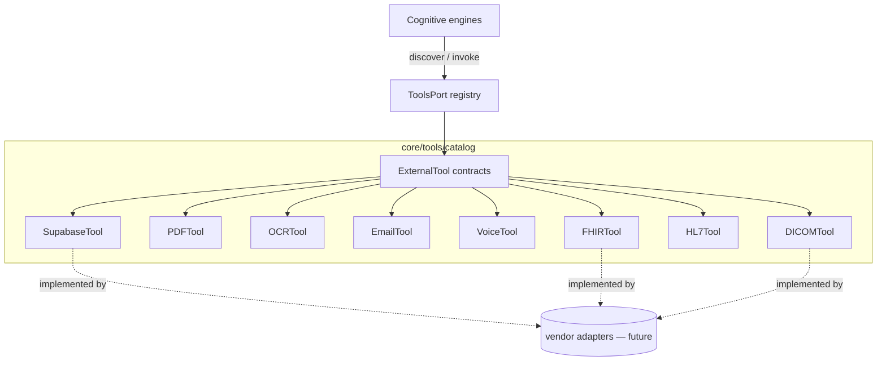

# core/tools — Tools engine & external-access catalog

> **Status:** scaffolding only. Contracts, models, diagrams and docs —
> **no implementation, logic, AI, or agents.** Protocol bodies are `...`.

## Principle: all external access goes through Tools

In EREN, **every external access is modeled as a Tool** — databases, files,
third-party services and clinical integrations included. Cognitive engines
*reason and coordinate*; tools *execute*. This separation keeps the core
domain-pure and every side-effecting integration governable, auditable and
swappable behind a contract.

The **Tools engine** is the controlled **registry**: engines discover and invoke
tools through `ToolsPort`, never by importing a vendor adapter directly. Each
concrete integration is an adapter that satisfies one of the catalog contracts.

## Architecture

## Catalog

All tool contracts extend `ExternalTool` (identity: `name`, `description`,
`category`) and expose typed, domain-specific I/O models.

| Contract | Category | Purpose | Key methods |
| --- | --- | --- | --- |
| `SupabaseTool` | `DATA` | Postgres/auth/storage data platform | `query`, `mutate` |
| `PDFTool` | `DOCUMENT` | PDF text/metadata & page rendering | `extract_text`, `render_pages` |
| `OCRTool` | `DOCUMENT` | Optical character recognition | `recognize` |
| `EmailTool` | `MESSAGING` | Outbound transactional email | `send` |
| `VoiceTool` | `MEDIA` | Speech-to-text & text-to-speech | `transcribe`, `synthesize` |
| `FHIRTool` | `CLINICAL` | HL7 FHIR resource access | `read`, `search`, `create` |
| `HL7Tool` | `CLINICAL` | HL7 v2 message parse/exchange | `parse`, `send` |
| `DICOMTool` | `CLINICAL` | DICOM imaging (PACS) | `find`, `fetch`, `store` |

## Relationship to `core/contracts`

`core.contracts.Tool[TInput, TOutput]` is the **generic** leaf-capability
contract (single `invoke`). The catalog here defines **specialized** external
tools with richer, domain-specific operations; `ExternalTool` adds the shared
identity/category the registry needs. Both express the same principle: tools are
controlled, non-reasoning leaves — deliberately **not** `CognitiveEngine`s
(Interface Segregation).

## Files

| Path | Purpose |
| --- | --- |
| `engine.py` | `ToolsEngine` — registry: register, discover, invoke (stubbed). |
| `interfaces.py` | `ToolsPort` — registry contract. |
| `exceptions.py` | `ToolsError` + `ToolNotFoundError`, `ToolAlreadyRegisteredError`, `ToolInvocationError`. |
| `catalog/base.py` | `ExternalTool` protocol + `ToolCategory`. |
| `catalog/supabase.py` … `catalog/dicom.py` | One external-tool contract + I/O models each. |

## Boundaries
- Capability brokering only — no UI; concrete integrations live as adapters.
- May depend on `core/contracts` and `packages/*`; never on `apps/*`.
