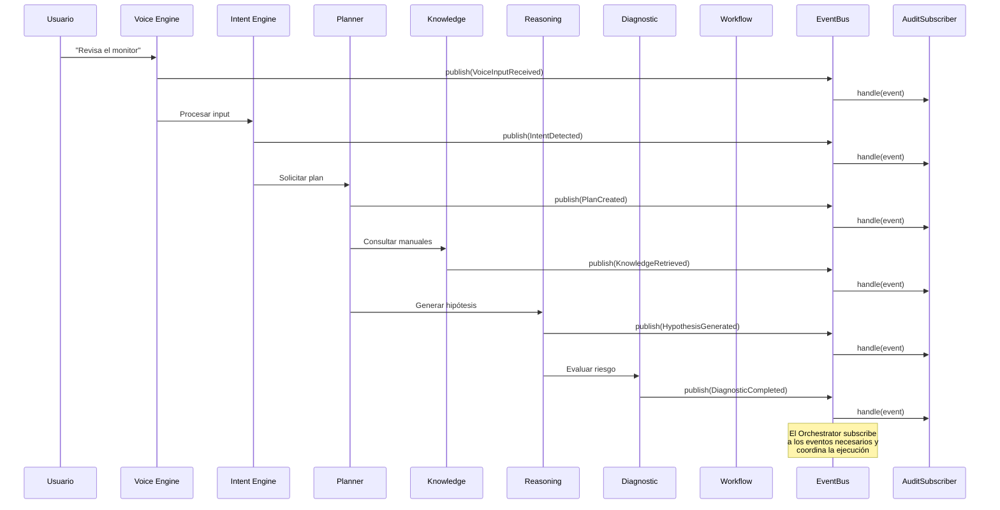

# core/events/ — Cognitive Event Bus

> **Estado:** Implementación funcional. EventBus thread-safe con pub/sub in-process.
> Listo para integrar con los motores cognitivos.

## Propósito

El **Event Bus** es el sistema de comunicación central de EREN. Todos los motores
cognitivos se comunican **exclusivamente mediante eventos** — queda prohibido que
un motor invoque directamente a otro.

```
┌─────────────────────────────────────────────────────────────────┐
│                         MOTOR COGNITIVO                          │
│  ┌─────────┐    ┌─────────────┐    ┌─────────────────────────┐  │
│  │Publishes│───►│  EventBus   │───►│Subscribes & Handles    │  │
│  │ Events  │    │ (central)   │    │ Events                  │  │
│  └─────────┘    └─────────────┘    └─────────────────────────┘  │
└─────────────────────────────────────────────────────────────────┘
```

## Principios Fundamentales

| Principio | Descripción |
|-----------|-------------|
| **Desacoplamiento** | Los motores no se conocen entre sí; solo conocen eventos |
| **Trazabilidad** | Cada evento lleva `correlation_id`, `session_id`, `source` |
| **Observabilidad** | Cada evento puede ser auditado, logged, medido |
| **Extensibilidad** | Nuevos suscriptores se añaden sin modificar productores |
| **Escalabilidad** | Preparado para múltiples hospitales y cientos de motores |

## Arquitectura de Componentes

```mermaid
flowchart TB
    subgraph "Event System"
        subgraph Models
            E[Event]
            ET[EventType]
        end
        subgraph Bus
            Bus[EventBus]
            GB[Global Bus]
        end
        subgraph Patterns
            PS[Publisher Patterns]
            SS[Subscriber Patterns]
        end
    end
    subgraph Engines
        V[Voice Engine]
        I[Intent Engine]
        P[Planner Engine]
        K[Knowledge Engine]
        M[Memory Engine]
        R[Reasoning Engine]
        D[Diagnostic Engine]
        W[Workflow Engine]
    end

    V -->|publish| Bus
    I -->|publish| Bus
    P -->|publish| Bus
    K -->|publish| Bus
    M -->|publish| Bus
    R -->|publish| Bus
    D -->|publish| Bus
    W -->|publish| Bus

    Bus -->|deliver| SS
    SS -->|audit| A[Audit]
    SS -->|log| L[Logging]
    SS -->|metrics| M2[Metrics]
```

## Catálogo de Eventos

### Eventos de Entrada/Salida

| Evento | EventType | Descripción |
|--------|-----------|-------------|
| `VoiceInputReceived` | `voice_input_received` | Entrada de voz recibida |
| `VoiceOutputGenerated` | `voice_output_generated` | Salida de voz generada |

### Eventos de Intención

| Evento | EventType | Descripción |
|--------|-----------|-------------|
| `IntentReceived` | `intent_received` | Intención recibida |
| `IntentDetected` | `intent_detected` | Intención detectada |

### Eventos de Planificación

| Evento | EventType | Descripción |
|--------|-----------|-------------|
| `PlanCreated` | `plan_created` | Plan creado |
| `PlanUpdated` | `plan_updated` | Plan actualizado |
| `PlanCompleted` | `plan_completed` | Plan completado |
| `PlanFailed` | `plan_failed` | Plan falló |

### Eventos de Conocimiento

| Evento | EventType | Descripción |
|--------|-----------|-------------|
| `KnowledgeRequested` | `knowledge_requested` | Búsqueda solicitada |
| `KnowledgeRetrieved` | `knowledge_retrieved` | Conocimiento recuperado |
| `KnowledgeSearchFailed` | `knowledge_search_failed` | Búsqueda fallida |

### Eventos de Memoria

| Evento | EventType | Descripción |
|--------|-----------|-------------|
| `MemoryRequested` | `memory_requested` | Memoria solicitada |
| `MemoryRetrieved` | `memory_retrieved` | Memoria recuperada |
| `MemoryStored` | `memory_stored` | Memoria almacenada |

### Eventos de Razonamiento

| Evento | EventType | Descripción |
|--------|-----------|-------------|
| `ReasoningStarted` | `reasoning_started` | Razonamiento iniciado |
| `ReasoningFinished` | `reasoning_finished` | Razonamiento finalizado |
| `HypothesisGenerated` | `hypothesis_generated` | Hipótesis generada |
| `HypothesisEvaluated` | `hypothesis_evaluated` | Hipótesis evaluada |

### Eventos de Diagnóstico

| Evento | EventType | Descripción |
|--------|-----------|-------------|
| `DiagnosticStarted` | `diagnostic_started` | Diagnóstico iniciado |
| `DiagnosticFinished` | `diagnostic_finished` | Diagnóstico finalizado |
| `DiagnosticCompleted` | `diagnostic_completed` | Diagnóstico completado |

### Eventos de Workflow

| Evento | EventType | Descripción |
|--------|-----------|-------------|
| `WorkflowStarted` | `workflow_started` | Workflow iniciado |
| `WorkflowFinished` | `workflow_finished` | Workflow finalizado |
| `WorkflowCompleted` | `workflow_completed` | Workflow completado |
| `StepExecuted` | `step_executed` | Paso ejecutado |

### Eventos de Herramientas

| Evento | EventType | Descripción |
|--------|-----------|-------------|
| `ToolRequested` | `tool_requested` | Herramienta solicitada |
| `ToolExecuted` | `tool_executed` | Herramienta ejecutada |
| `ToolFailed` | `tool_failed` | Ejecución fallida |

### Eventos de Respuesta

| Evento | EventType | Descripción |
|--------|-----------|-------------|
| `ResponseReady` | `response_ready` | Respuesta lista |
| `ResponseGenerated` | `response_generated` | Respuesta generada |

### Eventos de Sistema

| Evento | EventType | Descripción |
|--------|-----------|-------------|
| `EngineError` | `engine_error` | Error en motor |
| `EngineInitialized` | `engine_initialized` | Motor inicializado |
| `EngineShutdown` | `engine_shutdown` | Motor apagado |

## API Pública

### Clases Principales

| Símbolo | Tipo | Descripción |
|---------|------|-------------|
| `EventBus` | class | Bus de eventos thread-safe con pub/sub |
| `Event` | Pydantic model | Clase base de eventos (inmutable) |
| `EventType` | Enum | Catálogo de tipos de eventos |

### Patrones de Publicación

| Símbolo | Tipo | Descripción |
|---------|------|-------------|
| `EventPublisherMixin` | Mixin | Para engines que publican eventos |
| `EventContext` | Context manager | Publicación con correlación automática |
| `EventAggregator` | class | Agrega eventos y publica en batch |
| `CircuitBreakerPublisher` | Wrapper | Protege contra fallos en cascada |

### Patrones de Suscripción

| Símbolo | Tipo | Descripción |
|---------|------|-------------|
| `BaseSubscriber` | ABC | Base para suscriptores custom |
| `FunctionSubscriber` | class | Suscriptor simple con función |
| `MultiHandlerSubscriber` | class | Routing a múltiples handlers |
| `LoggingSubscriber` | class | Suscriptor que loguea eventos |
| `AuditSubscriber` | class | Suscriptor que audita eventos |
| `MetricSubscriber` | class | Suscriptor que recoge métricas |

### Funciones del Bus Global

| Símbolo | Descripción |
|---------|-------------|
| `get_global_bus()` | Obtiene el bus singleton global |
| `set_global_bus(bus)` | Establece el bus global |
| `reset_global_bus()` | Resetea el bus global (para tests) |

## Flujo Típico de un Request



## Ejemplo de Uso

### Publicador Simple

```python
from core.events import EventPublisherMixin, EventType, EventBus

class MyEngine(EventPublisherMixin):
    def __init__(self, event_bus: EventBus):
        self._event_bus = event_bus
        self._source = "my_engine"

    def do_work(self):
        self.publish(
            EventType.PLAN_CREATED,
            step_count=5,
            priority="high",
        )
```

### Suscriptor con Patrón

```python
from core.events import EventBus, EventType, MetricSubscriber

bus = EventBus()
metrics = MetricSubscriber()

bus.subscribe_wildcard(metrics)
bus.publish(PlanCreated(source="planner"))

print(metrics.get_counts())
# {'plan_created': 1}
```

### Contexto de Correlación

```python
from core.events import EventContext, EventType, EventBus

bus = EventBus()

with EventContext("request-123", source="planner", event_bus=bus) as ctx:
    ctx.publish(EventType.PLAN_CREATED, step_count=5)
    ctx.publish(EventType.PLAN_COMPLETED, steps_done=5)
```

## Archivos del Módulo

| Archivo | Descripción |
|---------|-------------|
| `models.py` | Modelos de eventos (Event, EventType, 33 eventos específicos) |
| `bus.py` | EventBus funcional + global bus singleton |
| `exceptions.py` | Jerarquía de excepciones tipadas |
| `subscriber.py` | Patrones de suscripción |
| `publisher.py` | Patrones de publicación |
| `__init__.py` | Exports públicos |

## Límites

- **No persiste eventos** — eso es responsabilidad de un suscriptor de auditoría
- **No conecta con brokers externos** — eso es para la fase de infraestructura
- **No interpreta payloads** — los motores interpretan sus propios payloads

## Referencias

- [ADR-0004: Event System](../adr/ADR-0004-event-system.md)
- [Clinical Reasoning Framework](../docs/core/clinical-reasoning-framework.md)
