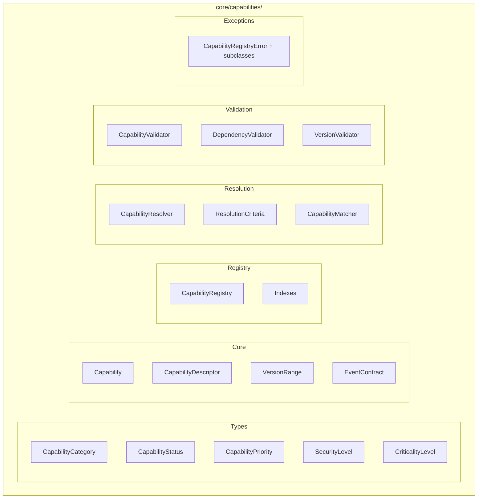
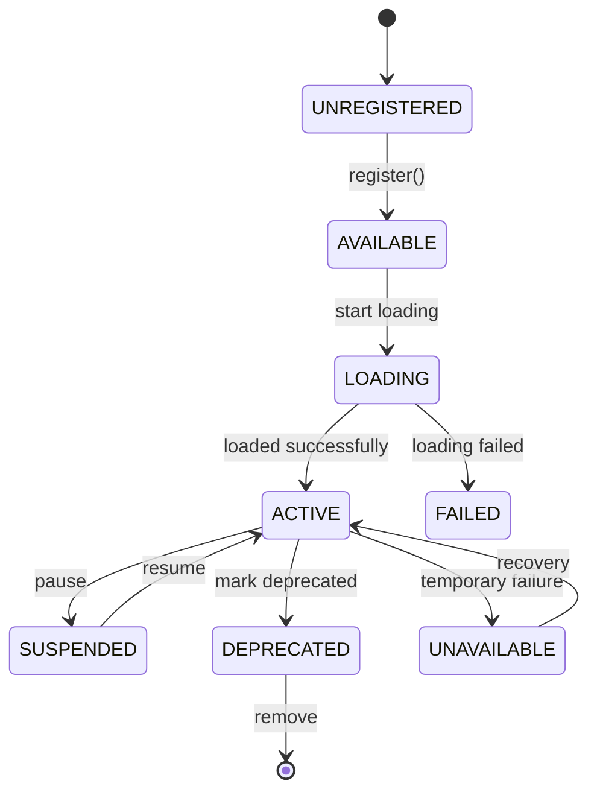
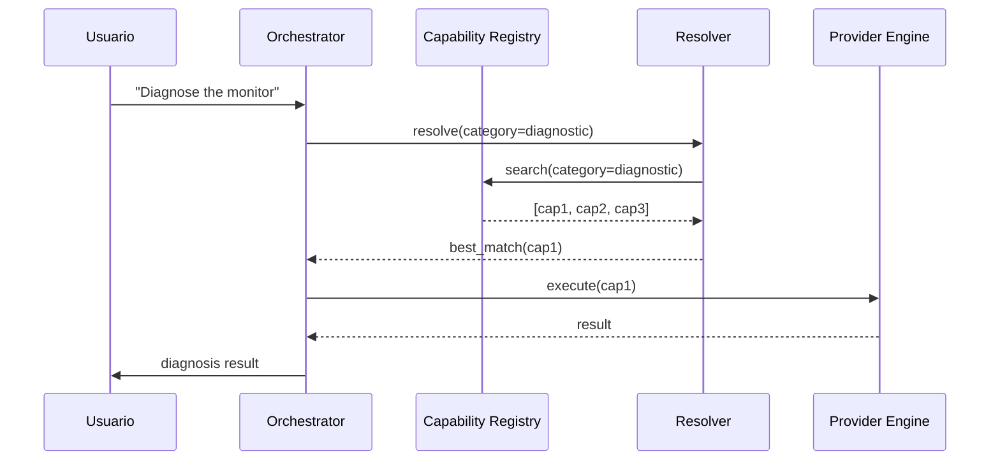

# core/capabilities/ — Cognitive Capability Registry

> **EREN NO registra motores. EREN registra CAPACIDADES COGNITIVAS.**

El **Cognitive Capability Registry (CCR)** es el Kernel de un Sistema Operativo
Cognitivo. Define qué puede hacer EREN, no quién lo hace.

---

## Paradigma Fundamental

```
┌─────────────────────────────────────────────────────────────────────┐
│                    ENGINE REGISTRY (ANTIGUO)                         │
├─────────────────────────────────────────────────────────────────────┤
│  Motor concreto: "Planner Engine v1"                               │
│  • Solo existe una implementación                                   │
│  • ORCHESTRATOR conoce al motor                                     │
│  • Acoplamiento directo                                             │
└─────────────────────────────────────────────────────────────────────┘

┌─────────────────────────────────────────────────────────────────────┐
│              COGNITIVE CAPABILITY REGISTRY (NUEVO)                   │
├─────────────────────────────────────────────────────────────────────┤
│  Capacidad abstracta: "planning.create.maintenance"                │
│  • Múltiples proveedores pueden implementarla                      │
│  • ORCHESTRATOR solo conoce capacidades                             │
│  • Desacoplamiento total                                            │
└─────────────────────────────────────────────────────────────────────┘
```

---

## Conceptos Clave

| Concepto | Descripción |
|----------|-------------|
| **Capability** | Unidad atómica de trabajo cognitivo |
| **Capability ID** | Identificador único: `category.action.target` |
| **Provider** | Motor que implementa una capability |
| **Resolver** | Encuentra la mejor capability para un query |
| **Registry** | Catálogo central de todas las capabilities |

---

## Capability ID

Formato: `category.action.target`

Ejemplos:

| Capability ID | Descripción |
|---------------|-------------|
| `planning.create.maintenance` | Crear plan de mantenimiento |
| `diagnostic.analyze.monitor` | Analizar monitor de signos vitales |
| `knowledge.search.document` | Buscar en documentos técnicos |
| `voice.input.audio` | Procesar entrada de audio |

---

## Categorías de Capabilities

| Categoría | Descripción | Ejemplo |
|-----------|-------------|---------|
| `planning` | Planificación de tareas | Crear planes de mantenimiento |
| `knowledge` | Gestión de conocimiento | Buscar manuales técnicos |
| `memory` | Operaciones de memoria | Almacenar contexto |
| `reasoning` | Razonamiento lógico | Generar hipótesis |
| `diagnostic` | Análisis diagnóstico | Diagnosticar equipos |
| `workflow` | Orquestación de flujos | Ejecutar workflows |
| `voice` | Entrada/salida de voz | Transcripción de voz |
| `tool` | Ejecución de herramientas | Llamar APIs |
| `learning` | Aprendizaje y adaptación | Mejorar modelos |
| `monitoring` | Monitoreo del sistema | Verificar estado |
| `security` | Operaciones de seguridad | Autenticación |
| `administration` | Administración | Gestionar usuarios |

---

## Arquitectura de Componentes



---

## API Rápida

### Registrar una Capability

```python
from core.capabilities import Capability, CapabilityRegistry

registry = CapabilityRegistry()

capability = Capability.create(
    category="diagnostic",
    action="analyze",
    target="monitor",
    name="Diagnose Monitor",
    description="Performs diagnostic analysis on patient monitors",
    provider_id="diagnostic_engine_v1",
    priority=CapabilityPriority.HIGH,
)

registry.register(capability)
```

### Buscar Capabilities

```python
from core.capabilities import CapabilityCategory, SearchOptions, CapabilityFilter

# Por categoría
diagnostics = registry.find_by_category(CapabilityCategory.DIAGNOSTIC)

# Por proveedor
planner_caps = registry.find_by_provider("planner_engine")

# Con filtros
results = registry.search(
    SearchOptions(
        filter=CapabilityFilter(
            min_priority=CapabilityPriority.HIGH,
            active_only=True,
        ),
        sort_by="priority",
    )
)
```

### Resolver la mejor Capability

```python
from core.capabilities import CapabilityResolver, ResolutionCriteria

resolver = CapabilityResolver(registry)

match = resolver.resolve(
    ResolutionCriteria(
        category=CapabilityCategory.DIAGNOSTIC,
        prefer_active=True,
    )
)

print(f"Best match: {match.capability.name} (score: {match.score})")
```

---

## Estructura de una Capability

```python
@dataclass
class Capability:
    # Identity
    capability_id: CapabilityId  # "planning.create.maintenance"
    name: str                   # "Create Maintenance Plan"
    description: str            # "Creates maintenance plans..."
    category: CapabilityCategory
    
    # Provider
    provider_id: str           # "planner_engine_v1"
    provider_version: str      # "1.0.0"
    
    # Classification
    priority: CapabilityPriority       # HIGH
    status: CapabilityStatus           # ACTIVE
    security_level: SecurityLevel       # AUTHENTICATED
    criticality: CriticalityLevel     # MODERATE
    
    # Dependencies
    required_capabilities: tuple[str, ...]  # ["planning.create"]
    required_permissions: tuple[Permission, ...]
    
    # Events
    publishes: tuple[EventContract, ...]  # Events que produce
    consumes: tuple[EventContract, ...]  # Events que consume
    
    # Execution
    timeout_seconds: float
    time_estimate: TimeEstimate
    
    # Metadata
    metadata: CapabilityMetadata
```

---

## Estados de una Capability



---

## Eventos del sistema

Las capabilities se comunican via Event Bus:

```python
EventContract(
    event_type="diagnostic_completed",
    direction="publishes",
    description="Publicado cuando un diagnóstico termina",
)

EventContract(
    event_type="diagnostic_requested",
    direction="consumes",
    is_critical=True,  # Requerido para funcionar
)
```

---

## Validación

```python
from core.capabilities import CapabilityValidator

validator = CapabilityValidator(registry)

# Validar antes de ejecutar
errors = validator.validate_for_execution(
    capability,
    granted_permissions={"devices:read", "reports:write"},
)

if errors:
    for error in errors:
        print(f"Cannot execute: {error}")
```

---

## Integración con el Orchestrator



---

## Archivos del Módulo

| Archivo | Descripción |
|---------|-------------|
| `types.py` | Enums, Value Objects, Filtros |
| `capability.py` | Clase Capability core |
| `descriptor.py` | CapabilityDescriptor, Snapshot |
| `exceptions.py` | Jerarquía de excepciones |
| `validators.py` | Validadores |
| `resolver.py` | Resolution logic |
| `capability_registry.py` | Registry central |
| `__init__.py` | Exports públicos |

---

## Principios de Diseño

1. **Capabilities > Engines**: Definimos QUÉ puede hacer EREN, no QUIÉN lo hace
2. **Inmutabilidad**: Las capabilities son inmutables una vez registradas
3. **Versioning**: Cada capability tiene control de versiones
4. **Desacoplamiento**: El Orchestrator solo conoce capabilities, no providers
5. **Validación temprana**: Los errores se detectan en registro, no en ejecución
6. **Seguridad**: Niveles de seguridad y permisos definidos

---

## Referencias

- [Documentación arquitectónica](../docs/core/cognitive-capability-registry.md)
- [Clinical Reasoning Framework](../docs/core/clinical-reasoning-framework.md)
- [Event Bus](./event-bus/README.md)
