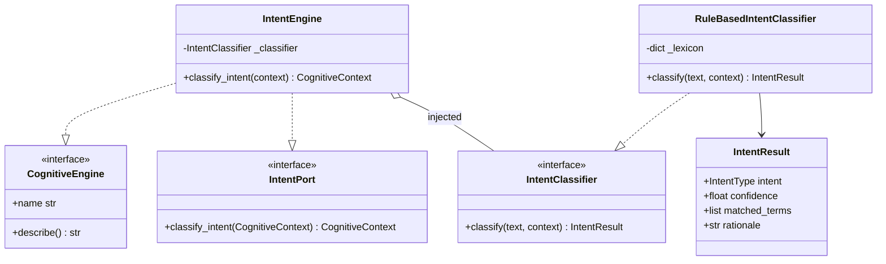
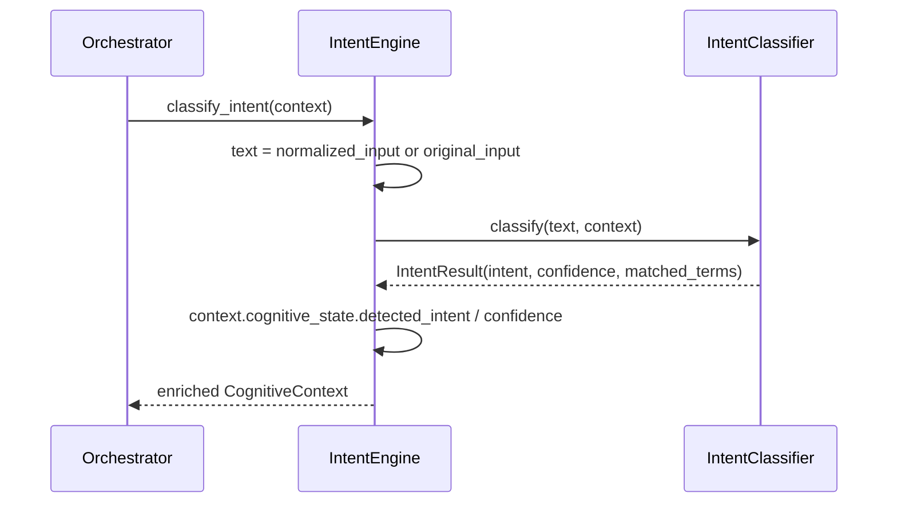

# core/intent/ — Intent Engine

The **Intent Engine** is EREN's **first real cognitive engine**. It reads the
input carried in a `CognitiveContext`, classifies *what the user wants*, and
writes the result back into the context.

> **Status:** functional, **no AI**. Classification is done today by a
> deterministic, rule-based (keyword) classifier. The design is **LLM-ready**:
> the classifier sits behind the `IntentClassifier` contract and is injected, so
> it can be replaced by an LLM-backed classifier later **without changing the
> engine**.

## Pipeline

```
receive CognitiveContext → analyze input → classify intent → update context → return context
```

`IntentEngine.classify_intent(context)`:

1. **receive** the `CognitiveContext`;
2. **analyze** `conversation.normalized_input` (falling back to `original_input`);
3. **classify** via the injected `IntentClassifier`;
4. **update** `cognitive_state.detected_intent` + `confidence`, and append
   `"intent"` to `cognitive_state.executed_engines`;
5. **return** the same, enriched context.

## Supported intents (`IntentType`)

| Intent | Meaning |
| --- | --- |
| `DEVICE_QUERY` | Questions about a device (specs, manual, manufacturer, model). |
| `DIAGNOSTIC_REQUEST` | A fault/troubleshooting request ("no enciende", "error"). |
| `MAINTENANCE_HISTORY` | Maintenance records / service history. |
| `REGULATION_QUERY` | Norms, standards, compliance (ISO/IEC/FDA…). |
| `GENERAL_CHAT` | Greetings / small talk. |
| `UNKNOWN` | Nothing recognized (empty input or no known terms). |

## Pluggable classification (Dependency Injection)

```python
from core.intent import IntentEngine, RuleBasedIntentClassifier

engine = IntentEngine()                         # defaults to rule-based
engine = IntentEngine(RuleBasedIntentClassifier())   # explicit
# Future, no engine changes:
# engine = IntentEngine(LLMIntentClassifier(model=...))
```

Any object implementing `IntentClassifier.classify(text, context) -> IntentResult`
can be injected. The rule-based default scores the input against a **bilingual
(ES/EN) keyword lexicon** (`DEFAULT_LEXICON`), picks the highest-scoring intent
(deterministic tie-break by clinical priority), and reports the matched terms for
**explainability**. Adding/tuning intents means editing the lexicon table — not
writing conditional branches.

## Class diagram



## Sequence



## Boundaries

This module does **not**:

- use AI/LLMs or external services (the default classifier is pure rules);
- normalize/translate the input (it reads what `Conversation` already holds);
- plan, retrieve knowledge, or produce a final response.

Related: [`../context/README.md`](../context/README.md),
[`../contracts/README.md`](../contracts/README.md),
[`../../CORE_SPECIFICATION.md`](../../CORE_SPECIFICATION.md), and
[ADR-0006](../../docs/adr/ADR-0006-intent-engine.md).
