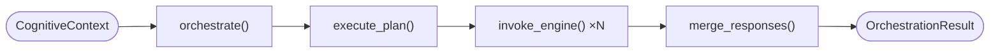

# core/orchestrator — Orchestrator engine

> **Status:** IMPLEMENTED ✅

## Responsibility

The **heart of EREN** — the central nervous system of its cognition. The
orchestrator owns the end-to-end lifecycle of a cognitive request and does
**only** these things:

1. **Receive a context** — accept a `CognitiveContext` (request + tenant +
   correlation + metadata).
2. **Execute a plan** — walk the ordered steps of the planner's `Plan`.
3. **Invoke engines** — delegate each step to the responsible cognitive engine
   (reasoning, knowledge, memory, diagnostic, workflow, tools, …).
4. **Merge responses** — fuse the per-engine `EngineResponse`s.
5. **Return a result** — assemble an explainable `OrchestrationResult`.

It is the **only** engine that legitimately knows about the others; every other
engine stays independent and is composed *by* the orchestrator. It **does not**
plan, reason, or implement domain logic — it delegates. It knows nothing about
UI/transport (`apps/*`).

## Implemented Features

### Orchestration Lifecycle
- Context validation
- Automatic plan creation (rule-based)
- Engine invocation with dependency resolution
- Response merging
- Execution metrics tracking

### Engine Management
- Engine registration/unregistration
- Engine registry with dependency injection
- Graceful error handling for missing engines

### State Management
- OrchestrationState tracking (IDLE, RECEIVING, PLANNING, EXECUTING, etc.)
- ExecutionMetrics for performance tracking

## Request lifecycle



## Architecture

```
OrchestratorEngine
    │
    ├── register_engine() / unregister_engine()
    ├── orchestrate() ← Main entry point
    │       │
    │       ├── _validate_context()
    │       ├── _create_plan()
    │       ├── execute_plan()
    │       │       └── invoke_engine()
    │       └── merge_responses()
    │
    └── get_metrics()
```

## Usage

```python
from core.orchestrator import OrchestratorEngine, CognitiveContext

# Create orchestrator
orchestrator = OrchestratorEngine()

# Register engines
orchestrator.register_engine("reasoning", reasoning_engine)
orchestrator.register_engine("rag", rag_pipeline)

# Orchestrate
context = CognitiveContext(
    request="What is the issue with device X?",
    tenant_id="hospital-123",
)

result = await orchestrator.orchestrate(context)

print(f"Success: {result.success}")
print(f"Confidence: {result.confidence}")
print(f"Summary: {result.execution_summary}")
```

## Files

| File | Purpose |
| --- | --- |
| `engine.py` | `OrchestratorEngine` — full 5-stage implementation |
| `interfaces.py` | `OrchestratorPort` + `EngineRegistry` type |
| `models.py` | `CognitiveContext`, `PlanStep`, `EngineResponse`, `OrchestrationResult` |
| `exceptions.py` | `OrchestratorError` and subclasses including `EngineNotFoundError` |

## Boundaries
- Domain-agnostic cognitive coordination — no UI/app/transport code.
- May depend on `core/contracts`, other `core/*` engines and `packages/*`;
  never on `apps/*`.
