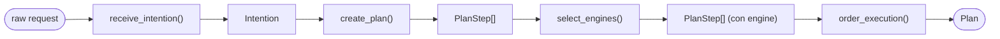
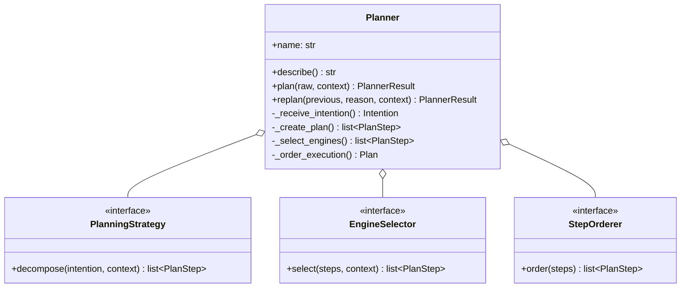
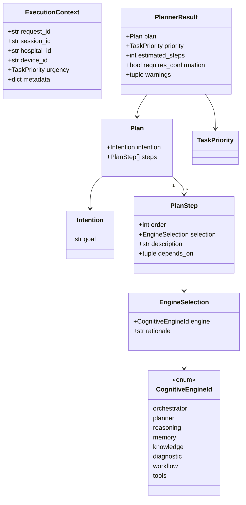
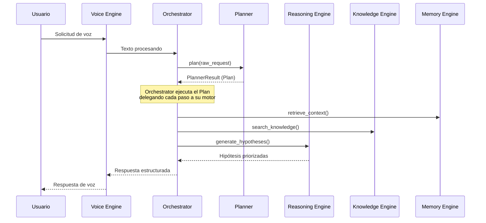

# core/planner — Planner Engine

> **Estado:** Arquitectura base completada. Scaffold con funcionalidad mínima;
> los métodos principales raise `NotImplementedError` hasta que se diseñe el
> comportamiento real (Fase 2+).

## Responsabilidad

El Planner es responsable de **exactamente cuatro cosas** (nada más):

1. **Recibir intención** — normalizar una solicitud cruda en una `Intention`
   estructurada.
2. **Crear plan** — descomponer la intención en pasos discretos ejecutables.
3. **Seleccionar motores** — decidir qué motor cognitivo (reasoning, knowledge,
   memory, diagnostic, workflow, tools…) es responsable de cada paso.
4. **Ordenar ejecución** — resolver dependencias entre pasos en un `Plan`
   final ordenado.

El planner decide *qué debe pasar y en qué orden*. **NO**:

- ejecuta los pasos — eso es responsabilidad del orchestrator / workflow engine;
- realiza razonamiento dentro de un paso — eso es el reasoning engine;
- se comunica con superficies de entrega (`apps/*`);
- conecta con BD, servicios externos o LLMs.

## Pipeline



## Arquitectura de Componentes



## Modelo de Datos



## Integración con el Sistema



## API Pública

### Clases Principales

| Símbolo | Tipo | Propósito |
| --- | --- | --- |
| `Planner` | class | Capacidad principal de planificación (async). |
| `PlannerEngine` | class | Stub legacy para compatibilidad hacia atrás. |
| `PlannerPort` | Protocol | Contrato que usan los llamadores. |

### Modelos de Datos

| Símbolo | Tipo | Propósito |
| --- | --- | --- |
| `Intention` | dataclass | Meta normalizada del llamador (forma de entrada). |
| `PlanStep` | dataclass | Una unidad ordenada de trabajo. |
| `EngineSelection` | dataclass | Qué motor maneja un paso, y por qué. |
| `Plan` | dataclass | Pasos ordenados que abordan una intención (forma de salida). |
| `CognitiveEngineId` | enum | Motores cognitivos seleccionables. |
| `ExecutionContext` | dataclass | Contexto de ejecución (hospital, dispositivo, urgencia). |
| `PlannerResult` | dataclass | Resultado completo con metadata. |

### Tipos y Enums

| Símbolo | Tipo | Propósito |
| --- | --- | --- |
| `TaskPriority` | IntEnum | Prioridad de tareas (CRITICAL → BACKGROUND). |
| `TaskStatus` | IntEnum | Estados del ciclo de vida de tareas. |
| `GoalType` | str class | Clasificación de metas (diagnostic, maintenance…). |
| `ReplanReason` | str class | Por qué se solicita replanificación. |

### Excepciones

| Símbolo | Tipo | Propósito |
| --- | --- | --- |
| `PlannerError` | Exception | Base para todos los errores del planner. |
| `InvalidIntentionError` | PlannerError | No se puede normalizar la solicitud. |
| `PlanCreationError` | PlannerError | No se puede crear el plan. |
| `EngineSelectionError` | PlannerError | No se puede seleccionar motor. |
| `StepOrderingError` | PlannerError | Dependencias cíclicas o inválidas. |

## Archivos

| Archivo | Propósito |
| --- | --- |
| `planner.py` | `Planner` — clase principal con el pipeline de 4 pasos. |
| `planner_engine.py` | Alias de re-export para compatibilidad. |
| `engine.py` | `PlannerEngine` — stub legacy (para backwards compat). |
| `interfaces.py` | `PlannerPort` — contrato para llamadores. |
| `models.py` | Modelos de dominio (Intention, Plan, PlanStep…). |
| `types.py` | Definiciones de tipos avanzados y protocolos. |
| `exceptions.py` | Excepciones tipadas por responsabilidad. |

## Estrategia de Inyección

El `Planner` acepta **estrategias inyectables** para permitir evolución:

```python
from core.planner import Planner
from core.planner.types import PlanningStrategy, EngineSelector, StepOrderer

# Comportamiento por defecto
planner = Planner()

# Comportamiento personalizado
planner = Planner(
    strategy=MyCustomStrategy(),
    selector=MyCustomSelector(),
    orderer=MyCustomOrderer(),
    validators=[safety_check, policy_validator],
    callbacks=[audit_logger],
)
```

## Relación con `core/contracts`

`core.contracts.Planner[Goal, Plan]` es el contrato **genérico, cross-engine**
(`plan` / `replan`). El `PlannerPort` de este módulo es el contrato
**planner-local** que expresa el pipeline de 4 pasos de forma concreta.
Son complementarios; una implementación futura puede satisfacer ambos.

## Relación con Clinical Reasoning Framework

El Planner consume el [Clinical Reasoning Framework](../../docs/core/clinical-reasoning-framework.md)
como guía para:

- §3 (Ciclo Cognitivo) → mapea directamente a las 4 responsabilidades del Planner.
- §4 (Modelo de Hipótesis) → usado por `_DefaultPlanningStrategy` para
  generar pasos candidatos.
- §6 (Reglas de Seguridad) → validadores pueden rechazar pasos inseguros.

## Límites

- Solo capacidad de planificación — sin ejecución, sin UI.
- Puede depender de `core/contracts` y `packages/*`; **nunca** de `apps/*`.
- No conecta con BD, Supabase, o LLMs en esta fase.
