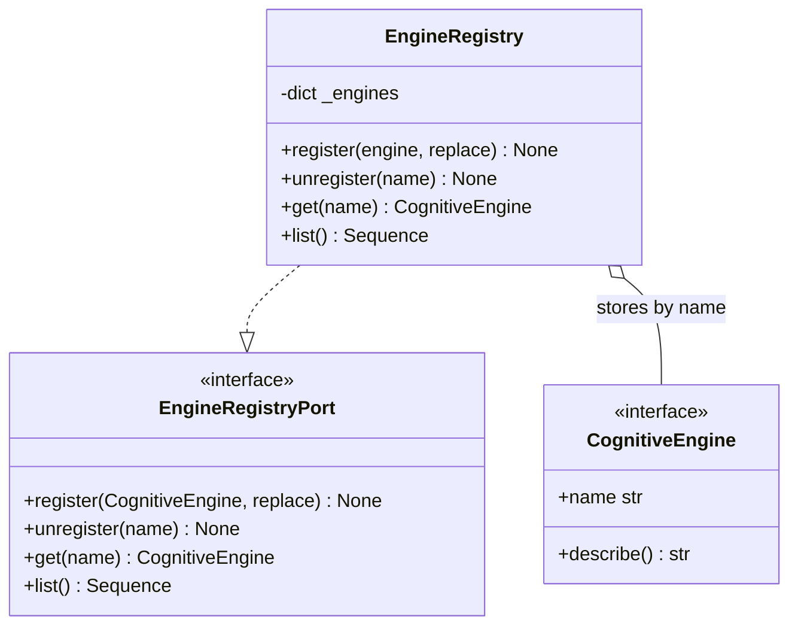
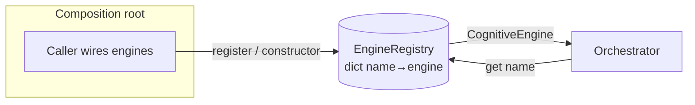

# core/registry/ — Engine Registry

The **engine registry** registers EREN's cognitive engines **dynamically** and
resolves them **by name at runtime**. Consumers (e.g. the orchestrator) discover
engines through the registry instead of importing and instantiating concrete
engine classes.

> **Status:** thin infrastructure. `EngineRegistry` is a small, general-purpose
> container (store + lookup). It contains **no business logic, no AI, and no
> cognition** — it stores and hands back objects that satisfy the
> `CognitiveEngine` contract.

## What it provides

`EngineRegistry` (and its `EngineRegistryPort` abstraction) expose:

| Method | Behavior |
| --- | --- |
| `register(engine, *, replace=False)` | Store `engine` under `engine.name`. Raises `EngineAlreadyRegisteredError` if the name is taken and `replace` is `False`. |
| `unregister(name)` | Remove the engine under `name`. Raises `EngineNotFoundError` if missing. |
| `get(name)` | Return the engine under `name` (O(1) lookup). Raises `EngineNotFoundError` if missing. |
| `list()` | Return all registered engines. |

Convenience: `name in registry` and `len(registry)`.

Exceptions: `RegistryError` (base), `EngineNotFoundError`,
`EngineAlreadyRegisteredError`.

## Principles

- **Dependency Injection.** Engines are injected from the outside — via the
  constructor `EngineRegistry(engines=[...])` or `register(...)`. The registry
  **never constructs engines** and depends only on the `CognitiveEngine`
  abstraction (`core/contracts`), not on any concrete engine.
- **No giant `if` chains.** Resolution is a **dictionary lookup** keyed by
  `engine.name`, so adding a new engine never means editing an `if/elif`
  dispatcher — you just register it.

## Usage (illustrative)

```python
from core.registry import EngineRegistry
from core.planner import PlannerEngine
from core.orchestrator import OrchestratorEngine

# Wiring happens at the composition root (caller), not inside the registry.
registry = EngineRegistry(engines=[PlannerEngine()])
registry.register(OrchestratorEngine())

planner = registry.get("planner")     # O(1) lookup, no conditional dispatch
all_engines = registry.list()
registry.unregister("planner")
```

## Class diagram



## Resolution flow



## Boundaries

This module does **not**:

- construct or configure engines (Dependency Injection is the caller's job);
- know engine-specific behavior or dispatch by type;
- persist the registry or provide thread-safety guarantees;
- contain AI, cognition, or domain logic.

Related: [`../contracts/README.md`](../contracts/README.md),
[`../../CORE_SPECIFICATION.md`](../../CORE_SPECIFICATION.md), and
[ADR-0005](../../docs/adr/ADR-0005-engine-registry.md).
