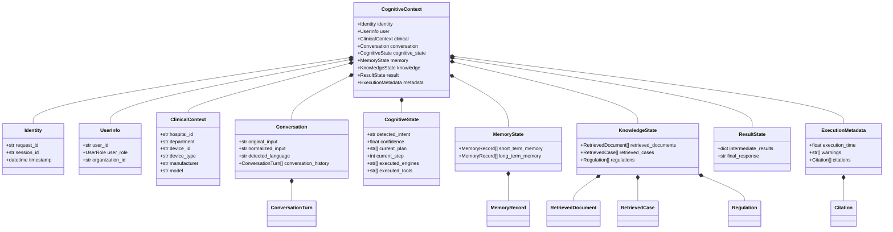
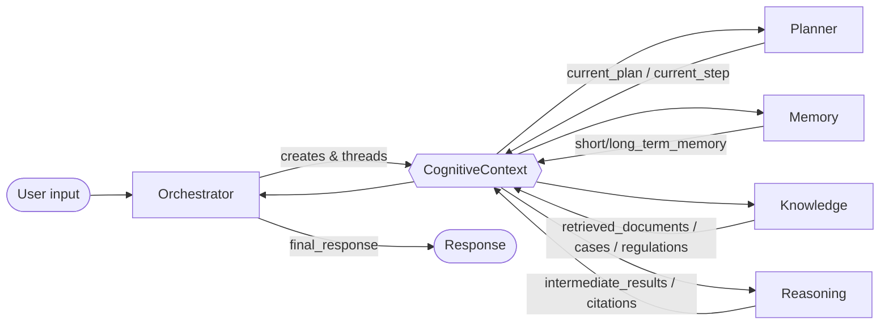
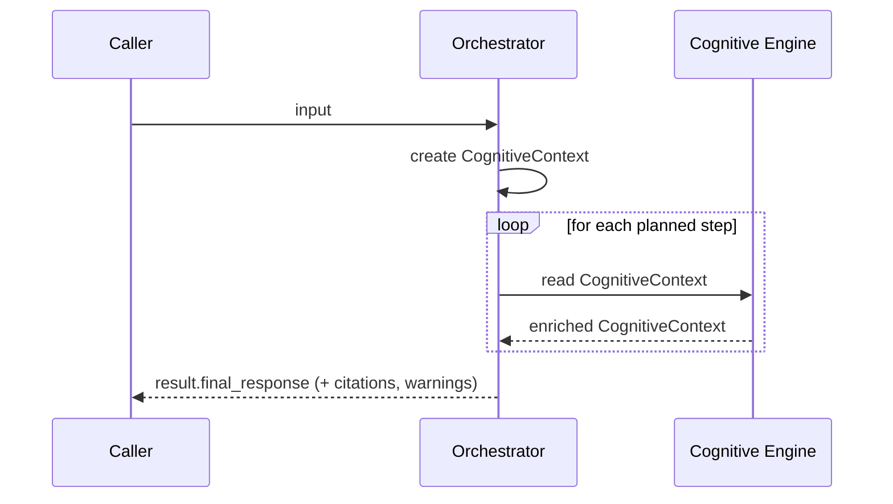

# core/context/ — Cognitive Context

The **Context Engine** owns `CognitiveContext`: the single object that travels
through every cognitive engine during one interaction. It is EREN's shared,
serializable "state of the conversation".

> **Status:** architecture only. This module contains a **declarative Pydantic
> v2 model and its documentation** — no business logic, no AI, no LLM calls.
> Populating, validating, and persisting the context belongs to the engines and
> services that consume it, not here.

## Why it exists

Cognitive engines (orchestrator, planner, reasoning, memory, knowledge,
diagnostic, workflow, tools) must collaborate without coupling to each other.
Instead of passing ad-hoc arguments between them, EREN passes **one context
object** that each engine reads from and writes back to. This gives the system:

- **A single source of truth** for an interaction's state.
- **Explainability & auditability**: the context accumulates the plan, the
  engines/tools executed, the knowledge retrieved and the citations, so the
  final answer is fully traceable.
- **Loose coupling**: engines depend on the context shape, not on each other.
- **Multi-tenant safety**: user, organization and hospital identity travel with
  every request.

## Shape of the context

`CognitiveContext` composes cohesive sub-models. Every field has an empty
default, so the context can be built up incrementally as it flows through the
pipeline.

| Group | Sub-model | Fields |
| --- | --- | --- |
| Identity | `Identity` | `request_id`, `session_id`, `timestamp` |
| User | `UserInfo` | `user_id`, `user_role`, `organization_id` |
| Clinical | `ClinicalContext` | `hospital_id`, `department`, `device_id`, `device_type`, `manufacturer`, `model` |
| Conversation | `Conversation` | `original_input`, `normalized_input`, `detected_language`, `conversation_history` |
| Cognitive state | `CognitiveState` | `detected_intent`, `confidence`, `current_plan`, `current_step`, `executed_engines`, `executed_tools` |
| Memory | `MemoryState` | `short_term_memory`, `long_term_memory` |
| Knowledge | `KnowledgeState` | `retrieved_documents`, `retrieved_cases`, `regulations` |
| Result | `ResultState` | `intermediate_results`, `final_response` |
| Metadata | `ExecutionMetadata` | `execution_time`, `warnings`, `citations` |

Supporting value models: `ConversationTurn`, `MemoryRecord`,
`RetrievedDocument`, `RetrievedCase`, `Regulation`, `Citation`; enums:
`UserRole`, `MessageRole`.

## Composition (class diagram)

## How it flows through the engines

The orchestrator creates one context per interaction and threads it through the
engines. Each engine **enriches** the context and passes it on; the object is
the carrier of state, not an actor.

## Design notes

- **Pydantic v2** models with `extra="forbid"` to keep the contract explicit.
- **Empty defaults everywhere** so the context can be assembled incrementally.
- `current_plan` is modeled as ordered step descriptions (`list[str]`) to keep
  the context **decoupled** from the Planner's own `Plan`/`PlanStep` types. The
  orchestrator maps between them.
- `intermediate_results` is an open map keyed by engine/tool name; each engine
  owns the interpretation of its own entry.
- The pre-existing lightweight `CognitiveContext` dataclass in
  `core/orchestrator/models.py` is a **local** orchestration placeholder; this
  package is the **canonical** context model. Aligning the orchestrator to use
  it is future work and is intentionally **not** done here (this change must not
  modify other engines).

## Boundaries

This module does **not**:

- populate or normalize any field (no NLP, no language detection, no retrieval);
- call any engine, tool, LLM, or external service;
- persist or load the context;
- enforce tenancy or authorization.

Those responsibilities live in the engines and services that consume the
context. See [`../../CORE_SPECIFICATION.md`](../../CORE_SPECIFICATION.md) and
[ADR-0003](../../docs/adr/ADR-0003-cognitive-context.md).
