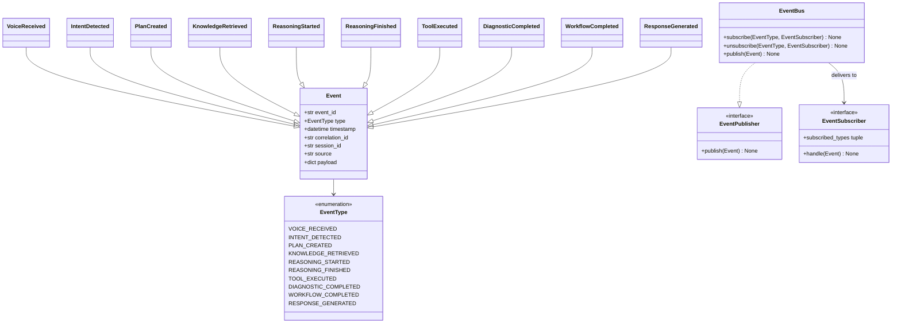
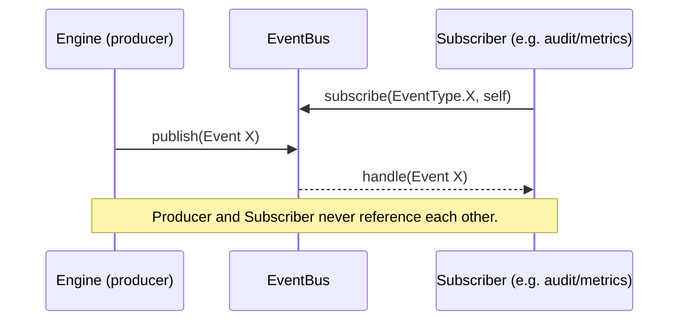
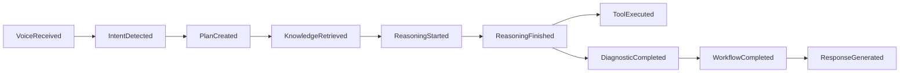

# core/events/ — Internal Event System

The **event system** lets EREN's cognitive engines communicate through
**events** instead of direct calls. A producer emits an event; the bus delivers
it to any subscriber interested in that type. Producers and consumers never
reference each other — they only depend on the event contracts.

> **Status:** architecture only. `Event` and its subclasses are declarative
> Pydantic v2 models; `EventPublisher`/`EventSubscriber` are `Protocol`
> contracts; `EventBus` is a **skeleton whose methods raise
> `NotImplementedError`**. No business logic, dispatching, threading, queues, or
> brokers are implemented here.

## Why it exists

- **Decoupling:** engines announce *what happened* without knowing who reacts.
- **Observability & auditability:** every event carries `correlation_id`,
  `session_id`, `source` and `timestamp`, so a full interaction can be traced.
- **Extensibility:** new subscribers (logging, metrics, audit, UI streaming) can
  be added without touching producers.
- **Substitutable transport:** the `EventBus` depends only on abstractions, so
  it can later be backed by an in-process dispatcher, a queue, or a message
  broker without changing producers or consumers.

## Building blocks

| Element | Kind | Responsibility |
| --- | --- | --- |
| `Event` | Pydantic model (frozen) | Immutable base fact: `event_id`, `type`, `timestamp`, `correlation_id`, `session_id`, `source`, `payload`. |
| `EventType` | `str` enum | Catalog of the ten lifecycle event types. |
| `EventPublisher` | `Protocol` | `publish(event)` — emit an event. |
| `EventSubscriber` | `Protocol` | `subscribed_types`, `handle(event)` — react to events. |
| `EventBus` | class (skeleton) | `subscribe`, `unsubscribe`, `publish` — mediates producers ↔ consumers. |
| `EventError` + `PublishError`, `SubscriptionError` | exceptions | Declarative error types. |

## Event catalog

| Event | `EventType` | Emitted when |
| --- | --- | --- |
| `VoiceReceived` | `VOICE_RECEIVED` | A voice input is received. |
| `IntentDetected` | `INTENT_DETECTED` | An intent is inferred from the input. |
| `PlanCreated` | `PLAN_CREATED` | The planner produces a plan. |
| `KnowledgeRetrieved` | `KNOWLEDGE_RETRIEVED` | Knowledge/cases/regulations are retrieved. |
| `ReasoningStarted` | `REASONING_STARTED` | Reasoning begins. |
| `ReasoningFinished` | `REASONING_FINISHED` | Reasoning concludes. |
| `ToolExecuted` | `TOOL_EXECUTED` | A tool finishes executing. |
| `DiagnosticCompleted` | `DIAGNOSTIC_COMPLETED` | A diagnostic completes. |
| `WorkflowCompleted` | `WORKFLOW_COMPLETED` | A workflow instance completes. |
| `ResponseGenerated` | `RESPONSE_GENERATED` | The final response is produced. |

Each event fixes its `type` and documents the payload keys it is expected to
carry; the payload itself stays a generic `dict[str, object]` to keep events
decoupled from other engines' concrete types.

## Publish/Subscribe (class diagram)

## Decoupled flow (sequence)

## Typical lifecycle stream

## Boundaries

This module does **not**:

- deliver, queue, retry, or order events (no dispatcher implementation);
- start threads, processes, or connect to any broker;
- interpret payloads or contain any engine-specific logic;
- persist events.

Those responsibilities belong to a concrete `EventBus` implementation and its
subscribers, added later. Related: [`../../CORE_SPECIFICATION.md`](../../CORE_SPECIFICATION.md)
and [ADR-0004](../../docs/adr/ADR-0004-event-system.md).
