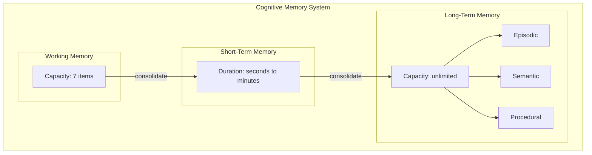

# core/memory/ — Cognitive Memory System

> **EREN NO es una base de datos. EREN tiene memoria cognitiva.**

El **Cognitive Memory System (CMS)** implementa un sistema de memoria inspirado
en la arquitectura de memoria humana, no en bases de datos tradicionales.

---

## Paradigma: Memoria Cognitiva vs Base de Datos

```
❌ BASE DE DATOS TRADICIONAL
═══════════════════════════════
- Almacena datos
- CRUD operations
- Sin contexto emocional
- Sin olvido automático
- Sin relaciones complejas
- Sin temporalidad

✅ SISTEMA DE MEMORIA COGNITIVA
══════════════════════════════════
- Almacena experiencias
- Retrieve/Consolidate/Forget
- Contexto emocional
- Olvido natural
- Relaciones complejas
- Temporalidad rica
```

---

## Tipos de Memoria

Inspirados en la psicología cognitiva:

| Tipo | Descripción | Duración |
|------|-------------|----------|
| **Working** | Procesamiento activo (~7 items) | ~segundos |
| **Short-Term** | Almacenamiento temporal | ~minutos |
| **Long-Term** | Almacenamiento persistente | días-años |
| **Episodic** | Eventos y experiencias | permanente |
| **Semantic** | Hechos y conceptos | permanente |
| **Procedural** | Habilidades y procedimientos | permanente |
| **Temporal** | Relaciones temporales | variable |
| **Spatial** | Relaciones espaciales | variable |

---

## Arquitectura



---

## MemoryEntry

```python
@dataclass
class MemoryEntry:
    # Identity
    memory_id: str
    memory_type: MemoryType
    
    # Content
    content: MemoryContent
    summary: str
    
    # Strength
    strength: float  # 0.0 - 1.0
    status: MemoryStatus
    
    # Relationships
    relationships: tuple[MemoryRelationship, ...]
    
    # Metadata
    metadata: MemoryMetadata
```

---

## API Rápida

### Almacenar memoria

```python
from core.memory import CognitiveMemoryEngine, MemoryType

memory = CognitiveMemoryEngine()

# Almacenar experiencia clínica
memory_id = memory.store(
    content="Patient presented with arrhythmia",
    memory_type=MemoryType.EPISODIC,
    summary="Arrhythmia case",
    tags=("cardiology", "patient"),
    importance=8,
)
```

### Recuperar memoria

```python
# Por ID
memory_entry = memory.retrieve(memory_id)

# Por query
results = memory.search(
    MemoryQuery(query_text="arrhythmia")
)

# Por contexto
results = memory.retrieve_with_context(
    query="patient cases",
    context=RetrievalContext(device_id="monitor-001"),
)
```

---

## Políticas de Memoria

### Retención

```python
@dataclass
class RetentionPolicy:
    min_duration_seconds: float = 60
    max_duration_seconds: float = 300
    decay_rate: float = 0.01
    consolidation_threshold: float = 0.5
    forget_threshold: float = 0.1
```

### Consolidación

```python
@dataclass
class ConsolidationPolicy:
    trigger_on_access_count: int = 3
    trigger_on_importance: int = 5
    trigger_on_emotional_valence: bool = True
    min_consolidation_strength: float = 0.5
```

---

## Files

| Archivo | Descripción |
|---------|-------------|
| `memory_types.py` | Tipos de memoria, políticas, filtros |
| `memory_models.py` | MemoryEntry, Query, Templates |
| `memory_stores.py` | Working, ShortTerm, LongTerm stores |
| `memory_engine.py` | CognitiveMemoryEngine principal |
| `exceptions.py` | Jerarquía de excepciones (11 tipos) |

## Boundaries
- Memory capability only — persistence details are injected, not hard-coded.
- May depend on `packages/*`; never on `apps/*`.

---

## Memory Orchestrator (CMO)

The **Cognitive Memory Orchestrator (CMO)** is the system that coordinates all memory operations.

### Philosophy

> The Orchestrator does NOT store information. It only decides:
> - WHERE to read?
> - WHERE to write?
> - IN WHAT ORDER?
> - HOW TO COMBINE results?

### The Orchestrator Never Knows

❌ PostgreSQL  
❌ Redis  
❌ Chroma  
❌ Qdrant  
❌ Pinecone  
❌ Milvus  
❌ FAISS  
❌ SQLite  
❌ **Anything**

Only contracts (BaseMemoryInterface).

### Usage

```python
from core.memory import (
    MemoryOrchestrator,
    MemoryEntry,
    MemoryType,
    MemoryAccessPolicy,
)

orchestrator = MemoryOrchestrator()

# Write
entry = MemoryEntry(
    content="User asked about monitor repair",
    memory_type=MemoryType.WORKING,
)
orchestrator.write(entry)

# Read
response = orchestrator.read(entry.key)

# Search
query = MemoryQuery(query="monitor", limit=10)
results = orchestrator.search(query)
```

### Access Policies

| Policy | Description |
|--------|-------------|
| `FIRST_AVAILABLE` | Use first available |
| `LONG_TERM_ONLY` | Only long-term memories |
| `SHORT_TERM_ONLY` | Only short-term memories |
| `MERGE_ALL` | Merge all results |
| `READ_ONLY` | No writes |
| `WRITE_THROUGH` | Write to all |

## Referencias
- [Documentación arquitectónica](../docs/core/cognitive-memory-system.md)
- [Memory Orchestrator](../docs/architecture/memory-orchestrator.md)
