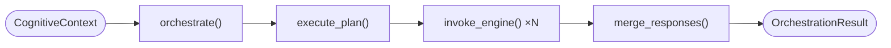
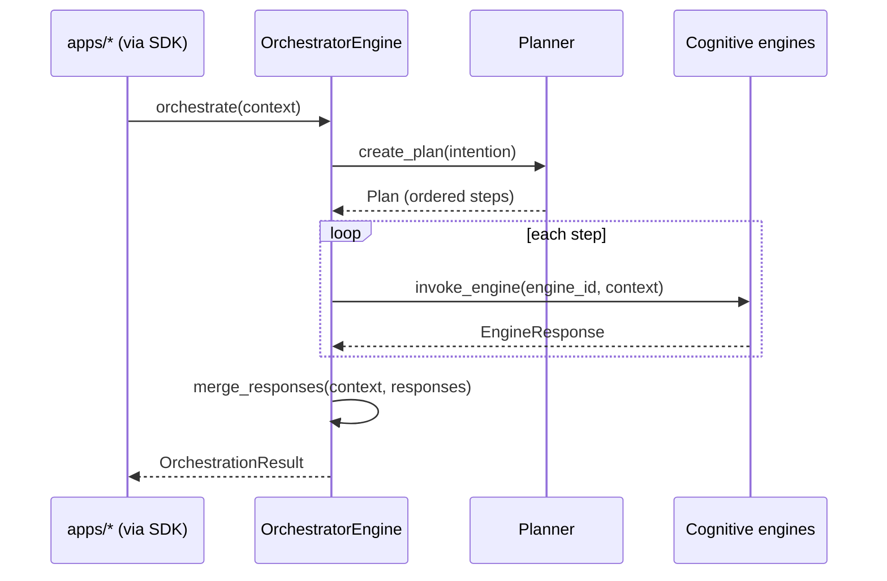
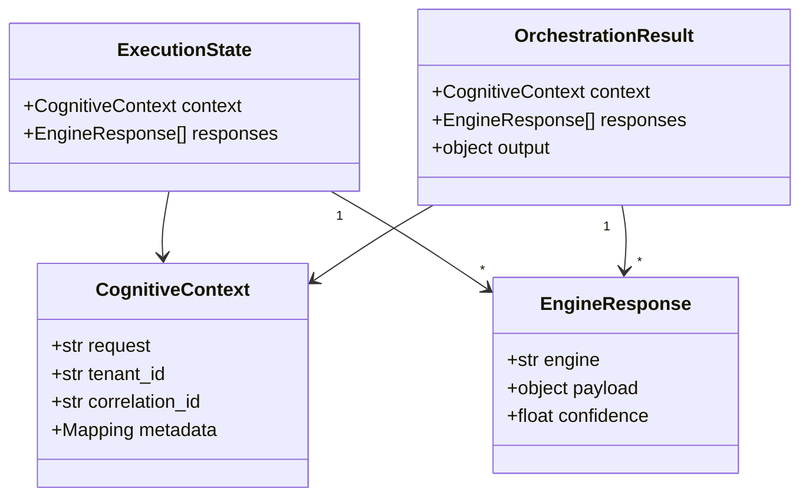

# core/orchestrator — Orchestrator engine

> **Status:** scaffolding only. Classes, interfaces, models, diagrams and docs —
> **no logic, AI, or agents.** Method bodies raise `NotImplementedError`.

## Responsibility

The **heart of EREN** — the central nervous system of its cognition. The
orchestrator owns the end-to-end lifecycle of a cognitive request and does
**only** these things:

1. **Receive a context** — accept a `CognitiveContext` (request + tenant +
   correlation + metadata).
2. **Execute a plan** — walk the ordered steps of the planner's `Plan`.
3. **Invoke engines** — delegate each step to the responsible cognitive engine
   (reasoning, knowledge, memory, diagnostic, workflow, tools, …).
4. **Merge responses** — fuse the per-engine `EngineResponse`s.
5. **Return a result** — assemble an explainable `OrchestrationResult`.

It is the **only** engine that legitimately knows about the others; every other
engine stays independent and is composed *by* the orchestrator. It **does not**
plan, reason, or implement domain logic — it delegates. It knows nothing about
UI/transport (`apps/*`).

## Request lifecycle



## Coordination (composition, not inheritance)



## Data model



## Engine registry (Dependency Inversion)

The orchestrator receives its engines as a registry and depends only on the
`core.contracts.CognitiveEngine` abstraction — never on concrete engine classes:

```python
type EngineRegistry = Mapping[str, CognitiveEngine]

orchestrator = OrchestratorEngine(engines=registry)  # engines injected in
```

## Public API (scaffolding)

| Symbol | Kind | Purpose |
| --- | --- | --- |
| `OrchestratorEngine` | class | Runs the 5-stage request lifecycle (stubbed). |
| `OrchestratorPort` | `Protocol` | Contract callers depend on. |
| `EngineRegistry` | type alias | `Mapping[str, CognitiveEngine]` injected registry. |
| `CognitiveContext` | dataclass | Request input shape. |
| `EngineResponse` | dataclass | One engine's contribution. |
| `ExecutionState` | dataclass | Intermediate accumulated state. |
| `OrchestrationResult` | dataclass | Final explainable output. |
| `OrchestratorError` (+ subclasses) | exceptions | One base + one per lifecycle stage. |

## Files

| File | Purpose |
| --- | --- |
| `engine.py` | `OrchestratorEngine` — the 5 lifecycle stages as stubbed methods. |
| `interfaces.py` | `OrchestratorPort` + `EngineRegistry` type. |
| `models.py` | `CognitiveContext`, `EngineResponse`, `ExecutionState`, `OrchestrationResult`. |
| `exceptions.py` | `OrchestratorError` and per-stage subclasses. |

## Boundaries
- Domain-agnostic cognitive coordination — no UI/app/transport code.
- May depend on `core/contracts`, other `core/*` engines and `packages/*`;
  never on `apps/*`.
