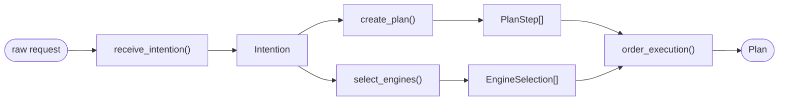
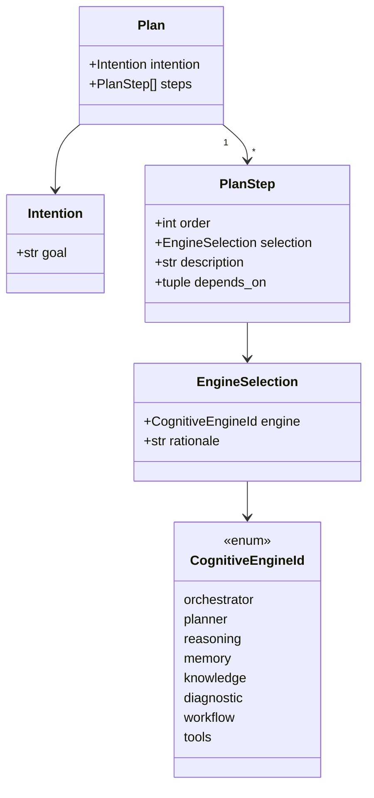
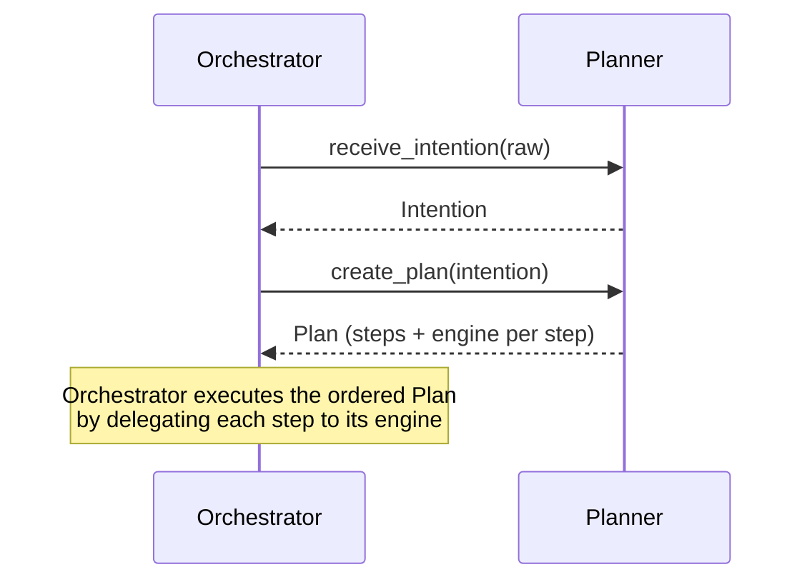

# core/planner — Planner engine

> **Status:** scaffolding only. Classes, interfaces, models, diagrams and docs —
> **no logic, AI, or agents.** Method bodies raise `NotImplementedError`.

## Responsibility

The Planner is responsible for **only** four things:

1. **Receive intention** — take a raw caller request and normalize it into a
   structured `Intention`.
2. **Create plan** — decompose the intention into discrete, executable steps.
3. **Select engines** — decide which cognitive engine (reasoning, knowledge,
   memory, diagnostic, workflow, tools, …) is responsible for each step.
4. **Order execution** — resolve dependencies between steps into a final,
   ordered `Plan`.

The planner decides *what should happen and in what order*. It does **not**:

- execute the steps — that is the orchestrator / workflow engine;
- perform the reasoning inside a step — that is the reasoning engine;
- talk to any delivery surface (`apps/*`).

## Pipeline

## Data model

## Where the planner sits

## Public API (scaffolding)

| Symbol | Kind | Purpose |
| --- | --- | --- |
| `PlannerEngine` | class | Implements the four responsibilities (stubbed). |
| `PlannerPort` | `Protocol` | Contract callers depend on. |
| `Intention` | dataclass | Normalized caller goal (input shape). |
| `PlanStep` | dataclass | One ordered unit of work. |
| `EngineSelection` | dataclass | Which engine handles a step, and why. |
| `Plan` | dataclass | Ordered steps addressing an intention (output shape). |
| `CognitiveEngineId` | enum | Selectable cognitive engines. |
| `PlannerError` (+ subclasses) | exceptions | One base error + one per responsibility. |

## Files

| File | Purpose |
| --- | --- |
| `engine.py` | `PlannerEngine` — the four responsibilities as stubbed methods. |
| `interfaces.py` | `PlannerPort` — the port callers depend on. |
| `models.py` | `Intention`, `PlanStep`, `EngineSelection`, `Plan`, `CognitiveEngineId`. |
| `exceptions.py` | `PlannerError` and per-responsibility subclasses. |

## Relationship to `core/contracts`

`core.contracts.Planner[Goal, Plan]` is the **generic, cross-engine** planning
contract (`plan` / `replan`). This module's `PlannerPort` is the
**planner-local** contract expressing the four-step pipeline concretely. The two
are complementary; a future `PlannerEngine` implementation may satisfy both.

## Boundaries
- Pure planning capability — no delivery/UI code, no execution.
- May depend on `core/contracts` and `packages/*`; never on `apps/*`.
