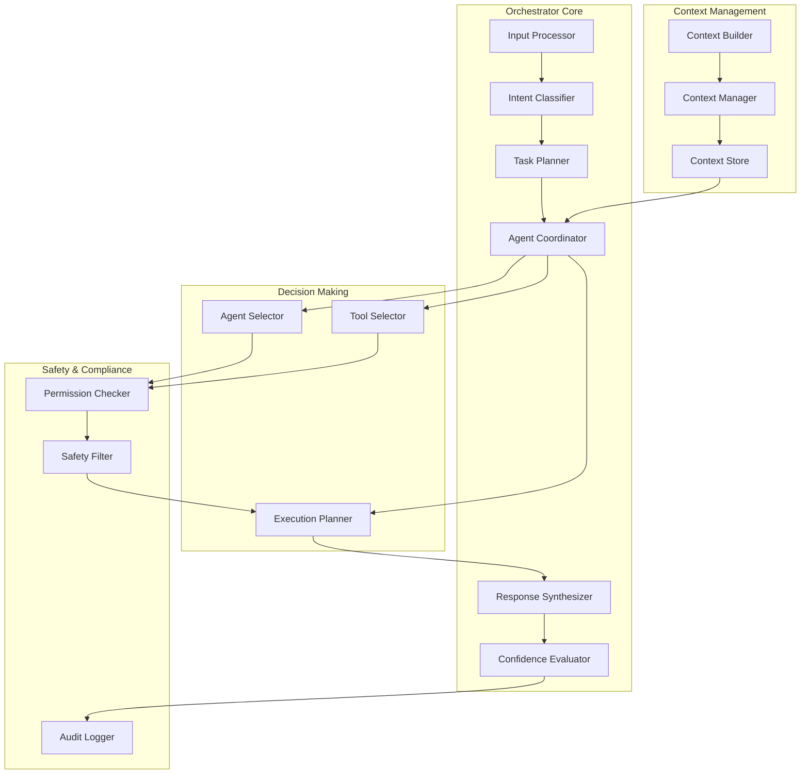
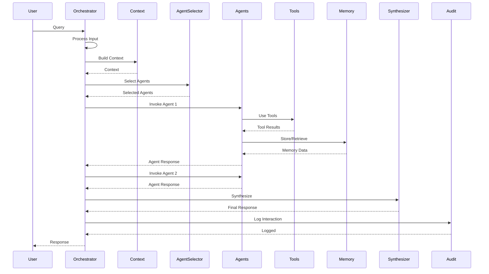
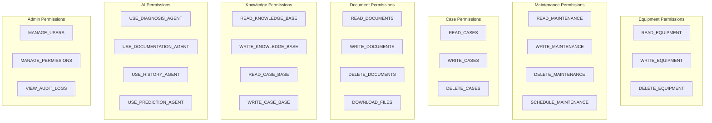
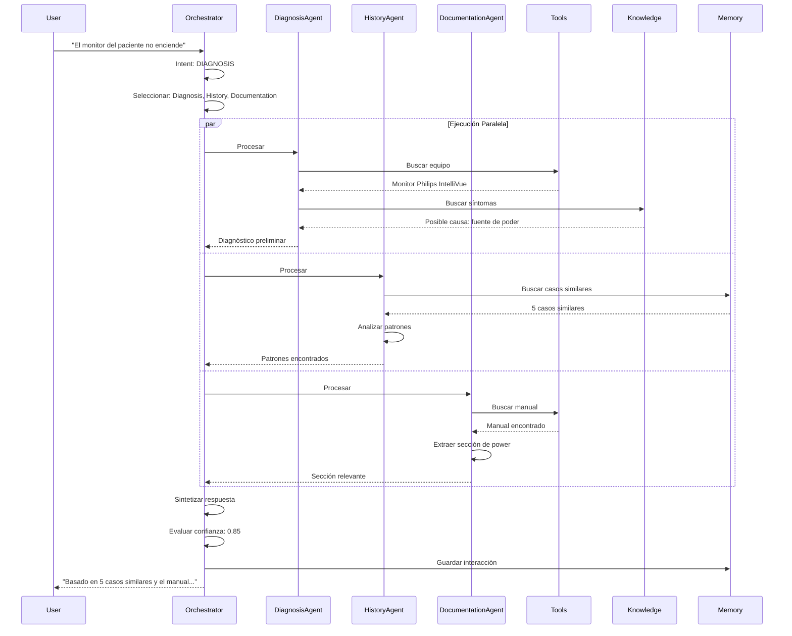

# Diseño del Sistema Multiagente de EREN

> **Arquitectura del cerebro de EREN - Sistema multiagente especializado**

---

## Tabla de Contenidos

1. [Visión General](#visión-general)
2. [Arquitectura del Orquestador](#arquitectura-del-orquestador)
3. [Agentes Especializados](#agentes-especializados)
4. [Sistema de Herramientas](#sistema-de-herramientas)
5. [Sistema de Permisos](#sistema-de-permisos)
6. [Sistema de Memoria](#sistema-de-memoria)
7. [Flujo de Orquestación](#flujo-de-orquestación)
8. [Protocolos de Comunicación](#protocolos-de-comunicación)

---

## Visión General

EREN no es un chatbot simple. Es un **sistema multiagente orquestado** donde cada agente tiene especializaciones específicas, herramientas dedicadas, y permisos granulares. El orquestador decide qué agentes invocar, en qué orden, y cómo sintetizar las respuestas.

### Principios de Diseño

1. **Especialización**: Cada agente es experto en un dominio específico
2. **Orquestación Inteligente**: El orquestador decide dinámicamente qué agentes usar
3. **Permisos Granulares**: Cada herramienta tiene permisos explícitos
4. **Memoria Compartida**: Los agentes comparten contexto a través de memoria
5. **Explicabilidad**: Cada decisión del orquestador es trazable
6. **Fallback Robusto**: Si un agente falla, el sistema degrada gracefulmente

---

## Arquitectura del Orquestador

### Componentes del Orquestador



### Flujo del Orquestador



### Lógica del Orquestador

```python
class AgentOrchestrator:
    def __init__(
        self,
        agent_registry: AgentRegistry,
        tool_registry: ToolRegistry,
        permission_system: PermissionSystem,
        memory_system: MemorySystem
    ):
        self.agent_registry = agent_registry
        self.tool_registry = tool_registry
        self.permission_system = permission_system
        self.memory_system = memory_system
    
    async def process_query(
        self,
        query: str,
        user_context: UserContext,
        conversation_history: List[Message]
    ) -> AgentResponse:
        """Procesa una query del usuario a través del sistema multiagente."""
        
        # 1. Analizar intento
        intent = await self._classify_intent(query, conversation_history)
        
        # 2. Construir contexto
        context = await self._build_context(user_context, intent, conversation_history)
        
        # 3. Seleccionar agentes
        selected_agents = await self._select_agents(intent, context)
        
        # 4. Ejecutar agentes en paralelo cuando posible
        agent_results = await self._execute_agents(
            selected_agents,
            query,
            context,
            user_context
        )
        
        # 5. Sintetizar respuesta
        response = await self._synthesize_response(agent_results, context)
        
        # 6. Evaluar confianza
        confidence = await self._evaluate_confidence(response, agent_results)
        
        # 7. Log auditoría
        await self._log_interaction(query, response, confidence, selected_agents)
        
        # 8. Actualizar memoria
        await self._update_memory(query, response, context)
        
        return AgentResponse(
            content=response.content,
            sources=response.sources,
            reasoning=response.reasoning,
            confidence=confidence,
            agents_used=[a.name for a in selected_agents]
        )
    
    async def _select_agents(
        self,
        intent: Intent,
        context: Context
    ) -> List[Agent]:
        """Selecciona los agentes apropiados basado en el intento."""
        
        agent_selection_rules = {
            Intent.DIAGNOSIS: [DiagnosisAgent, HistoryAgent],
            Intent.DOCUMENT_SEARCH: [DocumentationAgent],
            Intent.CASE_SEARCH: [HistoryAgent, DiagnosisAgent],
            Intent.GENERAL: [DiagnosisAgent, DocumentationAgent],
        }
        
        base_agents = agent_selection_rules.get(intent, [])
        
        # Añadir agentes condicionalmente
        if context.requires_prediction:
            base_agents.append(PredictionAgent)
        
        if context.requires_purchasing:
            base_agents.append(PurchasingAgent)
        
        return [self.agent_registry.get(name) for name in base_agents]
```

---

## Agentes Especializados

### 1. Agente de Diagnóstico (Diagnosis Agent)

**Propósito**: Analizar síntomas y recomendar soluciones técnicas

**Responsabilidades**:
- Analizar descripciones de fallas
- Identificar posibles causas
- Recomendar soluciones
- Estimar confianza del diagnóstico
- Citar fuentes de conocimiento

**Herramientas**:
- `EquipmentSearchTool`: Buscar información de equipos
- `SymptomAnalyzerTool`: Analizar síntomas
- `KnowledgeSearchTool`: Buscar en Knowledge Base
- `CaseSearchTool`: Buscar casos similares

**Permisos**:
- `Permission.READ_EQUIPMENT`
- `Permission.READ_KNOWLEDGE_BASE`
- `Permission.READ_CASE_BASE`

**Memoria**:
- Short-term: Contexto de diagnóstico actual
- Long-term: Patrones de diagnóstico exitosos

```python
class DiagnosisAgent(BaseAgent):
    name: str = "diagnosis_agent"
    description: str = "Analiza síntomas y recomienda soluciones técnicas"
    
    tools: List[BaseTool] = [
        EquipmentSearchTool(),
        SymptomAnalyzerTool(),
        KnowledgeSearchTool(),
        CaseSearchTool()
    ]
    
    permissions: List[Permission] = [
        Permission.READ_EQUIPMENT,
        Permission.READ_KNOWLEDGE_BASE,
        Permission.READ_CASE_BASE
    ]
    
    memory: bool = True
    
    async def process(
        self,
        query: str,
        context: Context
    ) -> AgentResult:
        """Procesa una query de diagnóstico."""
        
        # 1. Extraer síntomas
        symptoms = await self.tools[1].run(query)
        
        # 2. Buscar equipo relacionado
        equipment = await self.tools[0].run(context.equipment_id)
        
        # 3. Buscar conocimiento relevante
        knowledge = await self.tools[2].run(symptoms, equipment.model)
        
        # 4. Buscar casos similares
        similar_cases = await self.tools[3].run(symptoms, equipment.model)
        
        # 5. Generar diagnóstico con LLM
        diagnosis = await self._generate_diagnosis(
            symptoms,
            equipment,
            knowledge,
            similar_cases
        )
        
        return AgentResult(
            content=diagnosis.explanation,
            reasoning=diagnosis.reasoning,
            sources=diagnosis.sources,
            confidence=diagnosis.confidence,
            metadata={
                "symptoms": symptoms,
                "equipment": equipment.model,
                "similar_cases_count": len(similar_cases)
            }
        )
```

### 2. Agente de Documentación (Documentation Agent)

**Propósito**: Buscar y recuperar manuales técnicos y documentación

**Responsabilidades**:
- Buscar manuales técnicos
- Recuperar especificaciones
- Encontrar procedimientos
- Indexar contenido de documentos
- Generar resúmenes de documentos

**Herramientas**:
- `DocumentSearchTool`: Buscar documentos
- `ManualRetrievalTool`: Recuperar manuales
- `ContentExtractorTool`: Extraer contenido
- `DocumentSummarizerTool`: Resumir documentos

**Permisos**:
- `Permission.READ_DOCUMENTS`
- `Permission.READ_KNOWLEDGE_BASE`
- `Permission.DOWNLOAD_FILES`

**Memoria**:
- Short-term: Documentos recientes
- Long-term: Patrones de búsqueda

```python
class DocumentationAgent(BaseAgent):
    name: str = "documentation_agent"
    description: str = "Busca y recupera manuales técnicos y documentación"
    
    tools: List[BaseTool] = [
        DocumentSearchTool(),
        ManualRetrievalTool(),
        ContentExtractorTool(),
        DocumentSummarizerTool()
    ]
    
    permissions: List[Permission] = [
        Permission.READ_DOCUMENTS,
        Permission.READ_KNOWLEDGE_BASE,
        Permission.DOWNLOAD_FILES
    ]
    
    memory: bool = True
    
    async def process(
        self,
        query: str,
        context: Context
    ) -> AgentResult:
        """Procesa una query de documentación."""
        
        # 1. Buscar documentos relevantes
        documents = await self.tools[0].run(query, context.equipment_id)
        
        # 2. Recuperar manuales si es necesario
        manuals = []
        if context.requires_manual:
            manuals = await self.tools[1].run(context.equipment_id)
        
        # 3. Extraer contenido relevante
        content = await self.tools[2].run(documents, query)
        
        # 4. Generar resumen si es largo
        if len(content) > 1000:
            summary = await self.tools[3].run(content)
        else:
            summary = content
        
        return AgentResult(
            content=summary,
            reasoning=f"Found {len(documents)} documents and {len(manuals)} manuals",
            sources=[doc.id for doc in documents + manuals],
            confidence=0.9,
            metadata={
                "document_count": len(documents),
                "manual_count": len(manuals),
                "content_length": len(content)
            }
        )
```

### 3. Agente de Historia (History Agent)

**Propósito**: Analizar casos similares y patrones históricos

**Responsabilidades**:
- Buscar casos similares
- Identificar patrones de falla
- Analizar tendencias
- Recomendar soluciones basadas en historia
- Aprender de casos exitosos

**Herramientas**:
- `CaseSearchTool`: Buscar casos
- `PatternRecognitionTool`: Reconocer patrones
- `TrendAnalysisTool`: Analizar tendencias
- `SimilarityCalculatorTool`: Calcular similitud

**Permisos**:
- `Permission.READ_CASE_BASE`
- `Permission.READ_KNOWLEDGE_BASE`
- `Permission.READ_MAINTENANCE_HISTORY`

**Memoria**:
- Short-term: Casos recientes
- Long-term: Patrones aprendidos

```python
class HistoryAgent(BaseAgent):
    name: str = "history_agent"
    description: str = "Analiza casos similares y patrones históricos"
    
    tools: List[BaseTool] = [
        CaseSearchTool(),
        PatternRecognitionTool(),
        TrendAnalysisTool(),
        SimilarityCalculatorTool()
    ]
    
    permissions: List[Permission] = [
        Permission.READ_CASE_BASE,
        Permission.READ_KNOWLEDGE_BASE,
        Permission.READ_MAINTENANCE_HISTORY
    ]
    
    memory: bool = True
    
    async def process(
        self,
        query: str,
        context: Context
    ) -> AgentResult:
        """Procesa una query de historia."""
        
        # 1. Buscar casos similares
        similar_cases = await self.tools[0].run(
            query,
            context.equipment_id,
            threshold=0.7
        )
        
        # 2. Reconocer patrones
        patterns = await self.tools[1].run(similar_cases)
        
        # 3. Analizar tendencias
        trends = await self.tools[2].run(
            context.equipment_id,
            time_range="6months"
        )
        
        # 4. Calcular similitud con casos recientes
        similarity = await self.tools[3].run(query, similar_cases)
        
        # 5. Generar insights
        insights = await self._generate_insights(
            similar_cases,
            patterns,
            trends,
            similarity
        )
        
        return AgentResult(
            content=insights.summary,
            reasoning=insights.reasoning,
            sources=[case.id for case in similar_cases],
            confidence=insights.confidence,
            metadata={
                "similar_cases_count": len(similar_cases),
                "patterns_found": len(patterns),
                "trend_direction": trends.direction
            }
        )
```

### 4. Agente de Predicción (Prediction Agent) - Futuro

**Propósito**: Predecir fallas y mantenimiento preventivo

**Responsabilidades**:
- Predecir fallas probables
- Recomendar mantenimiento preventivo
- Analizar datos de telemetría
- Identificar equipos en riesgo
- Optimizar calendarios de mantenimiento

**Herramientas**:
- `TelemetryAnalyzerTool`: Analizar telemetría
- `FailurePredictionTool`: Predecir fallas
- `RiskAssessmentTool`: Evaluar riesgo
- `MaintenanceOptimizerTool`: Optimizar mantenimiento

**Permisos**:
- `Permission.READ_EQUIPMENT`
- `Permission.READ_TELEMETRY`
- `Permission.READ_MAINTENANCE_HISTORY`
- `Permission.WRITE_PREDICTIONS`

**Memoria**:
- Short-term: Predicciones recientes
- Long-term: Modelos de predicción

### 5. Agente de Compras (Purchasing Agent) - Futuro

**Propósito**: Recomendar repuestos y proveedores

**Responsabilidades**:
- Recomendar repuestos necesarios
- Buscar proveedores
- Comparar precios
- Verificar stock
- Generar órdenes de compra

**Herramientas**:
- `SparePartSearchTool`: Buscar repuestos
- `SupplierSearchTool`: Buscar proveedores
- `PriceComparisonTool`: Comparar precios
- `StockCheckTool`: Verificar stock
- `PurchaseOrderGeneratorTool`: Generar órdenes

**Permisos**:
- `Permission.READ_SPARE_PARTS`
- `Permission.READ_SUPPLIERS`
- `Permission.WRITE_PURCHASE_ORDERS`

**Memoria**:
- Short-term: Búsquedas recientes
- Long-term: Patrones de compra

---

## Sistema de Herramientas

### Registro de Herramientas

```python
class ToolRegistry:
    def __init__(self):
        self._tools: Dict[str, BaseTool] = {}
    
    def register(self, tool: BaseTool) -> None:
        """Registra una herramienta."""
        self._tools[tool.name] = tool
    
    def get(self, name: str) -> BaseTool:
        """Obtiene una herramienta por nombre."""
        if name not in self._tools:
            raise ToolNotFound(name)
        return self._tools[name]
    
    def list_by_permission(self, permission: Permission) -> List[BaseTool]:
        """Lista herramientas que requieren un permiso específico."""
        return [
            tool for tool in self._tools.values()
            if permission in tool.permissions
        ]
```

### Ejemplo de Herramienta

```python
class EquipmentSearchTool(BaseTool):
    name: str = "equipment_search"
    description: str = "Busca información de equipos médicos"
    
    permissions: List[Permission] = [
        Permission.READ_EQUIPMENT
    ]
    
    parameters: Dict[str, Type] = {
        "equipment_id": str,
        "serial_number": Optional[str],
        "model": Optional[str]
    }
    
    memory: bool = False
    
    async def _run(
        self,
        equipment_id: Optional[str] = None,
        serial_number: Optional[str] = None,
        model: Optional[str] = None
    ) -> Equipment:
        """Ejecuta la búsqueda de equipo."""
        
        # Buscar en base de datos
        if equipment_id:
            equipment = await self.equipment_repository.find_by_id(equipment_id)
        elif serial_number:
            equipment = await self.equipment_repository.find_by_serial(serial_number)
        elif model:
            equipment = await self.equipment_repository.find_by_model(model)
        else:
            raise ValueError("Must provide equipment_id, serial_number, or model")
        
        # Log acceso
        await self.audit_logger.log_tool_access(
            tool_name=self.name,
            parameters={"equipment_id": equipment_id},
            result_id=equipment.id
        )
        
        return equipment
```

### Tipos de Herramientas

1. **Search Tools**: Búsqueda en bases de datos y conocimiento
2. **Analysis Tools**: Análisis de datos y patrones
3. **Retrieval Tools**: Recuperación de documentos y contenido
4. **Generation Tools**: Generación de contenido con LLM
5. **Calculation Tools**: Cálculos y computaciones
6. **External API Tools**: Integración con APIs externas

---

## Sistema de Permisos

### Jerarquía de Permisos



### Sistema de Verificación de Permisos

```python
class PermissionSystem:
    def __init__(self, user_repository: UserRepository):
        self.user_repository = user_repository
    
    async def check_permission(
        self,
        user_id: str,
        permission: Permission,
        resource_id: Optional[str] = None
    ) -> bool:
        """Verifica si un usuario tiene un permiso específico."""
        
        user = await self.user_repository.find_by_id(user_id)
        
        # Verificar permisos directos
        if permission in user.permissions:
            return True
        
        # Verificar permisos de rol
        for role in user.roles:
            if permission in role.permissions:
                return True
        
        # Verificar permisos de recurso específico
        if resource_id:
            if await self._check_resource_permission(
                user, permission, resource_id
            ):
                return True
        
        return False
    
    async def check_agent_permission(
        self,
        user_id: str,
        agent_name: str
    ) -> bool:
        """Verifica si un usuario puede usar un agente específico."""
        
        agent_permissions = {
            "diagnosis_agent": [Permission.USE_DIAGNOSIS_AGENT],
            "documentation_agent": [Permission.USE_DOCUMENTATION_AGENT],
            "history_agent": [Permission.USE_HISTORY_AGENT],
            "prediction_agent": [Permission.USE_PREDICTION_AGENT],
        }
        
        required_permissions = agent_permissions.get(agent_name, [])
        
        for perm in required_permissions:
            if not await self.check_permission(user_id, perm):
                return False
        
        return True
    
    async def check_tool_permission(
        self,
        user_id: str,
        tool_name: str
    ) -> bool:
        """Verifica si un usuario puede usar una herramienta específica."""
        
        tool = self.tool_registry.get(tool_name)
        
        for permission in tool.permissions:
            if not await self.check_permission(user_id, permission):
                return False
        
        return True
```

---

## Sistema de Memoria

### Tipos de Memoria

```mermaid
graph TB
    subgraph "Memory System"
        ShortTerm[Short-term Memory]
        LongTerm[Long-term Memory]
        Episodic[Episodic Memory]
        Semantic[Semantic Memory]
    end
    
    subgraph "Short-term"
        ConversationContext[Conversation Context]
        CurrentSession[Current Session]
        RecentQueries[Recent Queries]
    end
    
    subgraph "Long-term"
        UserPreferences[User Preferences]
        AgentPerformance[Agent Performance]
        ToolUsage[Tool Usage Patterns]
    end
    
    subgraph "Episodic"
        CaseHistory[Case History]
        MaintenanceHistory[Maintenance History]
        InteractionHistory[Interaction History]
    end
    
    subgraph "Semantic"
        KnowledgeGraph[Knowledge Graph]
        ConceptMap[Concept Map]
        RelationshipMap[Relationship Map]
    end
    
    ShortTerm --> ConversationContext
    ShortTerm --> CurrentSession
    ShortTerm --> RecentQueries
    
    LongTerm --> UserPreferences
    LongTerm --> AgentPerformance
    LongTerm --> ToolUsage
    
    Episodic --> CaseHistory
    Episodic --> MaintenanceHistory
    Episodic --> InteractionHistory
    
    Semantic --> KnowledgeGraph
    Semantic --> ConceptMap
    Semantic --> RelationshipMap
```



### Implementación de Memoria

```python
class MemorySystem:
    def __init__(
        self,
        short_term_store: ShortTermStore,
        long_term_store: LongTermStore,
        episodic_store: EpisodicStore,
        semantic_store: SemanticStore
    ):
        self.short_term = short_term_store
        self.long_term = long_term_store
        self.episodic = episodic_store
        self.semantic = semantic_store
    
    async def store_conversation_context(
        self,
        conversation_id: str,
        context: ConversationContext
    ) -> None:
        """Almacena el contexto de una conversación."""
        await self.short_term.store(
            key=f"conversation:{conversation_id}",
            value=context,
            ttl=3600  # 1 hora
        )
    
    async def retrieve_conversation_context(
        self,
        conversation_id: str
    ) -> Optional[ConversationContext]:
        """Recupera el contexto de una conversación."""
        return await self.short_term.retrieve(
            key=f"conversation:{conversation_id}"
        )
    
    async def store_user_preference(
        self,
        user_id: str,
        preference: UserPreference
    ) -> None:
        """Almacena una preferencia de usuario a largo plazo."""
        await self.long_term.store(
            key=f"user:{user_id}:preference:{preference.key}",
            value=preference
        )
    
    async def store_case_history(
        self,
        case: Case
    ) -> None:
        """Almacena un caso en la memoria episódica."""
        await self.episodic.store(
            key=f"case:{case.id}",
            value=case
        )
    
    async def search_similar_cases(
        self,
        query: str,
        threshold: float = 0.7
    ) -> List[Case]:
        """Busca casos similares usando memoria episódica."""
        return await self.episodic.search_similar(
            query=query,
            threshold=threshold
        )
    
    async def update_knowledge_graph(
        self,
        entity: str,
        relationship: str,
        value: str
    ) -> None:
        """Actualiza el grafo de conocimiento semántico."""
        await self.semantic.add_relationship(
            entity=entity,
            relationship=relationship,
            value=value
        )
```

---

## Flujo de Orquestación

### Ejemplo Completo: Diagnóstico de Falla



### Estrategias de Orquestación

1. **Paralela**: Ejecutar agentes independientes en paralelo
2. **Secuencial**: Ejecutar agentes en orden específico
3. **Condicional**: Ejecutar agentes basado en condiciones
4. **Iterativa**: Refinar resultados con múltiples pasadas
5. **Fallback**: Degradar gracefulmente si un agente falla

---

## Protocolos de Comunicación

### Mensajes entre Agentes

```python
class AgentMessage(BaseModel):
    sender: str
    receiver: str
    message_type: MessageType
    content: Dict[str, Any]
    timestamp: datetime
    correlation_id: str
    metadata: Optional[Dict[str, Any]] = None

class MessageType(Enum):
    REQUEST = "request"
    RESPONSE = "response"
    ERROR = "error"
    NOTIFICATION = "notification"
    QUERY = "query"
    RESULT = "result"
```

### Ejemplo de Comunicación

```python
# Agente A solicita información a Agente B
message = AgentMessage(
    sender="diagnosis_agent",
    receiver="history_agent",
    message_type=MessageType.QUERY,
    content={
        "query": "Find similar cases for symptom: monitor not turning on",
        "equipment_model": "Philips IntelliVue MX450",
        "threshold": 0.7
    },
    timestamp=datetime.now(),
    correlation_id=str(uuid4())
)

# Agente B responde
response = AgentMessage(
    sender="history_agent",
    receiver="diagnosis_agent",
    message_type=MessageType.RESULT,
    content={
        "similar_cases": [case1, case2, case3],
        "patterns": ["power_supply_failure", "loose_connection"],
        "confidence": 0.82
    },
    timestamp=datetime.now(),
    correlation_id=message.correlation_id
)
```

---

## Resumen

El sistema multiagente de EREN está diseñado para:

1. **Especialización**: Cada agente es experto en su dominio
2. **Orquestación Inteligente**: El orquestador decide dinámicamente qué agentes usar
3. **Permisos Granulares**: Cada herramienta tiene permisos explícitos
4. **Memoria Compartida**: Los agentes comparten contexto y aprenden
5. **Explicabilidad**: Cada decisión es trazable y auditable
6. **Escalabilidad**: Fácil agregar nuevos agentes y herramientas

Esta arquitectura permite que EREN evolucione desde 3 agentes iniciales hasta docenas de agentes especializados sin reescribir el núcleo del sistema.

---

**Última actualización**: 2026-07-10
**Autor**: Lead Architect (Cascade)
**Versión**: 1.0.0
