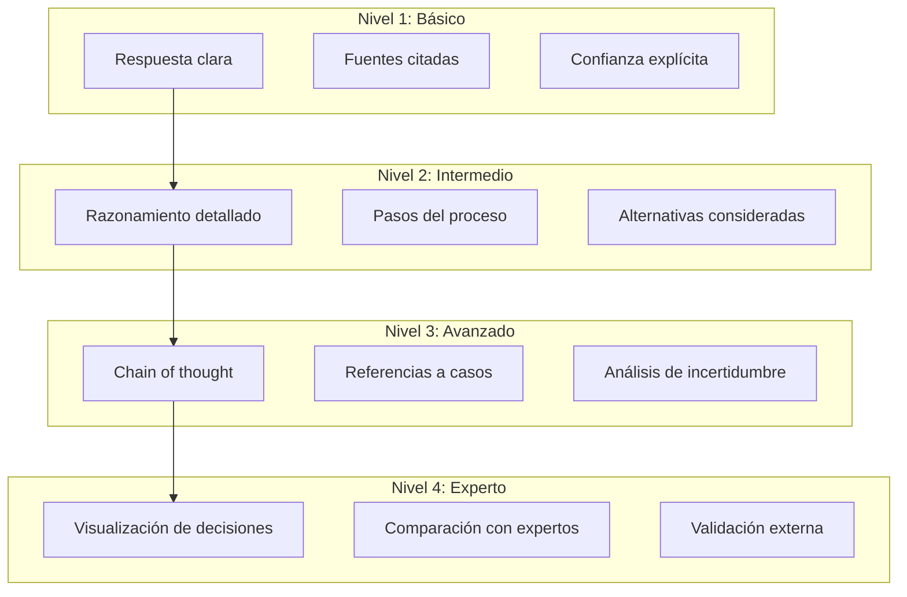
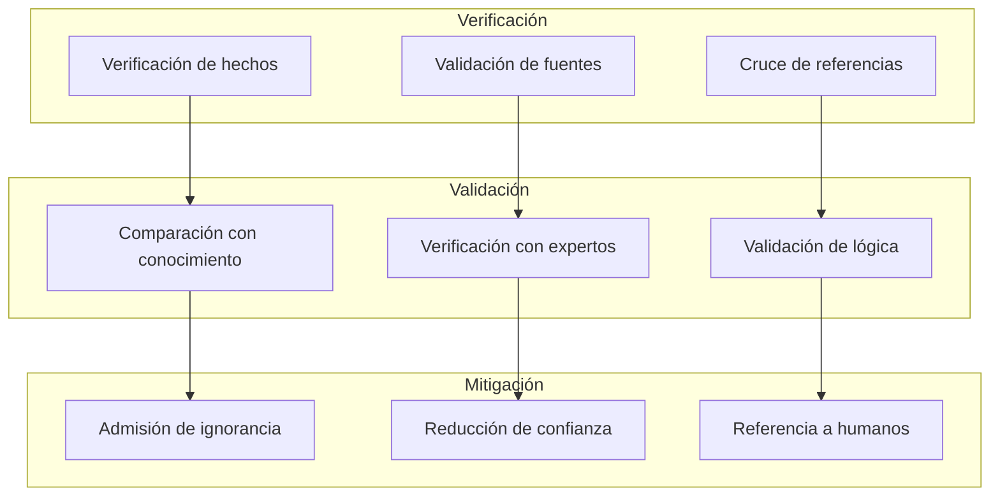
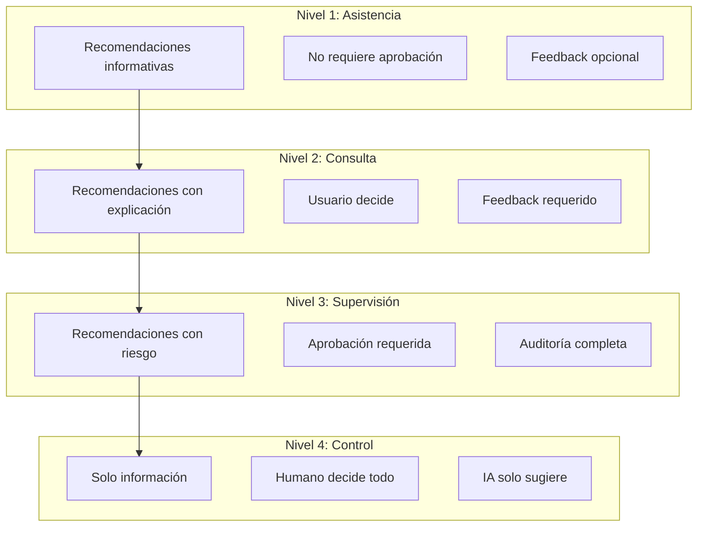

# Política de IA Responsable de EREN

> **Directrices para el uso responsable de IA en entornos hospitalarios**

---

## Tabla de Contenidos

1. [Visión General](#visión-general)
2. [Principios Fundamentales](#principios-fundamentales)
3. [Explicabilidad](#explicabilidad)
4. [Auditoría](#auditoría)
5. [Trazabilidad](#trazabilidad)
6. [Prevención de Alucinaciones](#prevención-de-alucinaciones)
7. [Confianza y Transparencia](#confianza-y-transparencia)
8. [Privacidad y Protección de Datos](#privacidad-y-protección-de-datos)
9. [Uso de Modelos de Lenguaje](#uso-de-modelos-de-lenguaje)
10. [Gestión de Contexto](#gestión-de-contexto)
11. [Sistema de Memoria](#sistema-de-memoria)
12. [Permisos y Autorización](#permisos-y-autorización)
13. [Versionado de Modelos](#versionado-de-modelos)
14. [Humano en el Circuito](#humano-en-el-circuito)
15. [Métricas de IA Responsable](#métricas-de-ia-responsable)

---

## Visión General

EREN opera en entornos hospitalarios donde las decisiones tienen consecuencias directas en la seguridad del paciente. Esta política establece los estándares mínimos para el uso responsable de IA, asegurando que EREN amplifique la capacidad humana sin comprometer la seguridad o la confianza.

### Alcance

Esta política aplica a:

- Todos los agentes de IA en EREN
- Todos los modelos de lenguaje utilizados
- Todos los sistemas de conocimiento y memoria
- Todas las interacciones con usuarios
- Todos los procesos de toma de decisiones asistida por IA

---

## Principios Fundamentales

### 1. Explicabilidad Obligatoria

**Principio**: Toda recomendación de IA debe ser explicable.

**Implementación**:
- Cada respuesta debe incluir razonamiento
- Fuentes de conocimiento deben ser citadas
- Nivel de confianza debe ser explícito
- Incertidumbre debe ser admitida cuando exista

```python
class AgentResponse:
    content: str  # Respuesta principal
    reasoning: str  # Razonamiento detallado
    sources: List[str]  # Fuentes citadas
    confidence: float  # Nivel de confianza (0-1)
    uncertainty: Optional[str]  # Admisión de incertidumbre
    limitations: List[str]  # Limitaciones conocidas
```

### 2. Auditoría Completa

**Principio**: Toda acción de IA debe ser auditable.

**Implementación**:
- Registro de todas las interacciones
- Logging de decisiones del orquestador
- Trazabilidad de fuentes de información
- Registro de permisos utilizados
- Timestamps en todas las acciones

### 3. Trazabilidad Total

**Principio**: Cada decisión debe ser trazable a su origen.

**Implementación**:
- Chain of thought para decisiones complejas
- Referencias a documentos y casos específicos
- Historial de versiones de conocimiento
- Registro de cambios en modelos

### 4. Anti-Halucinación

**Principio**: EREN no debe inventar información.

**Implementación**:
- Verificación de hechos antes de responder
- Citas obligatorias para afirmaciones fácticas
- Admisión de ignorancia cuando no se sabe
- Validación de conocimiento con fuentes confiables

### 5. Confianza Basada en Evidencia

**Principio**: La confianza se gana con evidencia, no con seguridad aparente.

**Implementación**:
- Confidence scores basados en evidencia
- Distinción clara entre hecho y probabilidad
- Admisión de limitaciones del conocimiento
- Referencias a casos similares y su éxito

### 6. Privacidad por Defecto

**Principio**: Los datos sensibles deben protegerse por defecto.

**Implementación**:
- PII no debe enviarse a modelos externos sin anonimización
- Datos de pacientes deben ser redactados
- Row Level Security para acceso a datos
- Encriptación en reposo y en tránsito

### 7. Humano en el Circuito

**Principio**: El humano siempre tiene la última palabra en decisiones críticas.

**Implementación**:
- Decisiones críticas requieren aprobación explícita
- Recomendaciones, no órdenes
- Capacidad de override por humano
- Feedback loop para aprendizaje

---

## Explicabilidad

### Niveles de Explicabilidad



### Implementación de Explicabilidad

```python
class ExplanationGenerator:
    def generate_explanation(
        self,
        agent_result: AgentResult,
        context: Context
    ) -> Explanation:
        """Genera una explicación detallada del resultado del agente."""
        
        explanation = Explanation()
        
        # Nivel 1: Respuesta básica
        explanation.content = agent_result.content
        explanation.sources = agent_result.sources
        explanation.confidence = agent_result.confidence
        
        # Nivel 2: Razonamiento
        explanation.reasoning = self._generate_reasoning(
            agent_result,
            context
        )
        explanation.steps = self._extract_steps(agent_result)
        explanation.alternatives = self._identify_alternatives(agent_result)
        
        # Nivel 3: Chain of thought
        explanation.chain_of_thought = self._generate_chain_of_thought(
            agent_result,
            context
        )
        explanation.case_references = self._find_case_references(agent_result)
        explanation.uncertainty_analysis = self._analyze_uncertainty(agent_result)
        
        # Nivel 4: Visualización (opcional)
        if context.requires_expert_explanation:
            explanation.visualization = self._generate_visualization(
                agent_result,
                explanation
            )
            explanation.expert_comparison = self._compare_with_experts(agent_result)
            explanation.external_validation = self._validate_externally(agent_result)
        
        return explanation
```

---

## Auditoría

### Eventos Auditables

```python
class AuditEventType(Enum):
    # Eventos de usuario
    USER_LOGIN = "user_login"
    USER_LOGOUT = "user_logout"
    USER_QUERY = "user_query"
    
    # Eventos de agentes
    AGENT_INVOKED = "agent_invoked"
    AGENT_COMPLETED = "agent_completed"
    AGENT_FAILED = "agent_failed"
    
    # Eventos de herramientas
    TOOL_USED = "tool_used"
    TOOL_FAILED = "tool_failed"
    
    # Eventos de conocimiento
    KNOWLEDGE_ACCESSED = "knowledge_accessed"
    KNOWLEDGE_UPDATED = "knowledge_updated"
    
    # Eventos de decisiones
    DECISION_MADE = "decision_made"
    RECOMMENDATION_PROVIDED = "recommendation_provided"
    
    # Eventos de seguridad
    PERMISSION_GRANTED = "permission_granted"
    PERMISSION_DENIED = "permission_denied"
    SECURITY_VIOLATION = "security_violation"
```

### Sistema de Auditoría

```python
class AuditSystem:
    def __init__(self, audit_repository: AuditRepository):
        self.audit_repository = audit_repository
    
    async def log_event(
        self,
        event_type: AuditEventType,
        user_id: str,
        metadata: Dict[str, Any]
    ) -> None:
        """Registra un evento de auditoría."""
        
        audit_event = AuditEvent(
            id=str(uuid4()),
            event_type=event_type,
            user_id=user_id,
            timestamp=datetime.now(),
            metadata=metadata,
            ip_address=self._get_ip_address(),
            user_agent=self._get_user_agent()
        )
        
        await self.audit_repository.save(audit_event)
    
    async def log_agent_invocation(
        self,
        agent_name: str,
        user_id: str,
        query: str,
        result: AgentResult
    ) -> None:
        """Registra la invocación de un agente."""
        
        await self.log_event(
            event_type=AuditEventType.AGENT_INVOKED,
            user_id=user_id,
            metadata={
                "agent_name": agent_name,
                "query": query,
                "confidence": result.confidence,
                "sources": result.sources,
                "tools_used": [tool.name for tool in result.tools_used]
            }
        )
    
    async def log_recommendation(
        self,
        recommendation: str,
        user_id: str,
        context: Context,
        confidence: float
    ) -> None:
        """Registra una recomendación proporcionada."""
        
        await self.log_event(
            event_type=AuditEventType.RECOMMENDATION_PROVIDED,
            user_id=user_id,
            metadata={
                "recommendation": recommendation,
                "context": context.dict(),
                "confidence": confidence,
                "requires_approval": context.is_critical
            }
        )
```

---

## Trazabilidad

### Chain of Thought

```python
class ChainOfThought:
    steps: List[ThoughtStep]
    final_decision: str
    confidence: float
    alternatives_considered: List[Alternative]

class ThoughtStep:
    step_number: int
    description: str
    reasoning: str
    evidence: List[Evidence]
    confidence: float
    timestamp: datetime

class Evidence:
    source_type: SourceType  # DOCUMENT, CASE, KNOWLEDGE, EXPERT
    source_id: str
    relevance: float
    content: str
```

### Implementación de Trazabilidad

```python
class TracingSystem:
    def __init__(self, trace_repository: TraceRepository):
        self.trace_repository = trace_repository
    
    async def create_trace(
        self,
        user_id: str,
        query: str
    ) -> TraceId:
        """Crea un nuevo trace para una interacción."""
        
        trace = Trace(
            id=str(uuid4()),
            user_id=user_id,
            query=query,
            started_at=datetime.now(),
            steps=[]
        )
        
        await self.trace_repository.save(trace)
        return trace.id
    
    async def add_step(
        self,
        trace_id: TraceId,
        step: ThoughtStep
    ) -> None:
        """Añade un paso al chain of thought."""
        
        trace = await self.trace_repository.find_by_id(trace_id)
        trace.steps.append(step)
        await self.trace_repository.save(trace)
    
    async def finalize_trace(
        self,
        trace_id: TraceId,
        decision: str,
        confidence: float
    ) -> None:
        """Finaliza un trace con la decisión final."""
        
        trace = await self.trace_repository.find_by_id(trace_id)
        trace.final_decision = decision
        trace.confidence = confidence
        trace.completed_at = datetime.now()
        await self.trace_repository.save(trace)
```

---

## Prevención de Alucinaciones

### Estrategias de Anti-Halucinación



### Implementación de Anti-Halucinación

```python
class HallucinationPreventionSystem:
    def __init__(
        self,
        knowledge_base: KnowledgeBase,
        fact_checker: FactChecker
    ):
        self.knowledge_base = knowledge_base
        self.fact_checker = fact_checker
    
    async def verify_response(
        self,
        response: str,
        sources: List[str]
    ) -> VerificationResult:
        """Verifica una respuesta para detectar posibles alucinaciones."""
        
        verification = VerificationResult()
        
        # 1. Extraer afirmaciones fácticas
        factual_claims = await self._extract_factual_claims(response)
        
        # 2. Verificar cada afirmación
        for claim in factual_claims:
            claim_verification = await self.fact_checker.verify(
                claim=claim,
                sources=sources
            )
            verification.claims.append(claim_verification)
        
        # 3. Verificar consistencia interna
        verification.internal_consistency = await self._check_internal_consistency(
            response
        )
        
        # 4. Verificar con conocimiento base
        verification.knowledge_consistency = await self._check_knowledge_consistency(
            response,
            sources
        )
        
        # 5. Calcular confianza ajustada
        verification.adjusted_confidence = self._calculate_adjusted_confidence(
            verification
        )
        
        return verification
    
    async def _extract_factual_claims(self, response: str) -> List[FactualClaim]:
        """Extrae afirmaciones fácticas de una respuesta."""
        # Implementación con NLP para extraer afirmaciones
        pass
    
    async def _check_internal_consistency(self, response: str) -> bool:
        """Verifica la consistencia interna de la respuesta."""
        # Verificar que no haya contradicciones internas
        pass
```

---

## Confianza y Transparencia

### Cálculo de Confianza

```python
class ConfidenceCalculator:
    def calculate_confidence(
        self,
        agent_result: AgentResult,
        context: Context
    ) -> ConfidenceScore:
        """Calcula el nivel de confianza de un resultado."""
        
        confidence = ConfidenceScore()
        
        # Factores que afectan la confianza
        factors = {
            "source_quality": self._evaluate_source_quality(agent_result.sources),
            "case_similarity": self._evaluate_case_similarity(agent_result),
            "knowledge_coverage": self._evaluate_knowledge_coverage(agent_result),
            "agent_performance": self._evaluate_agent_performance(agent_result.agent_name),
            "user_feedback": self._evaluate_user_feedback(context.user_id),
            "certainty_level": agent_result.certainty_level
        }
        
        # Calcular confianza ponderada
        confidence.raw_score = self._calculate_weighted_score(factors)
        confidence.adjusted_score = self._adjust_for_uncertainty(
            confidence.raw_score,
            agent_result.uncertainty
        )
        
        # Calibrar confianza
        confidence.calibrated_score = self._calibrate_confidence(
            confidence.adjusted_score,
            context
        )
        
        confidence.factors = factors
        confidence.explanation = self._generate_confidence_explanation(factors)
        
        return confidence
    
    def _evaluate_source_quality(self, sources: List[str]) -> float:
        """Evalúa la calidad de las fuentes."""
        if not sources:
            return 0.0
        
        quality_scores = []
        for source in sources:
            if source.startswith("manual_"):
                quality_scores.append(0.9)  # Manuales son alta calidad
            elif source.startswith("case_"):
                quality_scores.append(0.7)  # Casos son media calidad
            else:
                quality_scores.append(0.5)  # Otras fuentes
        
        return sum(quality_scores) / len(quality_scores)
```

---

## Privacidad y Protección de Datos

### Anonimización de Datos

```python
class DataAnonymizer:
    def __init__(self):
        self.pii_detector = PIIDetector()
        self.redactor = TextRedactor()
    
    async def anonymize_query(
        self,
        query: str,
        context: Context
    ) -> str:
        """Anonimiza una query antes de enviarla a modelos externos."""
        
        # Detectar PII
        pii_entities = await self.pii_detector.detect(query)
        
        # Redactar PII
        anonymized_query = query
        for entity in pii_entities:
            anonymized_query = self.redactor.redact(
                anonymized_query,
                entity.start,
                entity.end,
                replacement=f"[{entity.type}]"
            )
        
        return anonymized_query
    
    async def anonymize_case(
        self,
        case: Case
    ) -> AnonymizedCase:
        """Anonimiza un caso para compartir conocimiento."""
        
        return AnonymizedCase(
            symptoms=self._anonymize_symptoms(case.symptoms),
            diagnosis=self._anonymize_diagnosis(case.diagnosis),
            solution=self._anonymize_solution(case.solution),
            equipment_model=case.equipment.model,  # No es PII
            timestamp=case.created_at  # No es PII
        )
```

### Row Level Security

```python
class RLSManager:
    def __init__(self, user_repository: UserRepository):
        self.user_repository = user_repository
    
    async def apply_rls(
        self,
        query: str,
        user_id: str
    ) -> str:
        """Aplica Row Level Security a una query."""
        
        user = await self.user_repository.find_by_id(user_id)
        
        # Añadir filtro de hospital
        rls_filter = f"AND hospital_id = '{user.hospital_id}'"
        
        # Añadir filtros adicionales según rol
        if user.role == "viewer":
            rls_filter += " AND is_public = true"
        elif user.role == "technician":
            rls_filter += " AND area_id IN (SELECT area_id FROM user_areas WHERE user_id = '{user_id}')"
        
        return f"{query} {rls_filter}"
```

---

## Uso de Modelos de Lenguaje

### Selección de Modelos

```python
class ModelSelector:
    def __init__(self):
        self.models = {
            "gpt-4": ModelConfig(
                name="gpt-4",
                capabilities=["reasoning", "analysis", "generation"],
                max_tokens=8192,
                cost_per_1k_tokens=0.03,
                latency=2000  # ms
            ),
            "gpt-4-turbo": ModelConfig(
                name="gpt-4-turbo",
                capabilities=["reasoning", "analysis", "generation"],
                max_tokens=128000,
                cost_per_1k_tokens=0.01,
                latency=1000  # ms
            ),
            "gpt-3.5-turbo": ModelConfig(
                name="gpt-3.5-turbo",
                capabilities=["generation", "simple_analysis"],
                max_tokens=4096,
                cost_per_1k_tokens=0.002,
                latency=500  # ms
            )
        }
    
    def select_model(
        self,
        task: Task,
        context: Context
    ) -> str:
        """Selecciona el modelo apropiado para una tarea."""
        
        if task.requires_complex_reasoning:
            return "gpt-4"
        elif task.requires Large_context:
            return "gpt-4-turbo"
        elif task.is_simple:
            return "gpt-3.5-turbo"
        else:
            return "gpt-4-turbo"  # Default
```

### Gestión de Tokens

```python
class TokenManager:
    def __init__(self):
        self.usage_tracker = TokenUsageTracker()
    
    async def estimate_tokens(self, text: str) -> int:
        """Estima el número de tokens en un texto."""
        # Implementación aproximada: 1 token ≈ 4 caracteres
        return len(text) // 4
    
    async def check_token_limit(
        self,
        text: str,
        model: str
    ) -> bool:
        """Verifica si el texto excede el límite de tokens del modelo."""
        
        estimated_tokens = await self.estimate_tokens(text)
        max_tokens = self.models[model].max_tokens
        
        return estimated_tokens < max_tokens
    
    async def truncate_to_fit(
        self,
        text: str,
        model: str
    ) -> str:
        """Trunca el texto para que quepa en el límite de tokens."""
        
        max_tokens = self.models[model].max_tokens
        estimated_tokens = await self.estimate_tokens(text)
        
        if estimated_tokens < max_tokens:
            return text
        
        # Truncar manteniendo estructura
        target_length = (max_tokens * 4) * 0.9  # 90% del límite
        return text[:target_length]
```

---

## Gestión de Contexto

### Sistema de Contexto

```python
class ContextManager:
    def __init__(self, context_store: ContextStore):
        self.context_store = context_store
    
    async def build_context(
        self,
        user_id: str,
        query: str,
        conversation_history: List[Message]
    ) -> Context:
        """Construye el contexto para una interacción."""
        
        context = Context()
        
        # Información de usuario
        context.user = await self._get_user_context(user_id)
        
        # Información de hospital
        context.hospital = await self._get_hospital_context(context.user.hospital_id)
        
        # Historial de conversación
        context.conversation_history = conversation_history[-10:]  # Últimos 10 mensajes
        
        # Contexto de equipo si está disponible
        context.equipment = await self._extract_equipment_context(query)
        
        # Contexto de caso si está disponible
        context.case = await self._extract_case_context(query)
        
        # Permisos del usuario
        context.permissions = await self._get_user_permissions(user_id)
        
        return context
    
    async def _extract_equipment_context(self, query: str) -> Optional[Equipment]:
        """Extrae información de equipo de la query."""
        # Implementación con NLP para detectar mención de equipos
        pass
```

---

## Sistema de Memoria

### Memoria a Corto Plazo

```python
class ShortTermMemory:
    def __init__(self, redis_client: Redis):
        self.redis = redis_client
    
    async def store(
        self,
        key: str,
        value: Any,
        ttl: int = 3600
    ) -> None:
        """Almacena un valor en memoria a corto plazo."""
        await self.redis.setex(
            key,
            ttl,
            json.dumps(value)
        )
    
    async def retrieve(self, key: str) -> Optional[Any]:
        """Recupera un valor de memoria a corto plazo."""
        value = await self.redis.get(key)
        if value:
            return json.loads(value)
        return None
```

### Memoria a Largo Plazo

```python
class LongTermMemory:
    def __init__(self, database: Database):
        self.database = database
    
    async def store_user_preference(
        self,
        user_id: str,
        preference: UserPreference
    ) -> None:
        """Almacena una preferencia de usuario a largo plazo."""
        await self.database.user_preferences.insert({
            "user_id": user_id,
            "key": preference.key,
            "value": preference.value,
            "created_at": datetime.now()
        })
    
    async def retrieve_user_preferences(
        self,
        user_id: str
    ) -> List[UserPreference]:
        """Recupera todas las preferencias de un usuario."""
        rows = await self.database.user_preferences.find(
            {"user_id": user_id}
        )
        return [UserPreference(**row) for row in rows]
```

---

## Permisos y Autorización

### Sistema de Permisos para IA

```python
class AIPermissionSystem:
    def __init__(self, permission_repository: PermissionRepository):
        self.permission_repository = permission_repository
    
    async def check_agent_permission(
        self,
        user_id: str,
        agent_name: str
    ) -> bool:
        """Verifica si un usuario puede usar un agente específico."""
        
        user = await self.permission_repository.find_user(user_id)
        
        # Permisos específicos de agentes
        agent_permissions = {
            "diagnosis_agent": "use_diagnosis_agent",
            "documentation_agent": "use_documentation_agent",
            "history_agent": "use_history_agent",
            "prediction_agent": "use_prediction_agent"
        }
        
        required_permission = agent_permissions.get(agent_name)
        
        if not required_permission:
            return False
        
        return required_permission in user.permissions
    
    async def check_critical_decision_permission(
        self,
        user_id: str
    ) -> bool:
        """Verifica si un usuario puede tomar decisiones críticas."""
        
        user = await self.permission_repository.find_user(user_id)
        
        # Solo ciertos roles pueden tomar decisiones críticas
        critical_roles = ["admin", "manager", "senior_engineer"]
        
        return user.role in critical_roles
```

---

## Versionado de Modelos

### Gestión de Versiones

```python
class ModelVersionManager:
    def __init__(self):
        self.model_registry = ModelRegistry()
    
    async def register_model(
        self,
        model_name: str,
        version: str,
        config: ModelConfig
    ) -> None:
        """Registra una versión de un modelo."""
        
        model_version = ModelVersion(
            id=str(uuid4()),
            model_name=model_name,
            version=version,
            config=config,
            registered_at=datetime.now(),
            status=ModelStatus.ACTIVE
        )
        
        await self.model_registry.save(model_version)
    
    async def get_active_version(
        self,
        model_name: str
    ) -> ModelVersion:
        """Obtiene la versión activa de un modelo."""
        
        return await self.model_registry.find_active(model_name)
    
    async def rollback_version(
        self,
        model_name: str,
        target_version: str
    ) -> None:
        """Rollback a una versión específica de un modelo."""
        
        # Desactivar versión actual
        current_version = await self.get_active_version(model_name)
        current_version.status = ModelStatus.INACTIVE
        
        # Activar versión objetivo
        target_version = await self.model_registry.find(
            model_name=model_name,
            version=target_version
        )
        target_version.status = ModelStatus.ACTIVE
        
        await self.model_registry.save(current_version)
        await self.model_registry.save(target_version)
```

---

## Humano en el Circuito

### Niveles de Autonomía



### Implementación de Humano en el Circuito

```python
class HumanInTheLoopSystem:
    def __init__(self, approval_repository: ApprovalRepository):
        self.approval_repository = approval_repository
    
    async def requires_approval(
        self,
        recommendation: Recommendation,
        context: Context
    ) -> bool:
        """Determina si una recomendación requiere aprobación humana."""
        
        # Factores que requieren aprobación
        critical_factors = [
            recommendation.confidence < 0.8,  # Baja confianza
            context.is_critical_decision,  # Decisión crítica
            recommendation.risk_level == "high",  # Alto riesgo
            recommendation.affects_patient_safety,  # Afecta seguridad del paciente
        ]
        
        return any(critical_factors)
    
    async def request_approval(
        self,
        recommendation: Recommendation,
        user_id: str
    ) -> ApprovalRequest:
        """Solicita aprobación humana para una recomendación."""
        
        approval_request = ApprovalRequest(
            id=str(uuid4()),
            recommendation_id=recommendation.id,
            user_id=user_id,
            status=ApprovalStatus.PENDING,
            created_at=datetime.now(),
            expires_at=datetime.now() + timedelta(hours=24)
        )
        
        await self.approval_repository.save(approval_request)
        
        # Notificar al usuario
        await self._notify_user(approval_request)
        
        return approval_request
    
    async def process_approval(
        self,
        approval_id: str,
        approved: bool,
        approver_id: str,
        comments: Optional[str] = None
    ) -> None:
        """Procesa una aprobación humana."""
        
        approval = await self.approval_repository.find_by_id(approval_id)
        approval.status = ApprovalStatus.APPROVED if approved else ApprovalStatus.REJECTED
        approval.approver_id = approver_id
        approval.approved_at = datetime.now()
        approval.comments = comments
        
        await self.approval_repository.save(approval)
        
        # Ejecutar o rechazar la recomendación
        if approved:
            await self._execute_recommendation(approval.recommendation_id)
        else:
            await self._reject_recommendation(approval.recommendation_id)
```

---

## Métricas de IA Responsable

### Métricas Clave

```python
class ResponsibleAIMetrics:
    def __init__(self, metrics_repository: MetricsRepository):
        self.metrics_repository = metrics_repository
    
    async def track_explainability(
        self,
        response: AgentResponse
    ) -> None:
        """Rastrea métricas de explicabilidad."""
        
        metrics = {
            "has_reasoning": bool(response.reasoning),
            "has_sources": len(response.sources) > 0,
            "has_confidence": response.confidence is not None,
            "reasoning_length": len(response.reasoning) if response.reasoning else 0,
            "sources_count": len(response.sources),
            "confidence_score": response.confidence
        }
        
        await self.metrics_repository.save("explainability", metrics)
    
    async def track_hallucination_rate(
        self,
        verification: VerificationResult
    ) -> None:
        """Rastrea la tasa de alucinaciones."""
        
        metrics = {
            "total_claims": len(verification.claims),
            "verified_claims": sum(1 for c in verification.claims if c.verified),
            "unverified_claims": sum(1 for c in verification.claims if not c.verified),
            "hallucination_rate": 1 - (sum(1 for c in verification.claims if c.verified) / len(verification.claims))
        }
        
        await self.metrics_repository.save("hallucination", metrics)
    
    async def track_user_satisfaction(
        self,
        user_id: str,
        feedback: UserFeedback
    ) -> None:
        """Rastrea la satisfacción del usuario."""
        
        metrics = {
            "user_id": user_id,
            "satisfaction_score": feedback.score,
            "found_helpful": feedback.helpful,
            "would_recommend": feedback.recommend,
            "comments": feedback.comments
        }
        
        await self.metrics_repository.save("satisfaction", metrics)
```

---

## Resumen

Esta política de IA Responsable establece:

1. **Explicabilidad obligatoria**: Toda recomendación debe ser explicada
2. **Auditoría completa**: Toda acción debe ser registrada y auditable
3. **Trazabilidad total**: Cada decisión debe ser trazable a su origen
4. **Anti-halucinación**: Verificación de hechos antes de responder
5. **Confianza basada en evidencia**: Confidence scores transparentes
6. **Privacidad por defecto**: Protección de datos sensibles
7. **Humano en el circuito**: Aprobación para decisiones críticas

EREN está diseñado para amplificar la capacidad humana en entornos hospitalarios sin comprometer la seguridad o la confianza.

---

**Última actualización**: 2026-07-10
**Autor**: Lead Architect (Cascade)
**Versión**: 1.0.0
**Aprobado por**: Comité de Ética de IA (Pendiente)
