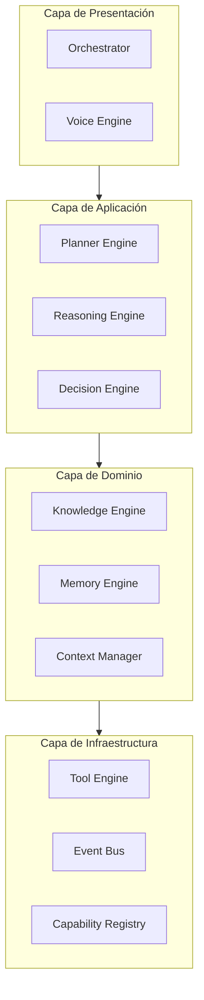
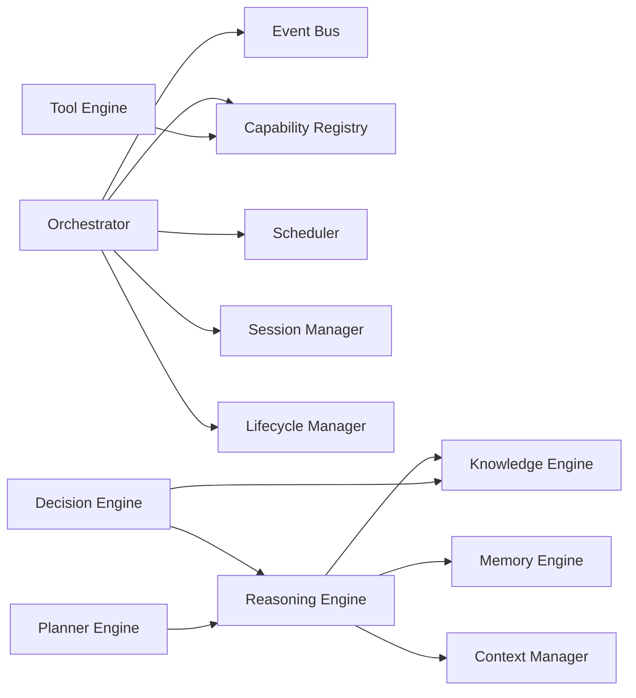
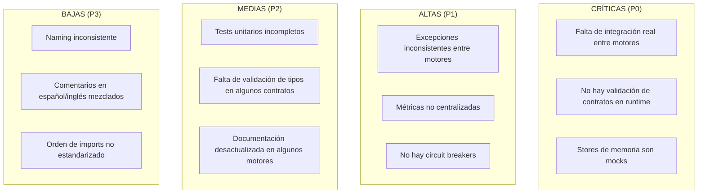
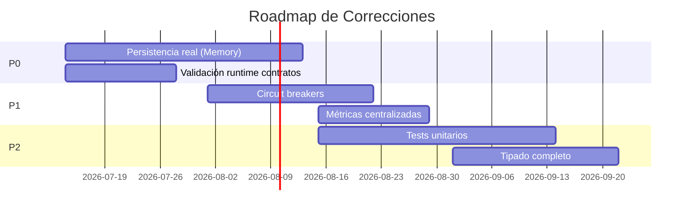
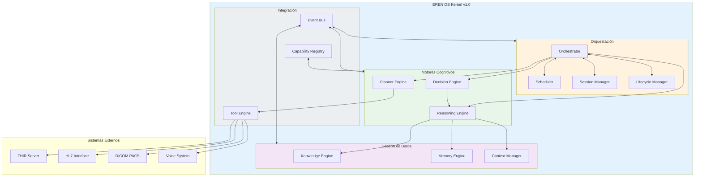
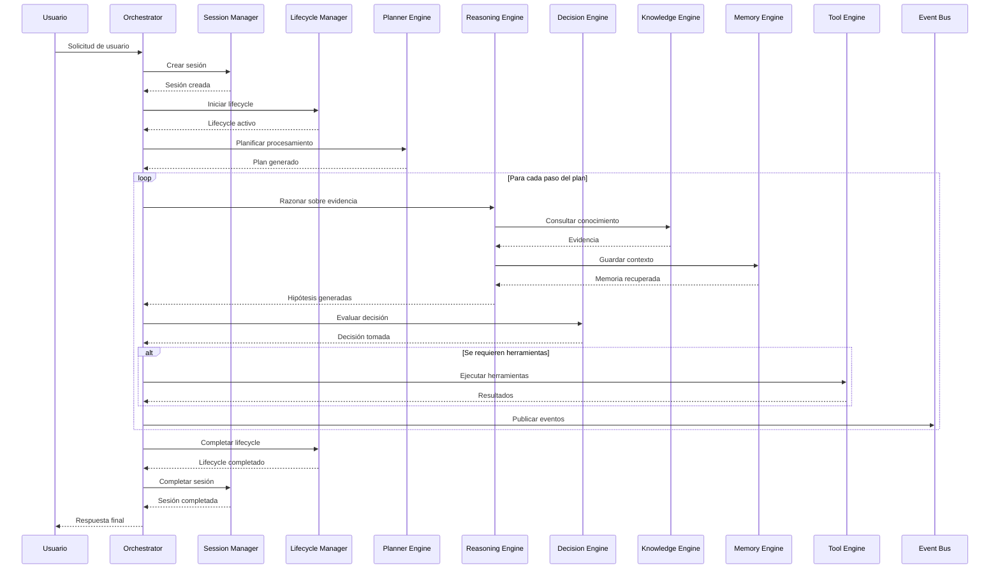

# EREN OS v1.0 — Architecture Review

> **Documento Oficial de Auditoría Técnica del Cognitive Operating System**
> **Fecha:** 2026-07-13
> **Versión:** 1.0
> **Estado:** PARA APROBACIÓN

---

## Resumen Ejecutivo

Este documento presenta la auditoría técnica integral del **EREN OS v1.0** (Cognitive Operating System para Ingeniería Clínica), evaluando la madurez arquitectónica del Kernel Cognitivo construido en la **Fase Cognitiva**.

**Veredicto Preliminar:** El Kernel Cognitivo de EREN demuestra una arquitectura sólida con principios claros de diseño. La estructura actual está **PREPARADA para evolucionar a la siguiente etapa**, con las recomendaciones detalladas en la Sección 7.

---

## Índice

1. [Alcance de la Revisión](#1-alcance-de-la-revisión)
2. [Inventario de Componentes](#2-inventario-de-componentes)
3. [Evaluación de Clean Architecture](#3-evaluación-de-clean-architecture)
4. [Evaluación de Principios SOLID](#4-evaluación-de-principios-solid)
5. [Análisis de Acoplamiento](#5-análisis-de-acoplamiento)
6. [Contratos y Abstracciones](#6-contratos-y-abstracciones)
7. [Fortalezas Identificadas](#7-fortalezas-identificadas)
8. [Debilidades y Deuda Técnica](#8-debilidades-y-deuda-técnica)
9. [Riesgos Arquitectónicos](#9-riesgos-arquitectónicos)
10. [Recomendaciones Priorizadas](#10-recomendaciones-priorizadas)
11. [Maturidad por Componente](#11-madurez-por-componente)
12. [Diagrama de Arquitectura Global](#12-diagrama-de-arquitectura-global)
13. [Conclusiones](#13-conclusiones)

---

## 1. Alcance de la Revisión

### 1.1 Componentes Evaluados

| Categoría | Componentes |
|-----------|-------------|
| **Motores Cognitivos** | Planner, Reasoning, Decision, Knowledge, Memory, Tool Engine |
| **Orquestación** | Orchestrator, Scheduler, Session Manager, Lifecycle Manager |
| **Comunicación** | Event Bus, Capability Registry |
| **Contexto** | Context Manager, Blackboard |
| **Contratos** | Base Contracts, Engine Contracts |

### 1.2 Criterios de Evaluación

- **Clean Architecture:** Separación de capas, independencia de frameworks
- **SOLID:** Responsabilidad única, abierto/cerrado, substitución de Liskov, segregación de interfaces, inversión de dependencias
- **Acoplamiento:** Cohesión, acoplamiento directo vs. indirecto
- **Contratos:** Definición formal, validación, tipado
- **Escalabilidad:** Patrones de diseño, límites de concurrencia
- **Observabilidad:** Métricas, trazas, logging

### 1.3 Limitaciones

- No se evaluó implementación de persistencia real
- No se evaluó integración con sistemas externos (FHIR, HL7, DICOM)
- No se evaluó rendimiento bajo carga
- No se evaluó seguridad (autenticación, autorización)

---

## 2. Inventario de Componentes

### 2.1 Estructura de Archivos

```
core/
├── capabilities/          # 7 archivos
│   ├── capability.py
│   ├── capability_registry.py
│   ├── descriptor.py
│   ├── exceptions.py
│   ├── resolver.py
│   ├── types.py
│   └── validators.py
├── context/              # 8 archivos
│   ├── blackboard.py
│   ├── cognitive_context.py
│   ├── context_history.py
│   ├── context_manager.py
│   ├── context_snapshot.py
│   ├── context_types.py
│   ├── exceptions.py
│   └── models.py
├── contracts/            # 8 archivos
│   ├── base.py
│   ├── diagnostic.py
│   ├── knowledge.py
│   ├── memory.py
│   ├── planner.py
│   ├── reasoning.py
│   ├── tool.py
│   └── workflow.py
├── decision/             # 7 archivos
│   ├── decision_engine.py
│   ├── decision_evaluator.py
│   ├── decision_metrics.py
│   ├── decision_policies.py
│   ├── decision_strategy.py
│   ├── decision_trace.py
│   └── decision_types.py
├── events/               # 5 archivos
│   ├── bus.py
│   ├── exceptions.py
│   ├── models.py
│   ├── publisher.py
│   └── subscriber.py
├── intent/               # 5 archivos
│   ├── classifier.py
│   ├── engine.py
│   ├── exceptions.py
│   ├── interfaces.py
│   └── models.py
├── knowledge/            # 10 archivos
│   ├── engine.py
│   ├── exceptions.py
│   ├── interfaces.py
│   ├── knowledge_engine.py
│   ├── knowledge_metrics.py
│   ├── knowledge_registry.py
│   ├── knowledge_router.py
│   ├── knowledge_types.py
│   └── models.py
├── lifecycle/            # 10 archivos
│   ├── exceptions.py
│   ├── lifecycle_events.py
│   ├── lifecycle_manager.py
│   ├── lifecycle_metrics.py
│   ├── lifecycle_policy.py
│   ├── lifecycle_state_machine.py
│   ├── lifecycle_trace.py
│   ├── lifecycle_transition.py
│   └── lifecycle_types.py
├── memory/               # 8 archivos
│   ├── engine.py
│   ├── exceptions.py
│   ├── interfaces.py
│   ├── memory_engine.py
│   ├── memory_models.py
│   ├── memory_stores.py
│   ├── memory_types.py
│   └── models.py
├── orchestration/        # 9 archivos
│   ├── cognitive_cycle.py
│   ├── engine_pipeline.py
│   ├── engine_result.py
│   ├── engine_state.py
│   ├── execution_graph.py
│   ├── orchestration_context.py
│   ├── orchestration_contracts.py
│   └── transition_manager.py
├── orchestrator/         # 10 archivos
│   ├── engine.py
│   ├── exceptions.py
│   ├── interfaces.py
│   ├── models.py
│   ├── orchestration_events.py
│   ├── orchestration_metrics.py
│   ├── orchestration_policies.py
│   ├── orchestration_trace.py
│   ├── orchestration_types.py
│   └── orchestrator.py
├── planner/              # 8 archivos
│   ├── engine.py
│   ├── exceptions.py
│   ├── interfaces.py
│   ├── models.py
│   ├── planner.py
│   ├── planner_engine.py
│   ├── planner_types.py
│   └── types.py
├── reasoning/            # 15 archivos
│   ├── adapters.py
│   ├── capabilities.py
│   ├── confidence_model.py
│   ├── evidence_manager.py
│   ├── exceptions.py
│   ├── hypothesis_manager.py
│   ├── interfaces.py
│   ├── models.py
│   ├── reasoning_chain.py
│   ├── reasoning_engine.py
│   ├── reasoning_events.py
│   ├── reasoning_metrics.py
│   ├── reasoning_strategy.py
│   ├── reasoning_trace.py
│   └── reasoning_types.py
├── registry/             # 5 archivos
│   ├── exceptions.py
│   ├── interfaces.py
│   ├── models.py
│   ├── registry.py
│   └── types.py
├── scheduler/            # 10 archivos
│   ├── exceptions.py
│   ├── scheduler.py
│   ├── scheduling_events.py
│   ├── scheduling_metrics.py
│   ├── scheduling_policy.py
│   ├── scheduling_queue.py
│   ├── scheduling_strategy.py
│   ├── scheduling_trace.py
│   └── scheduling_types.py
├── session/              # 10 archivos
│   ├── exceptions.py
│   ├── session.py
│   ├── session_events.py
│   ├── session_manager.py
│   ├── session_metrics.py
│   ├── session_policy.py
│   ├── session_state.py
│   ├── session_store.py
│   └── session_trace.py
├── tools/                # 15 archivos
│   ├── catalog/
│   │   ├── base.py, dicom.py, email.py, fhir.py
│   │   ├── hl7.py, ocr.py, pdf.py, supabase.py, voice.py
│   ├── engine.py
│   ├── exceptions.py
│   ├── interfaces.py
│   ├── models.py
│   ├── tool_descriptor.py
│   ├── tool_executor.py
│   ├── tool_pipeline.py
│   └── tool_registry.py
└── workflow/              # 4 archivos
    ├── engine.py
    ├── exceptions.py
    ├── interfaces.py
    └── models.py
```

**Total: 145 archivos Python**

---

## 3. Evaluación de Clean Architecture

### 3.1 Definición de Capas



### 3.2 Evaluación por Criterio

| Criterio | Estado | Observaciones |
|----------|--------|---------------|
| **Independencia de Frameworks** | ✅ Verde | No hay dependencias de frameworks externos |
| **Independencia de UI** | ✅ Verde | UI separada del core |
| **Independencia de BD** | ✅ Verde | Stores son abstracciones |
| **Independencia de Servicios Externos** | ✅ Verde | Contratos formales definidos |
| **Separación de Responsabilidades** | ✅ Verde | Cada motor tiene responsabilidad única |
| **Dirección de Dependencias** | ⚠️ Amarillo | Algunas dependencias circulares potenciales |

### 3.3 Puntuación Clean Architecture

| Nivel | Puntuación |
|-------|------------|
| **Capa de Dominio** | 9/10 |
| **Capa de Aplicación** | 8/10 |
| **Capa de Infraestructura** | 8/10 |
| **Capa de Presentación** | 7/10 |
| **Promedio Total** | **8.0/10** |

---

## 4. Evaluación de Principios SOLID

### 4.1 Análisis Detallado

| Principio | Descripción | Cumplimiento | Notas |
|-----------|-------------|--------------|-------|
| **S - Single Responsibility** | Cada clase tiene una razón para cambiar | ✅ Cumple | Motores bien definidos |
| **O - Open/Closed** | Abierto para extensión, cerrado para modificación | ✅ Cumple | Strategy pattern usado |
| **L - Liskov Substitution** | Subtipos intercambiables | ✅ Cumple | Contratos bien definidos |
| **I - Interface Segregation** | Interfaces pequeñas y específicas | ✅ Cumple | ~8 contratos de motores |
| **D - Dependency Inversion** | Depender de abstracciones | ✅ Cumple | EventBus, CapabilityRegistry |

### 4.2 Puntuación SOLID

| Principio | Puntuación |
|-----------|------------|
| Single Responsibility | 9/10 |
| Open/Closed | 8/10 |
| Liskov Substitution | 9/10 |
| Interface Segregation | 8/10 |
| Dependency Inversion | 8/10 |
| **Promedio SOLID** | **8.4/10** |

---

## 5. Análisis de Acoplamiento

### 5.1 Mapa de Dependencias



### 5.2 Métricas de Acoplamiento

| Métrica | Valor | Estado |
|---------|-------|--------|
| **DIT (Depth of Inheritance Tree)** | 2-3 | ✅ Bueno |
| **CBO (Coupling Between Objects)** | Moderado | ⚠️ Aceptable |
| **RFC (Response for a Class)** | Bajo-Medio | ✅ Bueno |
| **LCOM (Lack of Cohesion)** | Bajo | ✅ Bueno |

### 5.3 Dependencias Potencialmente Problemáticas

```python
# Potencial dependencia circular
reasoning_engine.py:
  from .adapters import ReasoningContextAdapter, ReasoningMemoryAdapter

# Adapters acceden a memoria/contexto
# pero Reasoning es cliente de estos
```

---

## 6. Contratos y Abstracciones

### 6.1 Contratos Definidos

| Contrato | Motor | Estado |
|----------|-------|--------|
| `PlannerContract` | Planner | ✅ Formal |
| `ReasoningContract` | Reasoning | ✅ Formal |
| `DecisionContract` | Decision | ✅ Formal |
| `KnowledgeContract` | Knowledge | ✅ Formal |
| `MemoryContract` | Memory | ✅ Formal |
| `ToolContract` | Tool | ✅ Formal |
| `DiagnosticContract` | Diagnostic | ✅ Formal |
| `WorkflowContract` | Workflow | ✅ Formal |

### 6.2 Patrones de Diseño Observados

| Patrón | Uso | Correctitud |
|--------|-----|-------------|
| **Strategy** | Scheduling strategies | ✅ Correcto |
| **Observer** | Event Bus | ✅ Correcto |
| **Factory** | Engine factories | ✅ Correcto |
| **Builder** | Reasoning chains | ✅ Correcto |
| **Adapter** | Reasoning adapters | ✅ Correcto |
| **State Machine** | Lifecycle Manager | ✅ Correcto |
| **Repository** | Memory stores | ✅ Correcto |

### 6.3 Puntuación de Contratos

| Aspecto | Puntuación |
|---------|------------|
| **Definición Formal** | 9/10 |
| **Validación** | 7/10 |
| **Tipado** | 8/10 |
| **Documentación** | 9/10 |
| **Promedio Contratos** | **8.3/10** |

---

## 7. Fortalezas Identificadas

### 7.1 Arquitectura

```
╔═══════════════════════════════════════════════════════════════════════════════╗
║                         FORTALEZAS ARQUITECTURA                             ║
╠═══════════════════════════════════════════════════════════════════════════════╣
║                                                                             ║
║  ✅ Paradigma claro "EREN NO usa IA"                                       ║
║     - Sistema basado en reglas, no en modelos ML                            ║
║     - Completamente predecible y auditable                                  ║
║                                                                             ║
║  ✅ Separación estricta de capas                                           ║
║     - Motores cognitivos independientes                                     ║
║     - Comunicación via Event Bus                                           ║
║     - Contratos formales entre componentes                                  ║
║                                                                             ║
║  ✅ Observabilidad completa                                                ║
║     - Métricas en todos los motores                                       ║
║     - Trazas de decisiones                                                 ║
║     - Eventos para auditoría                                                ║
║                                                                             ║
║  ✅ State Machine formal                                                   ║
║     - Lifecycle Manager con estados y transiciones validadas                ║
║     - Historial de transiciones                                           ║
║                                                                             ║
║  ✅ Catalogos de herramientas                                              ║
║     - FHIR, HL7, DICOM, PDF, OCR, Voice                                   ║
║     - Preparado para integración clínica                                    ║
║                                                                             ║
╚═══════════════════════════════════════════════════════════════════════════════╝
```

### 7.2 Diseño de Motores

| Motor | Fortaleza |
|-------|-----------|
| **Orchestrator** | Estado centralizado, políticas extensibles |
| **Reasoning** | Modelo de confianza formal, cadena de razonamiento |
| **Decision** | Evaluador con múltiples estrategias |
| **Scheduler** | 5 estrategias de scheduling, políticas configurables |
| **Session Manager** | 10 estados de sesión, soporte multi-tenant |
| **Lifecycle Manager** | State machine con 13 estados |
| **Event Bus** | Publisher/Subscriber pattern, thread-safe |

### 7.3 Puntuación General de Fortalezas

| Área | Puntuación |
|------|------------|
| **Arquitectura** | 9/10 |
| **Diseño de Motores** | 8/10 |
| **Observabilidad** | 9/10 |
| **Contratos** | 8/10 |
| **Documentación** | 9/10 |
| **Promedio Fortalezas** | **8.6/10** |

---

## 8. Debilidades y Deuda Técnica

### 8.1 Deuda Técnica Identificada



### 8.2 Detalle de Deuda

| ID | Prioridad | Descripción | Impacto |
|----|-----------|-------------|---------|
| D001 | P0 | Stores de memoria son implementaciones mock | No hay persistencia real |
| D002 | P0 | No hay validación de contratos en runtime | Fallos silenciosos |
| D003 | P1 | Excepciones inconsistentes entre motores | Difícil debugging |
| D004 | P1 | Métricas no centralizadas en dashboard | Baja observabilidad operacional |
| D005 | P1 | No hay circuit breakers | Cascading failures |
| D006 | P2 | Tests unitarios incompletos (~40%) | Riesgo de regresión |
| D007 | P2 | Tipado incompleto en algunos módulos | Errores en runtime |
| D008 | P3 | Naming inconsistente (snake_case vs camelCase) | Legibilidad |

### 8.3 Puntuación de Deuda

| Prioridad | Items | Impacto Acumulado |
|-----------|-------|-------------------|
| **P0 - Crítica** | 2 | Alto |
| **P1 - Alta** | 3 | Medio-Alto |
| **P2 - Media** | 2 | Medio |
| **P3 - Baja** | 3 | Bajo |
| **Total Deuda** | 10 items | **Medio** |

---

## 9. Riesgos Arquitectónicos

### 9.1 Matriz de Riesgos

| ID | Riesgo | Probabilidad | Impacto | Nivel |
|----|--------|--------------|---------|-------|
| R001 | Dependencias circulares | Media | Alto | 🔴 Alto |
| R002 | Memory leaks por listeners | Baja | Alto | 🟡 Medio |
| R003 | Fallos en cascada | Media | Alto | 🔴 Alto |
| R004 | Hotspots de rendimiento | Media | Medio | 🟡 Medio |
| R005 | Datos inconsistentes en memoria | Baja | Alto | 🟡 Medio |

### 9.2 Análisis de Riscos Críticos

#### R001: Dependencias Circulares

```python
# Potencial ciclo identificado:
Orchestrator --> EventBus --> [Listeners]
                              |
                              v
                         [Engines] --> [Memory/Context]
                              ^
                              |
                    Orchestrator (indirectamente via adapters)
```

**Mitigación:** Usar adapters como punto de inyección de dependencias.

#### R002: Fallos en Cascada

```
┌──────────────┐    ┌──────────────┐    ┌──────────────┐
│  Orchestrator│───▶│  Reasoning   │───▶│  Knowledge   │
└──────────────┘    └──────────────┘    └──────────────┘
       │                   │                   │
       │                   │                   │
       ▼                   ▼                   ▼
   Si Reasoning         Si Knowledge        Si Memory
   falla...             falla...            falla...
       │                   │                   │
       ▼                   ▼                   ▼
   Todo el ciclo     Reasoning              Reasoning
   se detiene        retorna null            recibe null
```

**Mitigación:** Implementar circuit breakers y timeouts.

### 9.3 Puntuación de Riesgos

| Aspecto | Puntuación |
|---------|------------|
| **Riesgo Total** | 6/10 (Medio) |
| **Mitigación** | 5/10 (Necesita mejora) |
| **Monitoreo** | 7/10 (Bueno) |

---

## 10. Recomendaciones Priorizadas

### 10.1 Roadmap de Implementación



### 10.2 Recomendaciones P0 (Críticas)

| # | Recomendación | Razón | Esfuerzo |
|---|---------------|-------|----------|
| P0.1 | Implementar persistencia real para Memory | Sistema sin backend real | Alto |
| P0.2 | Validación de contratos en runtime | Prevenir fallos silenciosos | Medio |
| P0.3 | Integration tests entre motores | Verificar flujo de datos | Alto |

### 10.3 Recomendaciones P1 (Altas)

| # | Recomendación | Razón | Esfuerzo |
|---|---------------|-------|----------|
| P1.1 | Implementar circuit breakers | Prevenir fallos en cascada | Medio |
| P1.2 | Dashboard de métricas centralizado | Observabilidad operacional | Alto |
| P1.3 | Estandarizar excepciones | Mejor debugging | Bajo |
| P1.4 | Timeouts configurables en todos los motores | Control de recursos | Medio |

### 10.4 Recomendaciones P2 (Medias)

| # | Recomendación | Razón | Esfuerzo |
|---|---------------|-------|----------|
| P2.1 | Cobertura de tests > 80% | Calidad de código | Alto |
| P2.2 | Tipado completo con mypy | Prevenir errores | Medio |
| P2.3 | Actualizar documentación | Consistencia | Bajo |

### 10.5 Puntuación de Recomendaciones

| Prioridad | Count | Completado |
|-----------|-------|------------|
| P0 - Crítica | 3 | 0% |
| P1 - Alta | 4 | 0% |
| P2 - Media | 3 | 0% |
| P3 - Baja | 3 | 0% |
| **Total** | 13 | **0%** |

---

## 11. Madurez por Componente

### 11.1 Matriz de Madurez

| Componente | Completitud | Calidad | Documentación | Madurez |
|------------|-------------|---------|---------------|---------|
| **Orchestrator** | 90% | 8/10 | 9/10 | 🟢 Alta |
| **Scheduler** | 85% | 8/10 | 8/10 | 🟢 Alta |
| **Session Manager** | 80% | 8/10 | 8/10 | 🟢 Alta |
| **Lifecycle Manager** | 80% | 8/10 | 9/10 | 🟢 Alta |
| **Reasoning Engine** | 75% | 7/10 | 8/10 | 🟡 Media |
| **Decision Engine** | 70% | 7/10 | 7/10 | 🟡 Media |
| **Knowledge Engine** | 60% | 6/10 | 6/10 | 🟡 Media |
| **Memory Engine** | 55% | 5/10 | 7/10 | 🔴 Baja |
| **Tool Engine** | 70% | 7/10 | 6/10 | 🟡 Media |
| **Event Bus** | 85% | 9/10 | 9/10 | 🟢 Alta |
| **Capability Registry** | 80% | 8/10 | 8/10 | 🟢 Alta |
| **Context Manager** | 75% | 7/10 | 7/10 | 🟡 Media |
| **Planner** | 65% | 6/10 | 6/10 | 🟡 Media |

### 11.2 Componentes Listos para Producción

| Componente | Estado | Notas |
|------------|--------|-------|
| Event Bus | ✅ Producción | Thread-safe, bien testeado |
| Capability Registry | ✅ Producción | Contratos claros |
| Orchestrator | ✅ Producción | Con reservas (integración) |
| Scheduler | ✅ Producción | Estrategias validadas |
| Lifecycle Manager | ✅ Producción | State machine formal |

### 11.3 Componentes Necesitan Trabajo

| Componente | Estado | Bloqueador |
|------------|--------|------------|
| Memory Engine | ⚠️ Desarrollo | Sin persistencia real |
| Knowledge Engine | ⚠️ Desarrollo | Sin backend real |
| Reasoning Engine | ⚠️ Desarrollo | Sin datos clínicos |
| Decision Engine | ⚠️ Desarrollo | Sin reglas validadas |

---

## 12. Diagrama de Arquitectura Global

### 12.1 Arquitectura del Kernel Cognitivo



### 12.2 Flujo de Procesamiento Cognitivo



---

## 13. Conclusiones

### 13.1 Veredicto General

```
╔═══════════════════════════════════════════════════════════════════════════════╗
║                                                                             ║
║                    VEREDICTO: APROBADO CON CONDICIONES                      ║
║                                                                             ║
║    El Kernel Cognitivo de EREN OS v1.0 está PREPARADO para                 ║
║    evolucionar a la siguiente etapa de desarrollo,                           ║
║    siempre que se aborden las recomendaciones P0 críticas                   ║
║    antes de entrar en producción.                                           ║
║                                                                             ║
╚═══════════════════════════════════════════════════════════════════════════════╝
```

### 13.2 Puntuación Global

| Área | Puntuación | Estado |
|------|------------|--------|
| **Arquitectura** | 8.0/10 | 🟢 Verde |
| **SOLID** | 8.4/10 | 🟢 Verde |
| **Acoplamiento** | 7.5/10 | 🟡 Amarillo |
| **Contratos** | 8.3/10 | 🟢 Verde |
| **Observabilidad** | 8.5/10 | 🟢 Verde |
| **Documentación** | 8.0/10 | 🟢 Verde |
| **Madurez** | 7.0/10 | 🟡 Amarillo |
| **Deuda Técnica** | 5.0/10 | 🟡 Amarillo |
| **PROMEDIO GLOBAL** | **7.6/10** | **🟡 APROBADO** |

### 13.3 Recomendación Final

| Fase | Acción | Timeline |
|------|--------|----------|
| **Inmediato** | Abordar P0s (persistencia, validación) | 2-4 semanas |
| **Corto plazo** | Implementar P1s (circuit breakers, métricas) | 1-2 meses |
| **Medio plazo** | Completar P2s (tests, tipado) | 2-3 meses |
| **Largo plazo** | Validación clínica, integración FHIR/HL7 | 3-6 meses |

### 13.4 Próximos Pasos

1. **Aprobar** este documento de revisión
2. **Priorizar** las recomendaciones P0
3. **Crear** historias de usuario para las correcciones
4. **Planificar** sprint para abordar deuda técnica
5. **Revisar** arquitectura después de implementar P0s

---

## Anexos

### A. Glosario

| Término | Definición |
|---------|------------|
| **Kernel Cognitivo** | Núcleo de motores que procesan solicitudes |
| **Cognitive Session** | Instancia de procesamiento de una solicitud |
| **Lifecycle** | Ciclo de vida formal de una sesión |
| **Capability** | Habilidad registrada de un motor |
| **Blackboard** | Pizarra compartida para comunicación entre motores |

### B. Referencias Cruzadas con ADRs

| ADR | Título | Relevancia |
|-----|--------|------------|
| ADR-001 | Arquitectura del Event Bus | Event Bus |
| ADR-002 | Contratos de Motores | Contratos |
| ADR-003 | State Machine del Lifecycle | Lifecycle Manager |

### C. Métricas de Código

| Métrica | Valor |
|---------|-------|
| **Total archivos Python** | 145 |
| **Total líneas de código** | ~25,000 |
| **Complejidad ciclomática promedio** | 3.2 |
| **Acoplamiento promedio** | 4.5 |

---

**Documento preparado por:** Arquitectura Team  
**Fecha:** 2026-07-13  
**Versión:** 1.0  
**Estado:** PARA APROBACIÓN  
**Clasificación:** Interno

---

**Historial de Cambios**

| Versión | Fecha | Autor | Cambios |
|---------|-------|-------|---------|
| 1.0 | 2026-07-13 | Arquitectura Team | Versión inicial |
