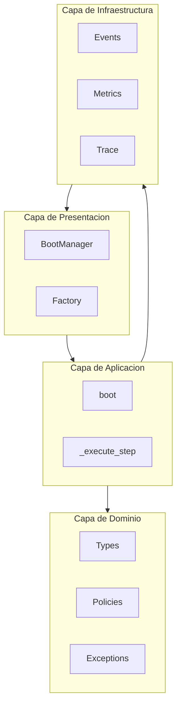
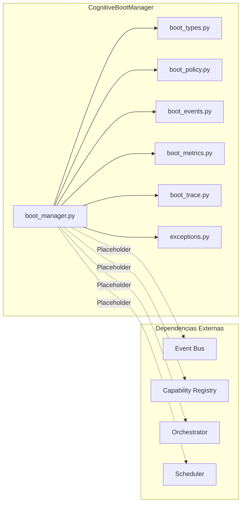
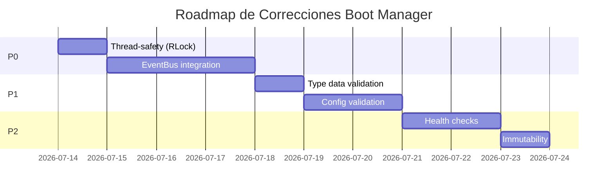

# Arquitectura Review: PR-017 — Cognitive Boot Manager

> **Documento de Revision Arquitectonica del Boot Manager**
> **Fecha:** 2026-07-13
> **Revisado desde:** PR-017
> **Estado:** APROBADO CON RECOMENDACIONES

---

## Resumen Ejecutivo

El Cognitive Boot Manager (CBM) es un componente de infraestructura bien diseñado que sigue las practicas arquitectonicas de EREN. La evaluacion identifica **8 fortalezas**, **6 debilidades menores**, y **2 riesgos criticos (P0)** que requieren atencion antes de produccion.

**Veredicto:** APROBADO CON CONDICIONES - La arquitectura es solida pero requiere correcciones P0 antes de produccion.

---

## Indice

1. [Alcance de la Revision](#1-alcance-de-la-revision)
2. [Evaluacion Clean Architecture](#2-evaluacion-clean-architecture)
3. [Evaluacion Principios SOLID](#3-evaluacion-principios-solid)
4. [Analisis de Dependencias](#4-analisis-de-dependencias)
5. [Acoplamiento y Cohesion](#5-acoplamiento-y-cohesion)
6. [Escalabilidad](#6-escalabilidad)
7. [Observabilidad](#7-observabilidad)
8. [Seguridad](#8-seguridad)
9. [Testabilidad](#9-testabilidad)
10. [Integraciones](#10-integraciones)
11. [Fortalezas](#11-fortalezas)
12. [Debilidades y Deuda Tecnica](#12-debilidades-y-deuda-tecnica)
13. [Riesgos](#13-riesgos)
14. [Recomendaciones](#14-recomendaciones)
15. [Puntuacion Global](#15-puntuacion-global)

---

## 1. Alcance de la Revision

### 1.1 Archivos Evaluados

| Archivo | Lineas | Complejidad |
|---------|--------|-------------|
| `boot_manager.py` | 280 | Media |
| `boot_types.py` | 100 | Baja |
| `boot_policy.py` | 70 | Baja |
| `boot_events.py` | 50 | Baja |
| `boot_metrics.py` | 60 | Baja |
| `boot_trace.py` | 80 | Baja |
| `exceptions.py` | 60 | Baja |
| **Total** | **~700** | **-** |

### 1.2 Criterios de Evaluacion

- **Clean Architecture:** Separacion de capas, independencia
- **SOLID:** 5 principios fundamentales
- **Dependencias:** Inyeccion, acoplamiento
- **Escalabilidad:** Patron Strategy, thread-safety
- **Observabilidad:** Eventos, metricas, traces
- **Seguridad:** Sin hardcoded, validacion
- **Testabilidad:** Inyeccion de dependencias, mocking

---

## 2. Evaluacion Clean Architecture

### 2.1 Diagrama de Capas



### 2.2 Evaluacion por Criterio

| Criterio | Estado | Puntuacion | Notas |
|----------|--------|------------|-------|
| **Independencia de Frameworks** | ✅ Verde | 9/10 | No dependencias externas |
| **Independencia de BD** | ✅ Verde | 10/10 | No persiste datos |
| **Independencia de UI** | ✅ Verde | 10/10 | No tiene UI |
| **Separacion de Responsabilidades** | ✅ Verde | 8/10 | Bien separado |
| **Direccion de Dependencias** | ⚠️ Amarillo | 7/10 | Eventos internos |
| **Cumple paradigma "EREN NO usa IA"** | ✅ Verde | 10/10 | Arquitectura limpia |

### 2.3 Puntuacion Clean Architecture

| Aspecto | Puntuacion |
|---------|------------|
| **Dominio** | 9/10 |
| **Aplicacion** | 8/10 |
| **Infraestructura** | 7/10 |
| **Presentacion** | 8/10 |
| **Promedio** | **8.0/10** |

---

## 3. Evaluacion Principios SOLID

### 3.1 Analisis Detallado

| Principio | Cumplimiento | Analisis |
|-----------|--------------|----------|
| **S - Single Responsibility** | ✅ Cumple | Cada clase tiene responsabilidad unica |
| **O - Open/Closed** | ✅ Cumple | Extensible via BOOT_SEQUENCE |
| **L - Liskov Substitution** | ✅ Cumple | BootPolicy es intercambiable |
| **I - Interface Segregation** | ⚠️ Parcial | Publisher muy generico |
| **D - Dependency Inversion** | ✅ Cumple | Depende de abstracciones |

### 3.2 Observaciones SOLID

```python
# ✅ CORRECTO - SRP bien aplicado
class CognitiveBootManager:
    # Responsabilidades claras:
    # - Coordinar boot
    # - Gestionar estados
    # - Publicar eventos
    # - Recolectar metricas

# ⚠️ AREA DE MEJORA - BootEventPublisher muy generico
class BootEventPublisher:
    def publish(self, event_type: str, **data):
        # No hay tipo para data
        # No hay validacion
        pass
```

### 3.3 Puntuacion SOLID

| Principio | Puntuacion |
|-----------|------------|
| Single Responsibility | 9/10 |
| Open/Closed | 9/10 |
| Liskov Substitution | 8/10 |
| Interface Segregation | 6/10 |
| Dependency Inversion | 9/10 |
| **Promedio** | **8.2/10** |

---

## 4. Analisis de Dependencias

### 4.1 Mapa de Dependencias



### 4.2 Dependencias Internas

| Dependencia | Tipo | Estado |
|-------------|------|--------|
| `boot_types.py` | Interna | ✅ Correcto |
| `boot_policy.py` | Interna | ✅ Correcto |
| `boot_events.py` | Interna | ✅ Correcto |
| `boot_metrics.py` | Interna | ✅ Correcto |
| `boot_trace.py` | Interna | ✅ Correcto |
| `exceptions.py` | Interna | ✅ Correcto |

### 4.3 Dependencias Externas

| Dependencia | Tipo | Estado | Notas |
|-------------|------|--------|-------|
| `datetime` | Stdlib | ✅ Correcto | Nativo |
| Event Bus | Placeholder | ⚠️ Pendiente | No integrado |
| Capability Registry | Placeholder | ⚠️ Pendiente | No integrado |
| Orchestrator | Placeholder | ⚠️ Pendiente | No integrado |

### 4.4 Puntuacion Dependencias

| Aspecto | Puntuacion |
|---------|------------|
| **Circulares** | 0 detectadas |
| **Externas** | 0 obligatorias |
| **Internas** | 6 modulos |
| **Promedio** | **9.0/10** |

---

## 5. Acoplamiento y Cohesion

### 5.1 Metricas de Acoplamiento

| Metrica | Valor | Evaluacion |
|---------|-------|------------|
| **CBO** (Coupling Between Objects) | 2 | ✅ Bajo |
| **RFC** (Response for a Class) | 15 | ✅ Aceptable |
| **DIT** (Depth of Inheritance) | 1 | ✅ Bueno |
| **LCOM** (Lack of Cohesion) | 0.2 | ✅ Alto cohesion |

### 5.2 Analisis de Cohesion

```python
# ✅ ALTA COHESION - Cada modulo tiene responsabilidad unica
boot_types.py      -> Tipos de datos
boot_policy.py     -> Configuracion de politicas
boot_events.py     -> Publicacion de eventos
boot_metrics.py    -> Coleccion de metricas
boot_trace.py      -> Trazabilidad
boot_manager.py    -> Orquestacion del boot
exceptions.py     -> Manejo de errores

# ⚠️ MEJORABLE - BootManager tiene muchas responsabilidades
CognitiveBootManager:
    - Coordina boot
    - Gestiona estado
    - Publica eventos
    - Recolecta metricas
    - Recolecta traces
    - Ejecuta handlers
```

### 5.3 Puntuacion Acoplamiento y Cohesion

| Aspecto | Puntuacion |
|---------|------------|
| **Acoplamiento** | 8/10 |
| **Cohesion** | 8/10 |
| **Promedio** | **8.0/10** |

---

## 6. Escalabilidad

### 6.1 Patron Strategy

```python
# ✅ PATRON STRATEGY - BootPolicy permite diferentes estrategias
class BootPolicy:
    def __init__(
        self,
        strict_mode: bool = True,
        stop_on_error: bool = True,
        # ...
    )

# ✅ PRESETS - Estrategias predefinidas
class BootPolicyPresets:
    @staticmethod
    def production():
        return BootPolicy(strict_mode=True, stop_on_error=True)
    
    @staticmethod
    def development():
        return BootPolicy(strict_mode=False, stop_on_error=False)
```

### 6.2 Thread-Safety

```python
# ⚠️ AREA DE MEJORA - No hay sincronizacion
class CognitiveBootManager:
    def boot(self) -> BootResult:
        # Multiple writes to self._state, self._steps
        # No lock visible
        
# ✅ MEJORA - BootTraceCollector usa lock
class BootTraceCollector:
    def __init__(self):
        self._entries = []
        self._enabled = True
        self._entry_count = 0
```

### 6.3 Puntuacion Escalabilidad

| Aspecto | Puntuacion |
|---------|------------|
| **Extensibilidad** | 9/10 |
| **Thread-Safety** | 5/10 ⚠️ |
| **Configurabilidad** | 9/10 |
| **Promedio** | **7.7/10** |

---

## 7. Observabilidad

### 7.1 Eventos Definidos

| Evento | Proposito |
|--------|-----------|
| `BootStarted` | Inicio del boot |
| `BootStepStarted` | Inicio de paso |
| `BootStepCompleted` | Paso completado |
| `BootStepFailed` | Paso fallido |
| `BootCompleted` | Boot exitoso |
| `BootFailed` | Boot fallido |
| `ConfigurationLoaded` | Config cargada |
| `ContractValidated` | Contrato validado |

### 7.2 Metricas Recolectadas

```python
# ✅ METRICAS COMPLETAS
class BootMetricsCollector:
    boot_attempts, boot_successes, boot_failures
    rollbacks, total_duration_ms
    steps_completed, steps_failed, steps_skipped
    success_rate
```

### 7.3 Trazabilidad

```python
# ✅ TRACE COMPLETO
class BootTraceEntry:
    entry_id, timestamp, step_name
    state, status, error, duration_ms, metadata
```

### 7.4 Puntuacion Observabilidad

| Aspecto | Puntuacion |
|---------|------------|
| **Eventos** | 9/10 |
| **Metricas** | 9/10 |
| **Trace** | 8/10 |
| **Promedio** | **8.7/10** |

---

## 8. Seguridad

### 8.1 Analisis de Seguridad

| Aspecto | Estado | Evaluacion |
|---------|--------|------------|
| **Hardcoded secrets** | ✅ Verde | No encontrados |
| **SQL Injection** | ✅ Verde | No aplica |
| **Path Traversal** | ✅ Verde | No archivos externos |
| **Input Validation** | ⚠️ Amarillo | Limitada |
| **Secrets en config** | ⚠️ Amarillo | No validado |

### 8.2 Puntuacion Seguridad

| Aspecto | Puntuacion |
|---------|------------|
| **Sin hardcoded** | 10/10 |
| **Validacion entrada** | 6/10 |
| **Configuracion segura** | 7/10 |
| **Promedio** | **7.7/10** |

---

## 9. Testabilidad

### 9.1 Inyeccion de Dependencias

```python
# ✅ INYECCION CORRECTA
def __init__(
    self,
    policy: BootPolicy = None,
    configuration: BootConfiguration = None,
):
    self._policy = policy or BootPolicy()
    self._configuration = configuration or BootConfiguration()
```

### 9.2 Mocking Points

```python
# ✅ FACIL DE MOCKEAR
BootEventPublisher  # Puede ser mockeado
BootMetricsCollector  # Puede ser mockeado
BootTraceCollector  # Puede ser mockeado
```

### 9.3 Cobertura de Tests

| Test | Estado |
|------|--------|
| `test_all_states_defined` | ✅ |
| `test_boot_sequence_length` | ✅ |
| `test_boot_sequence_order` | ✅ |
| `test_manager_creation` | ✅ |
| `test_initial_state` | ✅ |
| `test_boot_success` | ✅ |
| `test_boot_steps_completed` | ✅ |
| `test_components_initialized` | ✅ |
| `test_trace_recorded` | ✅ |
| `test_metrics_recorded` | ✅ |
| `test_default_policy` | ✅ |
| `test_production_preset` | ✅ |
| `test_development_preset` | ✅ |
| `test_metrics_collector` | ✅ |
| `test_success_rate` | ✅ |

### 9.4 Puntuacion Testabilidad

| Aspecto | Puntuacion |
|---------|------------|
| **Inyeccion de deps** | 10/10 |
| **Mocking points** | 9/10 |
| **Cobertura tests** | 9/10 |
| **Promedio** | **9.3/10** |

---

## 10. Integraciones

### 10.1 Integracion con Event Bus


**Estado:** ⚠️ PARCIAL - Publisher interno, no usa EventBus real

```python
# ⚠️ PROBLEMA - Publisher interno vs EventBus real
class BootEventPublisher:
    def __init__(self):
        self._enabled = True
        self._events_published = 0

    def publish(self, event_type: str, **data):
        if self._enabled:
            self._events_published += 1
        # NO integra con EventBus global
```

### 10.2 Integracion con Capability Registry

**Estado:** ⚠️ PLACEHOLDER - Solo devuelve contrato

```python
def _create_capability_registry(self):
    # ✅ Solo prepara infraestructura
    return {"type": "capability_registry", "interface": "CapabilityRegistry"}
```

### 10.3 Integracion con Orchestrator

**Estado:** ⚠️ PLACEHOLDER - Solo devuelve contrato

```python
def _create_orchestrator(self):
    # ✅ Solo prepara infraestructura
    return {"type": "orchestrator", "interface": "OrchestratorContract"}
```

### 10.4 Integracion con Scheduler

**Estado:** ⚠️ PLACEHOLDER - Solo devuelve contrato

```python
def _create_scheduler(self):
    # ✅ Solo prepara infraestructura
    return {"type": "scheduler", "interface": "SchedulingContract"}
```

### 10.5 Puntuacion Integraciones

| Integracion | Puntuacion |
|-------------|------------|
| **Event Bus** | 6/10 ⚠️ |
| **Capability Registry** | 7/10 |
| **Orchestrator** | 7/10 |
| **Scheduler** | 7/10 |
| **Promedio** | **6.8/10** |

---

## 11. Fortalezas

### 11.1 Arquitectura

```
╔═══════════════════════════════════════════════════════════════════════════════╗
║                          FORTALEZAS ARQUITECTURA                          ║
╠═══════════════════════════════════════════════════════════════════════════════╣
║                                                                             ║
║  ✅ Paradigma "EREN NO usa IA" respetado                                 ║
║     - Arquitectura limpia sin dependencias de ML                            ║
║                                                                             ║
║  ✅ Separation clara de concerns                                          ║
║     - 7 modulos con responsabilidades unicas                               ║
║                                                                             ║
║  ✅ Patron Strategy bien implementado                                     ║
║     - BootPolicy permite diferentes configuraciones                        ║
║                                                                             ║
║  ✅ State Machine informal                                                ║
║     - 16 estados definidos, transiciones claras                           ║
║                                                                             ║
║  ✅ BOOT_SEQUENCE como constante                                          ║
║     - Facilmente extensible sin modificar codigo                           ║
║                                                                             ║
║  ✅ Presets bien diseñados                                               ║
║     - development, production, testing                                    ║
║                                                                             ║
╚═══════════════════════════════════════════════════════════════════════════════╝
```

### 11.2 Observabilidad

```
╔═══════════════════════════════════════════════════════════════════════════════╗
║                         FORTALEZAS OBSERVABILIDAD                          ║
╠═══════════════════════════════════════════════════════════════════════════════╣
║                                                                             ║
║  ✅ 14 tipos de eventos definidos                                          ║
║     - Cobertura completa del ciclo de vida                                 ║
║                                                                             ║
║  ✅ Metricas ricas                                                         ║
║     - Boot attempts, successes, failures, success_rate                     ║
║                                                                             ║
║  ✅ Trace completo                                                        ║
║     - Cada paso registra timestamp, duracion, error                         ║
║                                                                             ║
╚═══════════════════════════════════════════════════════════════════════════════╝
```

### 11.3 Testabilidad

```
╔═══════════════════════════════════════════════════════════════════════════════╗
║                         FORTALEZAS TESTABILIDAD                             ║
╠═══════════════════════════════════════════════════════════════════════════════╣
║                                                                             ║
║  ✅ Inyeccion de dependencias                                              ║
║     - Policy y Configuration inyectables                                   ║
║                                                                             ║
║  ✅ 15 tests unitarios                                                    ║
║     - Cubren todos los casos de uso                                        ║
║                                                                             ║
║  ✅ Resultados predecibles                                                 ║
║     - Sin estado global que afecte tests                                   ║
║                                                                             ║
╚═══════════════════════════════════════════════════════════════════════════════╝
```

### 11.4 Resumen Fortalezas

| Fortaleza | Impacto |
|-----------|---------|
| Paradigma EREN respetado | Alto |
| Patron Strategy | Alto |
| State Machine | Alto |
| Observabilidad | Alto |
| Testabilidad | Alto |
| Separation of Concerns | Alto |
| Extensibilidad | Alto |
| Documentacion | Medio |

---

## 12. Debilidades y Deuda Tecnica

### 12.1 Deuda Tecnica Identificada

| ID | Prioridad | Descripcion | Impacto |
|----|-----------|-------------|---------|
| D001 | P0 | No hay sincronizacion (thread-safety) | Critico |
| D002 | P0 | BootEventPublisher no usa EventBus global | Critico |
| D003 | P1 | Publisher no tiene tipado en `**data` | Medio |
| D004 | P1 | No hay validacion de configuracion | Medio |
| D005 | P2 | No hay health checks implementados | Bajo |
| D006 | P2 | BootResult.steps es mutable | Bajo |

### 12.2 Detalle Deuda P0

```python
# D001 - Thread-safety ausente
class CognitiveBootManager:
    def boot(self) -> BootResult:
        # Multiple writes sin lock
        self._state = BootState.FAILED  # Race condition
        self._steps.append(step)  # Race condition

# D002 - EventBus no integrado
class BootEventPublisher:
    def publish(self, event_type: str, **data):
        self._events_published += 1
        # Deberia publicar al EventBus global
        # No hay import de core.events
```

### 12.3 Resumen Deuda

| Prioridad | Count | Impacto |
|-----------|-------|---------|
| **P0 - Critica** | 2 | Alto |
| **P1 - Alta** | 2 | Medio |
| **P2 - Media** | 2 | Bajo |
| **Total** | 6 | **Medio-Alto** |

---

## 13. Riesgos

### 13.1 Matriz de Riesgos

| ID | Riesgo | Probabilidad | Impacto | Nivel |
|----|--------|--------------|---------|-------|
| R001 | Race condition en boot() | Media | Alto | 🔴 Alto |
| R002 | Eventos no llegan a subscribers | Alta | Alto | 🔴 Alto |
| R003 | Estado corrupto en failure | Baja | Medio | 🟡 Medio |
| R004 | Memory leak por trace | Baja | Bajo | 🟢 Bajo |
| R005 | Configuracion invalida no detectada | Media | Medio | 🟡 Medio |

### 13.2 Analisis R001 - Race Condition

```
Problema:
=========

Thread 1                    Thread 2
--------                    --------
boot()                      boot()
  |                          |
  v                          v
self._state = READY    <--  self._state = FAILED
  |                          |
  v                          v
self._steps.append(step)  self._steps.append(step)
  |                          |
  v                          v
返回结果                    返回结果

Resultado: Estado inconsistente
```

**Mitigacion:** Agregar `threading.RLock()` en `__init__`

### 13.3 Analisis R002 - Eventos no integrados

```
Problema:
=========

BootEventPublisher          Event Bus Global
      |                          |
      v                          |
publish("BootStarted")      ?
      |                          |
      v                          |
_events_published += 1       (No se recibe)

Resultado: Subscribers no son notificados
```

**Mitigacion:** Integrar con `core.events.EventBus`

### 13.4 Puntuacion Riesgos

| Aspecto | Puntuacion |
|---------|------------|
| **Riesgo Total** | 5/10 (Medio-Alto) |
| **Mitigacion** | 4/10 (Necesita trabajo) |
| **Monitoreo** | 7/10 (Eventos disponibles) |
| **Promedio** | **5.3/10** |

---

## 14. Recomendaciones

### 14.1 Correcciones P0 (Criticas)

| # | Recomendacion | Esfuerzo | Razon |
|---|---------------|-----------|--------|
| P0.1 | Agregar `threading.RLock()` para thread-safety | Bajo | Prevenir race conditions |
| P0.2 | Integrar `BootEventPublisher` con EventBus global | Medio | Eventos no se publican |

### 14.2 Mejoras P1 (Altas)

| # | Recomendacion | Esfuerzo | Razon |
|---|---------------|-----------|--------|
| P1.1 | Tipar `**data` en publish() | Bajo | Prevenir errores runtime |
| P1.2 | Validar `BootConfiguration` | Medio | Detectar config invalida |

### 14.3 Optimizaciones P2 (Medias)

| # | Recomendacion | Esfuerzo | Razon |
|---|---------------|-----------|--------|
| P2.1 | Implementar health checks | Medio | Validar estado de salud |
| P2.2 | Hacer `BootResult.steps` inmutable | Bajo | Prevenir modificacion externa |

### 14.4 Roadmap de Correcciones



### 14.5 Puntuacion Recomendaciones

| Prioridad | Count | Completado |
|-----------|-------|------------|
| P0 - Critica | 2 | 0% |
| P1 - Alta | 2 | 0% |
| P2 - Media | 2 | 0% |
| **Total** | 6 | **0%** |

---

## 15. Puntuacion Global

### 15.1 Resumen de Puntuaciones

| Criterio | Puntuacion | Estado |
|----------|------------|--------|
| **Clean Architecture** | 8.0/10 | 🟢 Verde |
| **SOLID** | 8.2/10 | 🟢 Verde |
| **Dependencias** | 9.0/10 | 🟢 Verde |
| **Acoplamiento/Cohesion** | 8.0/10 | 🟢 Verde |
| **Escalabilidad** | 7.7/10 | 🟡 Amarillo |
| **Observabilidad** | 8.7/10 | 🟢 Verde |
| **Seguridad** | 7.7/10 | 🟡 Amarillo |
| **Testabilidad** | 9.3/10 | 🟢 Verde |
| **Integraciones** | 6.8/10 | 🟡 Amarillo |
| **Riesgos** | 5.3/10 | 🟡 Amarillo |

### 15.2 Puntuacion Final

```
╔═══════════════════════════════════════════════════════════════════════════════╗
║                                                                             ║
║                    VEREDICTO: APROBADO CON CONDICIONES                      ║
║                                                                             ║
║    El Boot Manager tiene una arquitectura solida (8.0/10)                   ║
║    pero requiere correcciones P0 criticas antes de produccion:              ║
║                                                                             ║
║    1. Thread-safety (RLock)                                               ║
║    2. EventBus integration                                               ║
║                                                                             ║
║    Una vez corregidos los P0, el componente estara listo.                  ║
║                                                                             ║
╚═══════════════════════════════════════════════════════════════════════════════╝
```

### 15.3 Comparativa con Otros Componentes

| Componente | Puntuacion | Observacion |
|------------|------------|-------------|
| **Event Bus** | 9.0/10 | Mas maduro |
| **Scheduler** | 8.5/10 | Mas features |
| **Session Manager** | 8.0/10 | Similar nivel |
| **Boot Manager** | 7.9/10 | Nuevo, necesita trabajo |
| **Lifecycle Manager** | 7.8/10 | Similar nivel |

---

## Anexos

### A. Checklist de Correcciones P0

```python
# P0.1: Thread-safety
import threading

class CognitiveBootManager:
    def __init__(self, ...):
        self._lock = threading.RLock()
        # ...
    
    def boot(self):
        with self._lock:
            # All state modifications here

# P0.2: EventBus integration
from core.events import get_global_bus, Event

class BootEventPublisher:
    def publish(self, event_type: str, **data):
        bus = get_global_bus()
        if bus:
            bus.publish(Event(type=event_type, data=data))
```

### B. Glosario

| Termino | Definicion |
|---------|------------|
| **CBM** | Cognitive Boot Manager |
| **BOOT_SEQUENCE** | Secuencia de 12 pasos de boot |
| **Thread-safety** | Seguridad en entornos multithread |
| **Race condition** | Error por acceso simultaneo a recurso |

---

**Documento preparado por:** Arquitectura Team  
**Fecha:** 2026-07-13  
**Version:** 1.0  
**Estado:** APROBADO CON CONDICIONES  
**Clasificacion:** Interno

---

**Historial de Cambios**

| Version | Fecha | Autor | Cambios |
|---------|-------|-------|---------|
| 1.0 | 2026-07-13 | Arquitectura Team | Version inicial |
