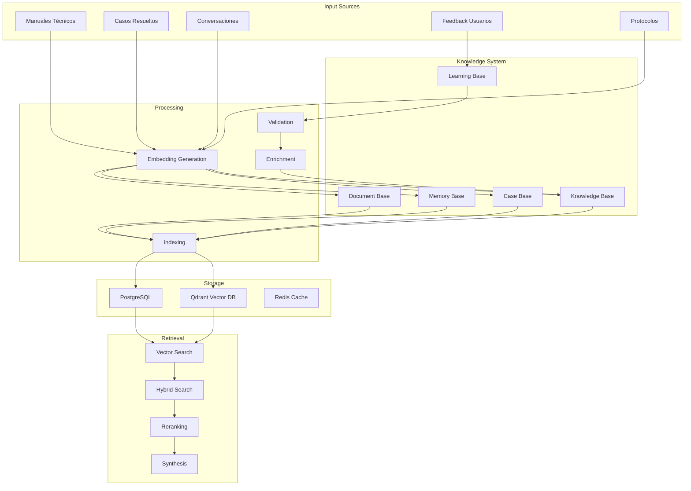
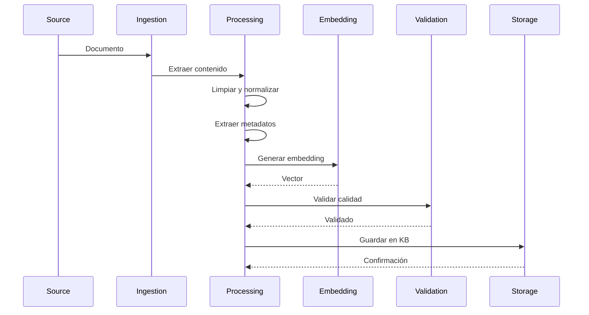
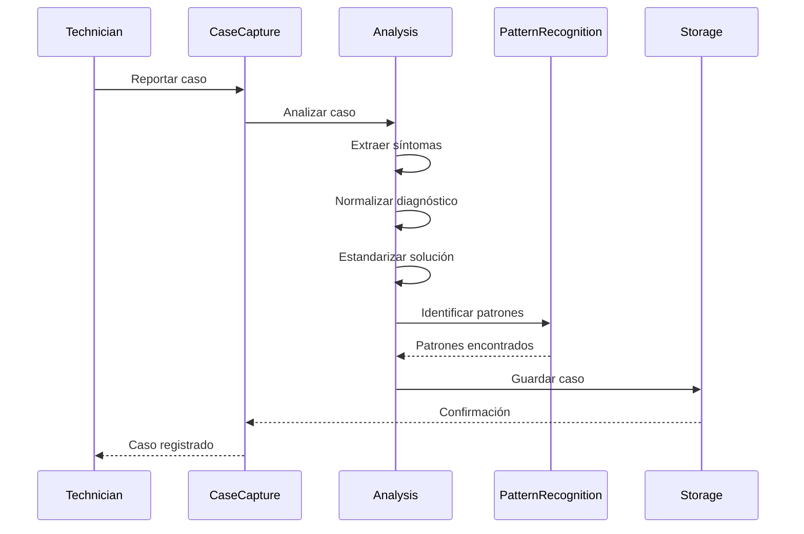
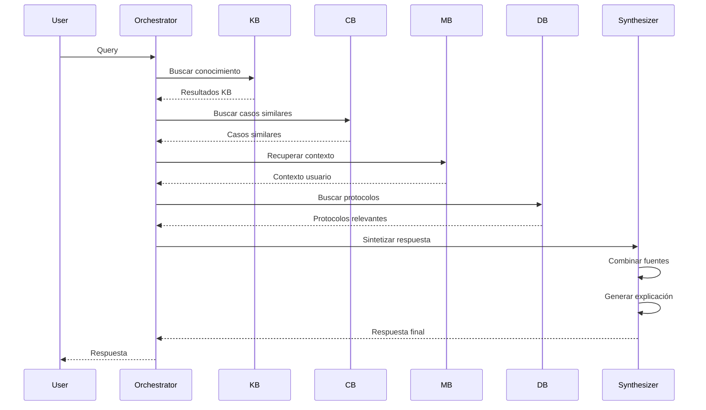
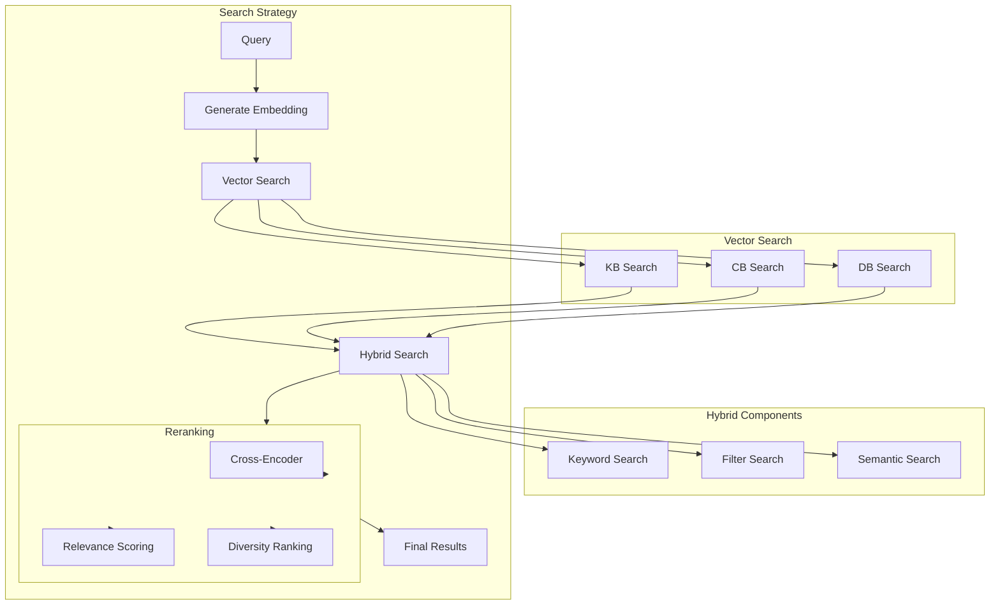

# Arquitectura del Conocimiento de EREN

> **Diseño del sistema de conocimiento: KB, CB, MB, LB, DB**

---

## Tabla de Contenidos

1. [Visión General](#visión-general)
2. [Knowledge Base (KB)](#knowledge-base-kb)
3. [Case Base (CB)](#case-base-cb)
4. [Memory Base (MB)](#memory-base-mb)
5. [Learning Base (LB)](#learning-base-lb)
6. [Document Base (DB)](#document-base-db)
7. [Interacción entre Bases](#interacción-entre-bases)
8. [Búsqueda Vectorial](#búsqueda-vectorial)
9. [Gestión de Conocimiento](#gestión-de-conocimiento)

---

## Visión General

EREN no depende inicialmente de manuales privados. Construye su propia inteligencia a través de cinco bases de conocimiento especializadas que interactúan entre sí para proporcionar respuestas precisas, explicables y confiables.

### Arquitectura de Conocimiento



---

## Knowledge Base (KB)

### Propósito

Almacenar conocimiento técnico explícito: manuales, especificaciones, procedimientos, y documentación técnica.

### Contenido

- **Manuales Técnicos**: Manuales de operación y servicio de equipos
- **Especificaciones**: Especificaciones técnicas de equipos y componentes
- **Procedimientos**: Procedimientos estándar de operación y mantenimiento
- **Best Practices**: Mejores prácticas de ingeniería biomédica
- **Troubleshooting Guides**: Guías de solución de problemas

### Estructura

```python
class KnowledgeItem(BaseModel):
    id: str
    title: str
    content: str
    type: KnowledgeType  # MANUAL, SPECIFICATION, PROCEDURE, GUIDE
    source: str  # URL, archivo, o referencia
    equipment_models: List[str]  # Modelos de equipo relacionados
    category: str  # Categoría de conocimiento
    tags: List[str]
    embedding: List[float]  # Vector embedding
    confidence: float  # Nivel de confianza del conocimiento
    last_validated: datetime
    created_at: datetime
    updated_at: datetime
    metadata: Dict[str, Any]
```

### Proceso de Ingesta



### Implementación

```python
class KnowledgeBase:
    def __init__(
        self,
        qdrant_client: QdrantClient,
        embedding_service: EmbeddingService,
        validator: KnowledgeValidator
    ):
        self.qdrant = qdrant_client
        self.embedding = embedding_service
        self.validator = validator
    
    async def ingest_document(
        self,
        document: Document,
        metadata: Dict[str, Any]
    ) -> KnowledgeItem:
        """Ingresa un documento en la Knowledge Base."""
        
        # 1. Extraer contenido
        content = await self._extract_content(document)
        
        # 2. Limpiar y normalizar
        cleaned_content = self._clean_content(content)
        
        # 3. Extraer metadatos
        extracted_metadata = await self._extract_metadata(cleaned_content, metadata)
        
        # 4. Generar embedding
        embedding = await self.embedding.generate(cleaned_content)
        
        # 5. Validar conocimiento
        validation_result = await self.validator.validate(
            content=cleaned_content,
            metadata=extracted_metadata
        )
        
        if not validation_result.is_valid:
            raise InvalidKnowledgeError(validation_result.errors)
        
        # 6. Crear knowledge item
        knowledge_item = KnowledgeItem(
            id=str(uuid4()),
            title=document.title,
            content=cleaned_content,
            type=self._classify_document(document),
            source=document.source,
            equipment_models=extracted_metadata.get("equipment_models", []),
            category=extracted_metadata.get("category"),
            tags=extracted_metadata.get("tags", []),
            embedding=embedding,
            confidence=validation_result.confidence,
            last_validated=datetime.now(),
            created_at=datetime.now(),
            updated_at=datetime.now(),
            metadata=extracted_metadata
        )
        
        # 7. Almacenar en Qdrant
        await self.qdrant.upsert(
            collection_name="knowledge_base",
            points=[{
                "id": knowledge_item.id,
                "vector": knowledge_item.embedding,
                "payload": knowledge_item.dict(exclude={"embedding"})
            }]
        )
        
        return knowledge_item
    
    async def search(
        self,
        query: str,
        filters: Optional[Dict[str, Any]] = None,
        limit: int = 10
    ) -> List[KnowledgeItem]:
        """Busca conocimiento relevante."""
        
        # Generar embedding de la query
        query_embedding = await self.embedding.generate(query)
        
        # Buscar en Qdrant
        search_results = await self.qdrant.search(
            collection_name="knowledge_base",
            query_vector=query_embedding,
            query_filter=self._build_filter(filters),
            limit=limit
        )
        
        # Convertir a KnowledgeItem
        results = [
            KnowledgeItem(**result.payload)
            for result in search_results
        ]
        
        return results
```

---

## Case Base (CB)

### Propósito

Almacenar casos de mantenimiento resueltos para aprendizaje y referencia futura.

### Contenido

- **Casos Resueltos**: Casos de diagnóstico y reparación exitosos
- **Síntomas**: Descripciones de síntomas reportados
- **Diagnósticos**: Diagnósticos realizados
- **Soluciones**: Soluciones aplicadas
- **Resultados**: Resultados de las soluciones
- **Patrones**: Patrones de falla identificados

### Estructura

```python
class Case(BaseModel):
    id: str
    equipment_id: str
    equipment_model: str
    hospital_id: str
    symptoms: List[str]
    diagnosis: str
    solution: str
    result: CaseResult  # SUCCESS, PARTIAL, FAILURE
    resolution_time: timedelta
    technician_id: str
    confidence: float
    similarity_score: Optional[float]  # Calculado durante búsqueda
    embedding: List[float]
    created_at: datetime
    updated_at: datetime
    metadata: Dict[str, Any]

class CaseResult(Enum):
    SUCCESS = "success"
    PARTIAL = "partial"
    FAILURE = "failure"
```

### Proceso de Ingesta



### Implementación

```python
class CaseBase:
    def __init__(
        self,
        qdrant_client: QdrantClient,
        embedding_service: EmbeddingService,
        pattern_recognizer: PatternRecognizer
    ):
        self.qdrant = qdrant_client
        self.embedding = embedding_service
        self.pattern_recognizer = pattern_recognizer
    
    async def create_case(
        self,
        case_data: CaseData,
        technician_id: str
    ) -> Case:
        """Crea un nuevo caso en la Case Base."""
        
        # 1. Normalizar síntomas
        normalized_symptoms = await self._normalize_symptoms(case_data.symptoms)
        
        # 2. Generar embedding de síntomas
        symptoms_text = " ".join(normalized_symptoms)
        embedding = await self.embedding.generate(symptoms_text)
        
        # 3. Reconocer patrones
        patterns = await self.pattern_recognizer.recognize(
            symptoms=normalized_symptoms,
            equipment_model=case_data.equipment_model
        )
        
        # 4. Crear caso
        case = Case(
            id=str(uuid4()),
            equipment_id=case_data.equipment_id,
            equipment_model=case_data.equipment_model,
            hospital_id=case_data.hospital_id,
            symptoms=normalized_symptoms,
            diagnosis=case_data.diagnosis,
            solution=case_data.solution,
            result=case_data.result,
            resolution_time=case_data.resolution_time,
            technician_id=technician_id,
            confidence=self._calculate_confidence(case_data, patterns),
            embedding=embedding,
            created_at=datetime.now(),
            updated_at=datetime.now(),
            metadata={
                "patterns": [p.dict() for p in patterns],
                "original_symptoms": case_data.symptoms
            }
        )
        
        # 5. Almacenar en Qdrant
        await self.qdrant.upsert(
            collection_name="case_base",
            points=[{
                "id": case.id,
                "vector": case.embedding,
                "payload": case.dict(exclude={"embedding"})
            }]
        )
        
        return case
    
    async def find_similar_cases(
        self,
        symptoms: List[str],
        equipment_model: str,
        threshold: float = 0.7,
        limit: int = 10
    ) -> List[Case]:
        """Encuentra casos similares."""
        
        # Generar embedding de síntomas
        symptoms_text = " ".join(symptoms)
        query_embedding = await self.embedding.generate(symptoms_text)
        
        # Buscar casos similares
        search_results = await self.qdrant.search(
            collection_name="case_base",
            query_vector=query_embedding,
            query_filter={
                "must": [
                    {"key": "equipment_model", "match": {"value": equipment_model}}
                ]
            },
            limit=limit,
            score_threshold=threshold
        )
        
        # Convertir a Case y añadir similarity score
        cases = []
        for result in search_results:
            case = Case(**result.payload)
            case.similarity_score = result.score
            cases.append(case)
        
        return cases
```

---

## Memory Base (MB)

### Propósito

Almacenar memoria de conversaciones y contexto de usuario para personalización y continuidad.

### Contenido

- **Conversaciones**: Historial de conversaciones con usuarios
- **Contexto de Usuario**: Preferencias y contexto de cada usuario
- **Interacciones**: Interacciones pasadas y sus resultados
- **Feedback**: Feedback de usuarios sobre respuestas
- **Patrones de Uso**: Patrones de cómo los usuarios usan EREN

### Estructura

```python
class Conversation(BaseModel):
    id: str
    user_id: str
    hospital_id: str
    messages: List[Message]
    context: ConversationContext
    started_at: datetime
    ended_at: Optional[datetime]
    metadata: Dict[str, Any]

class Message(BaseModel):
    id: str
    role: MessageRole  # USER, ASSISTANT, SYSTEM
    content: str
    timestamp: datetime
    agent_used: Optional[str]
    tools_used: List[str]
    confidence: Optional[float]
    feedback: Optional[UserFeedback]

class ConversationContext(BaseModel):
    equipment_id: Optional[str]
    case_id: Optional[str]
    current_task: Optional[str]
    user_preferences: Dict[str, Any]
    session_variables: Dict[str, Any]
```

### Implementación

```python
class MemoryBase:
    def __init__(
        self,
        conversation_repository: ConversationRepository,
        context_store: ContextStore,
        embedding_service: EmbeddingService
    ):
        self.conversation_repo = conversation_repository
        self.context_store = context_store
        self.embedding = embedding_service
    
    async def create_conversation(
        self,
        user_id: str,
        hospital_id: str
    ) -> Conversation:
        """Crea una nueva conversación."""
        
        conversation = Conversation(
            id=str(uuid4()),
            user_id=user_id,
            hospital_id=hospital_id,
            messages=[],
            context=ConversationContext(),
            started_at=datetime.now(),
            metadata={}
        )
        
        await self.conversation_repo.save(conversation)
        return conversation
    
    async def add_message(
        self,
        conversation_id: str,
        role: MessageRole,
        content: str,
        agent_used: Optional[str] = None,
        tools_used: List[str] = [],
        confidence: Optional[float] = None
    ) -> Message:
        """Añade un mensaje a una conversación."""
        
        conversation = await self.conversation_repo.find_by_id(conversation_id)
        
        message = Message(
            id=str(uuid4()),
            role=role,
            content=content,
            timestamp=datetime.now(),
            agent_used=agent_used,
            tools_used=tools_used,
            confidence=confidence,
            feedback=None
        )
        
        conversation.messages.append(message)
        await self.conversation_repo.save(conversation)
        
        return message
    
    async def get_conversation_context(
        self,
        user_id: str
    ) -> ConversationContext:
        """Obtiene el contexto de conversación actual de un usuario."""
        
        # Buscar conversación activa
        active_conversation = await self.conversation_repo.find_active(user_id)
        
        if active_conversation:
            return active_conversation.context
        
        # Crear nuevo contexto
        return ConversationContext()
    
    async def update_context(
        self,
        conversation_id: str,
        context_updates: Dict[str, Any]
    ) -> None:
        """Actualiza el contexto de una conversación."""
        
        conversation = await self.conversation_repo.find_by_id(conversation_id)
        
        for key, value in context_updates.items():
            setattr(conversation.context, key, value)
        
        await self.conversation_repo.save(conversation)
```

---

## Learning Base (LB)

### Propósito

Aprendizaje automático a partir de interacciones y feedback para mejorar continuamente.

### Contenido

- **Modelos de ML**: Modelos entrenados para tareas específicas
- **Features**: Características extraídas de datos
- **Predicciones**: Predicciones generadas por modelos
- **Performance Metrics**: Métricas de performance de modelos
- **Learning Patterns**: Patrones de aprendizaje identificados

### Estructura

```python
class LearningModel(BaseModel):
    id: str
    name: str
    version: str
    task: LearningTask  # PREDICTION, CLASSIFICATION, CLUSTERING
    model_type: ModelType  # NEURAL_NETWORK, DECISION_TREE, etc.
    features: List[str]
    performance: ModelPerformance
    trained_at: datetime
    is_active: bool
    metadata: Dict[str, Any]

class ModelPerformance(BaseModel):
    accuracy: float
    precision: float
    recall: float
    f1_score: float
    auc_roc: Optional[float]
    last_evaluated: datetime
```

### Implementación

```python
class LearningBase:
    def __init__(
        self,
        model_repository: ModelRepository,
        feature_extractor: FeatureExtractor,
        trainer: ModelTrainer
    ):
        self.model_repo = model_repository
        self.feature_extractor = feature_extractor
        self.trainer = trainer
    
    async def train_model(
        self,
        task: LearningTask,
        training_data: pd.DataFrame,
        model_type: ModelType
    ) -> LearningModel:
        """Entrena un nuevo modelo de ML."""
        
        # 1. Extraer features
        features = await self.feature_extractor.extract(training_data)
        
        # 2. Entrenar modelo
        trained_model = await self.trainer.train(
            task=task,
            features=features,
            model_type=model_type
        )
        
        # 3. Evaluar performance
        performance = await self._evaluate_model(trained_model, features)
        
        # 4. Crear learning model
        learning_model = LearningModel(
            id=str(uuid4()),
            name=f"{task.value}_{model_type.value}",
            version="1.0.0",
            task=task,
            model_type=model_type,
            features=features.columns.tolist(),
            performance=performance,
            trained_at=datetime.now(),
            is_active=True,
            metadata={}
        )
        
        # 5. Guardar modelo
        await self.model_repo.save(learning_model, trained_model)
        
        return learning_model
    
    async def predict(
        self,
        model_id: str,
        input_data: Dict[str, Any]
    ) -> Prediction:
        """Realiza una predicción usando un modelo entrenado."""
        
        model = await self.model_repo.find_by_id(model_id)
        
        if not model.is_active:
            raise ModelNotActiveError(model_id)
        
        # Extraer features
        features = await self.feature_extractor.extract_single(input_data)
        
        # Realizar predicción
        prediction = await model.predict(features)
        
        return Prediction(
            model_id=model_id,
            prediction=prediction.value,
            confidence=prediction.confidence,
            timestamp=datetime.now()
        )
```

---

## Document Base (DB)

### Propósito

Almacenar protocolos, normativas, y documentos regulatorios.

### Contenido

- **Protocolos**: Protocolos hospitalarios y de seguridad
- **Normativas**: Normativas regulatorias (ISO, FDA, etc.)
- **Estándares**: Estándares internacionales y locales
- **Guías**: Guías de buenas prácticas
- **Políticas**: Políticas institucionales

### Estructura

```python
class Protocol(BaseModel):
    id: str
    title: str
    type: ProtocolType  # SAFETY, REGULATORY, OPERATIONAL, CLINICAL
    content: str
    authority: str  # Autoridad que emite el protocolo
    effective_date: datetime
    expiry_date: Optional[datetime]
    version: str
    status: ProtocolStatus  # ACTIVE, DRAFT, SUPERSEDED, EXPIRED
    embedding: List[float]
    created_at: datetime
    updated_at: datetime
    metadata: Dict[str, Any]
```

### Implementación

```python
class DocumentBase:
    def __init__(
        self,
        qdrant_client: QdrantClient,
        embedding_service: EmbeddingService,
        validator: DocumentValidator
    ):
        self.qdrant = qdrant_client
        self.embedding = embedding_service
        self.validator = validator
    
    async def ingest_protocol(
        self,
        protocol_data: ProtocolData
    ) -> Protocol:
        """Ingresa un protocolo en la Document Base."""
        
        # 1. Validar protocolo
        validation_result = await self.validator.validate(protocol_data)
        
        if not validation_result.is_valid:
            raise InvalidProtocolError(validation_result.errors)
        
        # 2. Generar embedding
        embedding = await self.embedding.generate(protocol_data.content)
        
        # 3. Crear protocolo
        protocol = Protocol(
            id=str(uuid4()),
            title=protocol_data.title,
            type=protocol_data.type,
            content=protocol_data.content,
            authority=protocol_data.authority,
            effective_date=protocol_data.effective_date,
            expiry_date=protocol_data.expiry_date,
            version=protocol_data.version,
            status=ProtocolStatus.ACTIVE,
            embedding=embedding,
            created_at=datetime.now(),
            updated_at=datetime.now(),
            metadata=protocol_data.metadata
        )
        
        # 4. Almacenar en Qdrant
        await self.qdrant.upsert(
            collection_name="document_base",
            points=[{
                "id": protocol.id,
                "vector": protocol.embedding,
                "payload": protocol.dict(exclude={"embedding"})
            }]
        )
        
        return protocol
    
    async def search_protocols(
        self,
        query: str,
        filters: Optional[Dict[str, Any]] = None,
        limit: int = 10
    ) -> List[Protocol]:
        """Busca protocolos relevantes."""
        
        query_embedding = await self.embedding.generate(query)
        
        search_results = await self.qdrant.search(
            collection_name="document_base",
            query_vector=query_embedding,
            query_filter=self._build_filter(filters),
            limit=limit
        )
        
        return [Protocol(**result.payload) for result in search_results]
```

---

## Interacción entre Bases

### Flujo de Conocimiento



### Sistema de Síntesis

```python
class KnowledgeSynthesizer:
    def __init__(self, llm_client: LLMClient):
        self.llm = llm_client
    
    async def synthesize_response(
        self,
        query: str,
        kb_results: List[KnowledgeItem],
        cb_results: List[Case],
        db_results: List[Protocol],
        context: ConversationContext
    ) -> SynthesizedResponse:
        """Sintetiza una respuesta combinando múltiples fuentes de conocimiento."""
        
        # 1. Preparar contexto para LLM
        synthesis_context = self._prepare_synthesis_context(
            kb_results,
            cb_results,
            db_results,
            context
        )
        
        # 2. Generar respuesta con LLM
        llm_response = await self.llm.generate(
            prompt=self._build_synthesis_prompt(query, synthesis_context),
            temperature=0.3  # Baja temperatura para respuestas más consistentes
        )
        
        # 3. Extraer componentes de la respuesta
        response = SynthesizedResponse(
            content=llm_response.content,
            reasoning=llm_response.reasoning,
            sources=self._extract_sources(kb_results, cb_results, db_results),
            confidence=self._calculate_confidence(kb_results, cb_results),
            limitations=self._identify_limitations(kb_results, cb_results),
            metadata={
                "kb_count": len(kb_results),
                "cb_count": len(cb_results),
                "db_count": len(db_results)
            }
        )
        
        return response
    
    def _prepare_synthesis_context(
        self,
        kb_results: List[KnowledgeItem],
        cb_results: List[Case],
        db_results: List[Protocol],
        context: ConversationContext
    ) -> str:
        """Prepara el contexto para síntesis."""
        
        context_parts = []
        
        if kb_results:
            context_parts.append("## Knowledge Base\n")
            for item in kb_results[:3]:
                context_parts.append(f"- {item.title}: {item.content[:200]}...\n")
        
        if cb_results:
            context_parts.append("## Similar Cases\n")
            for case in cb_results[:3]:
                context_parts.append(f"- Case {case.id}: {case.diagnosis} -> {case.solution}\n")
        
        if db_results:
            context_parts.append("## Relevant Protocols\n")
            for protocol in db_results[:2]:
                context_parts.append(f"- {protocol.title}: {protocol.content[:200]}...\n")
        
        return "\n".join(context_parts)
```

---

## Búsqueda Vectorial

### Estrategia de Búsqueda



### Implementación de Búsqueda Híbrida

```python
class HybridSearchEngine:
    def __init__(
        self,
        qdrant_client: QdrantClient,
        embedding_service: EmbeddingService,
        reranker: Reranker
    ):
        self.qdrant = qdrant_client
        self.embedding = embedding_service
        self.reranker = reranker
    
    async def search(
        self,
        query: str,
        collections: List[str],
        filters: Optional[Dict[str, Any]] = None,
        limit: int = 10
    ) -> List[SearchResult]:
        """Realiza una búsqueda híbrida."""
        
        # 1. Generar embedding de query
        query_embedding = await self.embedding.generate(query)
        
        # 2. Búsqueda vectorial en múltiples colecciones
        vector_results = []
        for collection in collections:
            results = await self.qdrant.search(
                collection_name=collection,
                query_vector=query_embedding,
                query_filter=self._build_filter(filters),
                limit=limit * 2  # Obtener más para reranking
            )
            vector_results.extend(results)
        
        # 3. Reranking
        reranked_results = await self.reranker.rerank(
            query=query,
            results=vector_results,
            top_k=limit
        )
        
        # 4. Convertir a SearchResult
        search_results = [
            SearchResult(
                content=result.payload["content"],
                score=result.score,
                source=result.payload.get("source"),
                metadata=result.payload
            )
            for result in reranked_results
        ]
        
        return search_results
```

---

## Gestión de Conocimiento

### Validación de Conocimiento

```python
class KnowledgeValidator:
    def __init__(self):
        self.quality_checker = QualityChecker()
        self.consistency_checker = ConsistencyChecker()
    
    async def validate(
        self,
        content: str,
        metadata: Dict[str, Any]
    ) -> ValidationResult:
        """Valida la calidad del conocimiento."""
        
        validation_result = ValidationResult()
        
        # 1. Verificar calidad del contenido
        quality_result = await self.quality_checker.check(content)
        validation_result.quality_score = quality_result.score
        validation_result.quality_issues = quality_result.issues
        
        # 2. Verificar consistencia
        consistency_result = await self.consistency_checker.check(
            content,
            metadata
        )
        validation_result.is_consistent = consistency_result.is_consistent
        validation_result.consistency_issues = consistency_result.issues
        
        # 3. Calcular confianza general
        validation_result.confidence = self._calculate_confidence(
            validation_result
        )
        
        # 4. Determinar si es válido
        validation_result.is_valid = (
            validation_result.quality_score >= 0.7 and
            validation_result.is_consistent
        )
        
        return validation_result
```

### Actualización de Conocimiento

```python
class KnowledgeUpdater:
    def __init__(
        self,
        knowledge_base: KnowledgeBase,
        case_base: CaseBase,
        learning_base: LearningBase
    ):
        self.kb = knowledge_base
        self.cb = case_base
        self.lb = learning_base
    
    async def update_from_feedback(
        self,
        feedback: UserFeedback
    ) -> None:
        """Actualiza el conocimiento basado en feedback del usuario."""
        
        if feedback.type == FeedbackType.CORRECTION:
            # Actualizar KB con corrección
            await self.kb.update_item(
                item_id=feedback.item_id,
                correction=feedback.correction
            )
        
        elif feedback.type == FeedbackType.NEW_CASE:
            # Añadir nuevo caso a CB
            await self.cb.create_case(
                case_data=feedback.case_data,
                technician_id=feedback.user_id
            )
        
        elif feedback.type == FeedbackType.PERFORMANCE:
            # Actualizar modelos en LB
            await self.lb.update_model_performance(
                model_id=feedback.model_id,
                performance_data=feedback.performance_data
            )
```

---

## Resumen

La arquitectura del conocimiento de EREN consiste en cinco bases especializadas:

1. **Knowledge Base (KB)**: Conocimiento técnico explícito
2. **Case Base (CB)**: Casos resueltos para aprendizaje
3. **Memory Base (MB)**: Memoria de conversaciones y contexto
4. **Learning Base (LB)**: Aprendizaje automático
5. **Document Base (DB)**: Protocolos y normativas

Estas bases interactúan a través de búsqueda vectorial, síntesis de respuestas, y aprendizaje continuo, permitiendo que EREN construya su propia inteligencia y evolucione con el tiempo.

---

**Última actualización**: 2026-07-10
**Autor**: Lead Architect (Cascade)
**Versión**: 1.0.0
