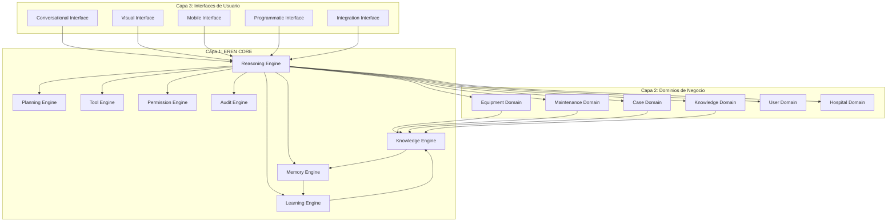
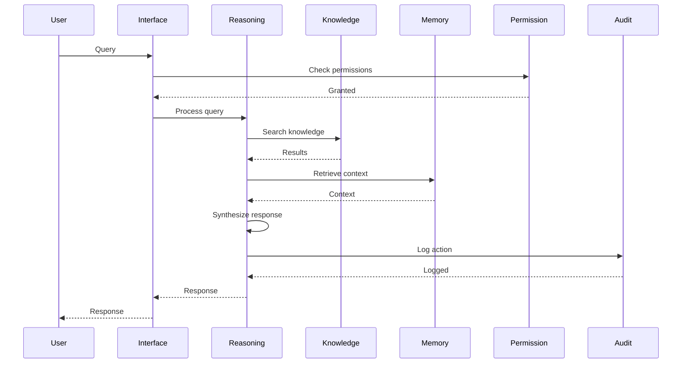
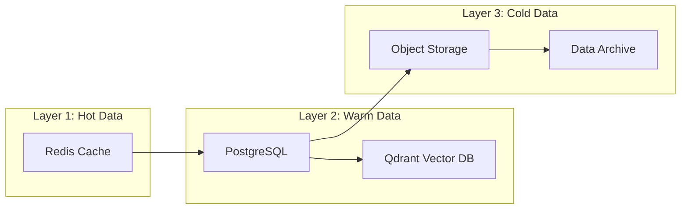

# ADR-0002: Arquitectura General de EREN CORE

## Status
Accepted

## Context

### Problema
EREN debe operar como un Cognitive Operating System que orquesta múltiples motores cognitivos especializados. La arquitectura debe:

1. Soportar múltiples motores cognitivos interconectados
2. Escalar a miles de hospitales con conocimiento distribuido
3. Mantener explicabilidad obligatoria en todas las decisiones
4. Proveer múltiples interfaces de usuario
5. Integrarse profundamente con sistemas hospitalarios
6. Evolucionar orgánicamente durante 15+ años
7. Mantener seguridad por diseño en todas las capas

### Requisitos Técnicos

**Escalabilidad**:
- Soportar 10,000+ hospitales
- Millones de documentos y casos
- Miles de usuarios concurrentes
- Búsqueda vectorial sub-segundo

**Confiabilidad**:
- 99.99% uptime SLA
- Disaster recovery multi-region
- Zero data loss
- Consistencia eventual aceptable donde apropiado

**Seguridad**:
- Compliance HIPAA/GDPR
- Encryption at rest, in transit, field-level
- Row Level Security por hospital
- Auditoría completa de acciones

**Performance**:
- < 100ms tiempo de respuesta para queries complejas
- < 500ms para respuestas cognitivas
- Soporte para caching multi-layer
- Optimización continua

## Decision

**EREN CORE adopta una arquitectura de tres capas con motores cognitivos especializados, comunicación event-driven, y separación de responsabilidades clara.**

### Arquitectura de Tres Capas

### Motores Cognitivos de EREN CORE

**1. Reasoning Engine**
- **Propósito**: Orquestar razonamiento lógico y deductivo
- **Responsabilidades**:
  - Clasificación de intentos
  - Planificación de razonamiento
  - Coordinación de otros motores
  - Síntesis de resultados
- **Tecnologías**: LangGraph, Chain of Thought, Tree of Thoughts

**2. Knowledge Engine**
- **Propósito**: Gestionar y recuperar conocimiento estructurado
- **Responsabilidades**:
  - Ingesta de conocimiento
  - Indexación y embeddings
  - Búsqueda vectorial híbrida
  - Validación de conocimiento
- **Tecnologías**: Qdrant, OpenAI Embeddings, Reranking

**3. Memory Engine**
- **Propósito**: Gestionar memoria a corto y largo plazo
- **Responsabilidades**:
  - Memoria de conversaciones
  - Memoria de contexto de usuario
  - Memoria episódica de casos
  - Memoria semántica de conceptos
- **Tecnologías**: Redis, PostgreSQL, Vector DB

**4. Learning Engine**
- **Propósito**: Aprendizaje automático de patrones
- **Responsabilidades**:
  - Entrenamiento de modelos
  - Predicción de fallas
  - Optimización de procesos
  - Detección de anomalías
- **Tecnologías**: scikit-learn, PyTorch (futuro)

**5. Planning Engine**
- **Propósito**: Planificación de tareas complejas
- **Responsabilidades**:
  - Descomposición de tareas
  - Planificación de workflows
  - Optimización de recursos
  - Programación de mantenimiento
- **Tecnologías**: Graph algorithms, Optimization

**6. Tool Engine**
- **Propósito**: Ejecución de herramientas externas
- **Responsabilidades**:
  - Registro de herramientas
  - Ejecución segura
  - Manejo de errores
  - Timeout handling
- **Tecnologías**: Python subprocess, API clients

**7. Permission Engine**
- **Propósito**: Control de permisos y autorización
- **Responsabilidades**:
  - Verificación de permisos
  - Role-based access control
  - Attribute-based access control
  - Auditoría de accesos
- **Tecnologías**: Custom RBAC/ABAC

**8. Audit Engine**
- **Propósito**: Auditoría completa de acciones
- **Responsabilidades**:
  - Logging estructurado
  - Tracing distribuido
  - Metrics collection
  - Alert generation
- **Tecnologías**: OpenTelemetry, Prometheus, Loki

### Arquitectura de Comunicación

**Event-Driven Architecture**

**Message Queue para Comunicación Asíncrona**

- **RabbitMQ** o **Kafka** para comunicación entre motores
- Event sourcing para eventos críticos
- CQRS para separación de reads/writes
- Circuit breakers para resiliencia

### Arquitectura de Datos

**Multi-Layer Storage**

**Data Strategy**:
- Redis para caching caliente (< 1s access)
- PostgreSQL para datos estructurados
- Qdrant para búsqueda vectorial
- S3 para almacenamiento de documentos
- Archive para datos históricos

## Consequences

### Impacto Positivo

1. **Escalabilidad Proven**: Arquitectura event-driven escala horizontalmente
2. **Resiliencia**: Circuit breakers y message queues previenen cascading failures
3. **Performance**: Multi-layer caching optimiza tiempos de respuesta
4. **Mantenibilidad**: Separación clara de responsabilidades
5. **Evolución**: Motores pueden añadirse/actualizarse independientemente
6. **Observabilidad**: Audit engine provee visibilidad completa
7. **Seguridad**: Permission engine centraliza control de accesos

### Impacto Negativo

1. **Complejidad Inicial**: Arquitectura más compleja que monolito simple
2. **Latencia**: Comunicación entre motores añade overhead
3. **Consistencia**: Eventual consistency requiere manejo cuidadoso
4. **Debugging**: Sistemas distribuidos son más difíciles de debuggear
5. **Infraestructura**: Requiere más infraestructura (message queue, cache, etc.)
6. **Costo**: Múltiples servicios aumentan costos operacionales

## Benefits

1. **Escalabilidad a 10,000+ Hospitales**: Arquitectura diseñada para escala masiva
2. **99.99% Uptime**: Resiliencia built-in con circuit breakers y redundancia
3. **< 100ms Response Times**: Multi-layer caching optimiza performance
4. **Explicabilidad Obligatoria**: Reasoning engine rastrea chain of thought
5. **Seguridad por Diseño**: Permission engine centraliza control
6. **Auditoría Completa**: Audit engine registra todas las acciones
7. **Evolución Orgánica**: Motores pueden añadirse sin reescribir core

## Risks

1. **Complejidad Operacional**: Sistema distribuido es más complejo de operar
   - **Mitigación**: Observabilidad exhaustiva, automated operations, team training

2. **Consistency Challenges**: Eventual consistency puede causar confusión
   - **Mitigación**: Documentación clara de consistency guarantees, eventual consistency solo donde apropiado

3. **Performance Overhead**: Comunicación entre motores añade latencia
   - **Mitigación**: Caching agresivo, optimización de message queues, parallel execution

4. **Debugging Dificult**: Sistemas distribuidos son difíciles de debuggear
   - **Mitigación**: Distributed tracing, comprehensive logging, chaos engineering

5. **Costos Operacionales**: Múltiples servicios aumentan costos
   - **Mitigación**: Auto-scaling, cost optimization, resource pooling

## Alternatives Considered

### Alternativa 1: Monolito Modular
**Descripción**: Single monolithic application con módulos internos.

**Por qué fue rechazada**:
- No escala horizontalmente
- Single point of failure
- Difficult to scale individual components
- Resource contention
- Deployment complexity increases with size

### Alternativa 2: Microservicios Completos
**Descripción**: Cada motor como microservicio independiente con su propia DB.

**Por qué fue rechazada**:
- Over-engineering para MVP
- Complexity masiva
- Distributed transactions
- Data consistency challenges
- Operational overhead

### Alternativa 3: Serverless Functions
**Descripción**: Motores implementados como AWS Lambda/serverless functions.

**Por qué fue rechazada**:
- Cold start latency
- Vendor lock-in
- Limited control over infrastructure
- Cost unpredictability at scale
- Difficult to optimize for specific workloads

### Alternativa 4: Event Sourcing Completo
**Descripción**: Todos los cambios como eventos, reconstrucción de estado.

**Por qué fue rechazada**:
- Over-engineering para MVP
- Complexity masiva
- Performance overhead
- Difficult debugging
- Learning curve steep

## Future Work

1. **Implementación de Motores**: Desarrollar los 8 motores cognitivos
2. **Message Queue**: Implementar RabbitMQ o Kafka
3. **Caching Strategy**: Implementar multi-layer caching
4. **Distributed Tracing**: Implementar OpenTelemetry
5. **Circuit Breakers**: Implementar resiliency patterns
6. **Performance Optimization**: Optimizar tiempos de respuesta
7. **Chaos Engineering**: Implementar chaos testing
8. **Auto-scaling**: Implementar auto-scaling policies

## References

- [VISION.md](../../VISION.md) - Máxima autoridad del proyecto
- [ADR-0001](./ADR-0001-cognitive-operating-system.md) - EREN como Cognitive OS
- Designing Data-Intensive Applications - Martin Kleppmann
- Microservices Patterns - Chris Richardson
- Building Event-Driven Microservices - Adam Bellemare
- Domain-Driven Design - Eric Evans

---

**ADR-0002**  
**Status**: Accepted  
**Fecha**: 2026-07-10  
**Autor**: Chief Software Architect / Principal AI Engineer / CTO  
**Aprobado por**: Product Owner  
**Alineado con**: VISION.md v1.0.0, ADR-0001
