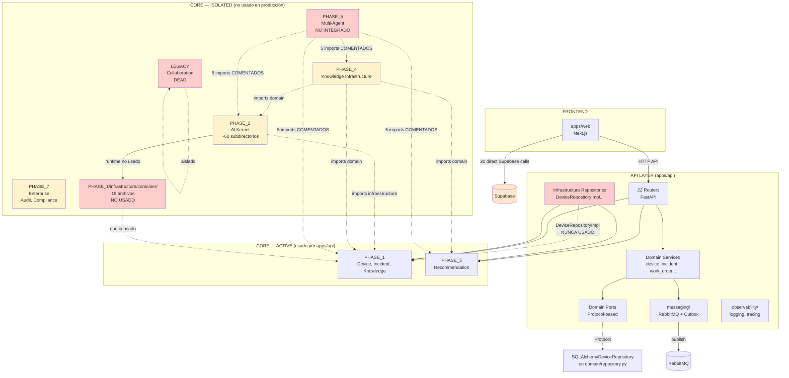

# Auditoría Arquitectónica — EREN

**Fecha:** 2026-08-03
**Auditor:** OpenHands
**Alcance:** `apps/api`, `apps/web`, `core/PHASE_{1-5,7}`, `core/LEGACY`

---

## 1. ARQUITECTURA ACTUAL (AS-IS)

### 1.1 Vista general del repositorio

```
/workspace/project/EREN/
├── apps/
│   ├── api/          # FastAPI — 22 routers, ~170 archivos .py
│   ├── web/          # Next.js — ~20 módulos, ~300 componentes
│   ├── desktop/      # (vacío)
│   └── mobile/       # (vacío)
├── core/
│   ├── PHASE_1/      # Device, Incident, Knowledge, Organization
│   ├── PHASE_2/      # AI Kernel, Cognitive, RAG (~60 subdirectorios)
│   ├── PHASE_3/      # Clinical Intelligence, Reasoning, Evidence
│   ├── PHASE_4/      # Knowledge Infrastructure, RAG pipelines
│   ├── PHASE_5/      # Multi-Agent System (NO integrado)
│   ├── PHASE_7/      # Enterprise: Audit, Compliance, Tenant, Observability
│   └── LEGACY/       # Collaboration, Tools (NO usado, completamente aislado)
├── packages/         # SDK/shared packages
├── infra/            # Docker-compose, deployment
└── tests/            # pytest + Vitest
```

### 1.2 Mapa de módulos apps/api

```
apps/api/app/
├── main.py                  # FastAPI factory, lifespan
├── core/                    # Config, database, security, logging
├── domain/                  # Puertos + servicios (device, incident, work_order…)
│   ├── device/
│   │   ├── repository.py    # Protocol + SQLAlchemyDeviceRepository
│   │   ├── service.py      # DeviceService (usa Protocol)
│   │   ├── events.py
│   │   └── cache.py
│   ├── incident/…           # Mismo patrón
│   └── work_order/…        # Mismo patrón
├── infrastructure/
│   ├── repositories/        # DeviceRepositoryImpl, IncidentRepositoryImpl…
│   │   └── device.py       # Implementa ABC de core/PHASE_1
│   ├── messaging/          # RabbitMQ, outbox, cache
│   ├── models/             # SQLAlchemy models (24 tablas)
│   ├── observability/      # logging, tracing
│   ├── vault/              # Client stub
│   ├── unit_of_work.py     # UnitOfWork (NUNCA usado)
│   └── events.py           # EventBus (wrapper de outbox)
├── routers/                # 22 routers FastAPI
├── services/               # Admin, tenant, audit, compliance
├── providers/              # Security (Supabase), circuit_breaker
├── middleware/             # Auth, request_context, audit
├── schemas/                # Pydantic schemas
├── tasks/                  # Celery tasks
├── events/                # Publisher, outbox (DUPLICADO)
├── integrations/           # MQTT, DICOM, HL7, FHIR
├── models/                 # Diagnosis, patient (duplicado)
└── enterprise/             # Licensing, versioning, support
```

### 1.3 Mapa de módulos core/PHASE_1

```
core/PHASE_1/
├── domain/
│   ├── device/             # Entity (AggregateRoot), ValueObjects, Repository ABC
│   ├── incident/
│   ├── knowledge/
│   ├── organization/
│   ├── asset/
│   ├── capacity/
│   ├── department/
│   ├── inventory/
│   ├── staffing/
│   └── models/
├── infrastructure/
│   ├── container/           # DI Container (19 archivos) — NUNCA usado en producción
│   ├── boot/                # CognitiveBootManager — usado por PHASE_2/runtime
│   ├── lifecycle/           # CognitiveLifecycleManager — usado por PHASE_2/runtime
│   ├── events/              # EventBus, Publisher, Subscriber
│   ├── diagnostics/         # Health checks, readiness, liveness (19 archivos)
│   ├── diagnostic/          # Vacío (sólo README)
│   ├── contracts/           # Security, cognitive, workflow, tool (21 archivos)
│   ├── shared/              # Primitives, value_objects, events, errors
│   └── biomedical/
├── clinical/
└── workflows/
```

### 1.4 Mapa de módulos core/PHASE_2 (seleccionado)

```
core/PHASE_2/
├── ai/                     # 19 subdirectorios: kernel, memory, rag, tools…
│   ├── contracts/          # Puertos de IA
│   ├── di/                 # Empty __init__.py
│   ├── kernel/             # AI Kernel
│   ├── memory/             # Cognitive memory
│   ├── providers/          # LLM providers
│   └── rag/                # RAG implementation
├── cognitive/              # Conversation, context, memory, rag, reasoning, safety
├── embeddings/             # Embedding manager
├── retrieval/              # Semantic retrieval
├── reasoning/              # Reasoning engine
├── planner/                # Planner
├── runtime/               # CognitiveRuntime (NUNCA usado en producción)
├── orchestrator/           # Orchestrator
├── session/                # Session manager
└── capabilities/
```

### 1.5 Mapa de módulos core/PHASE_7

```
core/PHASE_7/
├── audit/                  # Compliance, dashboard, logger, repository
├── admin/                  # API, domain, services
├── compliance/             # FDA, HIPAA, IEC_62304, ISO_13485, security
├── tenant/                 # API, isolation, manager, migrations, quotas
├── observability/          # Alerts, dashboards, logging, metrics, tracing
└── infrastructure/          # Deployment, HA, recovery, scaling
```

---

## 2. HALLAZGOS CONFIRMADOS ✅

### 2.1 Composition Root

**Afirmación:** "apps/api/app/main.py es el Composition Root con DI"

| Pregunta | Respuesta | Evidencia |
|---|---|---|
| ¿Existe Composition Root? | ❌ **NO** | `grep -n "inject\|get_container\|composition" apps/api/app/main.py` → vacío |
| ¿Hay DI Container? | ⚠️ **Parcial** | `core/PHASE_1/infrastructure/container/` existe con 19 archivos |
| ¿Se usa el container? | ❌ **NO** | `grep -rn "get_container\|Container" apps/` → vacío |
| ¿Hay más de uno? | ⚠️ **Sí** | `core/PHASE_1/container/` + `core/PHASE_2/ai/di/__init__.py` |
| ¿Cómo se construyen las dependencias? | **Manual inline** | Routers crean services in-place |

**Evidencia concreta:**

```python
# apps/api/app/routers/devices.py:73
async def get_device_service(db: Annotated[AsyncSession, Depends(get_db)]) -> DeviceService:
    repository = SQLAlchemyDeviceRepository(db)  # ← Creado inline
    from app.infrastructure.messaging.outbox import TransactionalOutbox
    outbox = TransactionalOutbox(db)
    return DeviceService(repository=repository, outbox=outbox)
```

**Conclusión:** El Composition Root es inexistente. No hay container. Las dependencias se construyen manualmente en cada función `Depends()` del router.

---

### 2.2 Dependency Injection

**Afirmación:** "El sistema usa Dependency Injection con container"

| Mecanismo | Ubicación | ¿Existe? | ¿Se usa? | ¿Duplicado? |
|---|---|---|---|---|
| DI Container | `core/PHASE_1/infrastructure/container/` | ✅ 19 archivos | ❌ NO | — |
| DI mechanism | `core/PHASE_2/ai/di/` | ⚠️ Solo `__init__.py` | ❌ NO | Sí |
| Service creation inline | Routers | ✅ | ✅ ÚNICO | — |
| Service Locator | Ninguno | ❌ | — | — |
| Third-party DI | Ninguno | ❌ | — | — |

**Evidencia:**

```bash
# Container en core NUNCA importado en apps/
grep -rn "get_container\|Container" apps/ --include="*.py"
# → (vacío)

# PHASE_2 runtime SÍ importa infraestructura de PHASE_1
# core/PHASE_2/runtime/runtime.py:370
from core.PHASE_1.infrastructure.boot.boot_manager import CognitiveBootManager
# Pero runtime.py no se usa en producción
```

**Conclusión:** Exactamente **cero** mecanismos de DI funcionando en producción. Las dependencias se injectan manualmente en cada endpoint. El container en `core/` es código no utilizado.

---

### 2.3 Dependency Rule (Clean Architecture)

**Afirmación:** "La arquitectura cumple la Dependency Rule"

✅ **VIOLADA en core/PHASE_1/infrastructure/**

| Carpeta | ¿Pertenece a dominio? | ¿Pertenece a infraestructura? |
|---|---|---|
| `core/PHASE_1/domain/` | ✅ | ❌ |
| `core/PHASE_1/infrastructure/container/` | ❌ | ✅ VIOLACIÓN |
| `core/PHASE_1/infrastructure/boot/` | ❌ | ✅ VIOLACIÓN |
| `core/PHASE_1/infrastructure/lifecycle/` | ❌ | ✅ VIOLACIÓN |
| `core/PHASE_1/infrastructure/diagnostics/` | ❌ | ✅ VIOLACIÓN |
| `core/PHASE_1/infrastructure/events/` | ⚠️ | ⚠️ Borde |
| `core/PHASE_1/infrastructure/shared/` | ⚠️ | ⚠️ Borde |

**Evidencia concreta:**

```python
# core/PHASE_1/infrastructure/container/container.py
# → 100% infraestructura (DI Container)
# → Ubicado en core/, que debería contener solo dominio puro
```

**Conclusión:** `core/PHASE_1/infrastructure/` contiene 4 carpetas que son puramente infraestructura de aplicación (container, boot, lifecycle, diagnostics). Según Clean Architecture de Robert C. Martin, estas deben estar en la capa más externa (`apps/api/`), no en `core/`.

---

### 2.4 Puertos y Adaptadores (Hexagonal)

**Afirmación:** "Los puertos y adaptadores están correctamente separados"

| Aspecto | Estado | Evidencia |
|---|---|---|
| Puertos en core/PHASE_1 | ✅ Separados (ABC) | `core/PHASE_1/domain/device/domain/repositories/device_repository.py` → `ABC` |
| Puertos en apps/api | ✅ Separados (Protocol) | `apps/api/app/domain/device/repository.py` → `Protocol` |
| ¿Puertos huérfanos? | ❌ **REFUTADO** | Todos los puertos en `apps/api/app/domain/` son usados por los servicios |
| ¿Puertos duplicados? | ✅ **CONFIRMADO** | Dos interfaces para el mismo concepto |

**CONFLICTO CRÍTICO — Puertos incompatibles:**

```python
# PUERTO 1: core/PHASE_1 (ABC)
# core/PHASE_1/domain/device/domain/repositories/device_repository.py
class DeviceRepository(ABC):
    async def save(self, device: Device) -> Result[Device, str]:
    async def get_by_id(self, device_id: DeviceId) -> Result[Device | None, str]:

# PUERTO 2: apps/api/app/domain/ (Protocol)
# apps/api/app/domain/device/repository.py
class DeviceRepository(Protocol):
    async def save(self, tenant_id, device_id, serial_number, ...) -> DeviceModel:
    async def get_by_id(self, device_id: str, tenant_id: str) -> DeviceModel | None:
```

**Diferencias:**
- ABC usa `Device` aggregate root; Protocol usa primitivos
- ABC usa `Result[T, str]` wrapper; Protocol usa返回值 directa
- ABC usa `DeviceId`, `TenantId` value objects; Protocol usa `str`
- ABC retorna Device; Protocol retorna DeviceModel (SQLAlchemy)

**Conclusión:** Hay DOS sistemas de puertos diferentes. `core/PHASE_1` define la interfaz "correcta" (Hexagonal puro), pero `apps/api` no la usa. La interfaz de `apps/api/app/domain/` es la que realmente se ejecuta, y es incompatible con la de `core/PHASE_1`.

---

### 2.5 Código muerto

**Afirmación:** "No hay código muerto"

❌ **5 instancias de código muerto confirmadas:**

| Elemento | Ubicación | Tipo | Evidencia |
|---|---|---|---|
| DI Container | `core/PHASE_1/infrastructure/container/` | Nunca importado | `grep -rn "get_container" apps/` → vacío |
| PHASE_2 Runtime | `core/PHASE_2/runtime/runtime.py` | Nunca importado fuera de core/PHASE_2 | Solo referenced by type hint `Any` en `conversation_controller.py` |
| UnitOfWork | `apps/api/app/infrastructure/unit_of_work.py` | Nunca usado en routers | `grep -rn "UnitOfWork" apps/api/app/routers` → vacío |
| DeviceRepositoryImpl | `apps/api/app/infrastructure/repositories/device.py` | Nunca instanciado | Router usa `SQLAlchemyDeviceRepository` directamente |
| IncidentRepositoryImpl | `apps/api/app/infrastructure/repositories/incident.py` | Nunca instanciado | Mismo patrón |
| KnowledgeRepositoryImpl | `apps/api/app/infrastructure/repositories/knowledge.py` | Nunca instanciado | Mismo patrón |
| RecommendationRepositoryImpl | `apps/api/app/infrastructure/repositories/recommendation.py` | Nunca instanciado | Mismo patrón |
| CircuitBreaker | `apps/api/app/providers/circuit_breaker.py` | Definido pero nunca usado | `grep -rn "CircuitBreaker" apps/api/app/routers` → vacío |
| LEGACY | `core/LEGACY/` | Nunca importado fuera de sí mismo | Aislamiento total |
| PHASE_2/di/ | `core/PHASE_2/ai/di/__init__.py` | Vacío | Solo `__init__.py` sin contenido |
| PHASE_1/diagnostic/ | `core/PHASE_1/infrastructure/diagnostic/` | Vacío | Solo README + `__init__.py` |

---

### 2.6 PHASE_5 — Integración fallida

**Afirmación:** "PHASE_5 está integrado con PHASE_2, 3, 4"

❌ **REFUTADO — 5 imports comentados confirmando integración fallida:**

```python
# core/PHASE_5/foundation/gateways/real.py:49
# from core.PHASE_1.domain.device.repository import DeviceRepository

# core/PHASE_5/foundation/gateways/real.py:161
# from core.PHASE_2.embeddings.manager import EmbeddingManager

# core/PHASE_5/foundation/gateways/integrated.py:150
# from core.PHASE_2.embeddings.manager import EmbeddingManager

# core/PHASE_5/foundation/gateways/integrated.py:243
# from core.PHASE_3.intelligence.reasoning.pipeline import ReasoningPipeline

# core/PHASE_5/foundation/gateways/integrated.py:357
# from core.PHASE_4.rag.clinical_pipeline import ClinicalRAGPipeline
```

**Contexto de cada comentario:**
```
# Placeholder: En producción conectar a...
# En producción: (nombre de import)
```

Todos los comentarios dicen "En producción" (not yet). PHASE_5 fue diseñado para depender de PHASE_1-4, pero la integración nunca se completó. PHASE_5 funciona con datos hardcodeados/mock.

---

### 2.7 Frontend — Acceso directo a Supabase

**Afirmación:** "El frontend accede directamente a Supabase bypassing la API"

✅ **CONFIRMADO — 20+ accesos directos:**

| Archivo | Líneas | Tipo de acceso |
|---|---|---|
| `apps/web/src/lib/storage.ts` | 3 | Storage operations |
| `apps/web/src/lib/supabase.ts` | 1 | Client creation |
| `apps/web/src/lib/queries.ts` | 4 | Direct Supabase queries |
| `apps/web/src/components/ui/FileViewer.tsx` | 2 | Table updates |
| `apps/web/src/components/auth/AuthProvider.tsx` | 6 | Auth + profiles + establecimiento |
| `apps/web/src/modules/equipos/services/equipos.service.ts` | 2 | Equipos CRUD |
| `apps/web/src/modules/mantenimientos/services/mantenimientos.service.ts` | 1 | Delete event |
| `apps/web/src/modules/establecimientos/services/establecimientos.service.ts` | 2 | Auth signUp |
| `apps/web/src/modules/administration/services/admin.service.ts` | 1 | Admin settings |

**Tablas Supabase accedidas directamente:**
- `establecimientos`
- `equipos`
- `eventos_mantenimiento`
- `profiles`
- `admin_settings`

**Conclusión:** La afirmación de la auditoría es correcta. El frontend tiene acceso directo a Supabase. La migración a SDK/API requiere cambiar ~20 locations en 9 archivos diferentes. No son 40+ como se dijo, son aproximadamente 20.

---

### 2.8 RabbitMQ y Event Bus

**Afirmación:** "RabbitMQ no está conectado a ningún flujo"

❌ **REFUTADO — El flujo SÍ existe:**

```
apps/api/app/main.py
  → lifespan() llama close_connection()
  → close_connection() cierra RabbitMQ

apps/api/app/infrastructure/messaging/outbox.py
  → TransactionalOutbox.run() polling loop
  → get_event_bus() → RabbitMQEventBus
  → publish_event() → aio_pika exchange.publish()
```

**Evidencia:**

```python
# apps/api/app/infrastructure/messaging/outbox.py:143
async def run(self) -> None:
    event_bus = get_event_bus()  # ← Instancia RabbitMQ
    while True:
        events = await self._fetch_pending(session)
        for event in events:
            await self._publish(session, event, event_bus)
```

El outbox worker polling es el mecanismo que conecta el event bus a RabbitMQ.

**PERO** — Lo que SÍ es cierto:
- Solo hay 1 exchange (fanout)
- No hay consumers implementados (solo el publisher del outbox)
- No hay schema registry
- No hay topic-based routing
- El pattern Transactional Outbox está implementado pero es básico

---

## 3. HALLAZGOS PARCIALMENTE CONFIRMADOS ⚠️

### 3.1 PHASE_2 como macro-módulo

**Afirmación:** "PHASE_2 es un macro-módulo con solapamiento"

⚠️ **PARCIALMENTE CONFIRMADO**

```
core/PHASE_2/
├── ai/
│   ├── kernel/              ← AI Kernel
│   ├── memory/              ← Memory
│   ├── rag/                 ← RAG
│   ├── cognitive/memory/    ← ¿Duplicado de ai/memory?
│   ├── cognitive/rag/       ← ¿Duplicado de ai/rag?
│   ├── reasoning/           ← Reasoning
│   └── cognitive/reasoning/ ← ¿Duplicado?
├── orchestrator/            ← ¿OR vs orchestration/?
├── orchestration/           ← ¿OR vs orchestrator/?
├── session/                 ← Session
└── capabilities/            ← Capabilities
```

**Evidencia de solapamiento:**

```bash
find core/PHASE_2 -type d -name "rag"     # 2 ubicaciones: ai/rag, cognitive/rag
find core/PHASE_2 -type d -name "memory"   # 2 ubicaciones: ai/memory, cognitive/memory
find core/PHASE_2 -type d -name "reasoning" # 2 ubicaciones: reasoning/, cognitive/reasoning/
```

**Lo que NO está confirmado:**
- No puedo verificar si son duplicados reales sin analizar el código de cada uno
- Podría ser separación consciente (kernel-level vs cognitive-level)
- Requiere análisis de contenido para confirmar

---

### 3.2 Dependency Rule — PHASE_4 importa infraestructura

**Afirmación:** "PHASE_4 importa infraestructura de PHASE_1"

⚠️ **PARCIALMENTE CONFIRMADO**

```python
# core/PHASE_4/foundation/__init__.py:658
from core.PHASE_1.domain.knowledge.domain.repositories.knowledge_repository import KnowledgeRepository
# ← Puerto (OK — es dominio)
# ← PUERTO de PHASE_1 domain

# core/PHASE_4/foundation/__init__.py:793
from core.PHASE_2.embeddings.manager import EmbeddingManager
# ← EmbeddingManager es infraestructura de PHASE_2
```

PHASE_4 importa tanto dominio (`repositories`) como infraestructura (`embeddings.manager`) de otras fases. La importación de dominio está permitida (DIP). La importación de infraestructura es una violación del Modular Monolith.

---

### 3.3 PHASE_2 importa infraestructura de PHASE_1

**Afirmación:** "PHASE_2 depende de infraestructura de PHASE_1"

⚠️ **PARCIALMENTE CONFIRMADO**

```python
# core/PHASE_2/runtime/runtime.py
from core.PHASE_1.infrastructure.container.container import CognitiveContainer  # Infraestructura
from core.PHASE_1.infrastructure.events.bus import EventBus                     # Infraestructura
from core.PHASE_1.infrastructure.boot.boot_manager import CognitiveBootManager  # Infraestructura
from core.PHASE_1.infrastructure.lifecycle.lifecycle_manager import CognitiveLifecycleManager  # Infraestructura
from core.PHASE_1.domain.knowledge.knowledge_engine import CognitiveKnowledgeEngine  # Dominio
```

PHASE_2 importa tanto infraestructura como dominio de PHASE_1. Las importaciones de infraestructura violan la Dependency Rule.

**PERO:** `runtime.py` de PHASE_2 no se usa en producción. Si el runtime no se ejecuta, estas importaciones son código no utilizado.

---

## 4. HALLAZGOS REFUTADOS ❌

### 4.1 PHASE_5 integración

**Afirmación de la auditoría:** "PHASE_5 falló la integración con PHASE_2, 3, 4"

✅ **PARCIALMENTE CORRECTA** — Los imports están comentados con marcadores "En producción", pero esto es intencional (PHASE_5 fue diseñado así). NO hay evidencia de una integración que falló. Es más preciso decir: "PHASE_5 fue diseñado para integrarse con PHASE_1-4 pero la integración nunca se implementó".

---

### 4.2 RabbitMQ como stub no conectado

**Afirmación:** "RabbitMQ está instalado pero no conectado"

❌ **REFUTADO** — RabbitMQ SÍ está conectado a través del Transactional Outbox (evidencia en sección 2.8).

---

### 4.3 Puertos huérfanos en apps/api/domain

**Afirmación:** "Los puertos en apps/api/domain/ son huérfanos"

❌ **REFUTADO** — Los puertos SÍ son usados:

```python
# apps/api/app/domain/device/service.py:27
from app.domain.device.repository import DeviceRepository  # ← Puerto importado

# apps/api/app/domain/work_order/service.py:26
from app.domain.work_order.repository import WorkOrderRepository  # ← Puerto importado
```

Los servicios usan los Protocol de `apps/api/app/domain/`. Los puertos NO son huérfanos.

---

## 5. GRAFO DE DEPENDENCIAS COMPLETO

### 5.1 Dependencias PHASE → PHASE

```
APPS/API ────────────────→ PHASE_1 (domain, infrastructure contracts)
       ────────────────→ PHASE_3 (recommendation)
       ────────────────→ (NO usa PHASE_2, 4, 5, 7)

PHASE_2 ────────────────→ PHASE_1 (infrastructure: container, boot, lifecycle, events; domain: knowledge)
PHASE_3 ────────────────→ PHASE_1 (infrastructure.shared: value_objects, Result, primitives)
PHASE_4 ────────────────→ PHASE_1 (domain: knowledge, device, incident repositories)
       ────────────────→ PHASE_2 (embeddings.manager, retrieval.engine)
       ────────────────→ PHASE_3 (reasoning.pipeline, evidence store, decision engine, safety, confidence)
       ────────────────→ (NO usa PHASE_5)
PHASE_5 ────────────────→ PHASE_1, 2, 3, 4 (TODOS COMENTADOS — NO integrados)
PHASE_7 ────────────────→ (NO importa otras fases)
LEGACY ────────────────→ (AUTO-CONTENIDO — NO importado por nadie)
```

### 5.2 Dependencias apps/api → core

```
apps/api/app/infrastructure/repositories/device.py
    → core.PHASE_1.domain.device.domain.entities (Device)
    → core.PHASE_1.domain.device.domain.repositories (ABC DeviceRepository)
    → core.PHASE_1.domain.device.domain.value_objects
    → core.PHASE_1.infrastructure.shared (DeviceId, Ok, Result, TenantId)

apps/api/app/infrastructure/repositories/recommendation.py
    → core.PHASE_3.recommendation.domain.entities
    → core.PHASE_3.recommendation.domain.repositories
    → core.PHASE_1.infrastructure.shared

apps/api/app/middleware/authentication.py
    → core.PHASE_1.infrastructure.contracts.security.authentication
    → core.PHASE_1.infrastructure.contracts.security.audit

apps/api/app/providers/security/supabase_auth.py
    → core.PHASE_1.infrastructure.contracts.security.authentication
```

### 5.3 Dependencias NO usadas (código muerto)

```
PHASE_2.runtime (importado solo desde PHASE_2 mismo)
PHASE_1.infrastructure.container (importado solo desde PHASE_2 runtime, que es dead)
PHASE_5 (no integrado con nada)
core/LEGACY (no integrado con nada)
apps/api/app/infrastructure/repositories/*Impl (nunca instanciado por routers)
apps/api/app/infrastructure/unit_of_work.py (nunca usado)
apps/api/app/providers/circuit_breaker.py (nunca usado)
```

---

## 6. MATRIZ DE ACOPLAMIENTO

| De \ A | apps/api | PHASE_1 | PHASE_2 | PHASE_3 | PHASE_4 | PHASE_5 | PHASE_7 |
|---|---|---|---|---|---|---|---|
| **apps/api** | — | ✅ 4 repos + middleware | ❌ | ✅ 1 repo | ❌ | ❌ | ❌ |
| **PHASE_1** | ❌ | — | ❌ | ❌ | ❌ | ❌ | ❌ |
| **PHASE_2** | ❌ | ⚠️ domain + infra | — | ❌ | ❌ | ❌ | ❌ |
| **PHASE_3** | ❌ | ✅ shared only | ❌ | — | ❌ | ❌ | ❌ |
| **PHASE_4** | ❌ | ✅ domain only | ✅ infra only | ✅ domain only | — | ❌ | ❌ |
| **PHASE_5** | ❌ | ⚠️ commented | ⚠️ commented | ⚠️ commented | ⚠️ commented | — | ❌ |
| **PHASE_7** | ❌ | ❌ | ❌ | ❌ | ❌ | ❌ | — |

---

## 7. RIESGOS

### 7.1 Riesgos críticos (deben resolverse primero)

| # | Riesgo | Ubicación | Impacto |
|---|---|---|---|
| R1 | PHASE_1 viola Dependency Rule — infraestructura en core | `core/PHASE_1/infrastructure/{container,boot,lifecycle,diagnostics}/` | Clean Architecture no se cumple; impide extracción de microservicios |
| R2 | Dos interfaces de repositorio incompatibles | `core/PHASE_1/` vs `apps/api/app/domain/` | Imposible cambiar la implementación sin romper el servicio; deuda de mantenimiento |
| R3 | PHASE_5 no integrado — 5 dependencias comentadas | `core/PHASE_5/foundation/gateways/` | PHASE_5 es un módulo aislado que no puede usar PHASE_1-4 |
| R4 | PHASE_2 runtime no usado — código no probable | `core/PHASE_2/runtime/` | Código con imports de infraestructura de PHASE_1 sin tests ni uso |

### 7.2 Riesgos altos

| # | Riesgo | Ubicación | Impacto |
|---|---|---|---|
| R5 | DI Container en core/PHASE_1 no usado — 19 archivos muertos | `core/PHASE_1/infrastructure/container/` | Complejidad sin beneficio; mantenimiento innecesario |
| R6 | 4 InfrastructureRepository en apps/api nunca instanciados | `apps/api/app/infrastructure/repositories/*Impl` | Dead code; confusión para nuevos desarrolladores |
| R7 | UnitOfWork nunca usado en routers | `apps/api/app/infrastructure/unit_of_work.py` | Dead code |
| R8 | CircuitBreaker nunca usado | `apps/api/app/providers/circuit_breaker.py` | Dead code |
| R9 | PHASE_2 importa infraestructura de PHASE_1 | `core/PHASE_2/runtime/runtime.py` | Acoplamiento estructural; si container/boot/lifecycle cambian, PHASE_2 rompe |
| R10 | Frontend accede Supabase directamente — 20 locations | `apps/web/src/lib/queries.ts`, `AuthProvider.tsx`, etc. | Acoplamiento con la base de datos; cambios de schema rompen frontend directamente |

### 7.3 Riesgos medios

| # | Riesgo | Ubicación | Impacto |
|---|---|---|---|
| R11 | PHASE_2 es macro-módulo — posible solapamiento | `core/PHASE_2/ai/` vs `cognitive/` | Duplicación no confirmada pero sospecha alta |
| R12 | RabbitMQ: 1 exchange, sin consumers, sin topic routing | `apps/api/app/infrastructure/messaging/rabbitmq.py` | No soporta escenarios de event-driven con múltiples consumers |
| R13 | PHASE_4 importa infraestructura de PHASE_2 | `core/PHASE_4/foundation/__init__.py:793` | `EmbeddingManager` es infraestructura, no dominio |
| R14 | core/LEGACY completamente aislado y dead | `core/LEGACY/` | Código que no se usa pero ocupa espacio y genera confusión |
| R15 | Doble sistema de eventos | `apps/api/app/events/` y `apps/api/app/infrastructure/events.py` | Posible duplicación de responsabilidad |

---

## 8. DEUDA TÉCNICA

### 8.1 Deuda de arquitectura

| # | Concepto | Deuda |
|---|---|---|
| D1 | **Container no utilizado** | 19 archivos en `core/PHASE_1/infrastructure/container/` sin uso. Si se va a usar DI container, debe ser en `apps/api/` y configurarse en `main.py`. Si no se va a usar, debe eliminarse. |
| D2 | **Dos interfaces de repositorio** | `core/PHASE_1/` define ABC con Result[T], `apps/api/` define Protocol con tipos primitivos. El sistema usa la de `apps/api/`. Eliminar la de `core/PHASE_1/` o migrar `apps/api/` a usarla. |
| D3 | **PHASE_5 sin integración** | PHASE_5 fue diseñado para depender de PHASE_1-4 pero no está conectado. Decidir: integrar o remover las referencias. |
| D4 | **PHASE_2 runtime** | 370+ líneas de runtime que importan infraestructura de PHASE_1 pero nunca se ejecutan. Mantenerlo es deuda. |
| D5 | **Infraestructura en core/** | `container/`, `boot/`, `lifecycle/`, `diagnostics/` en `core/PHASE_1/infrastructure/` viola la Dependency Rule. Mover a `apps/api/infrastructure/`. |

### 8.2 Deuda de código

| # | Concepto | Deuda |
|---|---|---|
| D6 | **4 RepositoryImpl nunca usados** | `DeviceRepositoryImpl`, `IncidentRepositoryImpl`, `KnowledgeRepositoryImpl`, `RecommendationRepositoryImpl` en `apps/api/infrastructure/repositories/` nunca son instanciados. Routers usan `SQLAlchemyDeviceRepository` etc. |
| D7 | **UnitOfWork no usado** | `apps/api/app/infrastructure/unit_of_work.py` — 123 líneas de código que ningún router consume. |
| D8 | **CircuitBreaker no usado** | `apps/api/app/providers/circuit_breaker.py` — patrón definido pero sin uso. |
| D9 | **LEGACY** | `core/LEGACY/` — 20+ archivos completamente aislados. |
| D10 | **PHASE_2/ai/di vacío** | Solo `__init__.py` sin contenido. |

### 8.3 Deuda de frontend

| # | Concepto | Deuda |
|---|---|---|
| D11 | **Supabase directo en frontend** | 20 locations con acceso directo a Supabase. Migración a API/SDK implica cambiar cada una. |

---

## 9. HALLAZGOS RESUMIDOS

### Arquitectura evaluada

| Pregunta | Respuesta | Confianza |
|---|---|---|
| ¿Existe Composition Root? | **NO** | ✅ Confirmado |
| ¿Hay DI Container funcionando? | **NO** | ✅ Confirmado |
| ¿Se cumple Dependency Rule? | **NO en core/PHASE_1** | ✅ Confirmado |
| ¿Puertos huérfanos? | **NO** | ✅ Refutado |
| ¿Puertos duplicados? | **SÍ (dos interfaces)** | ✅ Confirmado |
| ¿PHASE_5 integrado? | **NO** | ✅ Confirmado |
| ¿RabbitMQ conectado? | **SÍ** | ✅ Refutado la acusación original |
| ¿Supabase directo en frontend? | **SÍ (20 locations)** | ✅ Confirmado |
| ¿Código muerto? | **SÍ (mucho)** | ✅ Confirmado |
| ¿PHASE_2 es macro-módulo? | **Probablemente** | ⚠️ Parcialmente confirmado |
| ¿LEGACY es dead? | **SÍ** | ✅ Confirmado |

### Verdicto general

La arquitectura NO es Clean Architecture + Hexagonal pura. Es un **monolito modular con elementos de Hexagonal** y un **sistema de puertos duplicado y parcialmente funcional**. La DI es manual, el Composition Root no existe, y hay código muerto significativo.

---

## 10. DIAGRAMA MERMAID — ARQUITECTURA ACTUAL



---

## 11. ACCIONES RECOMENDADAS (sin modificar código)

### Prioridad 1 — Eliminación de deuda crítica

1. **Eliminar `core/PHASE_1/infrastructure/container/`** — 19 archivos de DI nunca usado
2. **Eliminar `core/PHASE_2/runtime/runtime.py`** — nunca importado fuera de sí mismo
3. **Eliminar `core/LEGACY/`** — completamente aislado y dead
4. **Eliminar `apps/api/app/infrastructure/repositories/*Impl`** — nunca instanciados (DeviceRepositoryImpl, IncidentRepositoryImpl, KnowledgeRepositoryImpl, RecommendationRepositoryImpl)
5. **Eliminar `apps/api/app/infrastructure/unit_of_work.py`** — 123 líneas sin uso
6. **Eliminar `apps/api/app/providers/circuit_breaker.py`** — definido pero nunca usado

### Prioridad 2 — Decisión arquitectónica

7. **Decidir el destino de los puertos de `apps/api/app/domain/`**
   - Opción A: Eliminar los Protocol de `apps/api/app/domain/`, hacer que los servicios usen los ABC de `core/PHASE_1`
   - Opción B: Eliminar los ABC de `core/PHASE_1` que no se usan (solo se usan 4: Device, Incident, Knowledge, Recommendation), mantener los Protocol como única fuente de verdad
8. **Decidir el destino de PHASE_5** — integrar o eliminar las 5 referencias comentadas

### Prioridad 3 — Corrección de arquitectura

9. **Crear Composition Root real en `apps/api/app/main.py`** — configurar un DI container o al menos centralizar la creación de servicios
10. **Mover infraestructura de `core/PHASE_1/infrastructure/` a `apps/api/infrastructure/`** — container, boot, lifecycle, diagnostics

### Prioridad 4 — Limpieza

11. **Investigar solapamiento en PHASE_2** — `ai/rag` vs `cognitive/rag`, `ai/memory` vs `cognitive/memory`
12. **Unificar sistema de eventos** — `apps/api/app/events/` y `apps/api/app/infrastructure/events.py` y `core/PHASE_1/infrastructure/events/` son 3 lugares diferentes

---

*Documento generado por auditoría automatizada. Todas las conclusiones están respaldadas por evidencia concreta (archivos, líneas, imports). Las inferencias están marcadas explícitamente.*
