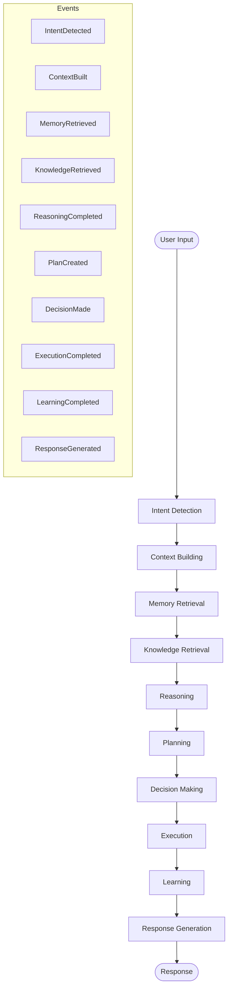

# PR-048 — Cognitive Runtime

## Overview

PR-048 implements the complete cognitive processing pipeline for EREN OS, enabling the system to process user inputs through a series of cognitive stages, from intent detection to response generation.

## Architecture



## Cognitive Stages

| Stage | Description | Input | Output |
|-------|-------------|-------|--------|
| **IntentDetection** | Detects user intent from input | `user_input` | `intent`, `confidence`, `entities` |
| **ContextBuilding** | Builds processing context | `user_input`, `intent` | `context_items`, `context_sources` |
| **MemoryRetrieval** | Retrieves relevant memories | `user_input`, `intent` | `memories`, `relevance_scores` |
| **KnowledgeRetrieval** | Retrieves knowledge base entries | `user_input`, `intent` | `knowledge`, `relevance` |
| **Reasoning** | Performs reasoning on inputs | `context`, `memories`, `knowledge` | `conclusions`, `confidence` |
| **Planning** | Creates execution plan | `intent`, `reasoning` | `plan`, `tasks`, `dependencies` |
| **DecisionMaking** | Makes decision based on analysis | `reasoning`, `plan` | `decision`, `confidence` |
| **Execution** | Executes planned tasks | `plan` | `results`, `success_count`, `failure_count` |
| **Learning** | Learns from execution | `execution`, `reasoning` | `lessons`, `memory_updates` |
| **ResponseGeneration** | Generates final response | `all_stages_output` | `text`, `citations`, `type` |

## Events

The pipeline emits the following events via the Event Bus:

| Event | Description | Data |
|-------|-------------|------|
| `PIPELINE_STARTED` | Pipeline execution began | `session_id`, `correlation_id` |
| `PIPELINE_COMPLETED` | Pipeline execution finished | `session_id`, `duration_ms` |
| `PIPELINE_FAILED` | Pipeline execution failed | `error`, `failed_stage` |
| `INTENT_DETECTED` | Intent was detected | `intent`, `confidence`, `entities` |
| `CONTEXT_BUILT` | Context was built | `context_items`, `sources` |
| `MEMORY_RETRIEVED` | Memories were retrieved | `count`, `types`, `scores` |
| `KNOWLEDGE_RETRIEVED` | Knowledge was retrieved | `count`, `sources`, `relevance` |
| `REASONING_COMPLETED` | Reasoning finished | `type`, `confidence`, `conclusions` |
| `PLAN_CREATED` | Plan was created | `plan_id`, `task_count`, `risk_level` |
| `DECISION_MADE` | Decision was made | `decision`, `confidence` |
| `EXECUTION_COMPLETED` | Execution finished | `executed`, `success`, `failed` |
| `LEARNING_COMPLETED` | Learning finished | `lessons`, `memory_updates` |
| `RESPONSE_GENERATED` | Response was generated | `text`, `type`, `citations` |

## Telemetry

Each stage collects:

- **Duration**: Time spent in stage (ms)
- **Tokens**: LLM tokens used (if applicable)
- **Provider**: LLM provider used (if applicable)
- **Cost**: Estimated cost (if applicable)
- **Errors**: Number of errors
- **Retries**: Number of retries

## Usage

```python
from core.pipeline import (
    create_cognitive_pipeline,
    CognitiveEventPublisher,
)

# Create event publisher for observability
publisher = CognitiveEventPublisher()

# Create configured pipeline
pipeline = create_cognitive_pipeline(event_publisher=publisher)

# Execute cognitive pipeline
result = pipeline.execute(
    user_input="What is the weather today?",
    session_id="user-session-123",
    metadata={"source": "web"}
)

# Check results
if result.success:
    print(f"Response: {result.response['text']}")
    print(f"Duration: {result.total_duration_ms}ms")
    
# Review events
for event in publisher.get_history():
    print(f"{event.event_type}: {event.timestamp}")
```

## API Reference

### `create_cognitive_pipeline(event_publisher, enable_telemetry)`

Creates a configured cognitive pipeline with all stages.

**Parameters:**
- `event_publisher` (`CognitiveEventPublisher | None`): Event publisher
- `enable_telemetry` (`bool`): Enable telemetry collection

**Returns:**
- `CognitivePipeline`: Configured pipeline instance

### `CognitivePipeline.execute(user_input, session_id, metadata)`

Executes the complete cognitive pipeline.

**Parameters:**
- `user_input` (`str`): User input text
- `session_id` (`str | None`): Optional session ID
- `metadata` (`dict | None`): Optional metadata

**Returns:**
- `CognitivePipelineResult`: Pipeline execution result

### `CognitiveEventPublisher`

Publishes cognitive events for observability.

**Methods:**
- `subscribe(callback)`: Subscribe to events
- `unsubscribe(callback)`: Unsubscribe from events
- `get_history(session_id, event_type, limit)`: Get event history

## Files Created

```
core/pipeline/
├── cognitive_events.py      # Cognitive event types and publisher
├── cognitive_pipeline.py    # Main cognitive pipeline
└── stages/
    ├── __init__.py
    ├── cognitive_stage.py   # Base cognitive stage
    ├── intent_stage.py      # Intent detection
    ├── context_stage.py     # Context building
    ├── memory_stage.py      # Memory retrieval
    ├── knowledge_stage.py   # Knowledge retrieval
    ├── reasoning_stage.py   # Reasoning
    ├── planning_stage.py    # Planning
    ├── decision_stage.py    # Decision making
    ├── execution_stage.py   # Task execution
    ├── learning_stage.py    # Learning
    └── response_stage.py    # Response generation
```

## Tests

Tests are located in `tests/unit/core/pipeline/test_cognitive_pipeline.py`.

Run tests:
```bash
pytest tests/unit/core/pipeline/test_cognitive_pipeline.py -v
```

## Future Enhancements

- [ ] Parallel stage execution where possible
- [ ] Stage result caching
- [ ] Pipeline branching based on intent
- [ ] Streaming response support
- [ ] Multi-turn conversation context
