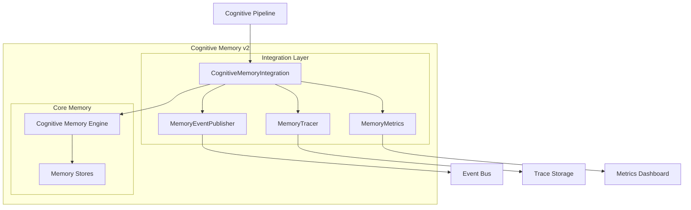

# PR-049 — Cognitive Memory v2

## Overview

PR-049 extends the Cognitive Memory System with integration capabilities, event publishing, metrics collection, and tracing for seamless integration with the Cognitive Pipeline.

## Architecture



## Components

### Memory Event Publisher

Publishes events for all memory operations:

| Event | Description | Data |
|-------|-------------|------|
| `MEMORY_STORED` | Memory was stored | `memory_id`, `memory_type`, `duration_ms` |
| `MEMORY_RETRIEVED` | Memory was retrieved | `memory_id`, `success`, `duration_ms` |
| `MEMORY_UPDATED` | Memory was updated | `memory_id`, `changes` |
| `MEMORY_DELETED` | Memory was deleted | `memory_id`, `success` |
| `MEMORY_SEARCHED` | Search was performed | `result_count`, `duration_ms` |
| `MEMORY_CONSOLIDATED` | Memory was consolidated | `from_type`, `to_type` |
| `MEMORY_FORGOTTEN` | Memory was forgotten | `memory_id`, `reason` |

### Memory Tracer

Provides detailed tracing of memory operations:

- Operation start/end times
- Duration calculation
- Success/failure tracking
- Error recording
- Correlation ID support

### Memory Metrics

Collects comprehensive metrics:

```python
@dataclass
class MemoryMetrics:
    total_stores: int
    total_memories: int
    working_memory_count: int
    short_term_count: int
    long_term_count: int
    episodic_count: int
    semantic_count: int
    procedural_count: int
    total_searches: int
    successful_searches: int
    failed_searches: int
    average_search_duration_ms: float
    total_storage_duration_ms: float
    total_retrieval_duration_ms: float
    cache_hits: int
    cache_misses: int
```

## Usage

```python
from core.memory import CognitiveMemoryEngine, MemoryType
from core.memory.cognitive_memory_integration import (
    create_cognitive_memory_integration,
)

# Create integrated memory system
integration = create_cognitive_memory_integration()

# Subscribe to events
def on_memory_event(event):
    print(f"{event.event_type}: {event.memory_id}")

integration.publisher.subscribe(on_memory_event)

# Store memory (with instrumentation)
memory_id = integration.store(
    content="Patient record updated",
    memory_type=MemoryType.CLINICAL,
    session_id="session-123",
    correlation_id="corr-456",
)

# Retrieve with tracing
memory = integration.retrieve(
    memory_id,
    session_id="session-123",
)

# Search with metrics
results = integration.search(
    MemoryQuery(query_text="patient vitals"),
)

# Get comprehensive metrics
all_metrics = integration.get_all_metrics()
print(f"Total searches: {all_metrics['metrics']['total_searches']}")
print(f"Total memories: {all_metrics['metrics']['total_memories']}")
```

## Integration with Cognitive Pipeline

The integration layer connects memory operations with the cognitive pipeline:

```python
from core.pipeline import create_cognitive_pipeline
from core.memory.cognitive_memory_integration import create_cognitive_memory_integration

# Create shared components
memory = create_cognitive_memory_integration()

# Memory events flow into the pipeline's event system
memory.publisher.subscribe(pipeline.handle_memory_event)

# Pipeline stages can access memory
pipeline = create_cognitive_pipeline(
    memory_integration=memory,
)
```

## Files Created

```
core/memory/
└── cognitive_memory_integration.py
    ├── MemoryEventType (enum)
    ├── MemoryEvent (dataclass)
    ├── MemoryEventPublisher (class)
    ├── MemoryMetrics (dataclass)
    ├── MemoryTrace (dataclass)
    ├── MemoryTracer (class)
    └── CognitiveMemoryIntegration (class)
```

## Tests

Tests are located in `tests/unit/core/memory/test_cognitive_memory_integration.py`.

Run tests:
```bash
pytest tests/unit/core/memory/test_cognitive_memory_integration.py -v
```

## Metrics Dashboard

The integration exposes metrics for monitoring:

```json
{
  "engine": {
    "working_memory": {...},
    "short_term_memory": {...},
    "long_term_memory": {...}
  },
  "metrics": {
    "total_memories": 150,
    "total_searches": 42,
    "successful_searches": 40,
    "failed_searches": 2,
    "average_search_duration_ms": 5.2,
    "total_storage_duration_ms": 120.5,
    "total_retrieval_duration_ms": 45.3
  },
  "traces": 192
}
```

## Future Enhancements

- [ ] Cache invalidation strategy
- [ ] Batch memory operations
- [ ] Memory replication across stores
- [ ] Predictive memory pre-loading
- [ ] Memory compression
