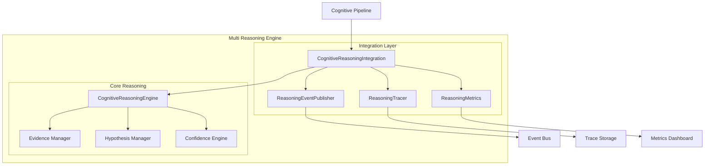

# PR-050 — Multi Reasoning Engine

## Overview

PR-050 implements the integration layer between the Cognitive Reasoning Engine and the Cognitive Pipeline, providing multi-strategy reasoning capabilities with event publishing, metrics collection, and tracing.

## Architecture



## Reasoning Strategies

The integration supports multiple reasoning strategies:

| Strategy | Description | Use Case |
|----------|-------------|----------|
| `focused` | Focused reasoning on key evidence | Quick decisions |
| `exhaustive` | Comprehensive reasoning | Critical decisions |
| `hypothesis_first` | Start with hypothesis generation | Exploratory analysis |
| `evidence_first` | Start with evidence collection | Data-driven reasoning |

## Components

### Reasoning Event Publisher

Publishes events for all reasoning operations:

| Event | Description | Data |
|-------|-------------|------|
| `REASONING_STARTED` | Reasoning session began | `strategy`, `session_id` |
| `REASONING_COMPLETED` | Reasoning session finished | `confidence`, `hypothesis_count` |
| `REASONING_FAILED` | Reasoning session failed | `error` |
| `EVIDENCE_COLLECTED` | Evidence was collected | `evidence_count` |
| `HYPOTHESIS_GENERATED` | Hypothesis was generated | `hypothesis_id` |
| `HYPOTHESIS_EVALUATED` | Hypothesis was evaluated | `confidence` |
| `DECISION_MADE` | Decision was made | `decision_id`, `confidence` |
| `CONFIDENCE_CALCULATED` | Confidence was calculated | `confidence_level` |
| `EXPLANATION_GENERATED` | Explanation was generated | `explanation` |

### Reasoning Tracer

Provides detailed tracing:

- Session-level tracing
- Evidence tracking
- Hypothesis tracking
- Stage completion tracking
- Duration calculation

### Reasoning Metrics

Collects comprehensive metrics:

```python
@dataclass
class ReasoningMetrics:
    total_reasoning_sessions: int
    successful_sessions: int
    failed_sessions: int
    total_evidence_collected: int
    total_hypotheses_generated: int
    total_decisions_made: int
    average_confidence: float
    average_reasoning_duration_ms: float
    strategy_usage: dict[str, int]
```

## Usage

```python
from core.reasoning.cognitive_reasoning_integration import (
    create_cognitive_reasoning_integration,
)

# Create integrated reasoning system
integration = create_cognitive_reasoning_integration()

# Subscribe to events
def on_reasoning_event(event):
    print(f"{event.event_type}: {event.session_id}")

integration.publisher.subscribe(on_reasoning_event)

# Perform reasoning (with instrumentation)
result = integration.reason(
    question="What is the diagnosis?",
    evidence=[
        {"type": "symptom", "content": "fever"},
        {"type": "lab", "content": "elevated WBC"},
    ],
    strategy="focused",
    session_id="session-123",
    correlation_id="corr-456",
)

if result["success"]:
    print(f"Conclusion: {result['conclusion']}")
    print(f"Confidence: {result['confidence']}")
    print(f"Duration: {result['duration_ms']}ms")
else:
    print(f"Error: {result['error']}")

# Generate explanation
explanation = integration.generate_explanation(
    conclusion=result["conclusion"],
    reasoning_chain=result["justification"],
)
```

## Integration with Cognitive Pipeline

The integration layer connects reasoning with the cognitive pipeline:

```python
from core.pipeline import create_cognitive_pipeline
from core.reasoning.cognitive_reasoning_integration import create_cognitive_reasoning_integration

# Create shared components
reasoning = create_cognitive_reasoning_integration()

# Reasoning events flow into the pipeline's event system
reasoning.publisher.subscribe(pipeline.handle_reasoning_event)

# Pipeline stages can access reasoning
pipeline = create_cognitive_pipeline(
    reasoning_integration=reasoning,
)
```

## Files Created

```
core/reasoning/
└── cognitive_reasoning_integration.py
    ├── ReasoningEventType (enum)
    ├── ReasoningEvent (dataclass)
    ├── ReasoningEventPublisher (class)
    ├── ReasoningMetrics (dataclass)
    ├── ReasoningTrace (dataclass)
    ├── ReasoningTracer (class)
    └── CognitiveReasoningIntegration (class)
```

## Tests

Tests are located in `tests/unit/core/reasoning/test_cognitive_reasoning_integration.py`.

Run tests:
```bash
pytest tests/unit/core/reasoning/test_cognitive_reasoning_integration.py -v
```

## Metrics Dashboard

The integration exposes metrics for monitoring:

```json
{
  "metrics": {
    "total_reasoning_sessions": 150,
    "successful_sessions": 145,
    "failed_sessions": 5,
    "total_evidence_collected": 890,
    "total_hypotheses_generated": 320,
    "total_decisions_made": 145,
    "average_confidence": 0.82,
    "average_reasoning_duration_ms": 45.3,
    "strategy_usage": {
      "focused": 100,
      "exhaustive": 30,
      "hypothesis_first": 15,
      "evidence_first": 5
    }
  },
  "traces": 150
}
```

## Future Enhancements

- [ ] Strategy auto-selection based on context
- [ ] Parallel hypothesis evaluation
- [ ] Reasoning pattern learning
- [ ] Conflict resolution strategies
- [ ] Multi-modal reasoning support
