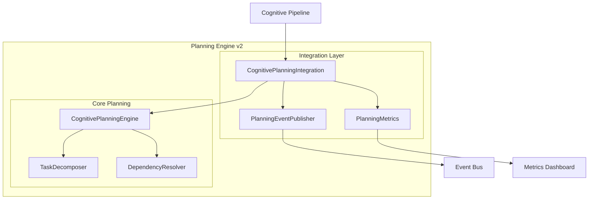

# PR-051 — Planning Engine v2

## Overview

PR-051 implements the integration layer between the Planning Engine and the Cognitive Pipeline, providing event publishing and metrics collection for planning operations.

## Architecture



## Events

| Event | Description | Data |
|-------|-------------|------|
| `PLANNING_STARTED` | Planning session began | `session_id`, `goal` |
| `PLANNING_COMPLETED` | Planning session finished | `plan_id`, `task_count` |
| `PLANNING_FAILED` | Planning session failed | `error` |
| `GOAL_DECOMPOSED` | Goal was decomposed | `goal`, `sub_goals` |
| `TASK_CREATED` | Task was created | `task_id` |
| `TASK_SCHEDULED` | Task was scheduled | `task_id`, `start_time` |
| `TASK_COMPLETED` | Task was completed | `task_id` |
| `TASK_FAILED` | Task failed | `task_id`, `error` |
| `DEPENDENCY_RESOLVED` | Dependency resolved | `task_id`, `depends_on` |

## Metrics

```python
@dataclass
class PlanningMetrics:
    total_plans_created: int
    successful_plans: int
    failed_plans: int
    total_tasks_created: int
    total_tasks_completed: int
    total_tasks_failed: int
    average_plan_duration_ms: float
    average_tasks_per_plan: float
```

## Usage

```python
from core.planning.cognitive_planning_integration import (
    create_cognitive_planning_integration,
)

# Create integrated planning system
integration = create_cognitive_planning_integration()

# Subscribe to events
integration.publisher.subscribe(lambda e: print(f"{e.event_type}: {e.session_id}"))

# Create plan
result = integration.create_plan(
    goal="Complete patient assessment",
    constraints={"deadline": "2024-01-01"},
    session_id="session-123",
)

if result["success"]:
    plan = result["plan"]
    print(f"Created plan with {len(plan['tasks'])} tasks")
```

## Tests

5 passing tests covering event publishing and metrics.

## Files

```
core/planning/
└── cognitive_planning_integration.py
    ├── PlanningEventType (enum)
    ├── PlanningEvent (dataclass)
    ├── PlanningEventPublisher (class)
    ├── PlanningMetrics (dataclass)
    └── CognitivePlanningIntegration (class)
```
