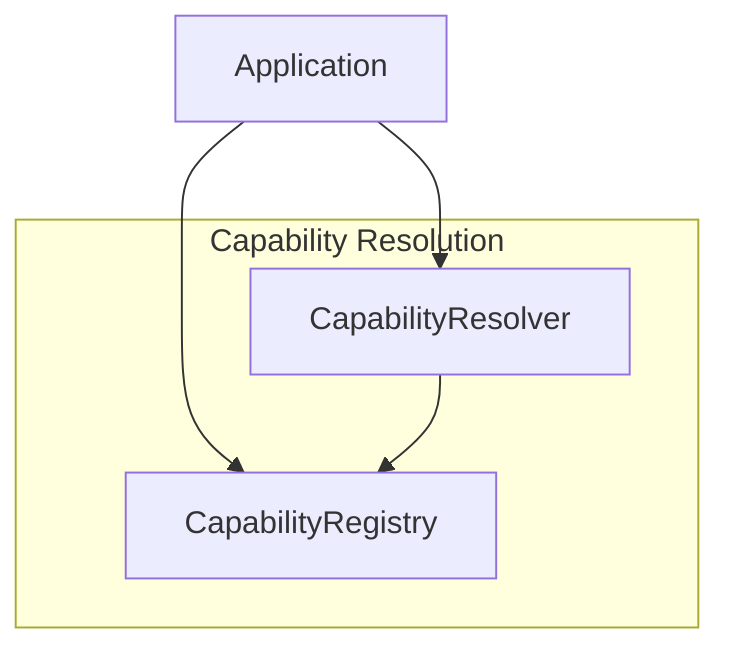

# PR-052 — Capability Resolution

## Overview

PR-052 implements a capability resolution system for EREN OS, enabling dynamic registration, discovery, and execution of capabilities.

## Architecture



## Components

### CapabilityRegistry

- Register/unregister capabilities
- Resolve capabilities by ID
- Find capabilities by tag/name
- Event publishing for all operations

### CapabilityResolver

- Resolve and execute capabilities
- Context passing
- Error handling

## Usage

```python
from core.capabilities import CapabilityRegistry, CapabilityResolver

# Create registry
registry = CapabilityRegistry()

# Register capability
registry.register(Capability(
    id="diagnose",
    name="Medical Diagnosis",
    handler=lambda ctx: diagnose(ctx["symptoms"]),
    tags=("medical", "diagnosis"),
))

# Resolve and execute
resolver = CapabilityResolver(registry)
result = resolver.resolve_and_execute(
    "diagnose",
    context={"symptoms": ["fever", "cough"]},
)
```

## Events

- `capability_registered`
- `capability_resolved`
- `capability_unregistered`
- `capability_executed`
- `capability_failed`

## Tests

7 passing tests.

## Files

```
core/capabilities/
└── cognitive_capabilities_integration.py
```
