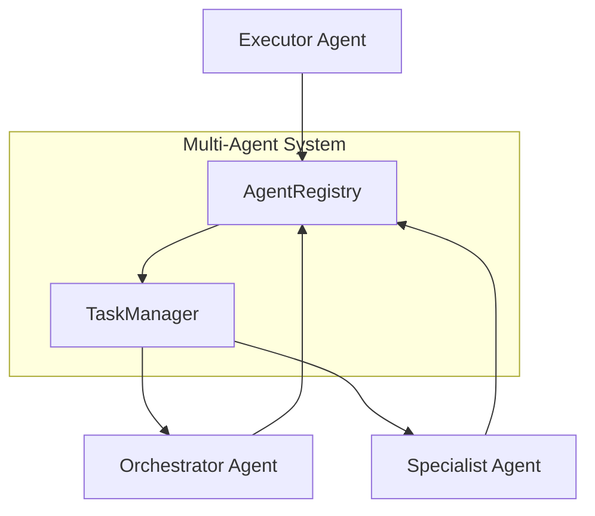

# PR-053 — Multi-Agent Collaboration

## Overview

PR-053 implements multi-agent collaboration capabilities for EREN OS, enabling multiple agents to work together on tasks.

## Architecture



## Agent Types

- **Orchestrator**: Coordinates other agents
- **Planner**: Creates execution plans
- **Executor**: Executes tasks
- **Monitor**: Observes and reports
- **Specialist**: Domain-specific capabilities

## Components

### AgentRegistry

- Register/unregister agents
- Find agents by type or capability
- Event publishing

### TaskManager

- Create tasks
- Assign to agents
- Execute and track task lifecycle

## Usage

```python
from core.agents import AgentRegistry, TaskManager, Agent, AgentType

# Create registry
registry = AgentRegistry()

# Register agents
registry.register(Agent(
    id="diagnostician",
    name="Medical Diagnostician",
    agent_type=AgentType.SPECIALIST,
    capabilities=("diagnosis",),
    handler=lambda ctx: diagnose(ctx["symptoms"]),
))

# Create and execute tasks
manager = TaskManager(registry)
task = manager.create_task("Diagnose patient", "diagnostician")
result = manager.execute_task(task.id, {"symptoms": ["fever"]})
```

## Events

- `agent_registered`
- `agent_unregistered`
- `task_assigned`
- `task_completed`
- `task_failed`
- `message_sent`
- `message_received`
- `collaboration_started`
- `collaboration_ended`

## Tests

8 passing tests.

## Files

```
core/agents/
└── cognitive_agent_integration.py
```
