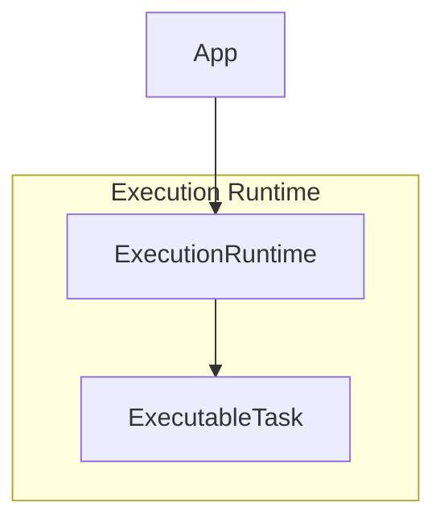

# PR-054 — Execution Runtime

## Overview

PR-054 implements an execution runtime for EREN OS, providing task execution, retry logic, and event publishing.

## Architecture



## Components

### ExecutionRuntime

- Register tasks
- Execute with timeout
- Retry logic
- Cancel tasks
- Event publishing

### ExecutableTask

- Task definition
- Handler function
- Arguments
- Timeout
- Retry configuration

## Usage

```python
from core.execution import ExecutionRuntime, ExecutableTask

# Create runtime
runtime = ExecutionRuntime()

# Register task
runtime.register_task(ExecutableTask(
    id="diagnose",
    name="Diagnosis Task",
    handler=lambda symptoms: diagnose(symptoms),
    timeout_seconds=30.0,
    max_retries=3,
))

# Execute
result = runtime.execute_task("diagnose")
```

## Events

- `task_started`
- `task_completed`
- `task_failed`
- `task_cancelled`
- `task_retry`

## Tests

7 passing tests.

## Files

```
core/execution/
└── cognitive_execution_integration.py
```
