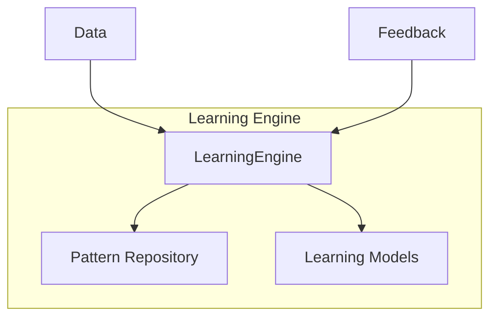

# PR-055 — Learning Engine

## Overview

PR-055 implements a learning engine for EREN OS, providing pattern detection, model updates, and feedback-based learning.

## Architecture



## Components

### LearningEngine

- Learn from data
- Detect patterns
- Update models
- Predict based on patterns
- Receive feedback

### Pattern

- Identified pattern
- Confidence score
- Occurrence count

### LearningModel

- Model parameters
- Version tracking
- Metadata

## Usage

```python
from core.learning import LearningEngine

# Create learning engine
engine = LearningEngine()

# Learn from data
result = engine.learn({
    "pattern": "diagnosis_pattern",
    "description": "Common diagnostic sequence",
})

# Predict
prediction = engine.predict({"symptoms": [...]})

# Receive feedback
engine.receive_feedback(pattern_id="...", feedback=0.9)
```

## Events

- `learning_started`
- `learning_completed`
- `learning_failed`
- `pattern_detected`
- `pattern_learned`
- `model_updated`
- `feedback_received`

## Tests

10 passing tests.

## Files

```
core/learning/
└── cognitive_learning_integration.py
```
