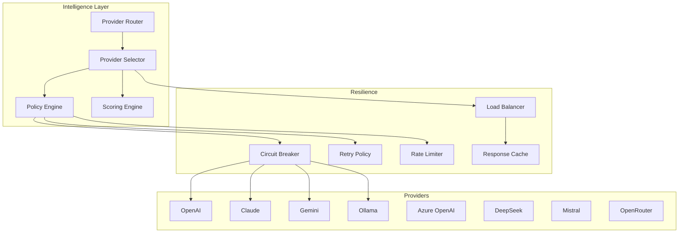

# PR-056 — Multi-LLM Intelligence Layer

## Overview

PR-056 implements the official multi-provider abstraction layer for EREN OS, enabling seamless integration with multiple LLM providers while maintaining resilience and optimal performance.

## Philosophy

> "EREN never assumes it's connected to a specific provider. EREN demonstrates it through resilience patterns."

EREN operates through contracts, not concrete implementations. The Intelligence Layer ensures:
- **Provider Independence**: No hard coupling to any LLM provider
- **Automatic Resilience**: Circuit breakers, retries, rate limiting
- **Optimal Selection**: Intelligent routing based on task requirements
- **Observability**: Comprehensive telemetry and metrics

## Architecture



## Components

### Provider Contracts

```python
class BaseProvider(ABC):
    @property
    def provider_id(self) -> str: ...
    
    @property
    def provider_type(self) -> ProviderType: ...
    
    def initialize(self, config: ProviderConfig) -> None: ...
    
    async def generate(self, request: GenerationRequest) -> GenerationResponse: ...
    
    def shutdown(self) -> None: ...
```

### Provider Types

| Type | Provider | Description |
|------|----------|-------------|
| `OPENAI` | OpenAI GPT | GPT-4, GPT-3.5 models |
| `CLAUDE` | Anthropic Claude | Claude 3 family |
| `GEMINI` | Google Gemini | Gemini Pro, Ultra |
| `OLLAMA` | Ollama | Local models |
| `AZURE_OPENAI` | Azure OpenAI | Enterprise OpenAI |
| `CUSTOM` | DeepSeek/Mistral | Other providers |

### Resilience Patterns

#### Circuit Breaker

```python
circuit = CircuitBreaker(
    name="openai-gpt4",
    config=CircuitBreakerConfig(
        failure_threshold=5,
        success_threshold=3,
        timeout_seconds=60,
    )
)

if circuit.allow_request():
    response = await provider.generate(request)
    circuit.record_success()
else:
    # Fallback to other provider
    pass
```

**States:**
- `CLOSED`: Normal operation, requests flow through
- `OPEN`: Too many failures, requests blocked
- `HALF_OPEN`: Testing recovery, limited requests allowed

#### Retry Policy

```python
policy = RetryPolicy(
    max_attempts=3,
    initial_delay_seconds=1.0,
    strategy=RetryStrategy.EXPONENTIAL,
    retryable_errors=("timeout", "rate_limit", "server_error"),
)

for attempt in range(policy.max_attempts):
    try:
        return await provider.generate(request)
    except Exception as e:
        if not policy.should_retry(attempt, e):
            raise
        await asyncio.sleep(policy.get_delay(attempt))
```

#### Rate Limiter

```python
limiter = TokenBucketRateLimiter(
    config=RateLimitConfig(
        requests_per_minute=60,
        requests_per_second=10,
        burst_size=20,
    )
)

if limiter.acquire(blocking=True, timeout=30.0):
    await provider.generate(request)
```

#### Load Balancer

```python
lb = LoadBalancer(LoadBalancingStrategy.WEIGHTED)

lb.register_provider("gpt4", weight=1.0)
lb.register_provider("claude3", weight=2.0)

selected = lb.select_provider(["gpt4", "claude3"])
```

**Strategies:**
- `ROUND_ROBIN`: Cyclic distribution
- `LEAST_LOADED`: Fewest active requests
- `WEIGHTED`: Random weighted by capacity
- `RANDOM`: Pure random selection
- `PRIORITY`: Configured priority order

#### Response Cache

```python
cache = SimpleCache(
    config=CacheConfig(
        max_size=1000,
        ttl_seconds=3600,
    )
)

# Check cache
cached = cache.get("request_hash")
if cached:
    return cached

# Cache response
cache.set("request_hash", response, ttl=3600)
```

### Streaming Support

```python
handler = CollectingStreamHandler()

await provider.generate_stream(request, handler)

for chunk in handler.stream():
    print(chunk.content, end="", flush=True)
```

### Telemetry

```python
telemetry = manager.get_telemetry()
# {
#     "providers": {...},
#     "load_balancer": {...},
#     "cache": {...},
#     "config": {...},
# }
```

## Usage Examples

### Basic Usage

```python
from core.providers import (
    EnhancedProviderManager,
    OpenAIMockProvider,
    ClaudeMockProvider,
)

manager = EnhancedProviderManager()

# Add providers
manager.add_provider(
    OpenAIMockProvider(model="gpt-4"),
    weight=1.0,
)
manager.add_provider(
    ClaudeMockProvider(model="claude-3"),
    weight=2.0,
)

# Generate with automatic selection
response = await manager.generate(
    GenerationRequest(prompt="Hello, how are you?")
)
```

### With Specific Provider

```python
response = await manager.generate(
    GenerationRequest(prompt="..."),
    provider_id="claude-3",
)
```

### With Fallback

```python
response = await manager.generate_with_fallback(
    GenerationRequest(prompt="..."),
    preferred_providers=["claude-3", "gpt-4"],
)
```

### Streaming

```python
handler = await manager.generate_stream(
    GenerationRequest(prompt="Tell me a story...", stream=True),
)

for chunk in handler.stream():
    print(chunk.content, end="", flush=True)
```

## Tests

73 tests covering:
- Circuit Breaker states and transitions
- Retry Policy exponential and fixed delays
- Token Bucket Rate Limiter
- Load Balancer strategies
- Cache eviction and TTL
- Provider selection and failover
- Streaming handlers

## Files

```
core/providers/
├── __init__.py
├── exceptions.py
├── manager.py
├── provider.py
├── registry.py
├── selector.py
├── resilience.py          # NEW: CircuitBreaker, Retry, RateLimiter, LoadBalancer, Cache
├── streaming.py           # NEW: Stream handlers
├── enhanced_manager.py   # NEW: Enhanced manager with resilience
├── mock_provider.py      # NEW: Mock providers for testing
└── types.py
```

## Metrics Tracked

| Metric | Description |
|--------|-------------|
| `total_requests` | Total requests made |
| `successful_requests` | Successful completions |
| `failed_requests` | Failed requests |
| `total_input_tokens` | Input tokens consumed |
| `total_output_tokens` | Output tokens generated |
| `total_duration_ms` | Total request duration |
| `total_cost` | Estimated cost |
| `retry_count` | Number of retries |
| `failover_count` | Failover occurrences |

## Events Published

- `circuit_state_change`: Circuit breaker state transitions
- `cache_hit`: Cache hit events
- `provider_error`: Provider error events
- `response_generated`: Successful response events
- `fallback_triggered`: Fallback activation events

## Next Steps

This layer provides the foundation for:
- **PR-057**: Intelligent Embedding Platform using the same resilience patterns
- **PR-058**: Enterprise Hybrid RAG Platform leveraging the multi-provider architecture
- **PR-059**: Universal Tool Calling Engine with provider-agnostic execution

## References

- [Circuit Breaker Pattern](https://docs.microsoft.com/en-us/aspnet/core/performance/caching/overview)
- [Token Bucket Rate Limiting](https://en.wikipedia.org/wiki/Token_bucket)
- [Load Balancing Algorithms](https://en.wikipedia.org/wiki/Load_balancing_(computing))
