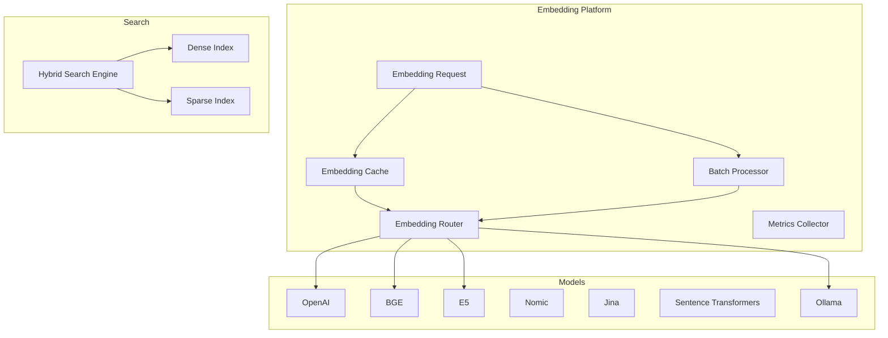

# PR-057 — Intelligent Embedding Platform

## Overview

PR-057 implements an intelligent embedding platform for EREN OS, enabling seamless integration with multiple embedding models while providing caching, batching, and hybrid search capabilities.

## Philosophy

> "Embeddings are the foundation of semantic search. EREN makes them intelligent."

## Architecture



## Components

### Embedding Cache

```python
cache = EmbeddingCache(
    config=EmbeddingCacheConfig(
        max_size=10000,
        ttl_seconds=86400,
        enable_deduplication=True,
    )
)

# Get from cache
vector = cache.get("text", "model")

# Store in cache
cache.set("text", "model", vector)
```

### Batch Processing

```python
processor = BatchProcessor(
    config=BatchProcessingConfig(
        batch_size=32,
        enable_deduplication=True,
    )
)

# Create batches
batches = processor.create_batches(texts)

# Deduplicate
unique_texts, indices = processor.deduplicate(texts)
```

### Embedding Normalizer

```python
# L2 normalize
normalized = EmbeddingNormalizer.normalize(vector)

# Calculate similarity
similarity = EmbeddingNormalizer.cosine_similarity(a, b)

# Truncate/pad
truncated = EmbeddingNormalizer.truncate(vector, max_dims)
padded = EmbeddingNormalizer.pad(vector, target_dims)
```

### Version Manager

```python
manager = EmbeddingVersionManager()

# Register version
manager.register_version("model1", EmbeddingVersion(
    version="1.0",
    model="model1",
    dimensions=768,
))

# Get latest
latest = manager.get_latest_version("model1")

# Deprecate
manager.deprecate_version("model1", "0.9")
```

### Hybrid Search

```python
engine = HybridSearchEngine()

# Index documents
engine.index("machine learning", vector)

# Search
results = engine.search(HybridQuery(
    dense_text="AI",
    sparse_keywords=["machine", "learning"],
    dense_weight=0.7,
    sparse_weight=0.3,
    top_k=10,
))
```

## Supported Models

| Model Type | Provider | Dimensions |
|------------|----------|------------|
| `openai` | OpenAI text-embedding-ada-002 | 1536 |
| `bge` | BGE embeddings | 768/1024 |
| `e5` | E5 embeddings | 768/1024 |
| `nomic` | Nomic embeddings | 768 |
| `jina` | Jina embeddings | 768/1024 |
| `sentence_transformers` | Sentence Transformers | Variable |
| `ollama` | Ollama local | Variable |

## Usage Examples

### Basic Usage

```python
from core.embeddings.enhanced_embeddings import (
    EmbeddingCache,
    BatchProcessor,
    EmbeddingNormalizer,
)

# Create cache
cache = EmbeddingCache()

# Check cache first
vector = cache.get("hello world", "openai")
if vector is None:
    # Generate and cache
    vector = generate_embedding("hello world", "openai")
    cache.set("hello world", "openai", vector)
```

### Batch Processing

```python
processor = BatchProcessor(BatchProcessingConfig(batch_size=64))

# Deduplicate
unique_texts, indices = processor.deduplicate(texts)

# Create batches
batches = processor.create_batches(unique_texts)

for batch in batches:
    embeddings = await generate_batch_embeddings(batch)
```

### Hybrid Search

```python
engine = HybridSearchEngine()

# Index corpus
for doc in corpus:
    embedding = cache.get(doc, "bge") or generate_embedding(doc, "bge")
    engine.index(doc, embedding)

# Query
results = engine.search(HybridQuery(
    dense_text=query,
    sparse_keywords=extract_keywords(query),
))
```

## Metrics

| Metric | Description |
|--------|-------------|
| `total_requests` | Total embedding requests |
| `total_tokens` | Total tokens processed |
| `cache_hits` | Cache hit count |
| `cache_misses` | Cache miss count |
| `cache_hit_rate` | Hit rate percentage |
| `average_latency_ms` | Average request latency |

## Tests

21 tests covering:
- Cache set/get/eviction
- Batch creation and deduplication
- Vector normalization
- Cosine similarity
- Version management
- Hybrid search

## Files

```
core/embeddings/
├── __init__.py
├── enhanced_embeddings.py    # NEW: Advanced embedding platform
├── ...
```

## Integration with PR-056

The Embedding Platform uses the same resilience patterns from PR-056:
- Circuit breaker for provider failures
- Retry policies for transient errors
- Rate limiting per provider
- Load balancing across providers
- Response caching

## Next Steps

This platform enables:
- **PR-058**: Enterprise Hybrid RAG Platform using intelligent embeddings
- **PR-059**: Universal Tool Calling Engine with semantic understanding
