# EREN OS System Overview

**Fecha:** 2026-07-14  
**Versión:** 1.0

---

## 1. ARQUITECTURA GENERAL

### 1.1 Diagrama de Componentes

```mermaid
flowchart TB
    subgraph APPS["Aplicaciones"]
        API[API]
        WEB[Web]
        DESKTOP[Desktop]
    end
    
    subgraph SDK["SDK Layer"]
        CAPABILITY[Capability SDK]
    end
    
    subgraph ORCH["Orchestrator"]
        ORCH_ENGINE[Orchestrator Engine]
        ORCH_CONTRACTS[Orchestration Contracts]
    end
    
    subgraph PLATFORMS["Platforms"]
        MEMORY[Memory]
        REASONING[Reasoning]
        PLANNING[Planning]
        WORKFLOWS[Workflows]
        KNOWLEDGE[Knowledge]
        DIAGNOSTICS[Diagnostics]
        AGENTS[Agents]
        TOOLS[Tools]
    end
    
    subgraph ENGINES["Engines"]
        RETRIEVAL[Retrieval]
        DECISION[Decision]
        EXECUTION[Execution]
        EMBEDDINGS[Embeddings]
    end
    
    subgraph INFRA["Infrastructure"]
        CONTAINER[Container]
        EVENTS[Event Bus]
        COMPOSITION[Composition Root]
        BOOT[Boot Manager]
        RUNTIME[Runtime]
        LIFECYCLE[Lifecycle]
    end
    
    subgraph CONTRACTS["Contracts"]
        BASE[Base Contracts]
    end
    
    APPS --> SDK
    SDK --> ORCH
    ORCH --> PLATFORMS
    PLATFORMS --> ENGINES
    PLATFORMS --> INFRA
    ENGINES --> INFRA
    INFRA --> CONTRACTS
```

---

## 2. CICLO COGNITIVO

### 2.1 Diagrama del Ciclo

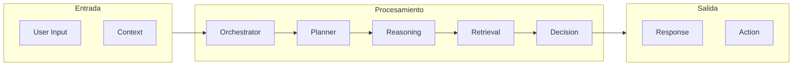

---

## 3. ARQUITECTURA DE CAPAS

### 3.1 Diagrama de Capas

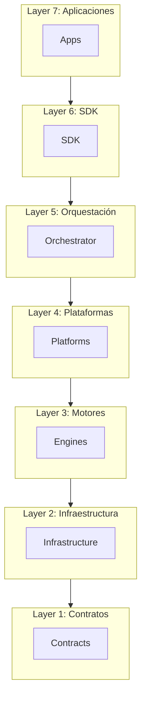

---

## 4. EVENT BUS

### 4.1 Diagrama de Eventos

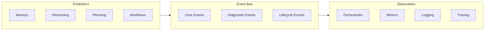

---

## 5. DEPENDENCY INJECTION

### 5.1 Diagrama del Container

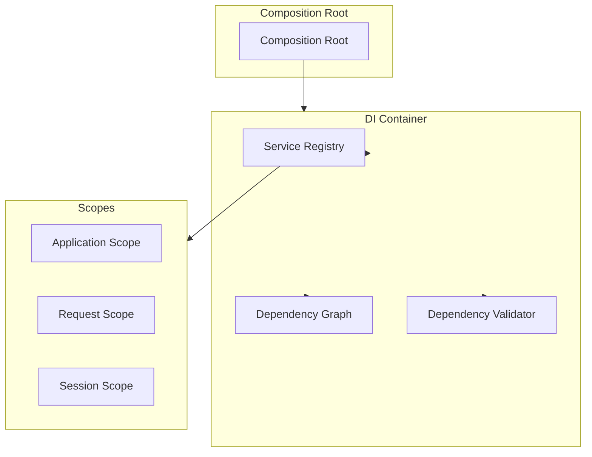

---

## 6. PLATAFORMAS

### 6.1 Cognitive Memory Platform

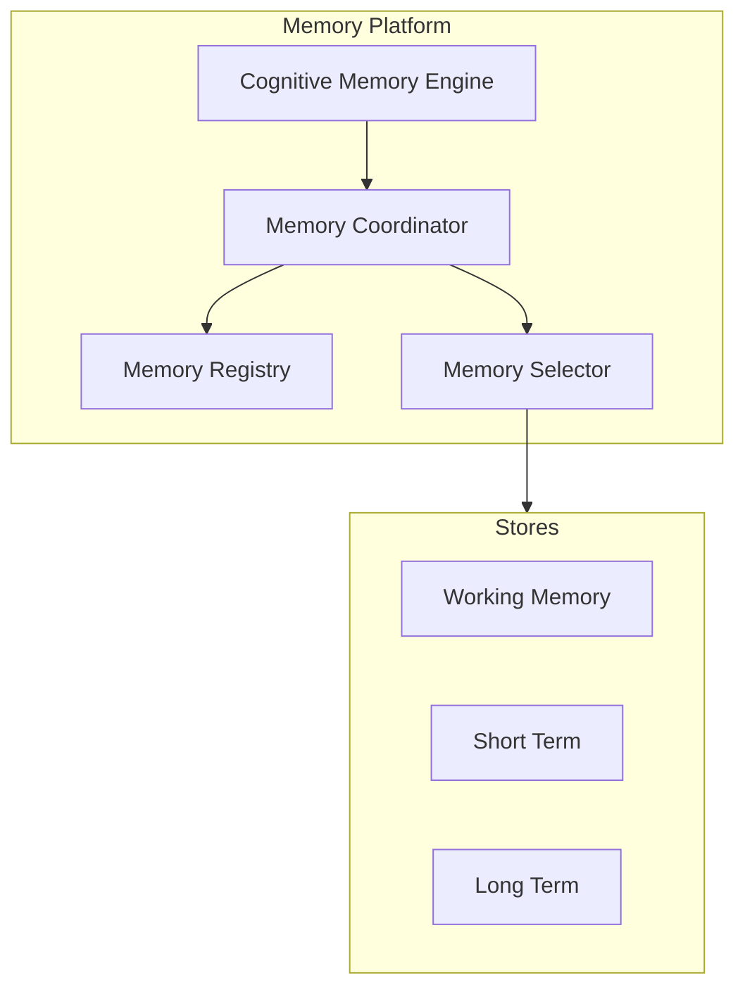

### 6.2 Cognitive Reasoning Platform

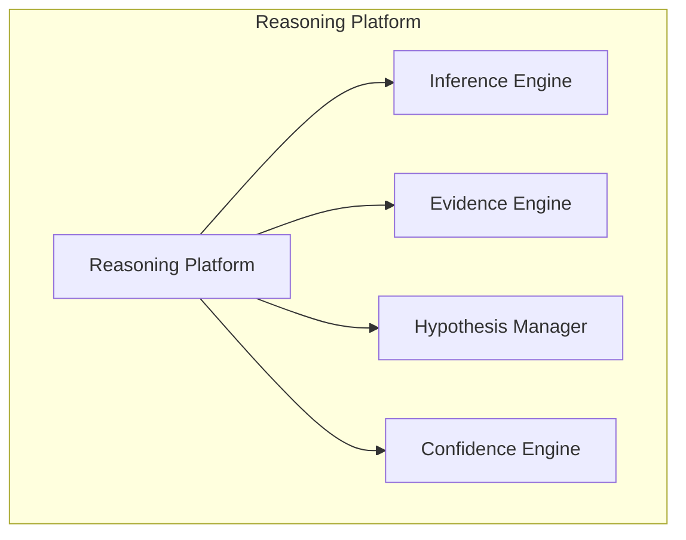

---

## 7. WORKFLOW PLATFORM

### 7.1 Arquitectura de Workflows

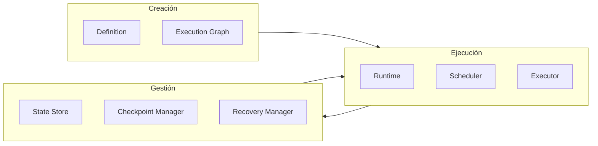

---

## 8. AGENT RUNTIME

### 8.1 Arquitectura de Agentes

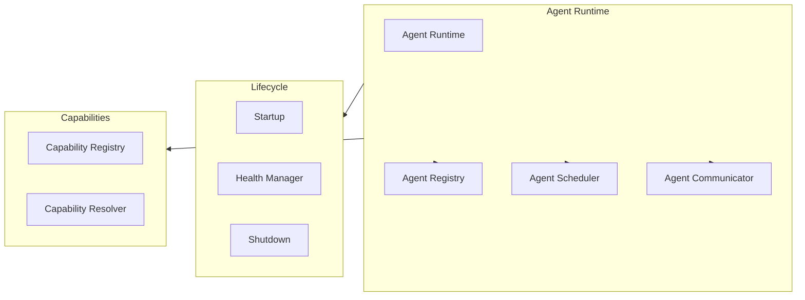

---

## 9. PROVIDER LAYER

### 9.1 Multi-Provider Architecture

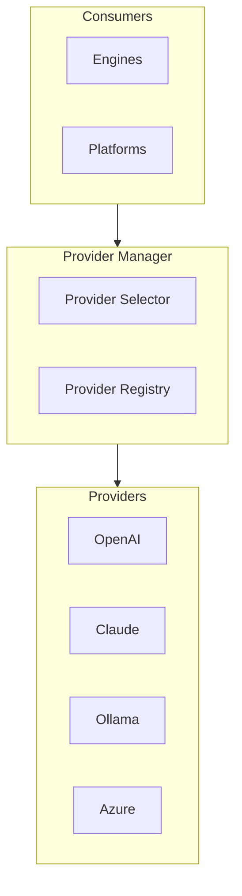

---

## 10. BOOT SEQUENCE

### 10.1 Diagrama de Boot

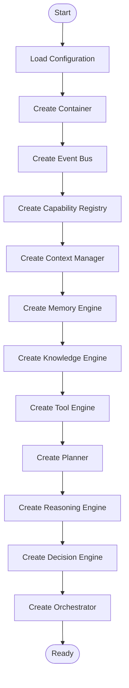

---

## 11. ESTADÍSTICAS

| Métrica | Valor |
|---------|-------|
| Módulos | 41 |
| Plataformas | 9 |
| Motores | 6 |
| Contratos | 9 |
| Líneas de código | ~107,000 |
| Archivos Python | 459 |

---

*Generado por Architecture Review Board*
