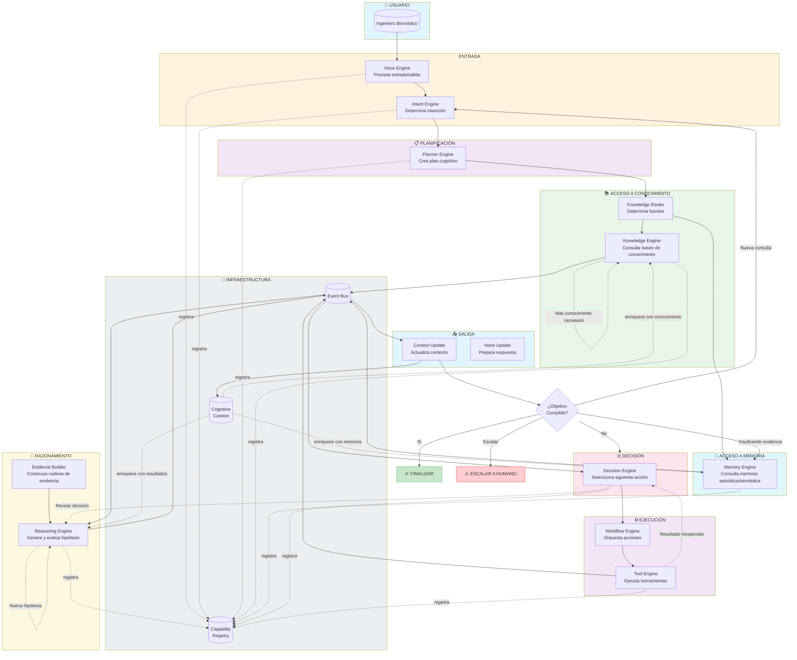
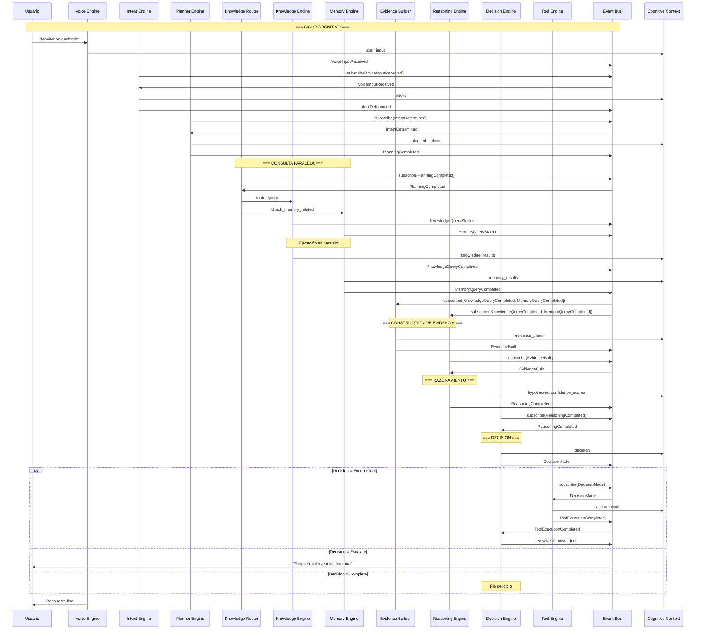
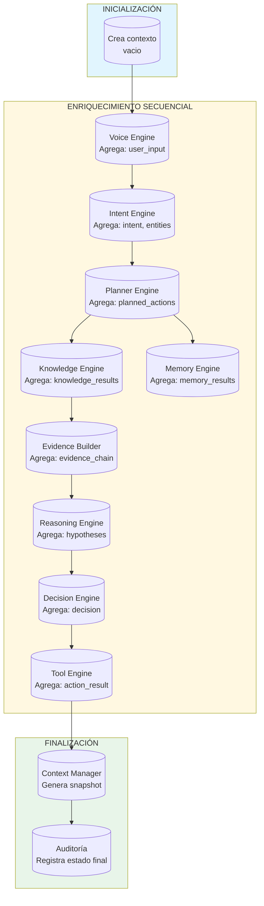
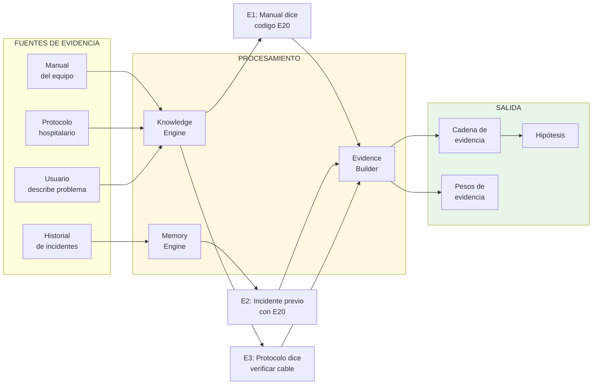
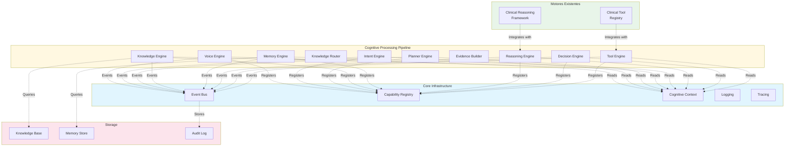

# Cognitive Processing Pipeline de EREN

## Arquitectura Oficial del Sistema Operativo Cognitivo

---

**Versión:** 1.0.0  
**Fecha:** 2026-07-13  
**Estado:** Arquitectura Aprobada  
**Propiedad:** Arquitectura Cognitiva de EREN  
**Clasificación:** Arquitectura Empresarial  

---

## Historial de Versiones

| Versión | Fecha | Autor | Cambios |
|---------|-------|-------|---------|
| 1.0.0 | 2026-07-13 | Arquitectura EREN | Version inicial |

---

## Resumen Ejecutivo

Este documento define la arquitectura oficial del **Cognitive Processing Pipeline** (CPP) de EREN, el Sistema Operativo Cognitivo para Ingeniería Clínica.

El CPP es el cerebro de EREN: el flujo orquestado que transforma una intención del usuario en una acción ejecutada, pasando por múltiples motores cognitivos especializados, cada uno con responsabilidades claramente definidas y completamente desacoplados.

**Principios Fundamentales:**

- Un solo contexto compartido entre todos los motores
- Comunicación exclusivamente mediante eventos
- Capacidades registradas en lugar de llamadas directas
- Separación absoluta de responsabilidades
- Razonamiento, decisiones y acciones completamente desacoplados

**Este documento es la referencia oficial.** Todo futuro desarrollo debe respetar este pipeline. Ningún motor puede saltarse el flujo definido.

---

## Tabla de Contenidos

1. [Introducción](#1-introduccion)
2. [Filosofía](#2-filosofia)
3. [Pipeline Completo](#3-pipeline-completo)
4. [Responsabilidad de Cada Motor](#4-responsabilidad-de-cada-motor)
5. [Contratos Entre Motores](#5-contratos-entre-motores)
6. [Flujo del Cognitive Context](#6-flujo-del-cognitive-context)
7. [Flujo de Evidencias](#7-flujo-de-evidencias)
8. [Ciclos Cognitivos](#8-ciclos-cognitivos)
9. [Gestión de Incertidumbre](#9-gestion-de-incertidumbre)
10. [Gestión de Errores](#10-gestion-de-errores)
11. [Observabilidad](#11-observabilidad)
12. [Escalabilidad](#12-escalabilidad)
13. [Integración con Componentes Existentes](#13-integracion-con-componentes-existentes)
14. [Reglas Arquitectónicas](#14-reglas-arquitectonicas)
15. [Roadmap](#15-roadmap)

---

# 1. Introduccion

## 1.1 Qué es el Cognitive Processing Pipeline

El **Cognitive Processing Pipeline** (CPP) es la arquitectura que define cómo EREN procesa solicitudes cognitivas desde que recibe una intención hasta que completa un ciclo cognitivo. Es el equivalente al córtex cerebral en un cerebro biológico: procesa información, razona, decide y actúa.

El CPP no es un motor. Es una **arquitectura de orquestación** que coordina múltiples motores especializados, cada uno responsable de una función cognitiva específica.

```
┌─────────────────────────────────────────────────────────────────────────────┐
│                    COGNITIVE PROCESSING PIPELINE                            │
├─────────────────────────────────────────────────────────────────────────────┤
│                                                                             │
│   USUARIO ───► VOICE ───► INTENT ───► PLANNER ───► ... ───► FINALIZAR    │
│                                                                             │
│   Cada etapa está controlada por un motor especializado.                   │
│   Ningún motor puede saltarse el flujo definido.                           │
│   Toda comunicación es mediante eventos.                                   │
│                                                                             │
└─────────────────────────────────────────────────────────────────────────────┘
```

## 1.2 Por Qué Todos los Motores Deben Seguir Este Flujo

La obligatoriedad del pipeline existe por tres razones fundamentales:

**1. Consistencia Predictible:** Cuando todos los motores siguen el mismo flujo, el comportamiento del sistema es predecible y auditable. Un ingeniero biomédico puede confiar en que cada solicitud pasará por las mismas validaciones y controles.

**2. Trazabilidad Completa:** El seguimiento del pipeline permite auditar exactamente qué decisiones tomó EREN, con qué evidencia, y en qué orden. En ingeniería clínica, esta trazabilidad es crítica para cumplimiento regulatorio.

**3. Desacoplamiento Real:** La separación entre motores solo funciona si todos respetan el mismo protocolo de comunicación. Saltarse el pipeline introduce acoplamiento que rompe la arquitectura.

## 1.3Ningún Motor Puede Saltarse el Pipeline

Esta es una **regla arquitectónica inquebrantable**:

```
╔═══════════════════════════════════════════════════════════════════════════╗
║                          REGLA CRÍTICA                                    ║
║                                                                           ║
║   NINGÚN MOTOR PUEDE SALTARSE EL PIPELINE                                ║
║                                                                           ║
║   • Voice Engine SIEMPRE procesa primero                                  ║
║   • Intent Engine SIEMPRE determina intención                             ║
║   • Planner Engine SIEMPRE crea un plan                                   ║
║   • Knowledge Engine SIEMPRE consulta conocimiento                        ║
║   • Memory Engine SIEMPRE consulta memoria                                 ║
║   • Reasoning Engine SIEMPRE razona                                       ║
║   • Decision Engine SIEMPRE decide                                        ║
║   • Tool Engine SIEMPRE ejecuta vía registro                              ║
║                                                                           ║
║   EXCEPCIONES: Solo mediante configuración explícita de pipeline.        ║
║                                                                           ║
╚═══════════════════════════════════════════════════════════════════════════╝
```

---

# 2. Filosofia

## 2.1 Principios Arquitectónicos

La filosofía del CPP se basa en ocho principios fundamentales que guían todas las decisiones de diseño:

### 2.1.1 Un Solo Contexto Compartido

Existe exactamente **un** Cognitive Context que es modificado por todos los motores durante el procesamiento. Este contexto es el único estado compartido del sistema.

```
┌──────────────────────────────────────────────────────────────┐
│                    COGNITIVE CONTEXT                         │
├──────────────────────────────────────────────────────────────┤
│                                                              │
│   user_input: "Monitor Philips no enciende"                  │
│   intent: "TROUBLESHOOT_DEVICE"                             │
│   device_info: {type: "monitor", brand: "Philips"}          │
│   hypotheses: [...]                                          │
│   evidence: [...]                                           │
│   decisions: [...]                                           │
│   knowledge_results: [...]                                   │
│   memory_results: [...]                                      │
│   action_results: [...]                                      │
│   response: ""                                               │
│                                                              │
│   ┌──────────────────────────────────────────────────────┐  │
│   │              MOTOR 1    MOTOR 2    MOTOR 3           │  │
│   │                 │           │           │             │  │
│   │                 ▼           ▼           ▼             │  │
│   │              ┌─────────────────────────┐              │  │
│   │              │   UNICO CONTEXTO        │              │  │
│   │              │   COMPARTIDO           │              │  │
│   │              └─────────────────────────┘              │  │
│   └──────────────────────────────────────────────────────┘  │
│                                                              │
└──────────────────────────────────────────────────────────────┘
```

**Implicación:** Cada motor lee del contexto, enriquece el contexto, pero nunca destruye información existente de otro motor.

### 2.1.2 Comunicacion Mediante Eventos

La comunicación entre motores **exclusivamente** mediante el Event Bus. No existen llamadas directas entre motores.

```
╔═════════════════════════════════════════════════════════════════════════════╗
║                                                                             ║
║                           ANTES (INCORRECTO)                                ║
║   ┌─────────┐         ┌─────────┐         ┌─────────┐                      ║
║   │ Planner │ ───────►│Knowledge│ ───────►│Reasoning│                      ║
║   │  Engine │  llama  │  Engine │  llama   │  Engine │                      ║
║   └─────────┘         └─────────┘         └─────────┘                      ║
║                                                                             ║
║   Problema: ACOPLAMIENTO DIRECTO                                             ║
║   - Planner conoce a Knowledge                                               ║
║   - Knowledge conoce a Reasoning                                             ║
║   - Imposible modificar un motor sin afectar otros                          ║
║                                                                             ║
╠═════════════════════════════════════════════════════════════════════════════╣
║                                                                             ║
║                           DESPUES (CORRECTO)                                ║
║   ┌─────────┐                              ┌─────────┐                      ║
║   │ Planner │ ──publish──►  ┌────────┐  ┌──│Knowledge│                      ║
║   │  Engine │               │ EVENT  │  │  │  Engine │                      ║
║   └─────────┘               │  BUS   │  │  └─────────┘                      ║
║                            │        │  │                                   ║
║   ┌─────────┐               │        │  │  ┌─────────┐                      ║
║   │Reasoning│◄──subscribe──┐└────────┘  └──│Knowledge │                      ║
║   │  Engine │              │             │  │QueryDone │                      ║
║   └─────────┘              └─────────────┘  └─────────┘                      ║
║                                                                             ║
║   Beneficio: DESACOPLAMIENTO COMPLETO                                       ║
║   - Motores no se conocen entre sí                                          ║
║   - Event Bus es el único punto de contacto                                 ║
║   - Puedo añadir/eliminar motores sin afectar otros                       ║
║                                                                             ║
╚═════════════════════════════════════════════════════════════════════════════╝
```

### 2.1.3 Capacidades en Lugar de Llamadas Directas

Los motores exponen **capacidades** (Capabilities) que son descubiertas y utilizadas mediante el Capability Registry. Un motor nunca llama directamente a otro; en su lugar, solicita una capacidad.

```
┌─────────────────────────────────────────────────────────────────────────┐
│                    CAPABILITY REGISTRY                                   │
├─────────────────────────────────────────────────────────────────────────┤
│                                                                          │
│   capacidad: "knowledge.retrieve"                                        │
│       ├── Motor: Knowledge Engine                                       │
│       ├── Version: 1.0.0                                                │
│       ├── Parametros: {query_type, filters}                             │
│       └── Resultado: KnowledgeResults                                    │
│                                                                          │
│   capacidad: "reasoning.analyze"                                         │
│       ├── Motor: Reasoning Engine                                        │
│       ├── Version: 1.0.0                                                │
│       ├── Parametros: {hypotheses, evidence}                             │
│       └── Resultado: AnalysisResult                                     │
│                                                                          │
│   capacidad: "tool.execute"                                             │
│       ├── Motor: Tool Engine                                             │
│       ├── Version: 1.0.0                                                │
│       ├── Parametros: {tool_id, parameters}                              │
│       └── Resultado: ToolResult                                         │
│                                                                          │
└─────────────────────────────────────────────────────────────────────────┘

┌─────────────────────────────────────────────────────────────────────────┐
│                                                                          │
│   MOTOR A necesita "reasoning.analyze"                                   │
│                                                                          │
│   1. Consulta Capability Registry                                        │
│   2. Registry responde: Capability disponible en Reasoning Engine        │
│   3. Motor A publica evento "ReasoningRequested"                         │
│   4. Reasoning Engine subscribe al evento                                │
│   5. Reasoning Engine ejecuta y publica "ReasoningCompleted"             │
│   6. Motor A recibe resultados via contexto compartido                  │
│                                                                          │
│   Motor A NUNCA llamó directamente a Reasoning Engine.                  │
│                                                                          │
└─────────────────────────────────────────────────────────────────────────┘
```

### 2.1.4 Separacion Absoluta de Responsabilidades

Cada motor tiene **exactamente una** responsabilidad. No existen motores que "hagan un poco de todo".

| Motor | Responsabilidad Unica |Nunca Debe |
|-------|----------------------|-----------|
| Voice Engine | Procesar entrada/salida de usuario | Llamar a otros motores directamente |
| Intent Engine | Determinar intención del usuario | Ejecutar acciones |
| Planner Engine | Crear plan de acción | Consultar conocimiento |
| Knowledge Engine | Gestionar fuentes de conocimiento | Tomar decisiones |
| Memory Engine | Gestionar memoria episódica/semántica | Modificar contexto directamente |
| Reasoning Engine | Generar y evaluar hipótesis | Ejecutar herramientas |
| Decision Engine | Seleccionar siguiente acción | Razonar |
| Tool Engine | Ejecutar herramientas registradas | Decidir qué ejecutar |

### 2.1.5 Razonamiento Desacoplado

El Reasoning Engine es **únicamente** responsable de razonar. No conoce quién lo llamó ni quién usará sus resultados.

```
┌─────────────────────────────────────────────────────────────────────────┐
│                      REASONING ENGINE                                    │
├─────────────────────────────────────────────────────────────────────────┤
│                                                                          │
│   ENTRADA (via contexto):                                               │
│   - hypotheses: [...]                                                   │
│   - evidence: [...]                                                      │
│   - device_info: {...}                                                   │
│                                                                          │
│   PROCESO INTERNO:                                                       │
│   1. Recibe señales de entrada                                          │
│   2. Construye cadenas de razonamiento                                   │
│   3. Evalúa confianza de hipótesis                                      │
│   4. Genera nuevas hipótesis                                             │
│   5. Calcula incertidumbre                                              │
│                                                                          │
│   SALIDA (via contexto):                                                │
│   - analyzed_hypotheses: [...]                                           │
│   - confidence_scores: {...}                                             │
│   - reasoning_trace: [...]                                               │
│                                                                          │
│   LO QUE NO CONOCE:                                                     │
│   ✗ Quién solicitó el razonamiento                                      │
│   ✗ Qué hará el Decision Engine con los resultados                      │
│   ✗ Qué herramientas están disponibles                                  │
│   ✗ Qué respondió el usuario                                            │
│                                                                          │
└─────────────────────────────────────────────────────────────────────────┘
```

### 2.1.6 Decisiones Desacopladas

El Decision Engine es **únicamente** responsable de decidir. No razona, no ejecuta, solo decide.

```
┌─────────────────────────────────────────────────────────────────────────┐
│                       DECISION ENGINE                                    │
├─────────────────────────────────────────────────────────────────────────┤
│                                                                          │
│   ENTRADA:                                                              │
│   - best_hypothesis_id: "hyp_123"                                      │
│   - hypothesis_confidence: 0.85                                         │
│   - available_actions: [...]                                            │
│   - risk_constraints: {...}                                             │
│                                                                          │
│   PROCESO:                                                              │
│   1. Recibe hipótesis del Reasoning Engine                              │
│   2. Genera candidatos de decisión                                      │
│   3. Evalúa riesgo de cada candidato                                    │
│   4. Aplica políticas de decisión                                       │
│   5. Selecciona mejor acción                                            │
│   6. Registra decisión en contexto                                      │
│                                                                          │
│   SALIDA:                                                               │
│   - decision: "EXECUTE_TOOL"                                            │
│   - decision_id: "dec_abc123"                                           │
│   - confidence: 0.90                                                    │
│   - risk_level: "MEDIUM"                                                │
│                                                                          │
│   LO QUE NO HACE:                                                       │
│   ✗ Genera hipótesis                                                    │
│   ✗ Ejecuta herramientas                                                │
│   ✗ Consulta conocimiento                                               │
│   ✗ Habla con el usuario                                                │
│                                                                          │
└─────────────────────────────────────────────────────────────────────────┘
```

### 2.1.7 Herramientas Desacopladas

El Tool Engine es **únicamente** un registro y ejecutor de herramientas. No decide qué ejecutar.

```
┌─────────────────────────────────────────────────────────────────────────┐
│                        TOOL ENGINE                                       │
├─────────────────────────────────────────────────────────────────────────┤
│                                                                          │
│   RESPONSABILIDAD:                                                       │
│   1. Registrar herramientas                                             │
│   2. Validar parámetros                                                  │
│   3. Ejecutar herramientas                                               │
│   4. Devolver resultados                                                  │
│   5. Manejar timeouts y errores                                          │
│                                                                          │
│   NUNCA DECIDE:                                                         │
│   ✗ Qué herramienta ejecutar                                             │
│   ✗ Cuándo ejecutar                                                     │
│   ✗ Con qué parámetros                                                  │
│                                                                          │
│   FLUJO:                                                                │
│                                                                          │
│   Decision Engine ──► "ExecuteToolRequested" ──► Tool Engine             │
│                          │                                               │
│                          │ (Tool Engine no decide, solo ejecuta)         │
│                          ▼                                               │
│                   ┌─────────────┐                                       │
│                   │  Ejecuta    │                                       │
│                   │  Herramienta│                                       │
│                   └─────────────┘                                       │
│                          │                                               │
│                          ▼                                               │
│   Decision Engine ◄── "ToolExecutionCompleted" ── Tool Engine           │
│                                                                          │
└─────────────────────────────────────────────────────────────────────────┘
```

---

# 3. Pipeline Completo

## 3.1 Diagrama General del Cognitive Processing Pipeline



## 3.2 Diagrama de Eventos del Pipeline



## 3.3 Flujo Detallado Paso a Paso

### Paso 1: Recepcion del Usuario

```
┌─────────────────────────────────────────────────────────────────────────┐
│                         PASO 1: RECEPCIÓN                               │
├─────────────────────────────────────────────────────────────────────────┤
│                                                                          │
│   USUARIO ──► Voice Engine                                               │
│                                                                          │
│   Voice Engine recibe:                                                   │
│   • Texto del usuario ("Monitor Philips IntelliVue no enciende")        │
│   • Metadatos de canal (Slack, API, Web)                                │
│   • Información de sesión                                               │
│                                                                          │
│   Voice Engine publica:                                                  │
│   • evento: VoiceInputReceived                                          │
│   • contexto: user_input actualizado                                     │
│                                                                          │
│   Voice Engine NUNCA:                                                   │
│   ✗ Interpreta el mensaje                                               │
│   ✗ Consulta conocimiento                                               │
│   ✗ Toma decisiones                                                     │
│                                                                          │
└─────────────────────────────────────────────────────────────────────────┘
```

### Paso 2: Determinacion de Intencion

```
┌─────────────────────────────────────────────────────────────────────────┐
│                      PASO 2: DETERMINACIÓN DE INTENCIÓN                 │
├─────────────────────────────────────────────────────────────────────────┤
│                                                                          │
│   Intent Engine (suscrito a VoiceInputReceived)                          │
│                                                                          │
│   Analiza:                                                              │
│   • Texto del usuario                                                   │
│   • Contexto de sesión                                                  │
│   • Historial de interacciones                                          │
│                                                                          │
│   Determina:                                                            │
│   • intent: "DEVICE_TROUBLESHOOTING"                                    │
│   • confidence: 0.95                                                     │
│   • entities: [{type: "device", value: "Philips IntelliVue"}]            │
│                                                                          │
│   Publica: IntentDetermined                                             │
│                                                                          │
└─────────────────────────────────────────────────────────────────────────┘
```

### Paso 3: Planificacion

```
┌─────────────────────────────────────────────────────────────────────────┐
│                       PASO 3: PLANIFICACIÓN                             │
├─────────────────────────────────────────────────────────────────────────┤
│                                                                          │
│   Planner Engine (suscrito a IntentDetermined)                           │
│                                                                          │
│   Crea plan cognitivo:                                                  │
│   1. Consultar manuales de Philips IntelliVue                           │
│   2. Revisar historial de mantenimiento                                │
│   3. Buscar alertas similares en memoria                                │
│   4. Identificar hipótesis de falla                                     │
│   5. Evaluar riesgo clínico                                            │
│   6. Determinar acción de resolución                                    │
│                                                                          │
│   Plan registrado en contexto:                                          │
│   • planned_actions: [...]                                               │
│   • estimated_duration: 30s                                             │
│   • phases: [KNOWLEDGE, MEMORY, REASONING, DECISION]                   │
│                                                                          │
└─────────────────────────────────────────────────────────────────────────┘
```

### Pasos 4-5: Consulta de Conocimiento y Memoria (En Paralelo)

```
┌─────────────────────────────────────────────────────────────────────────┐
│                   PASOS 4-5: CONSULTA PARALELA                         │
├─────────────────────────────────────────────────────────────────────────┤
│                                                                          │
│   Knowledge Engine              Memory Engine                            │
│   ─────────────────             ───────────────                         │
│   • Manual Philips IntelliVue   • Historial del equipo                  │
│   • Protocolos de inicio        • Incidentes previos                    │
│   • Códigos de error           • Soluciones aplicadas                   │
│   • Especificaciones técnicas  • Patrones de falla                       │
│                                                                          │
│   Ambos publican eventos de completion                                  │
│   Context se enriquece con resultados                                   │
│                                                                          │
└─────────────────────────────────────────────────────────────────────────┘
```

### Paso 6: Construccion de Evidencia

```
┌─────────────────────────────────────────────────────────────────────────┐
│                   PASO 6: CONSTRUCCIÓN DE EVIDENCIA                    │
├─────────────────────────────────────────────────────────────────────────┤
│                                                                          │
│   Evidence Builder (suscrito a KNOWLEDGE + MEMORY completados)          │
│                                                                          │
│   Construye cadena de evidencia:                                        │
│                                                                          │
│   E1 ──► E2 ──► E3 ──► ... ──► Hipotesis                              │
│   │       │       │                   │                                │
│   ├──(manual)──(historial)──(patron)──► CONFIAZA: 0.85               │
│                                                                          │
│   Evidencia:                                                            │
│   • Fuente: manual Philips                                               │
│   • Tipo: technical_documentation                                       │
│   • Contenido: "Código E20 indica falla de alimentación"               │
│   • Confianza: 0.95                                                     │
│   • Relacionada con: hipotesis_falla_alimentacion                       │
│                                                                          │
└─────────────────────────────────────────────────────────────────────────┘
```

### Paso 7: Razonamiento

```
┌─────────────────────────────────────────────────────────────────────────┐
│                         PASO 7: RAZONAMIENTO                            │
├─────────────────────────────────────────────────────────────────────────┤
│                                                                          │
│   Reasoning Engine (suscrito a EvidenceBuilt)                           │
│                                                                          │
│   Genera hipótesis:                                                      │
│                                                                          │
│   Hipotesis 1: "Falla de alimentación"                                  │
│     • Confianza: 0.85                                                   │
│     • Evidencia: E1, E2, E3                                            │
│     • Probabilidad: 0.40                                                │
│                                                                          │
│   Hipotesis 2: "Falla de pantalla"                                      │
│     • Confianza: 0.45                                                   │
│     • Evidencia: E4, E5                                                │
│     • Probabilidad: 0.25                                                │
│                                                                          │
│   Hipotesis 3: "Cable desconectado"                                      │
│     • Confianza: 0.60                                                   │
│     • Evidencia: E2                                                    │
│     • Probabilidad: 0.35                                                │
│                                                                          │
│   Ranking por confianza: H1 > H3 > H2                                   │
│                                                                          │
└─────────────────────────────────────────────────────────────────────────┘
```

### Paso 8: Decision

```
┌─────────────────────────────────────────────────────────────────────────┐
│                           PASO 8: DECISIÓN                              │
├─────────────────────────────────────────────────────────────────────────┤
│                                                                          │
│   Decision Engine (suscrito a ReasoningCompleted)                        │
│                                                                          │
│   Candidatos de decisión:                                                │
│                                                                          │
│   C1: CONTINUE_ANALYSIS                                                │
│       • Confianza: 0.85                                                  │
│       • Riesgo: LOW                                                      │
│       • Score: 0.82                                                      │
│                                                                          │
│   C2: EXECUTE_TOOL (verificar_cableado)                                  │
│       • Confianza: 0.60                                                  │
│       • Riesgo: MEDIUM                                                   │
│       • Score: 0.55                                                      │
│                                                                          │
│   C3: ESCALATE_TO_HUMAN                                                 │
│       • Confianza: 0.30                                                  │
│       • Riesgo: LOW                                                      │
│       • Score: 0.30                                                      │
│                                                                          │
│   DECISION SELECCIONADA: C1 (Mayor score)                               │
│                                                                          │
└─────────────────────────────────────────────────────────────────────────┘
```

### Pasos 9-10: Ejecucion y Verificacion

```
┌─────────────────────────────────────────────────────────────────────────┐
│                    PASOS 9-10: EJECUCIÓN Y VERIFICACIÓN                │
├─────────────────────────────────────────────────────────────────────────┤
│                                                                          │
│   Tool Engine ejecuta: verificar_cableado                               │
│                                                                          │
│   Resultado: "Cable de alimentación desconectado"                        │
│                                                                          │
│   Se reconecta cable                                                     │
│                                                                          │
│   Decision Engine recibe resultado                                       │
│   Nueva evaluación de hipótesis                                          │
│                                                                          │
│   Hipotesis 1: CONFIRMADA (evidencia directa)                          │
│   Resolución: Monitor funciona                                            │
│                                                                          │
│   Decision Engine genera: COMPLETE                                      │
│                                                                          │
└─────────────────────────────────────────────────────────────────────────┘
```

### Paso 11: Respuesta y Finalizacion

```
┌─────────────────────────────────────────────────────────────────────────┐
│                    PASO 11: RESPUESTA Y FINALIZACIÓN                    │
├─────────────────────────────────────────────────────────────────────────┤
│                                                                          │
│   Voice Engine prepara respuesta:                                        │
│                                                                          │
│   "El monitor Philips IntelliVue no encendía porque el cable de        │
│    alimentación estaba desconectado. He reconectado el cable y el        │
│    dispositivo funciona correctamente.                                     │
│                                                                          │
│    Código de error E20 indica falla de alimentación según el manual      │
│    del fabricante. Se recomienda verificar las conexiones antes de      │
│    contactar soporte técnico.                                             │
│                                                                          │
│   Registro de auditoría generado.                                        │
│                                                                          │
└─────────────────────────────────────────────────────────────────────────┘
```

---

# 4. Responsabilidad de Cada Motor

## 4.1 Tabla Maestra de Motores

| Motor | Responsabilidad | Entrada | Salida | Eventos Publicados | Eventos Consumidos | Capacidades |
|-------|----------------|---------|--------|---------------------|-------------------|-------------|
| **Voice Engine** | Procesar entrada/salida de usuario | Mensaje del usuario | user_input, response | VoiceInputReceived, VoiceOutputSent | CycleStarted, FinalizeRequested | voice.listen, voice.speak, voice.format |
| **Intent Engine** | Determinar intención del usuario | VoiceInputReceived, user_input | intent, entities, intent_confidence | IntentDetermined | VoiceInputReceived | intent.classify, intent.extract_entities |
| **Planner Engine** | Crear plan cognitivo | IntentDetermined, context | planned_actions, phases, estimated_duration | PlanningCompleted | IntentDetermined | planner.create_plan, planner.validate |
| **Knowledge Router** | Determinar fuentes de conocimiento | PlanningCompleted, intent | source_types, query_plan | KnowledgeQueryStarted, KnowledgeQueryRouted | PlanningCompleted | knowledge.route, knowledge.plan_query |
| **Knowledge Engine** | Consultar fuentes de conocimiento | KnowledgeQueryRouted, source_types | knowledge_results, evidence | KnowledgeQueryCompleted, EvidenceFound | KnowledgeQueryStarted, KnowledgeQueryRouted | knowledge.retrieve, knowledge.search, knowledge.verify |
| **Memory Engine** | Consultar memoria episódica/semántica | PlanningCompleted, device_info | memory_results, past_incidents | MemoryQueryCompleted, MemoryPatternFound | MemoryQueryStarted | memory.retrieve, memory.search, memory.store |
| **Evidence Builder** | Construir cadena de evidencia | KnowledgeQueryCompleted, MemoryQueryCompleted | evidence_chain, evidence_weights | EvidenceBuilt, EvidenceUpdated | KnowledgeQueryCompleted, MemoryQueryCompleted | evidence.build, evidence.weight, evidence.link |
| **Reasoning Engine** | Generar y evaluar hipótesis | EvidenceBuilt, evidence_chain | hypotheses, confidence_scores, reasoning_trace | ReasoningCompleted, HypothesisGenerated | EvidenceBuilt, NewEvidenceAvailable | reasoning.analyze, reasoning.hypothesize, reasoning.evaluate |
| **Decision Engine** | Seleccionar siguiente acción | ReasoningCompleted, hypotheses | decision, decision_confidence, execution_plan | DecisionMade, DecisionEscalated | ReasoningCompleted, ToolExecutionCompleted | decision.evaluate, decision.select, decision.escalate |
| **Workflow Engine** | Orquestar acciones compuestas | DecisionMade, decision | workflow_id, action_sequence | WorkflowStarted, WorkflowCompleted | DecisionMade | workflow.create, workflow.execute, workflow.pause |
| **Tool Engine** | Ejecutar herramientas registradas | WorkflowStarted, tool_request | action_result, execution_status | ToolExecutionCompleted, ToolFailed | WorkflowStarted, DecisionMade | tool.execute, tool.register, tool.validate |
| **Context Manager** | Gestionar contexto compartido | Cualquier evento | context_update | ContextUpdated, ContextEnriched | * (todos) | context.read, context.write, context.lock |

## 4.2 Descripcion Detallada de Cada Motor

### Voice Engine

```
╔═══════════════════════════════════════════════════════════════════════════╗
║                           VOICE ENGINE                                     ║
╠═══════════════════════════════════════════════════════════════════════════╣
║                                                                           ║
║  RESPONSABILIDAD:                                                         ║
║  Procesar toda comunicación con el usuario (entrada y salida)             ║
║                                                                           ║
║  ENTRADA:                                                                 ║
║  • Mensaje de usuario (texto)                                             ║
║  • Metadatos de canal (Slack, API, Web)                                    ║
║  • Información de sesión                                                  ║
║                                                                           ║
║  SALIDA:                                                                  ║
║  • user_input: Texto normalizado                                          ║
║  • response: Respuesta formateada                                          ║
║  • response_type: "text", "markdown", "json"                             ║
║                                                                           ║
║  EVENTOS PUBLICADOS:                                                      ║
║  • VoiceInputReceived                                                     ║
║  • VoiceOutputSent                                                        ║
║                                                                           ║
║  EVENTOS CONSUMIDOS:                                                      ║
║  • CycleStarted (para iniciar ciclo)                                      ║
║  • FinalizeRequested (para generar respuesta final)                       ║
║                                                                           ║
║  CAPACIDADES:                                                             ║
║  • voice.listen: Procesar entrada del usuario                             ║
║  • voice.speak: Generar respuesta al usuario                             ║
║  • voice.format: Formatear respuestas según canal                       ║
║                                                                           ║
║  CONTRATOS:                                                              ║
║  • CognitiveEngine                                                        ║
║  • prepare(): Validar sesión                                               ║
║  • execute(): Procesar mensaje                                          ║
║  • cleanup(): Cerrar sesión                                               ║
║                                                                           ║
║  NUNCA DEBE:                                                             ║
║  ✗ Interpretar intención                                                 ║
║  ✗ Consultar conocimiento                                                ║
║  ✗ Tomar decisiones                                                      ║
║  ✗ Ejecutar herramientas                                                 ║
║                                                                           ║
╚═══════════════════════════════════════════════════════════════════════════╝
```

### Intent Engine

```
╔═══════════════════════════════════════════════════════════════════════════╗
║                           INTENT ENGINE                                 ║
╠═══════════════════════════════════════════════════════════════════════════╣
║                                                                           ║
║  RESPONSABILIDAD:                                                         ║
║  Determinar qué quiere el usuario (intención)                             ║
║                                                                           ║
║  ENTRADA:                                                                 ║
║  • user_input: Texto del usuario                                           ║
║  • session_history: Historial de la sesión                                 ║
║  • user_profile: Perfil del usuario                                        ║
║                                                                           ║
║  SALIDA:                                                                  ║
║  • intent: "DEVICE_TROUBLESHOOTING"                                       ║
║  • entities: [{type: "device", value: "Philips"}, {type: "brand", ...}] ║
║  • intent_confidence: 0.95                                                ║
║  • intent_type: Tipos predefinidos                                        ║
║                                                                           ║
║  INTENTOS SOPORTADOS:                                                     ║
║  • DEVICE_TROUBLESHOOTING                                                ║
║  • DEVICE_MAINTENANCE                                                     ║
║  • DEVICE_CALIBRATION                                                     ║
║  • SAFETY_ALERT                                                           ║
║  • COMPLIANCE_QUERY                                                       ║
║  • TECHNICAL_SPECIFICATION                                                ║
║  • HISTORICAL_INCIDENT                                                    ║
║  • PROTOCOL_LOOKUP                                                        ║
║                                                                           ║
║  EVENTOS PUBLICADOS:                                                      ║
║  • IntentDetermined                                                       ║
║                                                                           ║
║  EVENTOS CONSUMIDOS:                                                      ║
║  • VoiceInputReceived                                                     ║
║                                                                           ║
║  NUNCA DEBE:                                                             ║
║  ✗ Consultar conocimiento                                               ║
║  ✗ Generar respuestas                                                    ║
║  ✗ Ejecutar herramientas                                                 ║
║                                                                           ║
╚═══════════════════════════════════════════════════════════════════════════╝
```

### Knowledge Engine

```
╔═══════════════════════════════════════════════════════════════════════════╗
║                          KNOWLEDGE ENGINE                                 ║
╠═══════════════════════════════════════════════════════════════════════════╣
║                                                                           ║
║  RESPONSABILIDAD:                                                         ║
║  Gestionar acceso a todas las fuentes de conocimiento                      ║
║                                                                           ║
║  TIPOS DE FUENTES:                                                        ║
║  • CLINICAL_DATABASE: Registros clínicos                                   ║
║  • EQUIPMENT_MANUALS: Manuales de equipos                                 ║
║  • HOSPITAL_PROTOCOLS: Protocolos hospitalarios                           ║
║  • TECHNICAL_DOCUMENTATION: Documentación técnica                         ║
║  • SCIENTIFIC_LITERATURE: Literatura científica                           ║
║  • REGULATORY_STANDARDS: Normativas (FDA, IEC, ISO)                       ║
║  • KNOWLEDGE_BASE: Base de conocimiento estructurada                      ║
║  • PROCEDURES: Procedimientos estándar                                     ║
║                                                                           ║
║  SALIDA:                                                                  ║
║  • knowledge_results: [{source, content, relevance, confidence}]         ║
║  • evidence: [{evidence_id, source, type, content, weight}]            ║
║                                                                           ║
║  EVENTOS PUBLICADOS:                                                      ║
║  • KnowledgeQueryStarted                                                  ║
║  • KnowledgeQueryCompleted                                                ║
║  • EvidenceFound                                                         ║
║                                                                           ║
║  EVENTOS CONSUMIDOS:                                                      ║
║  • KnowledgeQueryStarted (por router)                                    ║
║  • KnowledgeQueryRouted                                                  ║
║                                                                           ║
║  NUNCA DEBE:                                                             ║
║  ✗ Decidir qué hacer con el conocimiento                                  ║
║  ✗ Generar hipótesis                                                     ║
║  ✗ Ejecutar herramientas                                                 ║
║                                                                           ║
╚═══════════════════════════════════════════════════════════════════════════╝
```

### Memory Engine

```
╔═══════════════════════════════════════════════════════════════════════════╗
║                           MEMORY ENGINE                                   ║
╠═══════════════════════════════════════════════════════════════════════════╣
║                                                                           ║
║  RESPONSABILIDAD:                                                         ║
║  Gestionar memoria episódica y semántica del sistema                      ║
║                                                                           ║
║  TIPOS DE MEMORIA:                                                        ║
║  • EPISODIC: Incidentes pasados, conversaciones previas                   ║
║  • SEMANTIC: Conocimiento general, hechos aprendidos                       ║
║  • PROCEDURAL: Cómo hacer cosas, procedimientos                          ║
║  • WORKING: Contexto del ciclo actual                                     ║
║                                                                           ║
║  SALIDA:                                                                  ║
║  • memory_results: [{type, content, relevance, timestamp}]               ║
║  • past_incidents: [{incident_id, description, resolution}]              ║
║  • patterns: [{pattern, frequency, last_occurrence}]                    ║
║                                                                           ║
║  EVENTOS PUBLICADOS:                                                      ║
║  • MemoryQueryStarted                                                    ║
║  • MemoryQueryCompleted                                                  ║
║  • MemoryPatternFound                                                    ║
║                                                                           ║
║  EVENTOS CONSUMIDOS:                                                      ║
║  • PlanningCompleted                                                     ║
║  • CycleCompleted (para almacenar en memoria)                             ║
║                                                                           ║
║  NUNCA DEBE:                                                             ║
║  ✗ Modificar contexto directamente                                        ║
║  ✗ Decidir qué almacenar                                                 ║
║  ✗ Consultar fuentes de conocimiento                                     ║
║                                                                           ║
╚═══════════════════════════════════════════════════════════════════════════╝
```

### Reasoning Engine

```
╔═══════════════════════════════════════════════════════════════════════════╗
║                          REASONING ENGINE                                 ║
╠═══════════════════════════════════════════════════════════════════════════╣
║                                                                           ║
║  RESPONSABILIDAD:                                                         ║
║  Generar y evaluar hipótesis basadas en evidencia                         ║
║                                                                           ║
║  MODELOS DE RAZONAMIENTO:                                                 ║
║  • BAYESIAN: Probabilidades condicionales                                 ║
║  • DEMPSTER_SHAFER: Evidencia不确定性                                     ║
║  • FUZZY: Lógica difusa                                                   ║
║  • RULE_BASED: Reglas heurísticas                                         ║
║                                                                           ║
║  SALIDA:                                                                  ║
║  • hypotheses: [{id, description, probability, confidence}]             ║
║  • confidence_scores: {hypothesis_id: score}                              ║
║  • reasoning_trace: [{step, evidence, conclusion}]                      ║
║  • uncertainty_level: "HIGH", "MEDIUM", "LOW"                          ║
║                                                                           ║
║  EVENTOS PUBLICADOS:                                                      ║
║  • ReasoningCompleted                                                     ║
║  • HypothesisGenerated                                                    ║
║  • ReasoningFailed                                                        ║
║                                                                           ║
║  EVENTOS CONSUMIDOS:                                                      ║
║  • EvidenceBuilt                                                          ║
║  • NewEvidenceAvailable                                                   ║
║                                                                           ║
║  NUNCA DEBE:                                                             ║
║  ✗ Ejecutar herramientas                                                 ║
║  ✗ Decidir qué hacer                                                    ║
║  ✗ Consultar conocimiento directamente                                    ║
║                                                                           ║
╚═══════════════════════════════════════════════════════════════════════════╝
```

### Decision Engine

```
╔═══════════════════════════════════════════════════════════════════════════╗
║                          DECISION ENGINE                                  ║
╠═══════════════════════════════════════════════════════════════════════════╣
║                                                                           ║
║  RESPONSABILIDAD:                                                         ║
║  Seleccionar la siguiente acción basada en hipótesis                      ║
║                                                                           ║
║  TIPOS DE DECISION:                                                       ║
║  • CONTINUE_ANALYSIS: Continuar razonando                                 ║
║  • REQUEST_MORE_EVIDENCE: Solicitar más evidencia                        ║
║  • EXECUTE_TOOL: Ejecutar herramienta                                    ║
║  • CONSULT_KNOWLEDGE: Consultar base de conocimiento                     ║
║  • CONSULT_MEMORY: Consultar memoria                                      ║
║  • ESCALATE_TO_HUMAN: Escalar a humano                                   ║
║  • STOP_ANALYSIS: Detener análisis                                       ║
║  • CREATE_WORKFLOW: Crear flujo de trabajo                               ║
║  • WAIT_FOR_EVENT: Esperar evento                                        ║
║  • REJECT_HYPOTHESIS: Rechazar hipótesis                                  ║
║                                                                           ║
║  SALIDA:                                                                  ║
║  • decision: Tipo de decisión                                            ║
║  • decision_id: Identificador único                                       ║
║  • decision_confidence: 0.0-1.0                                          ║
║  • risk_level: "CRITICAL", "HIGH", "MEDIUM", "LOW"                      ║
║  • execution_plan: {action, parameters}                                  ║
║                                                                           ║
║  EVENTOS PUBLICADOS:                                                      ║
║  • DecisionMade                                                           ║
║  • DecisionEscalated                                                      ║
║  • DecisionRejected                                                       ║
║                                                                           ║
║  EVENTOS CONSUMIDOS:                                                      ║
║  • ReasoningCompleted                                                     ║
║  • ToolExecutionCompleted                                                 ║
║                                                                           ║
║  NUNCA DEBE:                                                             ║
║  ✗ Razonar sobre evidencia                                                ║
║  ✗ Ejecutar herramientas                                                 ║
║  ✗ Consultar conocimiento                                                ║
║                                                                           ║
╚═══════════════════════════════════════════════════════════════════════════╝
```

---

# 5. Contratos Entre Motores

## 5.1 Matriz de Transiciones de Eventos

```
╔═════════════════════════════════════════════════════════════════════════════╗
║                    CONTRATOS DE TRANSICIÓN                                  ║
╠═════════════════════════════════════════════════════════════════════════════╣
║                                                                             ║
║  TRANSICIÓN: VOICE ──► INTENT                                              ║
║  ══════════════════════════════════════════════════════════════════════   ║
║  Evento publicado: VoiceInputReceived                                     ║
║  Evento consumido: IntentDetermined (produces)                             ║
║                                                                             ║
║  DATOS COMPARTIDOS:                                                        ║
║  → user_input: Texto normalizado                                           ║
║  → session_id: Identificador de sesión                                     ║
║  → channel: Canal de comunicación                                          ║
║                                                                             ║
║  NUNCA COMPARTIR:                                                         ║
║  ✗ Respuesta final                                                        ║
║  ✗ Decisiones                                                             ║
║  ✗ Hipótesis                                                             ║
║                                                                             ║
║  ACCIONES DEL CONTRATO:                                                    ║
║  • Voice valida sesión                                                    ║
║  • Intent extrae intención                                                ║
║                                                                             ║
╠═════════════════════════════════════════════════════════════════════════════╣
║                                                                             ║
║  TRANSICIÓN: INTENT ──► PLANNER                                           ║
║  ══════════════════════════════════════════════════════════════════════   ║
║  Evento publicado: IntentDetermined                                         ║
║  Evento consumido: PlanningCompleted (produces)                             ║
║                                                                             ║
║  DATOS COMPARTIDOS:                                                        ║
║  → intent: Tipo de intención                                              ║
║  → entities: Entidades extraídas                                          ║
║  → intent_confidence: Confianza de intención                              ║
║                                                                             ║
║  NUNCA COMPARTIR:                                                         ║
║  ✗ Respuesta del usuario                                                  ║
║  ✗ Plan de ejecución                                                      ║
║                                                                             ║
╠═════════════════════════════════════════════════════════════════════════════╣
║                                                                             ║
║  TRANSICIÓN: PLANNER ──► KNOWLEDGE + MEMORY                               ║
║  ══════════════════════════════════════════════════════════════════════   ║
║  Evento publicado: PlanningCompleted                                        ║
║  Eventos consumidos: KnowledgeQueryStarted, MemoryQueryStarted              ║
║                                                                             ║
║  DATOS COMPARTIDOS:                                                        ║
║  → planned_actions: Acciones planeadas                                     ║
║  → phases: Fases del plan                                                 ║
║  → device_info: Información del dispositivo                                ║
║                                                                             ║
║  NOTA: Esta transición es PARALELA                                         ║
║  Knowledge y Memory se ejecutan simultáneamente                            ║
║                                                                             ║
╠═════════════════════════════════════════════════════════════════════════════╣
║                                                                             ║
║  TRANSICIÓN: KNOWLEDGE + MEMORY ──► EVIDENCE BUILDER                       ║
║  ══════════════════════════════════════════════════════════════════════   ║
║  Eventos publicados: KnowledgeQueryCompleted, MemoryQueryCompleted         ║
║  Evento consumido: EvidenceBuilt (produce)                                 ║
║                                                                             ║
║  DATOS COMPARTIDOS:                                                        ║
║  → knowledge_results: Resultados de consulta                               ║
║  → memory_results: Resultados de memoria                                   ║
║  → relevance_scores: Puntuación de relevancia                               ║
║                                                                             ║
║  NOTA: Evidence Builder espera AMBOS eventos                               ║
║                                                                             ║
╠═════════════════════════════════════════════════════════════════════════════╣
║                                                                             ║
║  TRANSICIÓN: EVIDENCE BUILDER ──► REASONING                               ║
║  ══════════════════════════════════════════════════════════════════════   ║
║  Evento publicado: EvidenceBuilt                                          ║
║  Evento consumido: ReasoningCompleted (produce)                            ║
║                                                                             ║
║  DATOS COMPARTIDOS:                                                        ║
║  → evidence_chain: Cadena de evidencia                                    ║
║  → evidence_weights: Pesos de evidencia                                    ║
║  → source_info: Información de fuentes                                    ║
║                                                                             ║
╠═════════════════════════════════════════════════════════════════════════════╣
║                                                                             ║
║  TRANSICIÓN: REASONING ──► DECISION                                        ║
║  ══════════════════════════════════════════════════════════════════════   ║
║  Evento publicado: ReasoningCompleted                                      ║
║  Evento consumido: DecisionMade (produce)                                   ║
║                                                                             ║
║  DATOS COMPARTIDOS:                                                        ║
║  → hypotheses: [{id, description, probability}]                           ║
║  → best_hypothesis_id: Hipótesis con mayor confianza                      ║
║  → hypothesis_confidence: Nivel de confianza                               ║
║  → uncertainty_level: Nivel de incertidumbre                               ║
║                                                                             ║
╠═════════════════════════════════════════════════════════════════════════════╣
║                                                                             ║
║  TRANSICIÓN: DECISION ──► TOOL / WORKFLOW                                 ║
║  ══════════════════════════════════════════════════════════════════════   ║
║  Evento publicado: DecisionMade                                            ║
║  Evento consumido: ToolExecutionCompleted / WorkflowCompleted              ║
║                                                                             ║
║  DATOS COMPARTIDOS:                                                        ║
║  → decision: Tipo de decisión                                             ║
║  → execution_plan: Plan de ejecución                                       ║
║  → risk_level: Nivel de riesgo                                            ║
║  → requires_approval: Si requiere aprobación humana                        ║
║                                                                             ║
╚═════════════════════════════════════════════════════════════════════════════╝
```

## 5.2 Eventos: Catalogo Completo

### Eventos de Entrada del Usuario

| Evento | Motor Publicador | Descripcion | Datos |
|--------|-----------------|-------------|-------|
| VoiceInputReceived | Voice Engine | Usuario envia mensaje | user_input, session_id, channel |
| CycleStarted | Orchestrator | Nuevo ciclo cognitivo inicia | cycle_id, trigger |
| SessionStarted | Voice Engine | Sesion de usuario inicia | session_id, user_id |

### Eventos de Intention

| Evento | Motor Publicador | Descripcion | Datos |
|--------|-----------------|-------------|-------|
| IntentDetermined | Intent Engine | Intencion del usuario determinada | intent, entities, confidence |
| IntentClassificationFailed | Intent Engine | No se pudo clasificar intencion | user_input, error |

### Eventos de Planificacion

| Evento | Motor Publicador | Descripcion | Datos |
|--------|-----------------|-------------|-------|
| PlanningCompleted | Planner Engine | Plan cognitivo creado | planned_actions, phases |
| PlanningFailed | Planner Engine | No se pudo crear plan | intent, error |

### Eventos de Conocimiento

| Evento | Motor Publicador | Descripcion | Datos |
|--------|-----------------|-------------|-------|
| KnowledgeQueryStarted | Knowledge Router | Inicio de consulta de conocimiento | query, source_types |
| KnowledgeQueryRouted | Knowledge Router | Fuentes determinadas | sources, query_plan |
| KnowledgeQueryCompleted | Knowledge Engine | Consulta completada | results, evidence |
| KnowledgeQueryFailed | Knowledge Engine | Consulta fallida | query, error |

### Eventos de Memoria

| Evento | Motor Publicador | Descripcion | Datos |
|--------|-----------------|-------------|-------|
| MemoryQueryStarted | Memory Engine | Inicio de consulta de memoria | query, memory_types |
| MemoryQueryCompleted | Memory Engine | Consulta completada | results, past_incidents |
| MemoryPatternFound | Memory Engine | Patron encontrado | pattern, frequency |
| MemoryQueryFailed | Memory Engine | Consulta fallida | query, error |

### Eventos de Evidencia

| Evento | Motor Publicador | Descripcion | Datos |
|--------|-----------------|-------------|-------|
| EvidenceBuilt | Evidence Builder | Cadena de evidencia construida | evidence_chain, weights |
| EvidenceUpdated | Evidence Builder | Evidencia actualizada | evidence_id, new_weight |

### Eventos de Razonamiento

| Evento | Motor Publicador | Descripcion | Datos |
|--------|-----------------|-------------|-------|
| ReasoningRequested | Decision Engine | Solicitud de razonamiento | context, question |
| ReasoningCompleted | Reasoning Engine | Razonamiento completado | hypotheses, confidence |
| HypothesisGenerated | Reasoning Engine | Nueva hipotesis generada | hypothesis, basis |
| ReasoningFailed | Reasoning Engine | Razonamiento fallido | context, error |

### Eventos de Decision

| Evento | Motor Publicador | Descripcion | Datos |
|--------|-----------------|-------------|-------|
| DecisionRequested | Reasoning Engine | Solicitud de decision | hypotheses, context |
| DecisionMade | Decision Engine | Decision tomada | decision, confidence, risk |
| DecisionEscalated | Decision Engine | Decision escalada a humano | decision, reason |
| DecisionRejected | Decision Engine | Decision rechazada | decision, reason |

### Eventos de Ejecucion

| Evento | Motor Publicador | Descripcion | Datos |
|--------|-----------------|-------------|-------|
| ToolExecutionRequested | Tool Engine | Solicitud de ejecucion | tool_id, parameters |
| ToolExecutionStarted | Tool Engine | Ejecucion iniciada | tool_id, execution_id |
| ToolExecutionCompleted | Tool Engine | Ejecucion completada | result, execution_time |
| ToolFailed | Tool Engine | Ejecucion fallida | tool_id, error, recoverable |

### Eventos de Contexto

| Evento | Motor Publicador | Descripcion | Datos |
|--------|-----------------|-------------|-------|
| ContextUpdated | Context Manager | Contexto actualizado | changes |
| ContextEnriched | Motor cualquiera | Contexto enriquecido | enrichment_type, data |
| ContextLocked | Context Manager | Contexto bloqueado para modificacion | cycle_id |
| ContextUnlocked | Context Manager | Contexto desbloqueado | cycle_id |

### Eventos de Finalizacion

| Evento | Motor Publicador | Descripcion | Datos |
|--------|-----------------|-------------|-------|
| CycleCompleted | Orchestrator | Ciclo completado exitosamente | cycle_id, outcome |
| CycleFailed | Orchestrator | Ciclo fallido | cycle_id, error |
| CycleCancelled | Orchestrator | Ciclo cancelado | cycle_id, reason |

---

# 6. Flujo del Cognitive Context

## 6.1 Diagrama del Flujo de Contexto



## 6.2 Estructura del Cognitive Context

```python
@dataclass
class CognitiveContext:
    """Contexto cognitivo compartido - UNICO para todo el sistema."""

    # === IDENTIFICACION ===
    cycle_id: str                           # ID del ciclo cognitivo
    session_id: str                         # ID de sesion
    request_id: str                        # ID de peticion
    correlation_id: str                     # ID para trazabilidad

    # === ENTRADA DEL USUARIO ===
    user_input: str                         # Mensaje original
    user_id: str                            # ID del usuario
    channel: str                            # Canal (slack, api, web)

    # === INTENCION ===
    intent: str                             # Tipo de intencion
    intent_confidence: float                # Confianza de intencion
    entities: list[Entity]                  # Entidades extraidas

    # === INFORMACION DEL DISPOSITIVO ===
    device_type: str                        # Tipo de dispositivo
    device_model: str                       # Modelo
    device_manufacturer: str                 # Fabricante
    device_serial: str                      # Numero de serie
    device_location: str                    # Ubicacion

    # === PLANIFICACION ===
    planned_actions: list[Action]           # Acciones planeadas
    phases: list[Phase]                    # Fases del plan
    estimated_duration: int                 # Duracion estimada (ms)

    # === CONOCIMIENTO ===
    knowledge_results: list[KnowledgeResult]  # Resultados de consulta
    evidence: list[Evidence]               # Evidencia collected
    evidence_weights: dict[str, float]     # Pesos de evidencia

    # === MEMORIA ===
    memory_results: list[MemoryResult]     # Resultados de memoria
    past_incidents: list[Incident]         # Incidentes pasados
    patterns: list[Pattern]                # Patrones encontrados

    # === RAZONAMIENTO ===
    hypotheses: list[Hypothesis]            # Hipotesis generadas
    best_hypothesis_id: str                 # Mejor hipotesis
    best_hypothesis_confidence: float       # Confianza de mejor hipotesis
    reasoning_trace: list[ReasoningStep]    # Traza de razonamiento
    uncertainty_level: str                  # Nivel de incertidumbre

    # === DECISION ===
    decision: Decision                      # Decision tomada
    decision_id: str                        # ID de decision
    decision_confidence: float             # Confianza de decision
    risk_level: str                         # Nivel de riesgo
    execution_plan: dict                    # Plan de ejecucion

    # === EJECUCION ===
    action_result: ActionResult            # Resultado de accion
    workflow_id: str                       # ID de workflow
    tool_results: list[ToolResult]        # Resultados de herramientas

    # === RESPUESTA ===
    response: str                          # Respuesta al usuario
    response_type: str                     # Tipo de respuesta
    attachments: list[Attachment]          # Adjuntos

    # === META ===
    metadata: dict                          # Metadatos adicionales
    created_at: str                         # Creacion
    updated_at: str                        # Ultima actualizacion
    version: int                           # Version del contexto
```

## 6.3 Reglas de Acceso al Contexto

```
╔═════════════════════════════════════════════════════════════════════════════╗
║                     REGLAS DE ACCESO AL CONTEXTO                            ║
╠═════════════════════════════════════════════════════════════════════════════╣
║                                                                             ║
║  ┌─────────────────────────────────────────────────────────────────────┐  ║
║  │                        QUIEN CREA EL CONTEXTO                         │  ║
║  ├─────────────────────────────────────────────────────────────────────┤  ║
║  │  • Context Manager crea el contexto al inicio del ciclo              │  ║
║  │  • Voice Engine proporciona user_input inicial                       │  ║
║  │  • Session Manager proporciona session_id                            │  ║
║  └─────────────────────────────────────────────────────────────────────┘  ║
║                                                                             ║
║  ┌─────────────────────────────────────────────────────────────────────┐  ║
║  │                        QUIEN PUEDE LEER                              │  ║
║  ├─────────────────────────────────────────────────────────────────────┤  ║
║  │  • TODOS los motores pueden leer                                    │  ║
║  │  • Capability Registry para acceder a capacidades de lectura         │  ║
║  │  • Logging de lecturas para auditoria                               │  ║
║  └─────────────────────────────────────────────────────────────────────┘  ║
║                                                                             ║
║  ┌─────────────────────────────────────────────────────────────────────┐  ║
║  │                        QUIEN PUEDE ESCRIBIR                           │  ║
║  ├─────────────────────────────────────────────────────────────────────┤  ║
║  │  • Solo el motor dueño de cada seccion                              │  ║
║  │  • Voice Engine: user_input, response                               │  ║
║  │  • Intent Engine: intent, entities                                  │  ║
║  │  • Planner Engine: planned_actions, phases                           │  ║
║  │  • Knowledge Engine: knowledge_results, evidence                    │  ║
║  │  • Memory Engine: memory_results                                    │  ║
║  │  • Reasoning Engine: hypotheses, confidence                          │  ║
║  │  • Decision Engine: decision                                        │  ║
║  │  • Tool Engine: action_result                                       │  ║
║  └─────────────────────────────────────────────────────────────────────┘  ║
║                                                                             ║
║  ┌─────────────────────────────────────────────────────────────────────┐  ║
║  │                    QUIEN NUNCA DEBE MODIFICAR                        │  ║
║  ├─────────────────────────────────────────────────────────────────────┤  ║
║  │  ✗ Un motor NO puede modificar info de otro motor                   │  ║
║  │  ✗ Reasoning Engine NO puede modificar knowledge_results            │  ║
║  │  ✗ Decision Engine NO puede modificar hypotheses                     │  ║
║  │  ✗ Tool Engine NO puede modificar decision                          │  ║
║  │  ✗ Voice Engine NO puede modificar reasoning_trace                  │  ║
║  └─────────────────────────────────────────────────────────────────────┘  ║
║                                                                             ║
║  ┌─────────────────────────────────────────────────────────────────────┐  ║
║  │                         ENRIQUECIMIENTO                              │  ║
║  ├─────────────────────────────────────────────────────────────────────┤  ║
║  │  • Motor A enriquece su seccion                                     │  ║
║  │  • Motor B puede leer lo enriquecido                                 │  ║
║  │  • Motor B NO puede modificar lo enrichecido por A                  │  ║
║  └─────────────────────────────────────────────────────────────────────┘  ║
║                                                                             ║
╚═════════════════════════════════════════════════════════════════════════════╝
```

## 6.4 El Blackboard Pattern

```
┌─────────────────────────────────────────────────────────────────────────────┐
│                           BLACKBOARD PATTERN                                │
├─────────────────────────────────────────────────────────────────────────────┤
│                                                                             │
│   El Cognitive Context implementa el patrón Blackboard:                     │
│                                                                             │
│   ┌─────────────────────────────────────────────────────────────────┐    │
│   │                    COGNITIVE BLACKBOARD                            │    │
│   ├─────────────────────────────────────────────────────────────────┤    │
│   │                                                                  │    │
│   │   ┌──────────────┐  ┌──────────────┐  ┌──────────────┐       │    │
│   │   │   MODULO A   │  │   MODULO B   │  │   MODULO C   │       │    │
│   │   │  Knowledge   │  │   Memory     │  │  Reasoning   │       │    │
│   │   └──────┬───────┘  └──────┬───────┘  └──────┬───────┘       │    │
│   │          │                │                │                │    │
│   │          ▼                ▼                ▼                │    │
│   │   ┌──────────────────────────────────────────────────────┐    │    │
│   │   │                                                      │    │    │
│   │   │              SHARED BLACKBOARD                       │    │    │
│   │   │                                                      │    │    │
│   │   │   • Todos leen                                      │    │    │
│   │   │   • Solo el dueño escribe                           │    │    │
│   │   │   • Transacciones serializadas                      │    │    │
│   │   │   • Versionamiento de cambios                       │    │    │
│   │   │                                                      │    │    │
│   │   └──────────────────────────────────────────────────────┘    │    │
│   │                              │                                 │    │
│   └──────────────────────────────┼─────────────────────────────────┘    │
│                                  ▼                                          │
│                         ┌──────────────┐                                   │
│                         │  EVENT BUS   │                                   │
│                         │  Notifica    │                                   │
│                         │  cambios     │                                   │
│                         └──────────────┘                                   │
│                                                                             │
└─────────────────────────────────────────────────────────────────────────────┘
```

---

# 7. Flujo de Evidencias

## 7.1 Diagrama del Flujo de Evidencias



## 7.2 Ciclo de Vida de una Evidencia

```
╔═════════════════════════════════════════════════════════════════════════════╗
║                       CICLO DE VIDA DE UNA EVIDENCIA                         ║
╠═════════════════════════════════════════════════════════════════════════════╣
║                                                                             ║
║  1. NACIMIENTO                                                            ║
║  ══════════════════════════════════════════════════════════════════════     ║
║  Una evidencia nace cuando:                                                ║
║  • Knowledge Engine retorna un resultado de consulta                       ║
║  • Memory Engine encuentra un incidente pasado                             ║
║  • Usuario proporciona informacion directa                                  ║
║  • Tool Engine retorna resultado de verificacion                            ║
║                                                                             ║
║  EVIDENCIA CREADA:                                                         ║
║  {                                                                         ║
║    "evidence_id": "ev_abc123",                                            ║
║    "source": "knowledge",                                                 ║
║    "source_id": "manual_philips_intellivue",                             ║
║    "type": "technical_documentation",                                     ║
║    "content": "Codigo E20 indica falla de alimentacion",                  ║
║    "weight": 0.8,                                                        ║
║    "confidence": 0.95,                                                    ║
║    "created_at": "2026-07-13T10:30:00Z"                                 ║
║  }                                                                         ║
║                                                                             ║
╠═════════════════════════════════════════════════════════════════════════════╣
║                                                                             ║
║  2. CONSTRUCCION DE CADENA                                                 ║
║  ══════════════════════════════════════════════════════════════════════     ║
║  Evidence Builder conecta evidencias:                                        ║
║                                                                             ║
║  E1 ──► E2 ──► E3 ──► Hipotesis                                          ║
║  │       │       │                                                        ║
║  Manual  Incidente Protocolo                                                ║
║                                                                             ║
║  Cada enlace tiene:                                                        ║
║  • relationship_type: "supports", "contradicts", "independent"            ║
║  • strength: 0.0-1.0                                                     ║
║                                                                             ║
╠═════════════════════════════════════════════════════════════════════════════╣
║                                                                             ║
║  3. CALCULO DE PESO                                                        ║
║  ══════════════════════════════════════════════════════════════════════     ║
║  PESO FINAL = f(fuente, tipo, calidad, relevancia)                        ║
║                                                                             ║
║  • Fuente confiable (manual oficial) = peso alto                          ║
║  • Fuente dudosa (anonimo) = peso bajo                                    ║
║  • Evidencia directa = peso completo                                       ║
║  • Evidencia indirecta = peso reducido                                    ║
║                                                                             ║
╠═════════════════════════════════════════════════════════════════════════════╣
║                                                                             ║
║  4. RELACION CON HIPOTESIS                                                 ║
║  ══════════════════════════════════════════════════════════════════════     ║
║  Hipotesis: "Falla de alimentacion"                                       ║
║                                                                             ║
║  Evidencias relacionadas:                                                  ║
║  • E1: "Codigo E20 indica falla" → SUPPORTS → peso 0.9                  ║
║  • E2: "Incidente previo similar" → SUPPORTS → peso 0.7                  ║
║  • E3: "Protocolo dice verificar" → SUPPORTS → peso 0.8                  ║
║                                                                             ║
║  CONFIANZA HIPOTESIS = 0.85                                               ║
║                                                                             ║
╠═════════════════════════════════════════════════════════════════════════════╣
║                                                                             ║
║  5. LLEGADA AL REASONING ENGINE                                            ║
║  ══════════════════════════════════════════════════════════════════════     ║
║  Reasoning Engine recibe:                                                   ║
║  • evidence_chain: [E1, E2, E3]                                            ║
║  • evidence_weights: {E1: 0.9, E2: 0.7, E3: 0.8}                          ║
║  • hypothesis_id: "hyp_falla_alimentacion"                                ║
║                                                                             ║
║  Reasoning Engine:                                                         ║
║  • Evalua cadena de evidencia                                             ║
║  • Calcula probabilidad condicional                                       ║
║  • Genera confianza de hipotesis                                          ║
║                                                                             ║
╠═════════════════════════════════════════════════════════════════════════════╣
║                                                                             ║
║  6. PASO AL DECISION ENGINE                                                ║
║  ══════════════════════════════════════════════════════════════════════     ║
║  Decision Engine recibe:                                                   ║
║  • best_hypothesis: {id, probability, evidence}                           ║
║  • evidence_summary: {total_evidence, avg_weight, consistency}           ║
║                                                                             ║
║  Decision Engine decide:                                                   ║
║  • Con evidencia suficiente: EXECUTE_TOOL                                  ║
║  • Con evidencia insuficiente: REQUEST_MORE_EVIDENCE                       ║
║  • Con evidencia contradictoria: ESCALATE_TO_HUMAN                        ║
║                                                                             ║
╚═════════════════════════════════════════════════════════════════════════════╝
```

---

# 8. Ciclos Cognitivos

## 8.1 Diagrama de Ciclos Cognitivos

```mermaid
flowchart TB
    START([("Inicio")])
    
    RECEIVE["Recibir<br/>peticion"]
    
    subgraph MAIN_CYCLE["CICLO PRINCIPAL"]
        DIRECT["Determinar<br/>intencion"]
        PLAN["Crear<br/>plan"]
        
        subgraph PARALLEL["CONSULTA PARALELA"]
            KNOW["Consultar<br/>conocimiento"]
            MEM["Consultar<br/>memoria"]
        end
        
        REASON["Razonar"]
        DECIDE["Decidir"]
        
        Q1{"Decision?"}
        
        subgraph DECISION_BRANCH["RAMIFICACIONES"]
            A_EXEC["Ejecutar<br/>herramienta"]
            A_ESCALE["Escalar a<br/>humano"]
            A_RETRY["Nueva<br/>consulta"]
            A_STOP["Detener"]
        end
    end
    
    RESULT["Generar<br/>respuesta"]
    END([("Fin")])
    
    START --> RECEIVE --> DIRECT --> PLAN
    PLAN --> KNOW & MEM
    KNOW --> REASON
    MEM --> REASON
    REASON --> DECIDE
    DECIDE --> Q1
    
    Q1 -->|EXECUTE| A_EXEC --> RESULT
    Q1 -->|ESCALATE| A_ESCALE --> RESULT
    Q1 -->|NEED_MORE| KNOW
    Q1 -->|COMPLETE| A_STOP --> RESULT
    
    RESULT --> END
    
    style MAIN_CYCLE fill:#fff8e1,stroke:#ff9800
    style PARALLEL fill:#e3f2fd,stroke:#2196f3
    style DECISION_BRANCH fill:#fce4ec,stroke:#e91e63
```

## 8.2 Condiciones de Cada Ciclo

### Solicitar Mas Memoria

```
╔═════════════════════════════════════════════════════════════════════════════╗
║                    CONDICION: SOLICITAR MAS MEMORIA                         ║
╠═════════════════════════════════════════════════════════════════════════════╣
║                                                                             ║
║  CUANDO:                                                                   ║
║  • Memory Engine no encontro resultados relevantes                         ║
║  • Hipotesis requiere validacion historica                                 ║
║  • Contexto sugiere incidentes previos                                     ║
║                                                                             ║
║  DECISION ENGINE evalua:                                                   ║
║  IF memory_results.is_empty AND context.suggests_history                   ║
║     decision = CONSULT_MEMORY                                               ║
║                                                                             ║
║  PARAMETROS DE RE-CONSULTA:                                                ║
║  • Expandir busqueda temporal (ultimo ano -> ultimos 3 anos)              ║
║  • Incluir dispositivos similares                                         ║
║  • Reducir umbral de relevancia                                           ║
║                                                                             ║
╚═════════════════════════════════════════════════════════════════════════════╝
```

### Solicitar Mas Conocimiento

```
╔═════════════════════════════════════════════════════════════════════════════╗
║                  CONDICION: SOLICITAR MAS CONOCIMIENTO                     ║
╠═════════════════════════════════════════════════════════════════════════════╣
║                                                                             ║
║  CUANDO:                                                                   ║
║  • Evidence Builder no puede construir cadena completa                      ║
║  • Confianza de hipotesis por debajo de umbral                            ║
║  • Nueva hipotesis requiere validacion documental                           ║
║                                                                             ║
║  DECISION ENGINE evalua:                                                   ║
║  IF evidence_chain.incomplete AND hypothesis.confidence < 0.7             ║
║     decision = CONSULT_KNOWLEDGE                                           ║
║                                                                             ║
║  PARAMETROS DE RE-CONSULTA:                                                ║
║  • Nuevas fuentes de conocimiento                                          ║
║  • Diferentes terminos de busqueda                                        ║
║  • Incluir literatura cientifica                                           ║
║                                                                             ║
╚═════════════════════════════════════════════════════════════════════════════╝
```

### Ejecutar Herramientas

```
╔═════════════════════════════════════════════════════════════════════════════╗
║                     CONDICION: EJECUTAR HERRAMIENTAS                        ║
╠═════════════════════════════════════════════════════════════════════════════╣
║                                                                             ║
║  CUANDO:                                                                   ║
║  • Existe hipotesis confirmada con alta confianza                         ║
║  • Decision Engine recomienda accion verificable                            ║
║  • Riesgo de accion es aceptable                                          ║
║                                                                             ║
║  DECISION ENGINE genera:                                                   ║
║  IF hypothesis.confidence >= 0.8 AND risk_level <= MEDIUM                ║
║     decision = EXECUTE_TOOL                                                ║
║     execution_plan = {tool_id, parameters}                                 ║
║                                                                             ║
║  FLUJO:                                                                    ║
║  Decision ──► Tool Engine ──► Resultado ──► Nueva evaluacion             ║
║                                                                             ║
╚═════════════════════════════════════════════════════════════════════════════╝
```

### Generar Nuevas Hipotesis

```
╔═════════════════════════════════════════════════════════════════════════════╗
║                   CONDICION: GENERAR NUEVAS HIPOTESIS                       ║
╠═════════════════════════════════════════════════════════════════════════════╣
║                                                                             ║
║  CUANDO:                                                                   ║
║  • Evidencia existente no sostiene ninguna hipotesis                       ║
║  • Resultado de herramienta contradice hipotesis actual                     ║
║  • Decision Engine solicita exploracion                                     ║
║                                                                             ║
║  REASONING ENGINE genera:                                                   ║
║  • Nueva hipotesis basada en evidencia                                     ║
║  • Ranking de hipotesis por probabilidad                                   ║
║  • Traza de razonamiento para cada hipotesis                               ║
║                                                                             ║
║  CRITERIOS:                                                                ║
║  • Maximo 10 hipotesis activas                                             ║
║  • Minimo 1 evidencia por hipotesis                                        ║
║  • Minima probabilidad 0.1                                                ║
║                                                                             ║
╚═════════════════════════════════════════════════════════════════════════════╝
```

### Escalar a Humano

```
╔═════════════════════════════════════════════════════════════════════════════╗
║                     CONDICION: ESCALAR A HUMANO                            ║
╠═════════════════════════════════════════════════════════════════════════════╣
║                                                                             ║
║  CUANDO (AUTOMATICO):                                                      ║
║  • Incertidumbre alta Y riesgo alto                                        ║
║  • Evidencia contradictoria                                                ║
║  • Hipotesis sin soporte suficiente                                        ║
║  • Decisiones repetidamente fallidas                                       ║
║  • Usuario lo solicita                                                     ║
║                                                                             ║
║  DECISION ENGINE genera:                                                   ║
║  decision = ESCALATE_TO_HUMAN                                              ║
║  escalation_reason = "HIGH_UNCERTAINTY_HIGH_RISK"                        ║
║  context_summary = {...}  // Resumen para humano                         ║
║                                                                             ║
║  INFORMACION PROVISTA AL HUMANO:                                          ║
║  • Resumen del problema                                                    ║
║  • Hipotesis evaluadas                                                    ║
║  • Cadena de evidencia                                                     ║
║  • Acciones intentadas                                                    ║
║  • Recomendacion de EREN                                                   ║
║                                                                             ║
╚═════════════════════════════════════════════════════════════════════════════╝
```

### Finalizar Ciclo

```
╔═════════════════════════════════════════════════════════════════════════════╗
║                         CONDICION: FINALIZAR                                ║
╠═════════════════════════════════════════════════════════════════════════════╣
║                                                                             ║
║  CUANDO:                                                                   ║
║  • Objetivo de usuario cumplido                                            ║
║  • Problema resuelto                                                       ║
║  • Usuario indica satisfaccion                                            ║
║  • Timeout de ciclo                                                       ║
║  • Maximo de iteraciones alcanzado                                        ║
║                                                                             ║
║  ACCIONES DE FINALIZACION:                                                ║
║  1. Generar respuesta final                                               ║
║  2. Registrar en memoria episodica                                         ║
║  3. Publicar evento CycleCompleted                                         ║
║  4. Limpiar recursos                                                      ║
║  5. Preparar contexto para proximo ciclo                                   ║
║                                                                             ║
╚═════════════════════════════════════════════════════════════════════════════╝
```

---

# 9. Gestion de Incertidumbre

## 9.1 Niveles de Incertidumbre

```
╔═════════════════════════════════════════════════════════════════════════════╗
║                       NIVELES DE INCERTIDUMBRE                               ║
╠═════════════════════════════════════════════════════════════════════════════╣
║                                                                             ║
║  ┌─────────────────────────────────────────────────────────────────────┐   ║
║  │                        NIVEL: CRITICAL                              │   ║
║  ├─────────────────────────────────────────────────────────────────────┤   ║
║  │  Incertidumbre: > 0.8                                               │   ║
║  │  Accion: ESCALAR INMEDIATAMENTE a humano                          │   ║
║  │  Nunca ejecutar herramientas automaticas                           │   ║
║  │  Nunca generar recomendaciones criticas                           │   ║
║  │                                                                     │   ║
║  │  Ejemplo: Dispositivo medico con riesgo de vida                    │   ║
║  │           sin evidencia clara de causa raiz                        │   ║
║  └─────────────────────────────────────────────────────────────────────┘   ║
║                                                                             ║
║  ┌─────────────────────────────────────────────────────────────────────┐   ║
║  │                         NIVEL: HIGH                                 │   ║
║  ├─────────────────────────────────────────────────────────────────────┤   ║
║  │  Incertidumbre: 0.6 - 0.8                                          │   ║
║  │  Accion: Escalar o solicitar mas evidencia                         │   ║
║  │  Ejecutar solo herramientas de bajo riesgo                        │   ║
║  │  Proporcionar advertencias claras                                  │   ║
║  │                                                                     │   ║
║  │  Ejemplo: Falla de dispositivo con hipotesis multiples            │   ║
║  │           sin distinguir claramente                               │   ║
║  └─────────────────────────────────────────────────────────────────────┘   ║
║                                                                             ║
║  ┌─────────────────────────────────────────────────────────────────────┐   ║
║  │                        NIVEL: MEDIUM                               │   ║
║  ├─────────────────────────────────────────────────────────────────────┤   ║
║  │  Incertidumbre: 0.3 - 0.6                                          │   ║
║  │  Accion: Continuar con cautela                                      │   ║
║  │  Ejecutar herramientas de verificacion                            │   ║
║  │  Proporcionar recomendaciones con caveats                         │   ║
║  │                                                                     │   ║
║  │  Ejemplo: Diagnostico probable con algunas evidencias faltantes    │   ║
║  └─────────────────────────────────────────────────────────────────────┘   ║
║                                                                             ║
║  ┌─────────────────────────────────────────────────────────────────────┐   ║
║  │                         NIVEL: LOW                                  │   ║
║  ├─────────────────────────────────────────────────────────────────────┤   ║
║  │  Incertidumbre: < 0.3                                              │   ║
║  │  Accion: Proceder con normalidad                                    │   ║
║  │  Ejecutar herramientas segun plan                                  │   ║
║  │  Proporcionar recomendaciones directas                             │   ║
║  │                                                                     │   ║
║  │  Ejemplo: Falla conocida con solucion documentada                  │   ║
║  └─────────────────────────────────────────────────────────────────────┘   ║
║                                                                             ║
╚═════════════════════════════════════════════════════════════════════════════╝
```

## 9.2 Cuando Volver Atras

```
╔═════════════════════════════════════════════════════════════════════════════╗
║                         CUANDO VOLVER ATRAS                                 ║
╠═════════════════════════════════════════════════════════════════════════════╣
║                                                                             ║
║  CRITERIOS PARA RETROCESO:                                                 ║
║                                                                             ║
║  1. NUEVA EVIDENCIA CONTRADICTORIA                                        ║
║  ─────────────────────────────────────────────────────                     ║
║  IF nueva_evi.contradicts(hypothesis):                                     ║
║     hypothesis.confidence -= 0.3                                          ║
║     IF hypothesis.confidence < threshold:                                  ║
║        REJECT hypothesis                                                   ║
║        GENERATE new_hypothesis                                             ║
║                                                                             ║
║  2. RESULTADO DE HERRAMIENTA INESPERADO                                    ║
║  ─────────────────────────────────────────────────────                     ║
║  IF tool_result.unexpected:                                                ║
║     CREATE revision_hypothesis                                             ║
║     REQUEST more_evidence                                                 ║
║     DO NOT proceed with current plan                                       ║
║                                                                             ║
║  3. TIEMPO DE CICLO EXCEDIDO                                              ║
║  ─────────────────────────────────────────────────────                     ║
║  IF cycle_time > max_time:                                                ║
║     IF progress_made:                                                      ║
║        FINALIZE with partial_result                                        ║
║     ELSE:                                                                  ║
║        ESCALATE to human                                                  ║
║                                                                             ║
║  4. MAXIMO DE ITERACIONES                                                  ║
║  ─────────────────────────────────────────────────────                     ║
║  IF iterations >= max_iterations:                                          ║
║     SELECT best_hypothesis_so_far                                         ║
║     GENERATE recommendation                                                ║
║     ESCALATE if confidence < threshold                                     ║
║                                                                             ║
╚═════════════════════════════════════════════════════════════════════════════╝
```

## 9.3 Cuando Detener el Proceso

```
╔═════════════════════════════════════════════════════════════════════════════╗
║                        CUANDO DETENER EL PROCESO                            ║
╠═════════════════════════════════════════════════════════════════════════════╣
║                                                                             ║
║  DETENER INMEDIATAMENTE si:                                                ║
║  ══════════════════════════════════════════════════════════════════════     ║
║                                                                             ║
║  ✗ Error critico de sistema                                              ║
║  ✗ Corrupcion de contexto                                                 ║
║  ✗ Falla de base de datos de conocimiento                                 ║
║  ✗ Perdida de conectividad requerida                                      ║
║  ✗ Usuario cancela peticion                                              ║
║  ✗ Timeout de seguridad                                                   ║
║                                                                             ║
║  ACCIONES AL DETENER:                                                     ║
║  1. Publicar evento CycleFailed                                           ║
║  2. Registrar estado en log                                               ║
║  3. Limpiar recursos                                                      ║
║  4. Notificar a usuario                                                   ║
║  5. Almacenar contexto para debugging                                      ║
║                                                                             ║
╚═════════════════════════════════════════════════════════════════════════════╝
```

## 9.4 Cuando Pedir Intervencion Humana

```
╔═════════════════════════════════════════════════════════════════════════════╗
║                   CUANDO PEDIR INTERVENCION HUMANA                          ║
╠═════════════════════════════════════════════════════════════════════════════╣
║                                                                             ║
║  ESCALAR AUTOMATICAMENTE si:                                              ║
║  ══════════════════════════════════════════════════════════════════════     ║
║                                                                             ║
║  1. INCERTIDUMBRE CRITICA                                                 ║
║     IF uncertainty_level == CRITICAL:                                       ║
║        ESCALATE("No hay evidencia suficiente para decidir")                ║
║                                                                             ║
║  2. RIESGO CLINICO ALTO                                                   ║
║     IF decision.risk_level == CRITICAL:                                   ║
║        ESCALATE("La accion recomendada tiene riesgo critico")              ║
║                                                                             ║
║  3. CONFLICTO DE EVIDENCIA                                                ║
║     IF evidence.contradictions > threshold:                                ║
║        ESCALATE("Evidencia contradictoria requiere juicio experto")       ║
║                                                                             ║
║  4. REVISION REPETIDA                                                     ║
║     IF rejected_decisions > max_rejections:                                 ║
║        ESCALATE("No se pudo alcanzar decision valida")                    ║
║                                                                             ║
║  5. DISPOSITIVO CRITICO                                                   ║
║     IF device.category == CRITICAL:                                        ║
║        IF uncertainty > medium_threshold:                                 ║
║           ESCALATE("Dispositivo critico requiere supervision")            ║
║                                                                             ║
║  6. USUARIO LO SOLICITA                                                   ║
║     IF user_input.contains_escalation:                                     ║
║        ESCALATE("Usuario solicita atencion humana")                        ║
║                                                                             ║
╚═════════════════════════════════════════════════════════════════════════════╝
```

---

# 10. Gestion de Errores

## 10.1 Clasificacion de Errores

```
╔═════════════════════════════════════════════════════════════════════════════╗
║                     CLASIFICACION DE ERRORES                                ║
╠═════════════════════════════════════════════════════════════════════════════╣
║                                                                             ║
║  ═══════════════════════════════════════════════════════════════════════════  ║
║  ERRORES RECUPERABLES                                                       ║
║  ═══════════════════════════════════════════════════════════════════════════  ║
║                                                                             ║
║  Caracteristica: El ciclo puede continuar                                 ║
║                                                                             ║
║  Ejemplos:                                                                 ║
║  • Fuente de conocimiento no disponible                                   ║
║    → Usar fuente alternativa                                             ║
║    → Continuar sin esa evidencia                                          ║
║                                                                             ║
║  • Timeout de herramienta                                                  ║
║    → Reintentar una vez                                                  ║
║    → Marcar como timeout y continuar                                      ║
║                                                                             ║
║  • Memory Engine retorna vacio                                            ║
║    → Continuar sin contexto historico                                      ║
║    → Advertir sobre falta de memoria                                     ║
║                                                                             ║
║  • Evidence Builder incompleto                                            ║
║    → Continuar con evidencia parcial                                      ║
║    → Reducir confianza de hipotesis                                       ║
║                                                                             ║
║  Accion: Registrar, reducir confianza, continuar                           ║
║                                                                             ║
╠═════════════════════════════════════════════════════════════════════════════╣
║                                                                             ║
║  ═══════════════════════════════════════════════════════════════════════════  ║
║  ERRORES CRITICOS                                                          ║
║  ═══════════════════════════════════════════════════════════════════════════  ║
║                                                                             ║
║  Caracteristica: El ciclo debe detenerse                                 ║
║                                                                             ║
║  Ejemplos:                                                                 ║
║  • Event Bus no disponible                                                 ║
║    → Deteccion inmediata                                                  ║
║    → Ciclo no puede continuar                                             ║
║    → Escalar a humano                                                    ║
║                                                                             ║
║  • Context corrupto                                                        ║
║    → Validacion de contexto falla                                         ║
║    → No se puede confiar en resultados                                    ║
║    → Ciclo debe abortar                                                  ║
║                                                                             ║
║  • Tool Engine falla criticamente                                         ║
║    → Error de ejecucion de herramienta                                    ║
║    → Resultado no confiable                                               ║
║    → Evaluar si escalar o abortar                                         ║
║                                                                             ║
║  • Reasoning Engine entra en loop                                         ║
║    → Deteccion de maximo de iteraciones                                  ║
║    → Seleccionar mejor hipotesis actual                                   ║
║    → Escalar a humano                                                    ║
║                                                                             ║
║  Accion: Detener, registrar, escalar                                      ║
║                                                                             ║
╚═════════════════════════════════════════════════════════════════════════════╝
```

## 10.2 Manejo de Timeouts

```
╔═════════════════════════════════════════════════════════════════════════════╗
║                         MANEJO DE TIMEOUTS                                 ║
╠═════════════════════════════════════════════════════════════════════════════╣
║                                                                             ║
║  TIMEPOUT POR MOTOR:                                                       ║
║  ══════════════════════════════════════════════════════════════════════     ║
║                                                                             ║
║  Voice Engine:        30 segundos                                          ║
║  Intent Engine:      10 segundos                                          ║
║  Planner Engine:     15 segundos                                          ║
║  Knowledge Engine:   60 segundos                                          ║
║  Memory Engine:      30 segundos                                          ║
║  Reasoning Engine:   120 segundos                                         ║
║  Decision Engine:    30 segundos                                          ║
║  Tool Engine:        300 segundos (configurable)                          ║
║                                                                             ║
║  TIMEOUT DE CICLO COMPLETO:                                                ║
║  ══════════════════════════════════════════════════════════════════════     ║
║  Maximo: 5 minutos                                                          ║
║  Advertencia: 4 minutos                                                     ║
║                                                                             ║
║  ACCIONES AL TIMEOUT:                                                      ║
║  ══════════════════════════════════════════════════════════════════════     ║
║                                                                             ║
║  1. Tool Engine timeout:                                                   ║
║     → Marcar tool como TIMEOUT                                            ║
║     → Reintentar si recoverable                                          ║
║     → Si no, marcar como FAILED y continuar                               ║
║                                                                             ║
║  2. Motor timeout:                                                         ║
║     → Marcar motor como TIMEOUT                                           ║
║     → Usar resultados parciales si disponibles                            ║
║     → Continuar con confianza reducida                                     ║
║                                                                             ║
║  3. Ciclo completo timeout:                                                ║
║     → Si progreso significativo: Finalizar con parcial                      ║
║     → Si no: Escalar a humano                                            ║
║                                                                             ║
╚═════════════════════════════════════════════════════════════════════════════╝
```

## 10.3 Eventos Perdidos

```
╔═════════════════════════════════════════════════════════════════════════════╗
║                        EVENTOS PERDIDOS                                    ║
╠═════════════════════════════════════════════════════════════════════════════╣
║                                                                             ║
║  DETECCION:                                                                ║
║  ══════════════════════════════════════════════════════════════════════     ║
║  • Motor espera evento pero no llega en timeout                          ║
║  • Validacion de secuencia de eventos falla                               ║
║  • EventBus reporta entrega fallida                                      ║
║                                                                             ║
║  ACCIONES:                                                                 ║
║  ══════════════════════════════════════════════════════════════════════     ║
║                                                                             ║
║  1. Evento opcional perdido:                                               ║
║     → Continuar sin el evento                                             ║
║     → Registrar warning                                                  ║
║     → No afecta resultado final                                           ║
║                                                                             ║
║  2. Evento requerido perdido:                                              ║
║     → EvidenceBuilt丢了 → No se puede razonar                            ║
║     → Solicitar re-envio del evento                                       ║
║     → Si no llega: Escalar o abortar                                     ║
║                                                                             ║
║  3. Secuencia de eventos corrupta:                                         ║
║     → Validar con version del contexto                                    ║
║     → Reconstruir secuencia si posible                                   ║
║     → Si no: Iniciar nuevo ciclo                                         ║
║                                                                             ║
║  PREVENCION:                                                               ║
║  • Todos los eventos se persistan antes de enviar                        ║
║  • EventBus mantiene retry queue                                          ║
║  • Correlation ID permite detectar duplicados                             ║
║                                                                             ║
╚═════════════════════════════════════════════════════════════════════════════╝
```

## 10.4 Contexto Inconsistente

```
╔═════════════════════════════════════════════════════════════════════════════╗
║                     CONTEXTO INCONSISTENTE                                 ║
╠═════════════════════════════════════════════════════════════════════════════╣
║                                                                             ║
║  SINTOMAS:                                                                 ║
║  ══════════════════════════════════════════════════════════════════════     ║
║  • Version de contexto no coincide                                        ║
║  • Campo requerido esta vacio                                            ║
║  • Tipo de dato incorrecto                                               ║
║  • Dependencias violadas (modifico lo que no debia)                      ║
║                                                                             ║
║  DETECCION:                                                                ║
║  ══════════════════════════════════════════════════════════════════════     ║
║  • Validacion de esquema al inicio de cada motor                           ║
║  • Versioning de cada seccion del contexto                               ║
║  • Checksum de integridad                                                 ║
║                                                                             ║
║  ACCIONES:                                                                 ║
║  ══════════════════════════════════════════════════════════════════════     ║
║                                                                             ║
║  1. Seccion corrupta:                                                     ║
║     → Restaurar desde snapshot anterior                                  ║
║     → Advertir sobre datos potencialmente perdidos                        ║
║     → Continuar si es recuperable                                         ║
║                                                                             ║
║  2. Dependencias violadas:                                                 ║
║     → Identificar motor responsable                                     ║
║     → Invalidar resultado del motor                                      ║
║     → Solicitar reprocesamiento                                          ║
║                                                                             ║
║  3. Inconsistencia critica:                                                ║
║     → Deteccion de inconsistencia irrecuperable                          ║
║     → Abortar ciclo                                                      ║
║     → Registrar para debugging                                           ║
║     → Escalar a humano                                                  ║
║                                                                             ║
╚═════════════════════════════════════════════════════════════════════════════╝
```

---

# 11. Observabilidad

## 11.1 Pilares de Observabilidad

```
╔═════════════════════════════════════════════════════════════════════════════╗
║                    PILARES DE OBSERVABILIDAD                               ║
╠═════════════════════════════════════════════════════════════════════════════╣
║                                                                             ║
║  ┌─────────────────────────────────────────────────────────────────────┐   ║
║  │                        1. EVENTOS                                   │   ║
║  ├─────────────────────────────────────────────────────────────────────┤   ║
║  │                                                                     │   ║
║  │  Todo evento publicado incluye:                                      │   ║
║  │  • correlation_id: Para trazar a traves de motores                   │   ║
║  │  • cycle_id: Identificador del ciclo                                │   ║
║  │  • timestamp: Hora del evento                                       │   ║
║  │  • source: Motor que publico                                        │   ║
║  │  • type: Tipo de evento                                            │   ║
║  │  • data: Contenido del evento                                       │   ║
║  │                                                                     │   ║
║  │  Almacenamiento:                                                    │   ║
║  │  • Event Bus -> Event Store (durable)                               │   ║
║  │  • Retencion: 90 dias                                              │   ║
║  │  • Indexado por: correlation_id, cycle_id, type                     │   ║
║  │                                                                     │   ║
║  └─────────────────────────────────────────────────────────────────────┘   ║
║                                                                             ║
║  ┌─────────────────────────────────────────────────────────────────────┐   ║
║  │                        2. METRICAS                                   │   ║
║  ├─────────────────────────────────────────────────────────────────────┤   ║
║  │                                                                     │   ║
║  │  METRICAS DE CICLO:                                                 │   ║
║  │  • ciclo_duracion_ms: Tiempo total del ciclo                        │   ║
║  │  • ciclo_estado: completed, failed, escalated                       │   ║
║  │  • ciclo_iteraciones: Numero de iteraciones                        │   ║
║  │                                                                     │   ║
║  │  METRICAS POR MOTOR:                                                │   ║
║  │  • motor_ejecuciones: Total de ejecuciones                          │   ║
║  │  • motor_duracion_p50/p95/p99: Latencia percentiles               │   ║
║  │  • motor_errores: Total de errores                                 │   ║
║  │  • motor_timeout: Numero de timeouts                                │   ║
║  │                                                                     │   ║
║  │  METRICAS DE NEGOCIO:                                               │   ║
║  │  • decisiones_exitosas: Decisiones que resolvieron problema        │   ║
║  │  • escalaciones: Numero de escalaciones a humano                  │   ║
║  │  • confianza_promedio: Confianza promedio de decisiones            │   ║
║  │                                                                     │   ║
║  └─────────────────────────────────────────────────────────────────────┘   ║
║                                                                             ║
║  ┌─────────────────────────────────────────────────────────────────────┐   ║
║  │                        3. TRACING                                    │   ║
║  ├─────────────────────────────────────────────────────────────────────┤   ║
║  │                                                                     │   ║
║  │  TRAZA DE CICLO:                                                     │   ║
║  │  • Span raiz: Ciclo completo                                       │   ║
║  │  • Spans hijos: Cada motor                                          │   ║
║  │  • Anotaciones: Eventos clave                                       │   ║
║  │                                                                     │   ║
║  │  EJEMPLO DE TRAZA:                                                  │   ║
║  │  ┌─────────────────────────────────────────────────────────────┐   │   ║
║  │  │ ciclo_abc123 [0ms - 45000ms]                                  │   │   ║
║  │  │  ├─ voice_process [0ms - 500ms]                              │   │   ║
║  │  │  ├─ intent_determine [500ms - 1200ms]                        │   │   ║
║  │  │  ├─ plan_create [1200ms - 2500ms]                             │   │   ║
║  │  │  ├─ knowledge_query [2500ms - 8000ms]                        │   │   ║
║  │  │  ├─ memory_query [2500ms - 6000ms]                           │   │   ║
║  │  │  ├─ evidence_build [8000ms - 9500ms]                         │   │   ║
║  │  │  ├─ reasoning_analyze [9500ms - 25000ms]                     │   │   ║
║  │  │  └─ decision_select [25000ms - 26000ms]                      │   │   ║
║  │  └─────────────────────────────────────────────────────────────┘   │   ║
║  │                                                                     │   ║
║  └─────────────────────────────────────────────────────────────────────┘   ║
║                                                                             ║
╚═════════════════════════════════════════════════════════════════════════════╝
```

## 11.2 Correlation IDs y Auditoria

```
╔═════════════════════════════════════════════════════════════════════════════╗
║                    CORRELATION IDs Y AUDITORIA                              ║
╠═════════════════════════════════════════════════════════════════════════════╣
║                                                                             ║
║  CORRELATION ID:                                                           ║
║  ══════════════════════════════════════════════════════════════════════  ║
║                                                                             ║
║  Generado al inicio del ciclo:                                             ║
║  correlation_id = "corr_" + UUID                                         ║
║                                                                             ║
║  Formato: corr_a1b2c3d4e5f6g7h8                                            ║
║                                                                             ║
║  Includo en:                                                               ║
║  • Todos los eventos                                                       ║
║  • Todos los logs                                                          ║
║  • Contexto de cada motor                                                  ║
║  • Trazas de reasoning                                                     ║
║  • Decisiones                                                             ║
║                                                                             ║
║  AUDITORIA:                                                                 ║
║  ══════════════════════════════════════════════════════════════════════     ║
║                                                                             ║
║  Registro de auditoria para cada ciclo:                                    ║
║  {                                                                         ║
║    "audit_id": "aud_xyz789",                                              ║
║    "correlation_id": "corr_a1b2c3d4",                                     ║
║    "cycle_id": "cycle_abc123",                                            ║
║    "timestamp": "2026-07-13T10:30:00Z",                                  ║
║    "user_id": "user_123",                                                ║
║    "session_id": "session_456",                                           ║
║    "intent": "DEVICE_TROUBLESHOOTING",                                   ║
║    "device_info": {...},                                                  ║
║    "hypotheses": [...],                                                   ║
║    "best_hypothesis": {...},                                               ║
║    "decision": {...},                                                     ║
║    "action_result": {...},                                                 ║
║    "outcome": "RESOLVED",                                                 ║
║    "escalated_to": null                                                   ║
║  }                                                                         ║
║                                                                             ║
║  LOGS COGNITIVOS:                                                         ║
║  ══════════════════════════════════════════════════════════════════════     ║
║                                                                             ║
║  Cada motor registra en formato estructurado:                               ║
║  {                                                                         ║
║    "level": "INFO",                                                       ║
║    "timestamp": "...",                                                    ║
║    "correlation_id": "corr_abc123",                                       ║
║    "motor": "reasoning_engine",                                           ║
║    "message": "Generated 3 hypotheses",                                  ║
║    "data": {                                                              ║
║      "hypothesis_count": 3,                                              ║
║      "best_confidence": 0.85,                                             ║
║    }                                                                      ║
║  }                                                                         ║
║                                                                             ║
╚═════════════════════════════════════════════════════════════════════════════╝
```

---

# 12. Escalabilidad

## 12.1 Arquitectura Escalable

```
╔═════════════════════════════════════════════════════════════════════════════╗
║                       ARQUITECTURA ESCALABLE                                ║
╠═════════════════════════════════════════════════════════════════════════════╣
║                                                                             ║
║  ESCALABILIDAD HORIZONTAL:                                                ║
║  ══════════════════════════════════════════════════════════════════════     ║
║                                                                             ║
║                    ┌─────────────────────────────────────┐                ║
║                    │          LOAD BALANCER              │                ║
║                    └───────────────┬─────────────────────┘                ║
║                                    │                                        ║
║           ┌────────────────────────┼────────────────────────┐               ║
║           │                        │                        │               ║
║           ▼                        ▼                        ▼               ║
║    ┌─────────────┐          ┌─────────────┐          ┌─────────────┐    ║
║    │  Instance 1  │          │  Instance 2  │          │  Instance N  │    ║
║    │ ┌─────────┐ │          │ ┌─────────┐ │          │ ┌─────────┐ │    ║
║    │ │ Voice   │ │          │ │ Voice   │ │          │ │ Voice   │ │    ║
║    │ │ Intent  │ │          │ │ Intent  │ │          │ │ Intent  │ │    ║
║    │ │ Planner │ │          │ │ Planner │ │          │ │ Planner │ │    ║
║    │ │ ...     │ │          │ │ ...     │ │          │ │ ...     │ │    ║
║    │ └─────────┘ │          │ └─────────┘ │          │ └─────────┘ │    ║
║    └──────┬──────┘          └──────┬──────┘          └──────┬──────┘    ║
║           │                        │                        │               ║
║           └────────────────────────┼────────────────────────┘               ║
║                                    │                                        ║
║                    ┌───────────────┴───────────────┐                        ║
║                    │         EVENT BUS            │                        ║
║                    │    (Message Broker Cluster)    │                        ║
║                    └───────────────┬───────────────┘                        ║
║                                    │                                        ║
║           ┌────────────────────────┼────────────────────────┐               ║
║           │                        │                        │               ║
║           ▼                        ▼                        ▼               ║
║    ┌─────────────┐          ┌─────────────┐          ┌─────────────┐    ║
║    │  Knowledge   │          │   Memory    │          │  Storage    │    ║
║    │  Cluster     │          │   Cluster   │          │  Cluster    │    ║
║    └─────────────┘          └─────────────┘          └─────────────┘    ║
║                                                                             ║
╚═════════════════════════════════════════════════════════════════════════════╝
```

## 12.2 Limites y Recomendaciones

```
╔═════════════════════════════════════════════════════════════════════════════╗
║                     LIMITES Y RECOMENDACIONES                                ║
╠═════════════════════════════════════════════════════════════════════════════╣
║                                                                             ║
║  MOTORES:                                                                  ║
║  ══════════════════════════════════════════════════════════════════════     ║
║  Recomendado: 10-50 instancias por motor                                   ║
║  Maximo teorico: Ilimitado (gracias a desacoplamiento)                    ║
║  Estrategia: Auto-scaling basado en queue depth                          ║
║                                                                             ║
║  HERRAMIENTAS:                                                             ║
║  ══════════════════════════════════════════════════════════════════════     ║
║  Recomendado: 100-500 herramientas registradas                          ║
║  Maximo teorico: Millones (Tool Engine es registro)                      ║
║  Estrategia: Registro por dominio, caching de metadata                   ║
║                                                                             ║
║  EVENTOS:                                                                   ║
║  ══════════════════════════════════════════════════════════════════════     ║
║  throughput: 100,000 eventos/segundo (benchmark)                          ║
║  latency_p99: < 10ms (event delivery)                                     ║
║  retention: 90 dias                                                        ║
║                                                                             ║
║  MULTI-HOSPITAL:                                                           ║
║  ══════════════════════════════════════════════════════════════════════     ║
║  Patron: Shared services + isolated data                                   ║
║  • Knowledge bases: Por hospital (datos clinicos)                         ║
║  • Memory: Por hospital (historial privado)                               ║
║  • Engines: Compartidos (logica comun)                                   ║
║  • Event Bus: Regional con fan-out                                       ║
║                                                                             ║
║  MULTI-REGION:                                                             ║
║  ══════════════════════════════════════════════════════════════════════     ║
║  Patron: Active-active con eventual consistency                            ║
║  • Event replication con lag aceptable                                    ║
║  • Context snapshots distribuidos                                          ║
║  • Fallback a region primaria                                             ║
║                                                                             ║
║  MULTI-TENANT:                                                             ║
║  ══════════════════════════════════════════════════════════════════════     ║
║  Aislamiento: Por tenant en storage                                      ║
║  Rate limiting: Por tenant                                                 ║
║  Quotas: Configurables por tier                                            ║
║                                                                             ║
╚═════════════════════════════════════════════════════════════════════════════╝
```

---

# 13. Integracion con Componentes Existentes

## 13.1 Diagrama de Integracion



## 13.2 Clinical Reasoning Framework

```
╔═════════════════════════════════════════════════════════════════════════════╗
║                 INTEGRACION: CLINICAL REASONING FRAMEWORK                    ║
╠═════════════════════════════════════════════════════════════════════════════╣
║                                                                             ║
║  El Clinical Reasoning Framework (CRF) define como EREN razona             ║
║  clinicamente. Se integra con el CPP de la siguiente manera:               ║
║                                                                             ║
║  Reasoning Engine (CPP) ──► Clinical Reasoning Framework                   ║
║                                                                             ║
║  Integracion:                                                              ║
║  • Reasoning Engine consume Clinical Evidence Rules                        ║
║  • Reasoning Engine aplica Clinical Safety Checks                         ║
║  • Reasoning Engine genera Clinically Valid Hypotheses                    ║
║                                                                             ║
║  Datos intercambiados:                                                     ║
║  • hipothesis.clinical_validity: Validacion clinica                       ║
║  • evidence.clinical_source: Fuente clinica                              ║
║  • decision.clinical_risk: Riesgo clinico                                 ║
║                                                                             ║
║  Capacidades expuestas:                                                    ║
║  • clinical.validate_hypothesis                                           ║
║  • clinical.check_safety                                                  ║
║  • clinical.assess_risk                                                   ║
║                                                                             ║
╚═════════════════════════════════════════════════════════════════════════════╝
```

## 13.3 Capability Registry

```
╔═════════════════════════════════════════════════════════════════════════════╗
║                   INTEGRACION: CAPABILITY REGISTRY                          ║
╠═════════════════════════════════════════════════════════════════════════════╣
║                                                                             ║
║  Capability Registry es el directorio central de capacidades               ║
║                                                                             ║
║  Registro de capacidades:                                                  ║
║  ══════════════════════════════════════════════════════════════════════     ║
║                                                                             ║
║  Motor            Capacidad                    Version                     ║
║  ─────────────────────────────────────────────────────────────────────     ║
║  Voice Engine     voice.listen                  1.0.0                       ║
║  Voice Engine     voice.speak                  1.0.0                       ║
║  Intent Engine    intent.classify              1.0.0                       ║
║  Intent Engine    intent.extract_entities      1.0.0                       ║
║  Planner Engine   planner.create_plan          1.0.0                       ║
║  Knowledge Engine  knowledge.retrieve          1.0.0                       ║
║  Memory Engine     memory.retrieve              1.0.0                       ║
║  Reasoning Engine  reasoning.analyze            1.0.0                       ║
║  Decision Engine   decision.select              1.0.0                       ║
║  Tool Engine       tool.execute                 1.0.0                       ║
║                                                                             ║
║  Descubrimiento:                                                            ║
║  ══════════════════════════════════════════════════════════════════════     ║
║                                                                             ║
║  1. Motor publica evento de registro                                       ║
║  2. Capability Registry recibe y almacena                                 ║
║  3. Motor consumidor consulta Registry                                     ║
║  4. Registry responde con ubicacion de capacidad                           ║
║  5. Motor consumidor publica solicitud de capacidad                        ║
║                                                                             ║
╚═════════════════════════════════════════════════════════════════════════════╝
```

---

# 14. Reglas Arquitectonicas

## 14.1 Reglas Obligatorias

```
╔═════════════════════════════════════════════════════════════════════════════╗
║                        REGLAS ARQUITECTONICAS                                ║
║                       OBLIGATORIAS E INQUEBRANTABLES                          ║
╠═════════════════════════════════════════════════════════════════════════════╣
║                                                                             ║
║  ═══════════════════════════════════════════════════════════════════════════  ║
║  REGLA 1: UN MOTOR NUNCA LLAMA DIRECTAMENTE A OTRO                         ║
║  ═══════════════════════════════════════════════════════════════════════════  ║
║                                                                             ║
║  INCORRECTO:                                                               ║
║    ReasoningEngine.call(DecisionEngine, results)                            ║
║                                                                             ║
║  CORRECTO:                                                                 ║
║    ReasoningEngine.publish(ReasoningCompleted, context)                    ║
║    DecisionEngine.subscribe(ReasoningCompleted, context)                     ║
║                                                                             ║
║  RAZON: Acoplamiento destruye la arquitectura                              ║
║                                                                             ║
╠═════════════════════════════════════════════════════════════════════════════╣
║                                                                             ║
║  ═══════════════════════════════════════════════════════════════════════════  ║
║  REGLA 2: TODO OCURRE MEDIANTE EVENTOS                                     ║
║  ═══════════════════════════════════════════════════════════════════════════  ║
║                                                                             ║
║  • Todo evento publicado debe tener correlation_id                         ║
║  • Todo evento debe ser durable (persistido)                               ║
║  • Ningun motor asume que otro recibe el evento                           ║
║  • Timeouts para eventos esperados                                         ║
║                                                                             ║
╠═════════════════════════════════════════════════════════════════════════════╣
║                                                                             ║
║  ═══════════════════════════════════════════════════════════════════════════  ║
║  REGLA 3: TODO TRABAJA SOBRE EL MISMO CONTEXTO                            ║
║  ═══════════════════════════════════════════════════════════════════════════  ║
║                                                                             ║
║  • Existe UN Cognitive Context por ciclo                                  ║
║  • Todos los motores leen y escriben en el mismo contexto                  ║
║  • Contexto es la unica verdad compartida                                 ║
║  • Contexto versiona cada seccion                                         ║
║                                                                             ║
╠═════════════════════════════════════════════════════════════════════════════╣
║                                                                             ║
║  ═══════════════════════════════════════════════════════════════════════════  ║
║  REGLA 4: TODA DECISION REQUIERE EVIDENCIA                                 ║
║  ═══════════════════════════════════════════════════════════════════════════  ║
║                                                                             ║
║  • Decision Engine solo decide si hay hipotesis con evidencia               ║
║  • Sin evidencia no hay decision                                           ║
║  • Nivel de evidencia afecta nivel de confianza                           ║
║  • Incertidumbre alta escala automaticamente                               ║
║                                                                             ║
╠═════════════════════════════════════════════════════════════════════════════╣
║                                                                             ║
║  ═══════════════════════════════════════════════════════════════════════════  ║
║  REGLA 5: TODA EVIDENCIA DEBE SER TRAZABLE                                ║
║  ═══════════════════════════════════════════════════════════════════════════  ║
║                                                                             ║
║  • Cada evidencia tiene ID unico                                           ║
║  • Cada evidencia tiene fuente documentada                                  ║
║  • Cadena de evidencia completa es inmutable                               ║
║  • Auditoria completa de creacion/modificacion                             ║
║                                                                             ║
╠═════════════════════════════════════════════════════════════════════════════╣
║                                                                             ║
║  ═══════════════════════════════════════════════════════════════════════════║
║  REGLA 6: TODA ACCION DEBE GENERAR UN EVENTO                               ║
║  ═══════════════════════════════════════════════════════════════════════════║
║                                                                             ║
║  • Tool ejecuta -> ToolExecutionCompleted                                  ║
║  • Decision toma -> DecisionMade                                            ║
║  • Razonamiento completa -> ReasoningCompleted                              ║
║  • Ninguna accion es "silenciosa"                                          ║
║                                                                             ║
╠═════════════════════════════════════════════════════════════════════════════╣
║                                                                             ║
║  ═══════════════════════════════════════════════════════════════════════════║
║  REGLA 7: TODO EVENTO DEBE TENER CORRELATION ID                          ║
║  ═══════════════════════════════════════════════════════════════════════════║
║                                                                             ║
║  • Correlation ID permite trazar cualquier evento a su ciclo                ║
║  • Correlation ID se propaga a traves de todos los motores                ║
║  • Sin correlation ID, evento es invalido                                  ║
║                                                                             ║
╠═════════════════════════════════════════════════════════════════════════════╣
║                                                                             ║
║  ═══════════════════════════════════════════════════════════════════════════║
║  REGLA 8: TODA HERRAMIENTA PASA POR TOOL ENGINE                           ║
║  ═══════════════════════════════════════════════════════════════════════════║
║                                                                             ║
║  • NINGUN motor ejecuta herramientas directamente                          ║
║  • Tool Engine es el unico ejecutor                                        ║
║  • Herramientas se registran en Tool Engine                               ║
║  • Parametros se validan antes de ejecucion                                ║
║                                                                             ║
╠═════════════════════════════════════════════════════════════════════════════╣
║                                                                             ║
║  ═══════════════════════════════════════════════════════════════════════════║
║  REGLA 9: TODO ACCESO AL CONOCIMIENTO PASA POR KNOWLEDGE ENGINE           ║
║  ═══════════════════════════════════════════════════════════════════════════║
║                                                                             ║
║  • Reasoning Engine no accede directamente a Knowledge Bases                ║
║  • Knowledge Engine mediates todos los accesos                            ║
║  • Knowledge Router determina fuentes apropiadas                           ║
║  • Caching de resultados para eficiencia                                   ║
║                                                                             ║
╠═════════════════════════════════════════════════════════════════════════════╣
║                                                                             ║
║  ═══════════════════════════════════════════════════════════════════════════║
║  REGLA 10: TODO ACCESO A MEMORIA PASA POR MEMORY ENGINE                   ║
║  ═══════════════════════════════════════════════════════════════════════════║
║                                                                             ║
║  • Reasoning Engine no accede directamente a Memory Store                   ║
║  • Memory Engine mediate todos los accesos                                  ║
║  • Tipos de memoria: Episodica, Semantica, Procedural                    ║
║  • Aislamiento de datos por hospital                                       ║
║                                                                             ║
╚═════════════════════════════════════════════════════════════════════════════╝
```

---

# 15. Roadmap

## 15.1 Construcciones Futuras Habilitadas por Este Pipeline

```
╔═════════════════════════════════════════════════════════════════════════════╗
║                    CONSTRUCCIONES FUTURAS                                    ║
║              HABILITADAS POR EL COGNITIVE PROCESSING PIPELINE             ║
╠═════════════════════════════════════════════════════════════════════════════╣
║                                                                             ║
║  ═══════════════════════════════════════════════════════════════════════════  ║
║  1. VOICE ENGINE AVANZADO                                                  ║
║  ═══════════════════════════════════════════════════════════════════════════  ║
║                                                                             ║
║  Futuro: Procesamiento de lenguaje natural avanzado                          ║
║  Dependencias: Pipeline basico + NLP models                                 ║
║  Componentes:                                                              ║
║  • Speech recognition integration                                           ║
║  • Sentiment analysis                                                      ║
║  • Multi-language support                                                  ║
║  • Context-aware responses                                                ║
║                                                                             ║
╠═════════════════════════════════════════════════════════════════════════════╣
║                                                                             ║
║  ═══════════════════════════════════════════════════════════════════════════  ║
║  2. DIAGNOSTIC ENGINE                                                      ║
║  ═══════════════════════════════════════════════════════════════════════════  ║
║                                                                             ║
║  Futuro: Motor especializado en diagnostico clinico                      ║
║  Dependencias: Reasoning Engine + Clinical Framework                         ║
║  Componentes:                                                              ║
║  • Diagnostic pattern matching                                            ║
║  • Differential diagnosis generation                                      ║
║  • Clinical decision support                                               ║
║  • Evidence-based recommendations                                         ║
║                                                                             ║
╠═════════════════════════════════════════════════════════════════════════════╣
║                                                                             ║
║  ═══════════════════════════════════════════════════════════════════════════  ║
║  3. LEARNING ENGINE                                                        ║
║  ═══════════════════════════════════════════════════════════════════════════  ║
║                                                                             ║
║  Futuro: Motor que aprende de resultados                                   ║
║  Dependencias: Memory Engine + Analytics                                   ║
║  Componentes:                                                              ║
║  • Feedback loop from outcomes                                            ║
║  • Pattern recognition in decisions                                        ║
║  • Knowledge base updates                                                  ║
║  • Confidence calibration                                                 ║
║                                                                             ║
╠═════════════════════════════════════════════════════════════════════════════╣
║                                                                             ║
║  ═══════════════════════════════════════════════════════════════════════════  ║
║  4. WORKFLOW ENGINE                                                        ║
║  ═══════════════════════════════════════════════════════════════════════════  ║
║                                                                             ║
║  Futuro: Motor de orquestacion de flujos complejos                         ║
║  Dependencias: Tool Engine + Decision Engine                                ║
║  Componentes:                                                              ║
║  • Workflow definition language                                            ║
║  • Conditional branching                                                   ║
║  • Parallel execution                                                     ║
║  • Rollback mechanisms                                                    ║
║                                                                             ║
╠═════════════════════════════════════════════════════════════════════════════╣
║                                                                             ║
║  ═══════════════════════════════════════════════════════════════════════════  ║
║  5. MEDICAL AGENTS                                                         ║
║  ═══════════════════════════════════════════════════════════════════════════  ║
║                                                                             ║
║  Futuro: Agentes especializados por especialidad                           ║
║  Dependencias: Pipeline + Learning Engine                                   ║
║  Componentes:                                                              ║
║  • Radiology agent                                                         ║
║  • Cardiology agent                                                        ║
║  • ICU agent                                                              ║
║  • Laboratory agent                                                        ║
║                                                                             ║
╠═════════════════════════════════════════════════════════════════════════════╣
║                                                                             ║
║  ═══════════════════════════════════════════════════════════════════════════  ║
║  6. HOSPITAL AGENTS                                                        ║
║  ═══════════════════════════════════════════════════════════════════════════  ║
║                                                                             ║
║  Futuro: Agentes por rol hospitalario                                      ║
║  Dependencias: Pipeline + Medical Agents                                    ║
║  Componentes:                                                              ║
║  • Biomedical engineer agent                                               ║
║  • Clinical engineer agent                                                 ║
║  • Safety officer agent                                                    ║
║  • Compliance agent                                                        ║
║                                                                             ║
╠═════════════════════════════════════════════════════════════════════════════╣
║                                                                             ║
║  ═══════════════════════════════════════════════════════════════════════════  ║
║  7. DIGITAL TWIN                                                           ║
║  ═══════════════════════════════════════════════════════════════════════════  ║
║                                                                             ║
║  Futuro: Gemelo digital de equipos medicos                                  ║
║  Dependencias: All engines + IoT integration                                ║
║  Componentes:                                                              ║
║  • Real-time monitoring                                                    ║
║  • Predictive maintenance                                                 ║
║  • Simulation scenarios                                                   ║
║  • Performance optimization                                               ║
║                                                                             ║
╠═════════════════════════════════════════════════════════════════════════════╣
║                                                                             ║
║  ═══════════════════════════════════════════════════════════════════════════  ║
║  8. SIMULACION CLINICA                                                    ║
║  ═══════════════════════════════════════════════════════════════════════════  ║
║                                                                             ║
║  Futuro: Entrenamiento con escenarios simulados                             ║
║  Dependencias: All engines + Training data                                  ║
║  Componentes:                                                              ║
║  • Scenario builder                                                        ║
║  • Outcome prediction                                                      ║
║  • Training mode                                                           ║
║  • Performance metrics                                                     ║
║                                                                             ║
╠═════════════════════════════════════════════════════════════════════════════╣
║                                                                             ║
║  ═══════════════════════════════════════════════════════════════════════════  ║
║  9. MULTI-AGENT COORDINATION                                               ║
║  ═══════════════════════════════════════════════════════════════════════════  ║
║                                                                             ║
║  Futuro: Multiples EREN coordinandose                                      ║
║  Dependencias: Event Bus + Orchestration                                    ║
║  Componentes:                                                              ║
║  • Agent communication protocol                                            ║
║  • Distributed reasoning                                                  ║
║  • Consensus mechanisms                                                    ║
║  • Conflict resolution                                                    ║
║                                                                             ║
╚═════════════════════════════════════════════════════════════════════════════╝
```

---

# Apendices

## A. Glosario

| Termino | Definicion |
|---------|------------|
| **Cognitive Context** | Estado compartido entre motores durante un ciclo |
| **Correlation ID** | Identificador para trazar eventos a traves de motores |
| **Cycle** | Procesamiento completo desde entrada hasta respuesta |
| **Engine** | Componente especializado en una responsabilidad |
| **Event Bus** | Infraestructura de comunicacion por eventos |
| **Hypothesis** | Suposicion formada basada en evidencia |
| **Pipeline** | Secuencia ordenada de motores |

## B. Referencias Cruzadas

| Documento | Relacion |
|----------|----------|
| [../core/README.md](../core/README.md) | Arquitectura general del nucleo |
| [./clinical-reasoning-framework.md](./clinical-reasoning-framework.md) | Framework de razonamiento clinico |
| [../reasoning/architecture.md](../reasoning/architecture.md) | Arquitectura del Reasoning Engine |
| [../knowledge/architecture.md](../knowledge/architecture.md) | Arquitectura del Knowledge Engine |
| [../decision/architecture.md](../decision/architecture.md) | Arquitectura del Decision Engine |
| [../events/architecture.md](../events/architecture.md) | Arquitectura del Event Bus |

## C. Versionado

| Version | Fecha | Cambios |
|---------|-------|---------|
| 1.0.0 | 2026-07-13 | Version inicial aprobada |

---

**Documento creado por:** Arquitectura Cognitiva de EREN  
**Ultima actualizacion:** 2026-07-13  
**Estado:** Arquitectura Aprobada  
**Clasificacion:** Arquitectura Empresarial  
