# Arquitectura Completa de EREN

> **Diagramas y descripción detallada de la arquitectura de EREN**

---

## Tabla de Contenidos

1. [Arquitectura de Alto Nivel](#arquitectura-de-alto-nivel)
2. [Arquitectura Frontend](#arquitectura-frontend)
3. [Arquitectura Backend](#arquitectura-backend)
4. [Sistema Multiagente](#sistema-multiagente)
5. [Sistema de Conocimiento](#sistema-de-conocimiento)
6. [Base de Datos](#base-de-datos)
7. [Autenticación y Autorización](#autenticación-y-autorización)
8. [Observabilidad](#observabilidad)
9. [Seguridad](#seguridad)
10. [Infraestructura](#infraestructura)

---

## Arquitectura de Alto Nivel

### Diagrama General

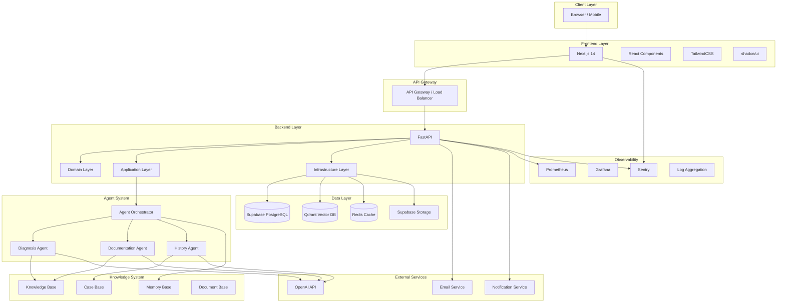

### Flujo de Datos

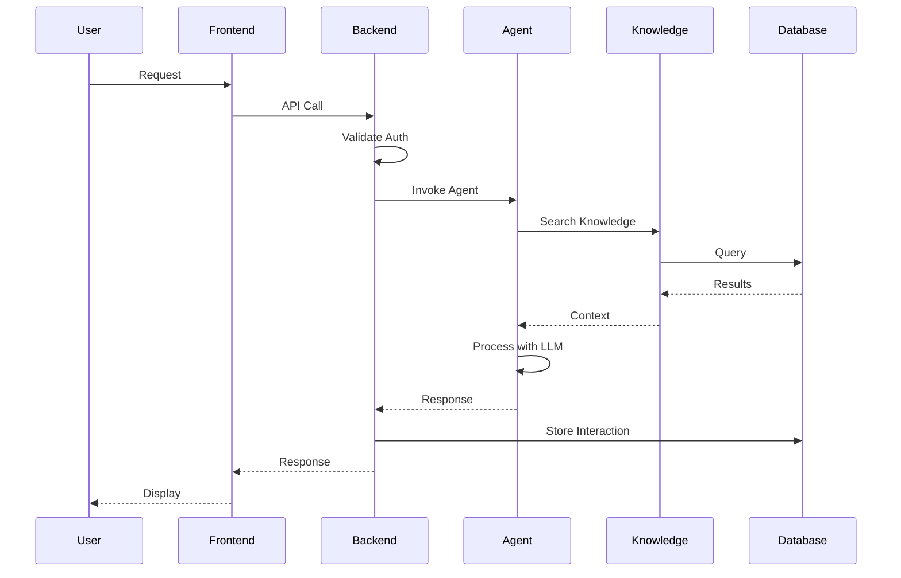

---

## Arquitectura Frontend

### Estructura de Componentes

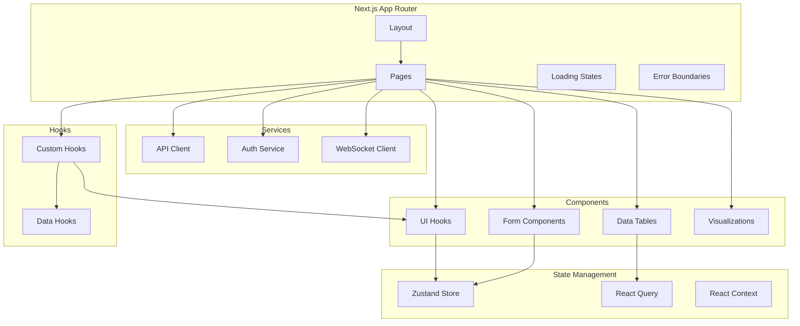

### Arquitectura de Rutas

```mermaid
graph LR
    A[/] --> B[Dashboard]
    A --> C[Equipos]
    A --> D[Mantenimiento]
    A --> E[Casos]
    A --> F[Conocimiento]
    A --> G[Configuración]
    
    B --> B1[Overview]
    B --> B2[Alertas]
    B --> B3[Métricas]
    
    C --> C1[Inventario]
    C --> C2[Detalles]
    C --> C3[Historial]
    
    D --> D1[Órdenes]
    D --> D2[Calendario]
    D --> D3[Reportes]
    
    E --> E1[Buscar Casos]
    E --> E2[Crear Caso]
    E --> E3[Similares]
    
    F --> F1[Manuales]
    F --> F2[Protocolos]
    F --> F3[Normativas]
    
    G --> G1[Usuarios]
    G --> G2[Permisos]
    G --> G3[Integraciones]
```

---

## Arquitectura Backend

### Capas de Clean Architecture

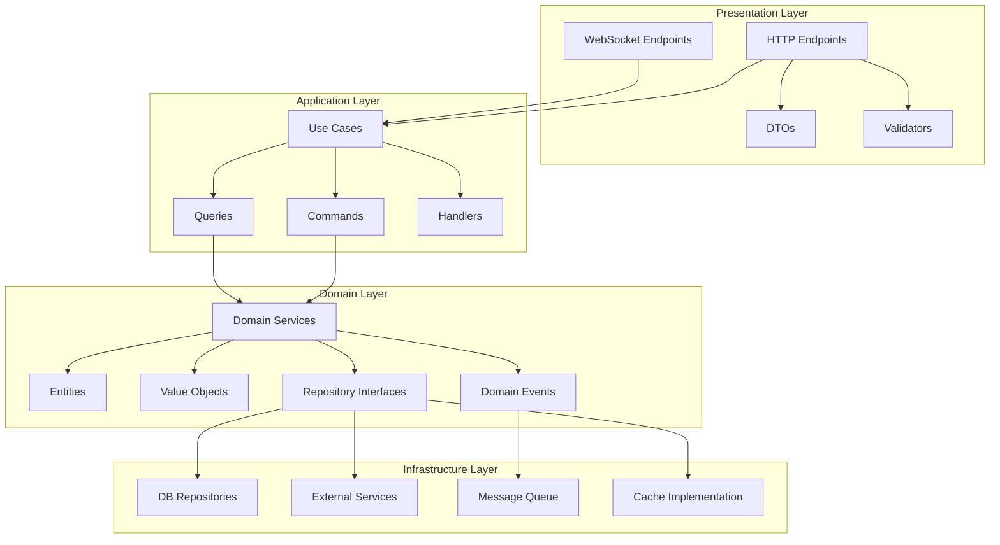

### Vertical Slice Architecture

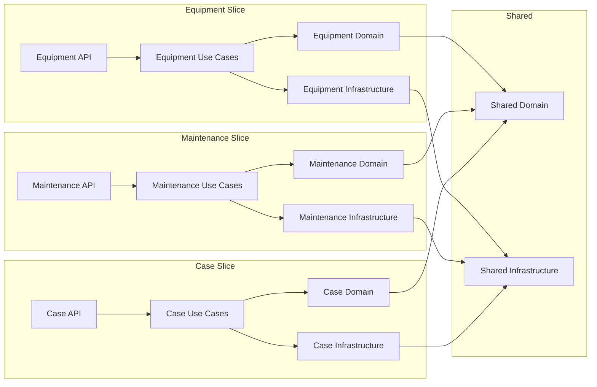

---

## Sistema Multiagente

### Arquitectura de Agentes

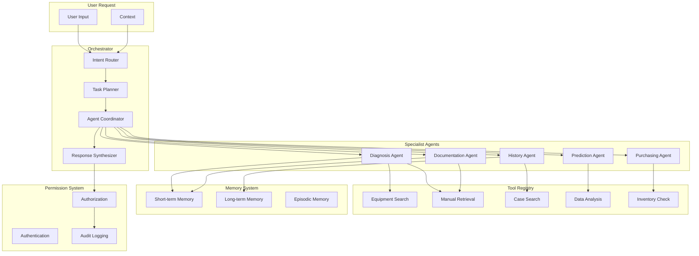

### Flujo de Orquestación

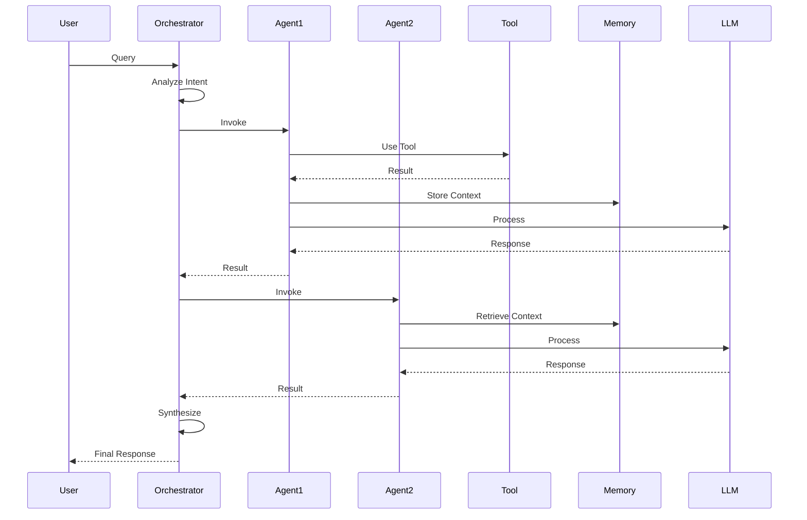

---

## Sistema de Conocimiento

### Arquitectura de Bases de Conocimiento

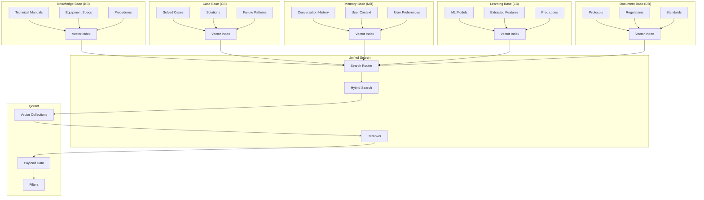

### Flujo de Búsqueda de Conocimiento

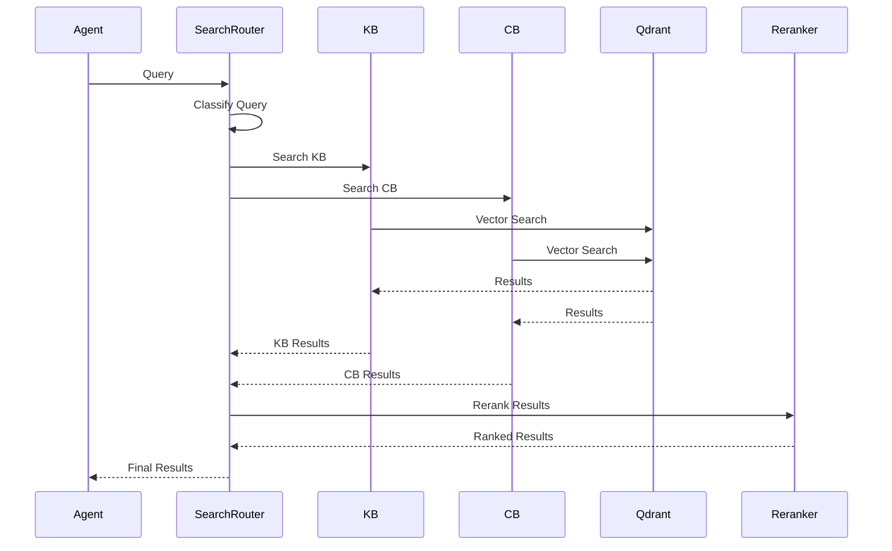

---

## Base de Datos

### Arquitectura de Datos

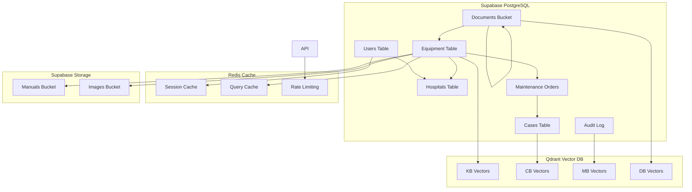

### Esquema de Base de Datos Relacional

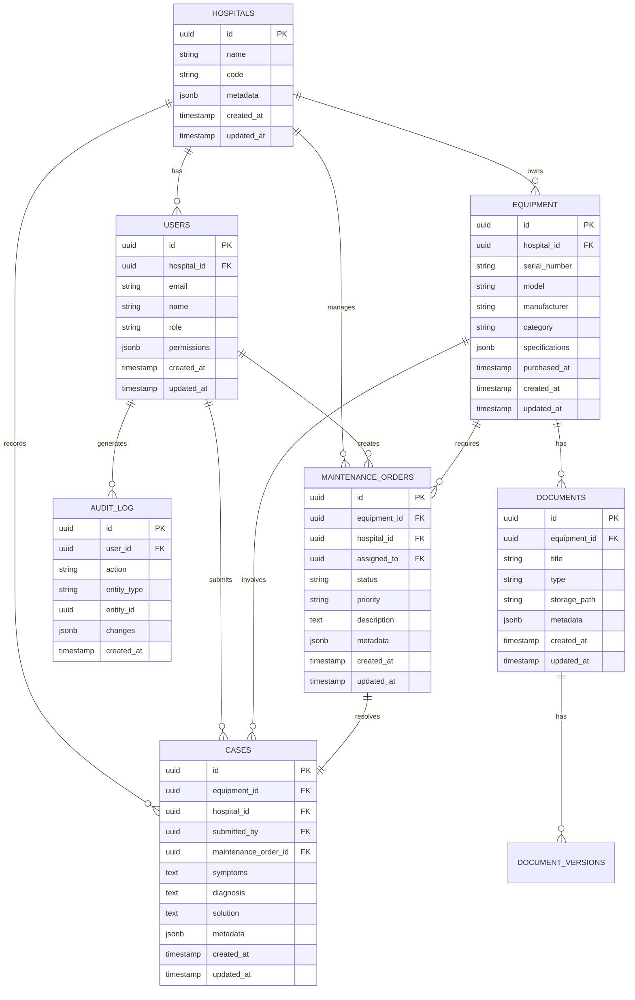

---

## Autenticación y Autorización

### Flujo de Autenticación

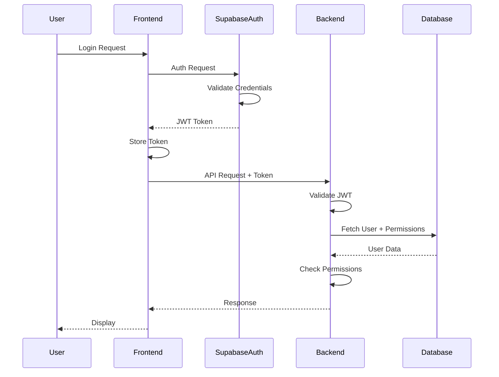

### Modelo de Autorización

```mermaid
graph TB
    subgraph "Roles"
        Admin[Admin]
        Manager[Manager]
        Engineer[Engineer]
        Technician[Technician]
        Viewer[Viewer]
    end
    
    subgraph "Permissions"
        P1[Create Equipment]
        P2[Edit Equipment]
        P3[Delete Equipment]
        P4[View Equipment]
        P5[Create Maintenance]
        P6[Edit Maintenance]
        P7[Delete Maintenance]
        P8[View Maintenance]
        P9[Create Cases]
        P10[View Cases]
        P11[Use AI Agents]
        P12[Manage Users]
    end
    
    subgraph "Resources"
        R1[Equipment]
        R2[Maintenance Orders]
        R3[Cases]
        R4[Documents]
        R5[Users]
    end
    
    Admin --> P1
    Admin --> P2
    Admin --> P3
    Admin --> P4
    Admin --> P5
    Admin --> P6
    Admin --> P7
    Admin --> P8
    Admin --> P9
    Admin --> P10
    Admin --> P11
    Admin --> P12
    
    Manager --> P1
    Manager --> P2
    Manager --> P4
    Manager --> P5
    Manager --> P6
    Manager --> P8
    Manager --> P9
    Manager --> P10
    Manager --> P11
    
    Engineer --> P4
    Engineer --> P5
    Engineer --> P8
    Engineer --> P9
    Engineer --> P10
    Engineer --> P11
    
    Technician --> P4
    Technician --> P5
    Technician --> P8
    Technician --> P9
    Technician --> P10
    
    Viewer --> P4
    Viewer --> P8
    Viewer --> P10
    
    P1 --> R1
    P2 --> R1
    P3 --> R1
    P4 --> R1
    
    P5 --> R2
    P6 --> R2
    P7 --> R2
    P8 --> R2
    
    P9 --> R3
    P10 --> R3
    
    P12 --> R5
```

---

## Observabilidad

### Stack de Observabilidad

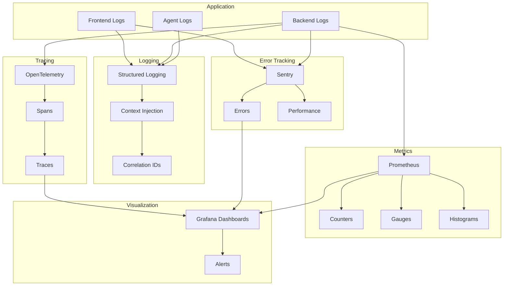

### Métricas Clave

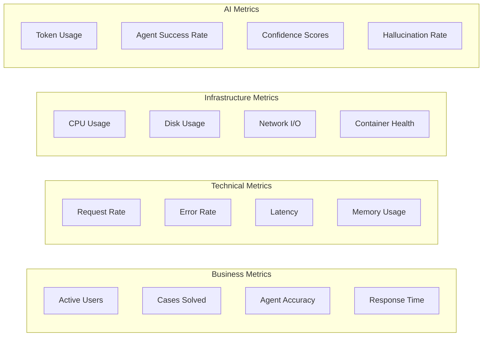

---

## Seguridad

### Capas de Seguridad

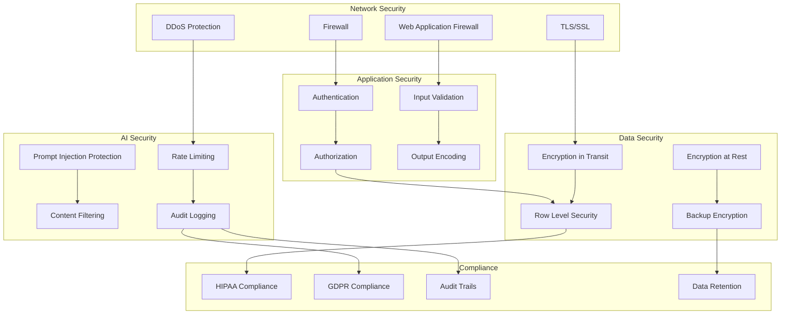

---

## Infraestructura

### Arquitectura de Despliegue

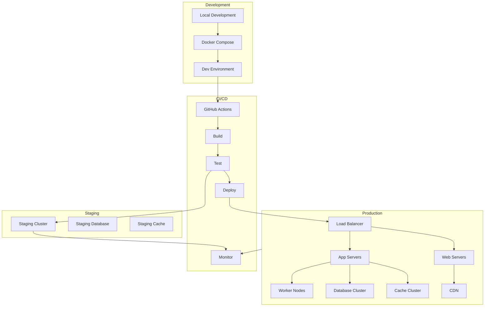

### Arquitectura de Contenedores

```mermaid
graph TB
    subgraph "Docker Containers"
        FrontendContainer[Frontend Container]
        BackendContainer[Backend Container]
        WorkerContainer[Worker Container]
        QdrantContainer[Qdrant Container]
        RedisContainer[Redis Container]
        PrometheusContainer[Prometheus Container]
        GrafanaContainer[Grafana Container]
    end
    
    subgraph "Docker Networks"
        FrontendNetwork[Frontend Network]
        BackendNetwork[Backend Network]
        DataNetwork[Data Network]
        MonitoringNetwork[Monitoring Network]
    end
    
    subgraph "Volumes"
        FrontendVolume[Frontend Volume]
        BackendVolume[Backend Volume]
        QdrantVolume[Qdrant Volume]
        RedisVolume[Redis Volume]
        LogsVolume[Logs Volume]
    end
    
    FrontendContainer --> FrontendNetwork
    BackendContainer --> FrontendNetwork
    BackendContainer --> BackendNetwork
    WorkerContainer --> BackendNetwork
    
    BackendContainer --> DataNetwork
    QdrantContainer --> DataNetwork
    RedisContainer --> DataNetwork
    
    PrometheusContainer --> MonitoringNetwork
    GrafanaContainer --> MonitoringNetwork
    
    FrontendContainer --> FrontendVolume
    BackendContainer --> BackendVolume
    QdrantContainer --> QdrantVolume
    RedisContainer --> RedisVolume
    BackendContainer --> LogsVolume
    WorkerContainer --> LogsVolume
```

---

## Resumen

Esta arquitectura está diseñada para:

1. **Escalabilidad Horizontal**: Cada componente puede escalar independientemente
2. **Seguridad Robusta**: Múltiples capas de seguridad y compliance
3. **IA Responsable**: Toda acción trazable y auditable
4. **Mantenibilidad**: Arquitectura limpia con separación de responsabilidades
5. **Observabilidad Completa**: Logging, tracing, y metrics en todos los niveles
6. **Flexibilidad**: Preparado para evolución a microservicios si necesario

La arquitectura sigue principios de Clean Architecture, DDD, y Vertical Slice Architecture, asegurando que el proyecto pueda evolucionar durante 10+ años sin reescrituras mayores.

---

**Última actualización**: 2026-07-10
**Autor**: Lead Architect (Cascade)
**Versión**: 1.0.0
