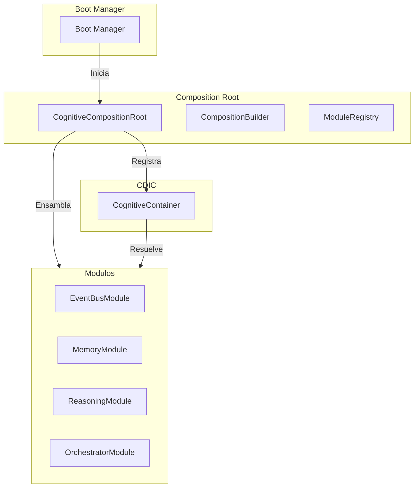
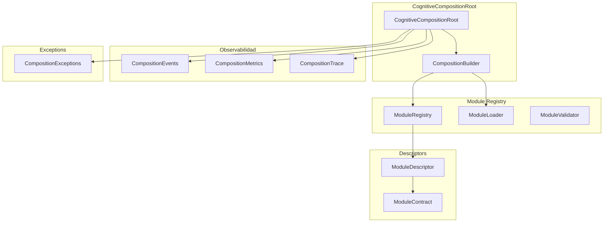
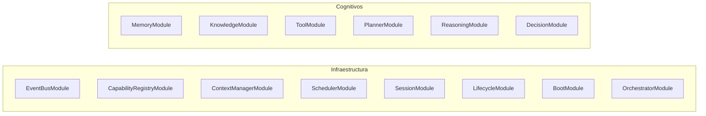
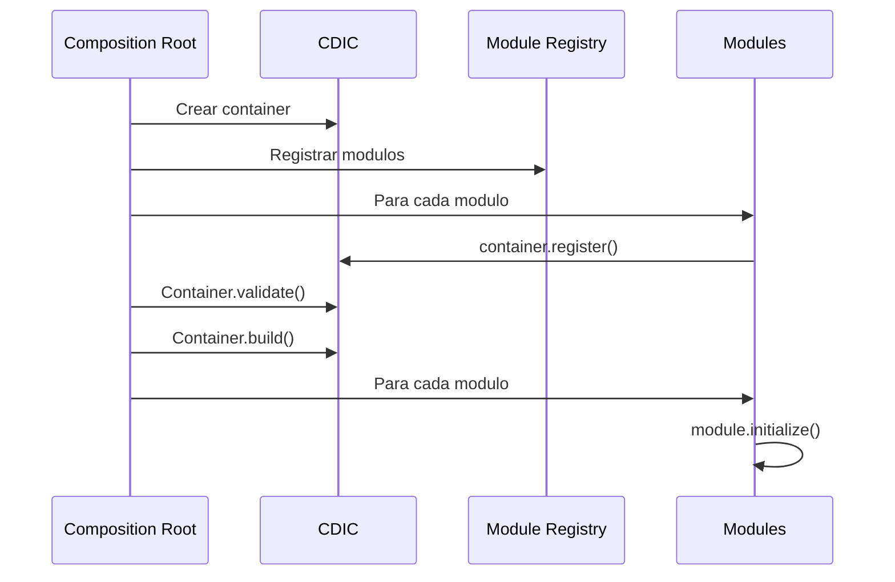
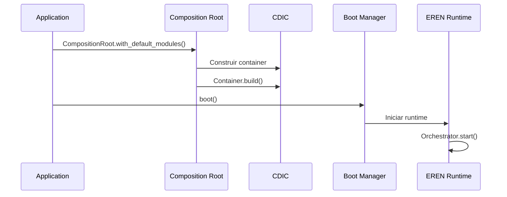

# Cognitive Composition Root — Arquitectura

> **Documento de arquitectura para el Cognitive Composition Root (CCRoot) de EREN.**
> El unico lugar autorizado para ensamblar el Cognitive Operating System de EREN.

| | |
|---|---|
| **Estado** | Fundacion implementada |
| **Fase** | Cognitiva - Fase 2 |
| **Tipo** | Composition Root |
| **Paradigma** | EREN NO usa IA |

---

## Indice

- [1. Mision](#1-mision)
- [2. Filosofia](#2-filosofia)
- [3. Arquitectura](#3-arquitectura)
- [4. Module System](#4-module-system)
- [5. Composition Builder](#5-composition-builder)
- [6. Composition Validator](#6-composition-validator)
- [7. Eventos](#7-eventos)
- [8. Metricas](#8-metricas)
- [9. Tracing](#9-tracing)
- [10. Integracion con CDIC](#10-integracion-con-cdic)
- [11. Integracion con Boot Manager](#11-integracion-con-boot-manager)
- [12. Ejemplos](#12-ejemplos)
- [13. Roadmap](#13-roadmap)

---

## 1. Mision

```
El Composition Root es el UNICO lugar autorizado para ensamblar
el Cognitive Operating System de EREN.

Su responsabilidad es:
- Construir el Container
- Registrar modulos
- Registrar contratos
- Configurar Event Bus
- Configurar Boot Manager
- Configurar Orchestrator
- Configurar todos los motores
- Validar el sistema completo
- Entregar un Runtime listo para arrancar

El resto del sistema NUNCA conocera implementaciones concretas.
```

---

## 2. Filosofia

```
EREN nunca conoce implementaciones.
EREN conoce unicamente contratos.
El Composition Root conoce las implementaciones.
El Container decide que implementacion entregar.
```

### 2.1 Principio Fundamental

```python
# PROHIBIDO en cualquier otro componente:
memory = CognitiveMemoryEngine()
planner = PlannerEngine()
reasoning = ReasoningEngine()

# CORRECTO - Solo en el Composition Root:
container.register('MemoryContract', CognitiveMemoryEngine)
container.register('PlannerContract', PlannerEngine)
container.register('ReasoningContract', ReasoningEngine)
```

### 2.2 Patron de Diseno



---

## 3. Arquitectura

### 3.1 Diagrama de Componentes



### 3.2 Archivos del Composition Root

```
core/composition/
├── composition_root.py       # Motor principal
├── composition_builder.py    # Builder pattern
├── composition_module.py     # Clases base de modulo
├── module_registry.py      # Registro de modulos
├── module_loader.py        # Cargador de modulos
├── module_descriptor.py     # Descriptores
├── composition_validator.py # Validador
├── composition_events.py    # Eventos
├── composition_metrics.py  # Metricas
├── composition_trace.py   # Trazabilidad
└── exceptions.py          # Excepciones
```

---

## 4. Module System

### 4.1 Tipos de Modulos

| Tipo | Descripcion |
|------|------------|
| **core** | Modulos del nucleo |
| **infrastructure** | Modulos de infraestructura |
| **cognitive** | Motores cognitivos |
| **capability** | Capacidades |

### 4.2 Modulos por Defecto



### 4.3 ModuleDescriptor

```python
@dataclass
class ModuleDescriptor:
    module_name: str
    module_type: str = "core"
    description: str = ""
    dependencies: list = []
    contracts: list = []
    capabilities: list = []
    tags: set = set()
    order: int = 0
```

---

## 5. Composition Builder

### 5.1 Patron Builder

```python
# Uso tipico
runtime = (
    CognitiveCompositionRoot()
        .with_default_modules()
        .with_module(custom_module)
        .configure(environment="production")
        .validate()
        .build()
)
```

### 5.2 Metodos del Builder

| Metodo | Descripcion |
|--------|------------|
| `with_default_modules()` | Agregar modulos por defecto |
| `with_module()` | Agregar un modulo |
| `with_modules()` | Agregar multiples modulos |
| `configure()` | Configurar el builder |
| `validate()` | Validar la composicion |
| `build()` | Construir el runtime |

---

## 6. Composition Validator

### 6.1 Validaciones

| Validacion | Descripcion |
|-----------|------------|
| **Modulos requeridos** | Todos los modulos registrados |
| **Dependencias** | Dependencias satisfechas |
| **Contratos** | Todos los contratos presentes |
| **Container** | Container valido |
| **Event Bus** | Event Bus presente |

### 6.2 Resultado de Validacion

```python
@dataclass
class ValidationResult:
    is_valid: bool
    errors: list = []
    warnings: list = []

    def add_error(self, error: ValidationError):
        self.errors.append(error)
        self.is_valid = False
```

---

## 7. Eventos

### 7.1 Tipos de Eventos

| Evento | Descripcion |
|--------|------------|
| `CompositionStarted` | Inicio de composicion |
| `ModuleRegistered` | Modulo registrado |
| `ModuleLoaded` | Modulo cargado |
| `ModuleInitialized` | Modulo inicializado |
| `ModuleValidated` | Modulo validado |
| `CompositionValidated` | Composicion validada |
| `CompositionCompleted` | Composicion completada |
| `CompositionFailed` | Composicion fallida |
| `ContainerBuilt` | Container construido |
| `RuntimeReady` | Runtime listo |

---

## 8. Metricas

### 8.1 Metricas Recolectadas

| Metrica | Descripcion |
|---------|------------|
| `modules_registered` | Total de modulos registrados |
| `modules_loaded` | Modulos cargados |
| `modules_initialized` | Modulos inicializados |
| `contracts_registered` | Contratos registrados |
| `total_build_time_ms` | Tiempo total de construccion |
| `build_errors` | Errores de construccion |

---

## 9. Tracing

### 9.1 Trace Entry

```python
@dataclass
class CompositionTraceEntry:
    entry_id: str
    timestamp: str
    operation: str           # register, load, validate, build
    module_name: str
    duration_ms: int
    success: bool
    error: str
    correlation_id: str
```

---

## 10. Integracion con CDIC

### 10.1 Flujo de Integracion



---

## 11. Integracion con Boot Manager

### 11.1 Arranque Completo



---

## 12. Ejemplos

### 12.1 Construccion Basica

```python
from core.composition import CognitiveCompositionRoot

# Construir EREN completo
runtime = (
    CognitiveCompositionRoot()
        .with_default_modules()
        .build()
)

print(f"EREN construido con {runtime['module_count']} modulos")
```

### 12.2 Construccion Custom

```python
from core.composition import (
    CognitiveCompositionRoot,
    ModuleDescriptor,
)

# Modulo personalizado
custom_module = ModuleDescriptor(
    module_name="CustomModule",
    module_type="cognitive",
    description="Mi modulo personalizado",
)

# Construir con modulo custom
runtime = (
    CognitiveCompositionRoot()
        .with_default_modules()
        .with_module(custom_module)
        .validate()
        .build()
)
```

### 12.3 Modulo Custom

```python
from core.composition import CognitiveModule

class MyModule(CognitiveModule):
    def __init__(self):
        super().__init__("MyModule")
    
    def register(self, container):
        container.register(
            'IMyService',
            MyServiceImplementation,
            lifetime='singleton'
        )
    
    def initialize(self, container):
        # Inicializacion
        pass
```

---

## 13. Roadmap

### Fase 1: Fundacion (Actual)
```
- Core Composition Root
- Module Registry
- Module Loader
- Module Descriptor
- Composition Builder
- Composition Validator
```

### Fase 2: Integracion CDIC
```
- Integracion completa con CDIC
- Registro automatico de contratos
- Validacion de contratos
```

### Fase 3: Modulos Completos
```
- Modulos con implementacion real
- Registro de motores
- Registro de capacidades
```

### Fase 4: Production Ready
```
- Performance optimization
- Configuration validation
- Health checks
```

---

## Referencias

| Referencia | Ubicacion |
|------------|-----------|
| Cognitive Dependency Injection Container | [./container.md](./container.md) |
| Cognitive Boot Manager | [./boot-manager.md](./boot-manager.md) |
| Cognitive Processing Pipeline | [../architecture/cognitive-processing-pipeline.md](../architecture/cognitive-processing-pipeline.md) |

---

**Ultima actualizacion:** 2026-07-13  
**Estado:** Fundacion implementada  
**Fase:** Cognitiva - Fase 2  
**Tipo:** Documentacion arquitectonica  
**Paradigma:** EREN NO usa IA