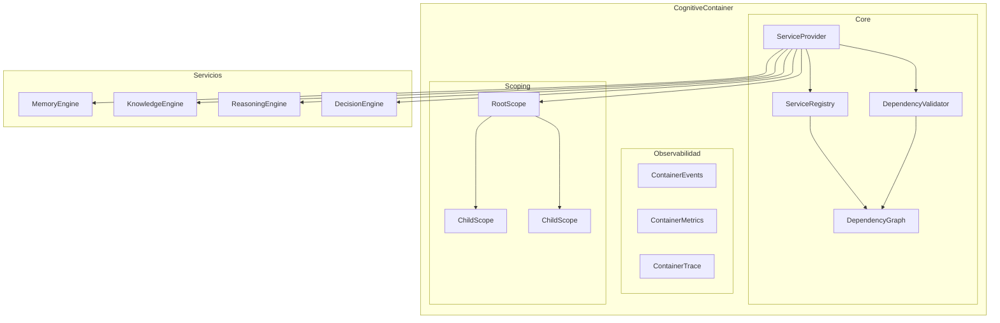
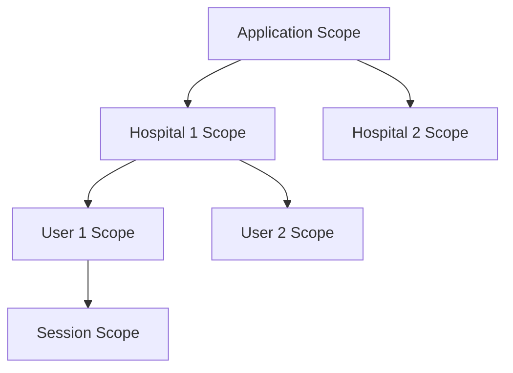
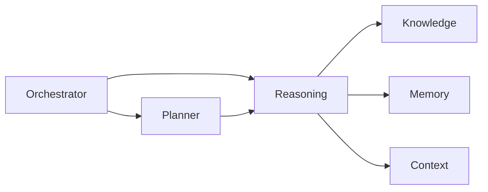
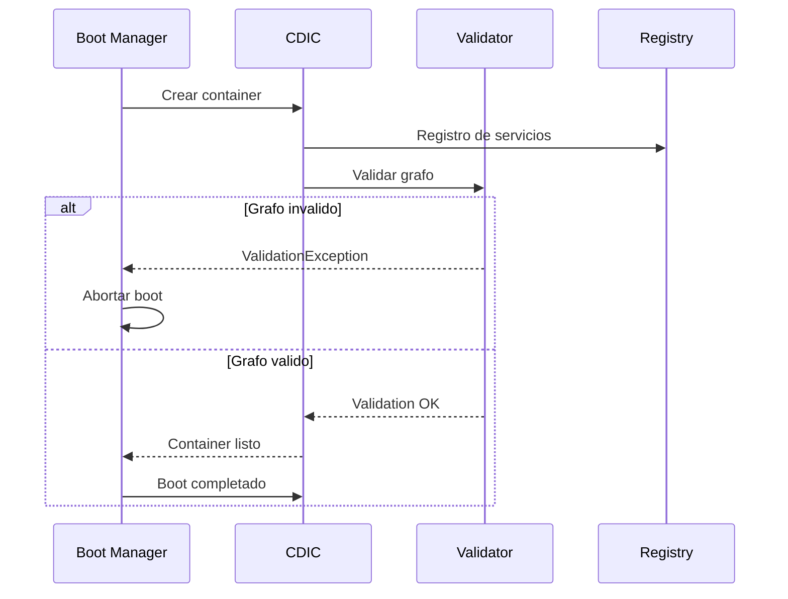

# Cognitive Dependency Injection Container — Arquitectura

> **Documento de arquitectura para el Cognitive Dependency Injection Container (CDIC) de EREN.**
> El componente oficial para la inyeccion de dependencias en EREN.

| | |
|---|---|
| **Estado** | Fundacion implementada |
| **Fase** | Cognitiva - Fase 2 |
| **Tipo** | Dependency Injection Container |
| **Paradigma** | EREN NO usa IA |

---

## Indice

- [1. Mision](#1-mision)
- [2. Filosofia](#2-filosofia)
- [3. Arquitectura](#3-arquitectura)
- [4. Service Lifetime](#4-service-lifetime)
- [5. Service Registry](#5-service-registry)
- [6. Service Provider](#6-service-provider)
- [7. Scopes](#7-scopes)
- [8. Dependency Graph](#8-dependency-graph)
- [9. Dependency Validator](#9-dependency-validator)
- [10. Eventos](#10-eventos)
- [11. Metricas](#11-metricas)
- [12. Tracing](#12-tracing)
- [13. Integracion con Boot Manager](#13-integracion-con-boot-manager)
- [14. Integracion con Orchestrator](#14-integracion-con-orchestrator)
- [15. Ejemplos](#15-ejemplos)
- [16. Buenas Practicas](#16-buenas-practicas)
- [17. Roadmap](#17-roadmap)

---

## 1. Mision

```
El Cognitive Dependency Injection Container (CDIC) es el UNICO componente
autorizado para la inyeccion de dependencias en EREN.

Su responsabilidad es:
- Registrar servicios
- Resolver dependencias
- Crear scopes
- Controlar ciclos de vida
- Detectar dependencias circulares
- Validar el grafo completo
- Entregar instancias

El resto del sistema NUNCA debera instanciar clases manualmente.
```

---

## 2. Filosofia

```
EREN nunca conoce implementaciones.
EREN solo conoce contratos.
El Container decide que implementacion entregar.
```

### 2.1 Principio Fundamental

```python
# PROHIBIDO
memory = MemoryEngine()
planner = Planner()
reasoning = ReasoningEngine()

# CORRECTO
memory = container.resolve('MemoryContract')
planner = container.resolve('PlannerContract')
reasoning = container.resolve('ReasoningContract')
```

### 2.2 Patron de Diseno

```
+------------------+      +------------------+
|   Application   | ---> |    Container     |
+------------------+      +------------------+
                              |
                              +---> Registry
                              |
                              +---> Provider
                              |
                              +---> Validator
                              |
                              +---> Graph
```

---

## 3. Arquitectura

### 3.1 Diagrama de Componentes



### 3.2 Archivos del Container

```
core/container/
├── container.py              # Motor principal
├── container_builder.py     # Builder pattern
├── service_descriptor.py    # Descriptores de servicio
├── service_factory.py       # Fabrica de servicios
├── service_lifetime.py     # Lifetimes
├── service_provider.py      # Resolucion
├── service_registry.py      # Registro
├── service_scope.py        # Scopes jerarquicos
├── dependency_graph.py    # Grafo de dependencias
├── dependency_validator.py # Validador
├── container_events.py     # Eventos
├── container_metrics.py    # Metricas
├── container_trace.py     # Trazabilidad
└── exceptions.py          # Excepciones
```

### 3.3 Responsabilidades

| Responsabilidad | Descripcion |
|---------------|------------|
| **Registro** | Registrar servicios por contrato |
| **Resolucion** | Resolver servicios bajo demanda |
| **Scopes** | Gestion de scopes jerarquicos |
| **Validacion** | Validar grafo de dependencias |
| **Circular Detection** | Detectar ciclos |
| **Observabilidad** | Eventos, metricas, traces |

---

## 4. Service Lifetime

### 4.1 Tipos de Lifetime

| Tipo | Descripcion | Caso de Uso |
|------|------------|------------|
| **SINGLETON** | Una instancia global | EventBus, Registry |
| **LAZY_SINGLETON** | Singleton creado en primer uso | Servicios costosos |
| **WEAK_SINGLETON** | Singleton con ref debil | Cache |
| **SCOPED** | Una instancia por scope | Session-specific |
| **TRANSIENT** | Nueva instancia cada vez | Services stateless |
| **FACTORY** | Factory function | Construccion personalizada |

### 4.2 Ejemplo de Lifetimes

```python
# Singleton - Una instancia global
container.register(
    'EventBusContract',
    EventBus,
    lifetime=ServiceLifetime.SINGLETON
)

# Scoped - Una instancia por session
container.register(
    'SessionContract',
    SessionManager,
    lifetime=ServiceLifetime.SCOPED
)

# Transient - Nueva instancia cada vez
container.register(
    'RequestContract',
    RequestHandler,
    lifetime=ServiceLifetime.TRANSIENT
)

# Factory - Funcion factory
container.register(
    'BuilderContract',
    factory=lambda resolver: Builder(resolver('ConfigContract')),
    lifetime=ServiceLifetime.FACTORY
)
```

---

## 5. Service Registry

### 5.1 Registro de Servicios

```python
# Registro basico
container.register(
    contract='MemoryContract',
    implementation=CognitiveMemoryEngine,
    lifetime=ServiceLifetime.SINGLETON,
    dependencies=['ContextContract', 'KnowledgeContract'],
    tags={'core', 'cognitive'},
    metadata={'version': '1.0'}
)

# Registro via Builder
container = ContainerFactory.create_builder()
container.register_singleton('MemoryContract', CognitiveMemoryEngine)
container.register_scoped('SessionContract', SessionManager)
container.register_transient('RequestContract', RequestHandler)
container.validate()
```

### 5.2 Registro por Contrato

```python
# EREN solo conoce contratos
# El Container decide la implementacion

# Registro
container.register(
    contract='IMemoryEngine',  # Contrato/Interfaz
    implementation=CognitiveMemoryEngine,  # Implementacion
    lifetime=ServiceLifetime.SINGLETON
)

# Resolucion - Solo por contrato
memory = container.resolve('IMemoryEngine')  # No se usa la clase directamente
```

---

## 6. Service Provider

### 6.1 Metodos de Resolucion

| Metodo | Descripcion |
|--------|------------|
| `resolve(contract)` | Resolver servicio, lanza si no existe |
| `try_resolve(contract)` | Resolver sin lanzar, retorna None |
| `resolve_all(contract)` | Resolver todas las implementaciones |
| `resolve_required(contract)` | Alias de resolve |

### 6.2 Resolucion de Dependencias

```python
class CognitiveReasoningEngine:
    def __init__(
        self,
        memory: 'IMemoryEngine',      # Inyectado
        knowledge: 'IKnowledgeEngine',  # Inyectado
        context: 'IContextManager',     # Inyectado
    ):
        self.memory = memory
        self.knowledge = knowledge
        self.context = context

# Registro
container.register(
    contract='IReasoningEngine',
    implementation=CognitiveReasoningEngine,
    dependencies=['IMemoryEngine', 'IKnowledgeEngine', 'IContextManager']
)

# Resolucion - El container inyecta automaticamente
reasoning = container.resolve('IReasoningEngine')
```

---

## 7. Scopes

### 7.1 Tipos de Scope

| Tipo | Descripcion | Uso |
|------|------------|-----|
| **APPLICATION** | Scope raiz | App-wide singletons |
| **HOSPITAL** | Scope de hospital | Multi-tenant |
| **USER** | Scope de usuario | User-specific |
| **SESSION** | Scope de sesion | Session data |
| **WORKFLOW** | Scope de workflow | Workflow-specific |
| **CUSTOM** | Scope personalizado | Casos especiales |

### 7.2 Scopes Jerarquicos



### 7.3 Ejemplo de Scopes

```python
# Crear scope de sesion
session_scope = container.create_scope(
    scope_type=ScopeType.SESSION,
    scope_id='session_123'
)

# Usar scope
container.use_scope(session_scope)

# Resolver - usa el scope actual
session_data = container.resolve('ISessionData')

# Resetear al scope raiz
container.reset_scope()
```

---

## 8. Dependency Graph

### 8.1 Grafo de Dependencias



### 8.2 Operaciones del Grafo

```python
graph = container.get_graph()

# Estadisticas
graph['statistics']  # node_count, edge_count, depth, etc.

# Encontrar ciclos
cycles = graph.find_cycles()

# Encontrar orphans
orphans = graph.find_orphans()

# Orden de resolucion
order = validator.get_resolution_order()
```

---

## 9. Dependency Validator

### 9.1 Validaciones

| Validacion | Descripcion |
|-----------|------------|
| **Ciclos** | Detectar dependencias circulares |
| **Orphans** | Dependencias sin implementacion |
| **Duplicados** | Multiples implementaciones |
| **Implementaciones invalidas** | Tipos no validos |
| **Conflictos de lifetime** | Inconsistencias |
| **Inaccesibles** | Servicios sin factory |

### 9.2 Validacion Formal

```python
# Validar antes del boot
try:
    container.validate()
    print("Container valido - Listo para boot")
except ValidationException as e:
    print(f"Container invalido: {e.errors}")
    # Abortar boot
```

### 9.3 Deteccion de Ciclos

```python
# Ejemplo de ciclo invalido
# Memory -> Reasoning -> Knowledge -> Memory

container.register('IMemory', MemoryEngine, dependencies=['IReasoning'])
container.register('IReasoning', ReasoningEngine, dependencies=['IKnowledge'])
container.register('IKnowledge', KnowledgeEngine, dependencies=['IMemory'])

# Validacion lanza CircularDependencyException
container.validate()  # ERROR: Circular dependency detected
```

---

## 10. Eventos

### 10.1 Tipos de Eventos

| Evento | Descripcion |
|--------|------------|
| `ContainerCreated` | Container creado |
| `ContainerDisposed` | Container destruido |
| `ServiceRegistered` | Servicio registrado |
| `ServiceResolved` | Servicio resuelto |
| `ServiceCreated` | Instancia creada |
| `ScopeCreated` | Scope creado |
| `ScopeDisposed` | Scope destruido |
| `DependencyValidated` | Dependencias validadas |
| `DependencyValidationFailed` | Validacion fallida |
| `CircularDependencyDetected` | Ciclo detectado |

---

## 11. Metricas

### 11.1 Metricas Recolectadas

| Metrica | Descripcion |
|---------|------------|
| `services_registered` | Total de registros |
| `services_resolved` | Total de resoluciones |
| `resolution_errors` | Errores de resolucion |
| `circular_dependencies_detected` | Ciclos detectados |
| `scopes_created` | Scopes creados |
| `active_scopes` | Scopes activos |
| `factories_executed` | Factories ejecutadas |
| `singletons_created` | Singletons creados |
| `average_resolution_time_ms` | Tiempo promedio |

---

## 12. Tracing

### 12.1 Trace Entry

```python
@dataclass
class ContainerTraceEntry:
    entry_id: str
    timestamp: str
    operation: str           # register, resolve, create_scope, etc.
    contract: str
    scope_id: str
    correlation_id: str
    duration_ms: int
    success: bool
    error: str
    metadata: dict
```

### 12.2 Trazabilidad Completa

```python
# Obtener traces
traces = container.get_trace()

# Filtrar por contrato
memory_traces = [t for t in traces if t.contract == 'IMemory']

# Filtrar por operacion
resolve_traces = [t for t in traces if t.operation == 'resolve']

# Filtrar errores
error_traces = [t for t in traces if not t.success]
```

---

## 13. Integracion con Boot Manager

### 13.1 Flujo de Arranque



### 13.2 Registro durante Boot

```python
# Boot Manager registra servicios
container.register(
    'EventBusContract',
    EventBus,
    lifetime=ServiceLifetime.SINGLETON
)

container.register(
    'CapabilityRegistryContract',
    CapabilityRegistry,
    lifetime=ServiceLifetime.SINGLETON
)

# Validar antes de continuar
container.validate()
```

---

## 14. Integracion con Orchestrator

### 14.1 Resolucion de Motores

```python
# Orchestrator resuelve motores via container
class CognitiveOrchestrator:
    def __init__(self, container):
        self.container = container

    def initialize(self):
        # Resolver motores via container
        self.memory = self.container.resolve('IMemoryEngine')
        self.knowledge = self.container.resolve('IKnowledgeEngine')
        self.reasoning = self.container.resolve('IReasoningEngine')
        self.decision = self.container.resolve('IDecisionEngine')

        # Never instantiate directly
        # self.memory = CognitiveMemoryEngine()  # PROHIBIDO
```

### 14.2 Scoping de Sesiones

```python
# Cada sesion tiene su scope
class CognitiveOrchestrator:
    def create_session(self, session_id):
        # Crear scope de sesion
        session_scope = self.container.create_scope(
            scope_type=ScopeType.SESSION,
            scope_id=session_id
        )

        # Resolver en el scope de sesion
        self.container.use_scope(session_scope)
        session_data = self.container.resolve('ISessionData')
```

---

## 15. Ejemplos

### 15.1 Registro Completo

```python
from core.container import (
    CognitiveContainer,
    ContainerFactory,
    ServiceLifetime,
)

# Crear container
container = ContainerFactory.create_builder()

# Registrar servicios del Kernel
container.register_singleton(
    'EventBusContract',
    EventBus,
)

container.register_singleton(
    'CapabilityRegistryContract',
    CapabilityRegistry,
)

container.register_singleton(
    'MemoryContract',
    CognitiveMemoryEngine,
    dependencies=['ContextContract', 'EventBusContract']
)

container.register_singleton(
    'KnowledgeContract',
    KnowledgeEngine,
    dependencies=['EventBusContract']
)

container.register_singleton(
    'ReasoningContract',
    ReasoningEngine,
    dependencies=['MemoryContract', 'KnowledgeContract']
)

# Validar
container.validate()

# Build
container = container.get_registry()  # O usar builder pattern
```

### 15.2 Resolucion con Constructor Injection

```python
# Registrar con dependencias declaradas
container.register(
    'IReasoningEngine',
    ReasoningEngine,
    dependencies=['IMemoryEngine', 'IKnowledgeEngine', 'IContextManager']
)

# Resolver - el container inyecta automaticamente
reasoning = container.resolve('IReasoningEngine')

# Equivale a:
# reasoning = ReasoningEngine(
#     memory=container.resolve('IMemoryEngine'),
#     knowledge=container.resolve('IKnowledgeEngine'),
#     context=container.resolve('IContextManager')
# )
```

### 15.3 Factory Pattern

```python
# Factory para construccion compleja
def create_orchestrator(resolver):
    return CognitiveOrchestrator(
        memory=resolver('IMemoryEngine'),
        knowledge=resolver('IKnowledgeEngine'),
        reasoning=resolver('IReasoningEngine'),
    )

container.register_factory(
    'IOrchestrator',
    factory=create_orchestrator,
    lifetime=ServiceLifetime.SINGLETON
)
```

---

## 16. Buenas Practicas

### 16.1 Registro

```
✓ Usar contratos/interfaces siempre que sea posible
✓ Declarar dependencias explicitamente
✓ Usar lifetimes apropiados para cada caso
✓ Validar antes del primer uso
✓ Usar tags para organizacion
```

### 16.2 Resolucion

```
✓ Nunca instanciar manualmente
✓ Usar try_resolve cuando sea opcional
✓ Manejar ContainerDisposedException
✓ Limpiar scopes cuando ya no se necesiten
```

### 16.3 Scoping

```
✓ Crear scopes para datos de sesion
✓ Dispose scopes cuando ya no se necesiten
✓ No mantener referencias a scopes disposed
✓ Usar hierarchy correcta de scopes
```

---

## 17. Roadmap

### Fase 1: Fundacion (Actual)
```
- Core Container
- Service Registry
- Service Provider
- Service Lifetime
- Dependency Graph
- Dependency Validator
```

### Fase 2: Integracion
```
- Integracion con Boot Manager
- Integracion con Orchestrator
- Integration tests
```

### Fase 3: Advanced Features
```
- Auto-registration via decorators
- Configuration-based registration
- Dynamic modules
```

### Fase 4: Production Ready
```
- Performance optimization
- Caching strategies
- Distributed container
```

---

## Referencias

| Referencia | Ubicacion |
|------------|-----------|
| Cognitive Boot Manager | [../core/boot-manager.md](./boot-manager.md) |
| Cognitive Orchestrator | [../core/orchestrator.md](./orchestrator.md) |
| Cognitive Processing Pipeline | [../architecture/cognitive-processing-pipeline.md](../architecture/cognitive-processing-pipeline.md) |

---

**Ultima actualizacion:** 2026-07-13  
**Estado:** Fundacion implementada  
**Fase:** Cognitiva - Fase 2  
**Tipo:** Documentacion arquitectonica  
**Paradigma:** EREN NO usa IA