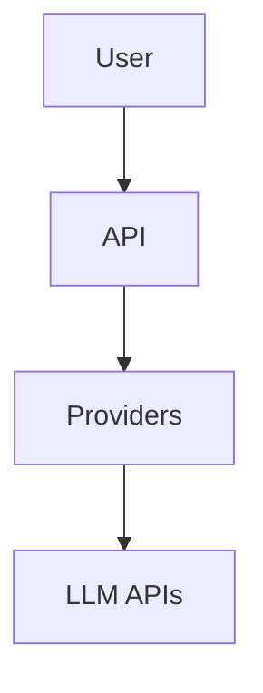

# Documentation Review
## EREN OS — Audit 12

---

## Executive Summary

EREN OS tiene documentación extensa en la raíz del proyecto incluyendo README, ARCHITECTURE_OVERVIEW, CORE_SPECIFICATION, y otros documentos.

**Documentation Score: 70/100**

La documentación es completa pero algunos módulos individuales carecen de docs.

---

## Documentation Structure

### Root Documentation
```
EREN OS Root/
├── README.md (17,336 bytes)
├── ARCHITECTURE_OVERVIEW.md
├── CORE_SPECIFICATION.md
├── SYSTEM_DESIGN.md
├── TECH_BIBLE.md
├── EREN_MANIFESTO.md
├── MASTER_ROADMAP.md
└── PROJECT_BOOTSTRAP.md
```

### Module Documentation
```
core/
├── {module}/
│   └── README.md (variable)
└── contracts/
    └── (inline docs)
```

---

## Documentation Analysis

### README.md ✅
- Overview completo
- Installation instructions
- Quick start
- Architecture description

### ARCHITECTURE_OVERVIEW.md ✅
- Diagramas
- Capas definidas
- Principios

### CORE_SPECIFICATION.md ✅
- Especificaciones detalladas
- Contratos definidos

### TECH_BIBLE.md ✅
- Best practices
- Coding standards
- Guidelines

---

## Missing Documentation

### 1. ADRs (Architecture Decision Records) ❌
- ❌ No /docs/adr/ directory
- ❌ No decisions documentadas
- ❌ No rationale

### 2. API Documentation ❌
- ❌ No OpenAPI/Swagger
- ❌ No API reference
- ❌ No endpoint docs

### 3. Module READMEs ⚠️
- ⚠️ Algunos módulos sin README
- ⚠️ Algunos READMEs vacíos

---

## Documentation Quality

### Strengths
- ✅ Manifesto well-written
- ✅ Architecture docs clear
- ✅ Roadmap visible

### Weaknesses
- ⚠️ Inconsistent module docs
- ❌ No API docs
- ❌ No tutorials
- ❌ No examples

---

## Diagram Quality

### Found
- Mermaid mentioned in spec
- ⚠️ No actual Mermaid files

### Recommendations


---

## ADR Structure (Missing)

### Recommended
```
docs/
└── adr/
    ├── 001-use-contracts-for-interfaces.md
    ├── 002-use-async-for-io.md
    └── ...
```

### ADR Template
```markdown
# ADR-XXX: Title

## Status
Proposed | Accepted | Deprecated

## Context
Problem statement

## Decision
What was decided

## Consequences
What becomes easier/harder
```

---

## Conclusion

EREN OS tiene buena documentación general pero necesita:
1. ADRs documentados
2. API documentation
3. Module-level READMEs
4. Tutorials

**Recomendación: Crear ADRs y completar docs de API.**

---

*Audit realizado: 2026-07-15*
