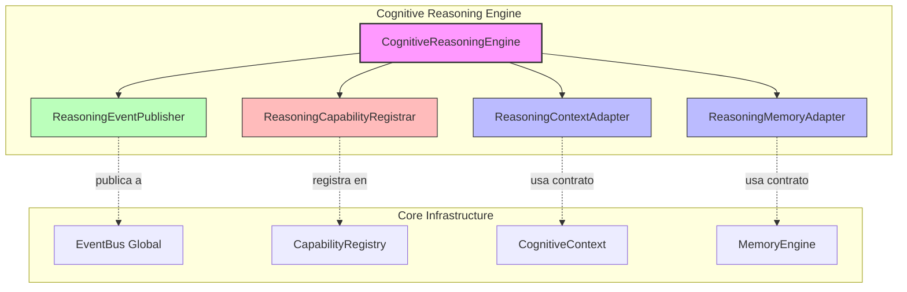

# Cognitive Reasoning Engine — Integracion Arquitectonica

## Resumen

Este documento describe como el Cognitive Reasoning Engine (CRE) se integra
con los demas componentes del nucleo cognitivo de EREN.

**Enfoque:** Adapters desacoplados y uso del EventBus global.

---

## Arquitectura de Integracion



---

## 1. Integration con EventBus

### Principios

```
ANTIGUO: Event Publisher interno
================================
CRE --> ReasoningEventPublisher --> (internal queue) --> ???

NUEVO: EventBus Global
======================
CRE --> ReasoningEventPublisher --> EventBus Global --> Suscribers
```

### Implementacion

```python
class ReasoningEventPublisher:
    """Publishes events to the global EventBus.
    
    CRITICAL: Uses ONLY the global EventBus. No internal bus.
    """

    def __init__(self) -> None:
        self._enabled = _HAS_EVENT_BUS

    def publish(self, event_type: str, **data: Any) -> None:
        """Publish to global EventBus."""
        if not self._enabled:
            return

        try:
            bus = get_global_bus()
            if bus:
                event = Event(event_type=event_type, data=data)
                bus.publish(event)
        except Exception:
            pass  # Fail silently
```

### Eventos Publicados

| Evento | Datos | Cuando |
|--------|-------|--------|
| session_started | session_id | Nueva sesion |
| hypothesis_created | hypothesis_id | Hipotesis creada |
| evidence_added | evidence_id | Evidencia anadida |
| confidence_updated | hypothesis_id, value | Confianza actualizada |
| hypothesis_confirmed | hypothesis_id | Hipotesis confirmada |
| hypothesis_rejected | hypothesis_id | Hipotesis rechazada |
| decision_generated | decision_id | Decision generada |
| session_completed | session_id | Sesion completada |

---

## 2. Integration con Capability Registry

### Principios

```
El CRE NO conoce el CapabilityRegistry concreto.
El CRE solo conoce el contrato.
El registro es automatico.
```

### Implementacion

```python
class ReasoningCapabilityRegistrar:
    """Handles automatic capability registration."""

    def register(self, registry: Any | None = None) -> None:
        """Register reasoning capabilities."""
        if not self._enabled or self._registered:
            return

        for cap_def in get_reasoning_capabilities():
            capability = Capability(
                capability_id=cap_def["id"],
                name=cap_def["name"],
                description=cap_def["description"],
                category=cap_def["category"],
            )
            registry.register(capability)

        self._registered = True
```

### Capacidades Registradas

| ID | Nombre | Descripcion |
|----|--------|-------------|
| reasoning.analyze | Analyze Evidence | Analyze and evaluate evidence |
| reasoning.compare | Compare Hypotheses | Compare multiple hypotheses |
| reasoning.rank | Rank Hypotheses | Rank by probability |
| reasoning.validate | Validate Reasoning | Validate chain and conclusions |
| reasoning.hypothesis.generate | Generate Hypotheses | Generate from evidence |
| reasoning.hypothesis.evaluate | Evaluate Hypothesis | Evaluate against evidence |
| reasoning.hypothesis.confirm | Confirm Hypothesis | Mark as confirmed |
| reasoning.hypothesis.reject | Reject Hypothesis | Mark as rejected |
| reasoning.evidence.collect | Collect Evidence | Collect and store |
| reasoning.evidence.incorporate | Incorporate Evidence | Add to hypothesis |
| reasoning.decision.generate | Generate Decision | Generate from reasoning |
| reasoning.decision.justify | Justify Decision | Provide justification |
| reasoning.trace | Generate Trace | Generate complete trace |
| reasoning.trace.export | Export Trace | Export for audit |

### Registro Automatico

```python
engine = CognitiveReasoningEngine()

# Registrar capacidades automaticamente
engine.register_capabilities(registry)

# Verificar registro
assert engine.capabilities_registered == True
```

---

## 3. Integration con Cognitive Context

### Principios

```
El CRE NO conoce ContextManager concreto.
El CRE usa ReasoningContextAdapter.
El adapter expone solo los metodos necesarios.
```

### Implementacion

```python
class ReasoningContextAdapter:
    """Adapter for Cognitive Context.
    
    Responsibilities:
    - Read evidence from context
    - Read hypotheses from context
    - Write conclusions to context
    - Update confidence in context
    
    NEVER accesses ContextManager directly.
    """

    def __init__(
        self,
        reader: ContextReader | None = None,
        writer: ContextWriter | None = None,
    ) -> None:
        self._reader = reader
        self._writer = writer

    def read_evidence(self) -> list[Any]:
        """Read evidence from context."""
        if self._reader:
            return self._reader.get_evidence()
        return []

    def read_hypotheses(self) -> list[Any]:
        """Read hypotheses from context."""
        if self._reader:
            return self._reader.get_hypotheses()
        return []

    def write_conclusion(self, conclusion: str) -> None:
        """Write a conclusion to context."""
        if self._writer:
            self._writer.write_conclusion(conclusion)

    def update_confidence(self, confidence: float) -> None:
        """Update confidence in context."""
        if self._writer:
            self._writer.update_confidence(confidence)
```

### Contratos

```python
class ContextReader(Protocol):
    """Protocol for reading from cognitive context."""

    def get_evidence(self) -> list[Any]: ...
    def get_hypotheses(self) -> list[Any]: ...
    def get_device_info(self) -> dict[str, Any]: ...


class ContextWriter(Protocol):
    """Protocol for writing to cognitive context."""

    def write_conclusion(self, conclusion: str) -> None: ...
    def update_confidence(self, confidence: float) -> None: ...
```

---

## 4. Integration con Memory Engine

### Principios

```
El CRE NO conoce el MemoryEngine concreto.
El CRE usa ReasoningMemoryAdapter.
El adapter expone solo: retrieve(), store(), search()
```

### Implementacion

```python
class ReasoningMemoryAdapter:
    """Adapter for Memory Engine.
    
    Exposes ONLY:
    - retrieve()
    - store()
    - search()
    
    NEVER depends on concrete Memory Engine.
    """

    def __init__(
        self,
        retriever: MemoryRetriever | None = None,
        storer: MemoryStorer | None = None,
    ) -> None:
        self._retriever = retriever
        self._storer = storer

    def retrieve(self, query: str) -> list[Any]:
        """Retrieve memories by query."""
        if self._retriever:
            return self._retriever.retrieve(query)
        return []

    def store(self, content: str, memory_type: str = "reasoning") -> str:
        """Store a reasoning memory."""
        if self._storer:
            return self._storer.store(content, memory_type)
        return ""

    def search(self, query: str, limit: int = 10) -> list[Any]:
        """Search memories."""
        if self._retriever:
            return self._retriever.search(query, limit)
        return []
```

### Contratos

```python
class MemoryRetriever(Protocol):
    """Protocol for memory retrieval."""

    def retrieve(self, query: str) -> list[Any]: ...
    def search(self, query: str, limit: int = 10) -> list[Any]: ...


class MemoryStorer(Protocol):
    """Protocol for memory storage."""

    def store(self, content: str, memory_type: str) -> str: ...
```

---

## 5. Session Inmutable

### Principios

```
Las sesiones del CRE son INMUTABLES.
Una vez creada, no puede modificarse.
Para actualizar, se crea una nueva sesion.
```

### Implementacion

```python
@dataclass(frozen=True)
class ReasoningSession:
    """A reasoning session (immutable)."""

    session_id: str
    created_at: str = ""
    started_at: str = ""
    completed_at: str = ""
    stage: ReasoningStage = ReasoningStage.INITIAL
    state: ReasoningState | None = None
    trace: ReasoningTrace | None = None
```

### Ejemplo de Actualizacion

```python
# ANTIGUO: Modificar sesion existente
session.stage = ReasoningStage.COMPLETED  # ERROR!

# NUEVO: Crear nueva sesion con cambios
new_session = ReasoningSession(
    session_id=session.session_id,
    created_at=session.created_at,
    started_at=session.started_at,
    stage=ReasoningStage.COMPLETED,  # Nuevo estado
    state=new_state,
    trace=session.trace,
)
```

---

## 6. Division by Zero Protection

### Principios

```
Los calculos probabilisticos son IMPERMEABLES a division por cero.
Nunca se lanza ZeroDivisionError.
Se retorna CONFIDENCE UNKNOWN en su lugar.
```

### Implementacion

```python
def calculate(self, hypothesis, supporting, contradicting):
    # ...
    denominator = prior * supporting_prod + (1 - prior) * contradicting_prod
    
    if denominator <= 0.0:
        # Return UNKNOWN confidence
        return ConfidenceScore(
            value=0.0,
            level=ConfidenceLevel.NONE,
            reasons=("Bayesian denominator is zero or negative",),
            # ...
        )

    posterior = (prior * supporting_prod) / denominator
```

---

## 7. Uso de Adapters en el Engine

### Inicializacion

```python
engine = CognitiveReasoningEngine(
    strategy=ReasoningStrategy.EXHAUSTIVE,
    max_hypotheses=10,
    confidence_algorithm="default",
    context_adapter=ReasoningContextAdapter(),  # O custom
    memory_adapter=ReasoningMemoryAdapter(),   # O custom
)
```

### Sin Adapters

```python
# Los adapters se inicializan automaticamente
engine = CognitiveReasoningEngine()

# Internamente
self._context_adapter = context_adapter or ReasoningContextAdapter()
self._memory_adapter = memory_adapter or ReasoningMemoryAdapter()
```

---

## Resumen de Integracion

```
                    +----------------+
                    | CRE            |
                    +-------+--------+
                            |
          +-----------------+-----------------+
          |                 |                 |
    +-----v-----+    +-----v-----+    +------v------+
    |Context    |    |Memory     |    |EventBus     |
    |Adapter    |    |Adapter    |    |Publisher    |
    +-----------+    +-----------+    +--------------+
          |                 |                 |
          v                 v                 v
    +-----------+    +-----------+    +--------------+
    |Cognitive  |    |Memory     |    |Global        |
    |Context    |    |Engine     |    |EventBus      |
    +-----------+    +-----------+    +--------------+

    +----------------+
    |Capability      |
    |Registrar       |
    +-------+--------+
            |
            v
    +---------------+
    |Capability     |
    |Registry       |
    +---------------+
```

---

**Fecha:** 2026-07-13  
**Estado:** Implementacion completa  
**Tipo:** Documentacion de integracion  
**Fase:** Cognitiva - Fase 2 - Hardening