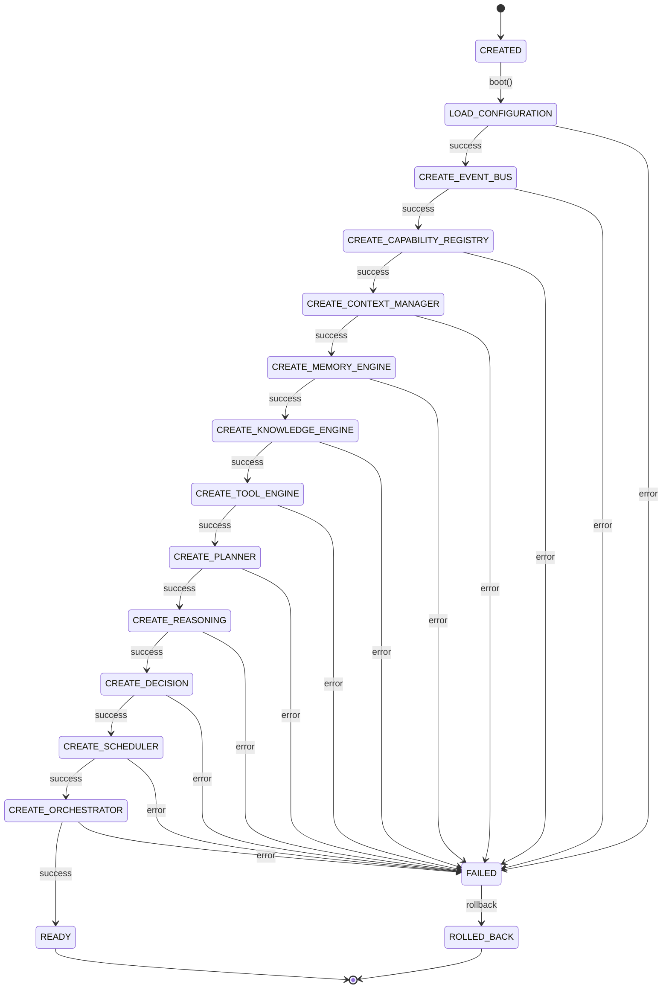
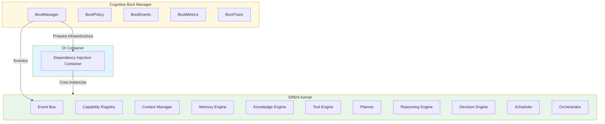

# Cognitive Boot Manager — Arquitectura

> **Documento de arquitectura para el Cognitive Boot Manager (CBM) de EREN.**
> El componente oficial para iniciar EREN de forma ordenada y reproducible.

| | |
|---|---|
| **Estado** | Fundacion implementada |
| **Fase** | Cognitiva - Fase 2 |
| **Tipo** | Boot Manager |
| **Paradigma** | EREN NO usa IA |

---

## Indice

- [1. Mision](#1-mision)
- [2. Filosofia](#2-filosofia)
- [3. Responsabilidades](#3-responsabilidades)
- [4. Restricciones](#4-restricciones)
- [5. Ciclo de Arranque](#5-ciclo-de-arranque)
- [6. Estados del Boot](#6-estados-del-boot)
- [7. Componentes](#7-componentes)
- [8. Integracion](#8-integracion)
- [9. Politicas](#9-politicas)
- [10. Eventos](#10-eventos)
- [11. Trazabilidad](#11-trazabilidad)
- [12. Buenas Practicas](#12-buenas-practicas)
- [13. Roadmap](#13-roadmap)

---

## 1. Mision

```
El Cognitive Boot Manager es el UNICO componente autorizado para iniciar EREN.

Su responsabilidad es arrancar todos los componentes del sistema
de forma ordenada y reproducible.

NO crea implementaciones concretas.
NO rompe contratos existentes.
NO modifica motores existentes.

Solo prepara la infraestructura para que el Dependency Injection Container
pueda crear las instancias reales despues.
```

---

## 2. Filosofia

```
Separacion clara:
================

Boot Manager (ESTE componente)
----------------------------------
- Coordina el arranque
- Gestiona estados de boot
- Valida contratos
- Publica eventos
- Recolecta metricas
- Soporta rollback

Dependency Injection Container (fuera del alcance)
----------------------------------
- Crea las instancias reales
- Inyecta dependencias
- Configura motores

Motores (ejecutores)
----------------------------------
- Planner: Planifica
- Knowledge: Consulta conocimiento
- Reasoning: Razo
- Decision: Decide
```

---

## 3. Responsabilidades

### 3.1 Lo Que Hace el Boot Manager

```
╔═══════════════════════════════════════════════════════════════════════════════╗
║                 RESPONSABILIDADES DEL BOOT MANAGER                           ║
╠═══════════════════════════════════════════════════════════════════════════════╣
║                                                                             ║
║  1. COORDINACION DEL ARRANQUE                                           ║
║     • Ejecutar secuencia de boot                                          ║
║     • Gestionar estados de boot                                          ║
║     • Controlar orden de inicializacion                                 ║
║                                                                             ║
║  2. VALIDACION                                                          ║
║     • Validar contratos antes del boot                                  ║
║     • Verificar dependencias                                            ║
║     • Detectar conflictos                                                ║
║                                                                             ║
║  3. ROLLBACK                                                             ║
║     • Revertir cambios en caso de fallo                                  ║
║     • Limpiar recursos                                                   ║
║     • Restaurar estado consistente                                        ║
║                                                                             ║
║  4. OBSERVABILIDAD                                                     ║
║     • Publicar eventos de boot                                          ║
║     • Recolectar metricas                                               ║
║     • Registrar traces                                                   ║
║                                                                             ║
╚═══════════════════════════════════════════════════════════════════════════════╝
```

### 3.2 Lo Que NO Hace el Boot Manager

```
╔═══════════════════════════════════════════════════════════════════════════════╗
║                RESTRICCIONES DEL BOOT MANAGER                             ║
╠═══════════════════════════════════════════════════════════════════════════════╣
║                                                                             ║
║  ✗ NO crea implementaciones concretas                                  ║
║  ✗ NO rompe contratos existentes                                      ║
║  ✗ NO modifica motores existentes                                     ║
║  ✗ NO crea dependencias circulares                                   ║
║  ✗ NO inyecta dependencias reales                                     ║
║  ✗ NO ejecuta logica de negocio                                      ║
║                                                                             ║
║  El Boot Manager SOLO prepara infraestructura.                          ║
║  El DI Container crea las instancias reales.                              ║
║                                                                             ║
╚═══════════════════════════════════════════════════════════════════════════════╝
```

---

## 4. Restricciones

### 4.1 Restricciones Arquitectonicas

| Restriccion | Descripcion |
|-------------|------------|
| No implementar | Solo infraestructura |
| No romper contratos | Usar interfaces existentes |
| No modificar motores | Solo preparar |
| No dependencias circulares | Orden estricto |
| No concrete implementations | Solo placeholders |

### 4.2 Restricciones de Seguridad

| Restriccion | Descripcion |
|-------------|------------|
| No secretos en codigo | Usar config externo |
| No hardcoded credentials | Usar variables de entorno |
| No paths absolutos | Usar configuracion |

---

## 5. Ciclo de Arranque

### 5.1 Diagrama de Estados



### 5.2 Secuencia de Boot

```
╔═══════════════════════════════════════════════════════════════════════════════╗
║                     SECUENCIA DE BOOT                                     ║
╠═══════════════════════════════════════════════════════════════════════════════╣
║                                                                             ║
║  1. CREATED                                                             ║
║     Estado inicial                                                        ║
║                                                                             ║
║  2. LOAD_CONFIGURATION                                                   ║
║     Cargar configuracion                                                  ║
║                                                                             ║
║  3. CREATE_EVENT_BUS                                                     ║
║     Preparar Event Bus (contrato)                                         ║
║                                                                             ║
║  4. CREATE_CAPABILITY_REGISTRY                                            ║
║     Preparar Capability Registry (contrato)                                 ║
║                                                                             ║
║  5. CREATE_CONTEXT_MANAGER                                                ║
║     Preparar Context Manager (contrato)                                    ║
║                                                                             ║
║  6. CREATE_MEMORY_ENGINE                                                   ║
║     Preparar Memory Engine (contrato)                                       ║
║                                                                             ║
║  7. CREATE_KNOWLEDGE_ENGINE                                                ║
║     Preparar Knowledge Engine (contrato)                                    ║
║                                                                             ║
║  8. CREATE_TOOL_ENGINE                                                     ║
║     Preparar Tool Engine (contrato)                                         ║
║                                                                             ║
║  9. CREATE_PLANNER                                                         ║
║     Preparar Planner (contrato)                                            ║
║                                                                             ║
║  10. CREATE_REASONING                                                      ║
║     Preparar Reasoning Engine (contrato)                                    ║
║                                                                             ║
║  11. CREATE_DECISION                                                      ║
║     Preparar Decision Engine (contrato)                                     ║
║                                                                             ║
║  12. CREATE_SCHEDULER                                                      ║
║     Preparar Scheduler (contrato)                                          ║
║                                                                             ║
║  13. CREATE_ORCHESTRATOR                                                   ║
║     Preparar Orchestrator (contrato)                                       ║
║                                                                             ║
║  14. READY                                                               ║
║     Sistema listo para iniciar                                            ║
║                                                                             ║
╚═══════════════════════════════════════════════════════════════════════════════╝
```

---

## 6. Estados del Boot

### 6.1 Estados Completos

| Estado | Descripcion |
|--------|-------------|
| CREATED | Boot Manager creado |
| LOAD_CONFIGURATION | Cargando configuracion |
| CREATE_EVENT_BUS | Creando Event Bus |
| CREATE_CAPABILITY_REGISTRY | Creando Capability Registry |
| CREATE_CONTEXT_MANAGER | Creando Context Manager |
| CREATE_MEMORY_ENGINE | Creando Memory Engine |
| CREATE_KNOWLEDGE_ENGINE | Creando Knowledge Engine |
| CREATE_TOOL_ENGINE | Creando Tool Engine |
| CREATE_PLANNER | Creando Planner |
| CREATE_REASONING | Creando Reasoning Engine |
| CREATE_DECISION | Creando Decision Engine |
| CREATE_SCHEDULER | Creando Scheduler |
| CREATE_ORCHESTRATOR | Creando Orchestrator |
| READY | Sistema listo |
| FAILED | Boot fallido |
| ROLLED_BACK | Rollback completado |

### 6.2 Estados de Paso

| Estado | Descripcion |
|--------|-------------|
| PENDING | Paso pendiente |
| IN_PROGRESS | Paso en ejecucion |
| COMPLETED | Paso completado |
| FAILED | Paso fallido |
| SKIPPED | Paso omitido |

---

## 7. Componentes

### 7.1 Archivos del Boot Manager

```
core/boot/
├── boot_manager.py       # Motor principal
├── boot_types.py         # Estados, configuraciones
├── boot_policy.py        # Politicas de boot
├── boot_events.py        # Eventos de boot
├── boot_metrics.py       # Metricas de boot
├── boot_trace.py        # Trazabilidad
├── exceptions.py        # Excepciones
└── __init__.py          # Exports
```

### 7.2 Tipos Principales

| Tipo | Descripcion |
|------|-------------|
| `BootState` | Estados del proceso de boot |
| `BootStatus` | Estados de cada paso |
| `BootStep` | Un paso individual |
| `BootResult` | Resultado del boot |
| `BootConfiguration` | Configuracion |

### 7.3 Politicas

| Politica | Descripcion |
|----------|-------------|
| `BootPolicy` | Politicas base |
| `BootPolicyPresets.development()` | Para desarrollo |
| `BootPolicyPresets.production()` | Para produccion |
| `BootPolicyPresets.testing()` | Para testing |

---

## 8. Integracion

### 8.1 Diagrama de Integracion



### 8.2 Integracion con Orchestrator

```
Boot Manager --> Orchestrator
   |
   +-- Prepara contrato
   +-- Valida contrato
   +-- Crea placeholder
   |
   v
DI Container --> Orchestrator
   |
   +-- Crea instancia real
   +-- Inyecta dependencias
   +-- Configura
```

### 8.3 Integracion con Scheduler

```
Boot Manager --> Scheduler
   |
   +-- Prepara contrato
   +-- Valida contrato
   +-- Crea placeholder
   |
   v
DI Container --> Scheduler
   |
   +-- Crea instancia real
   +-- Configura politicas
```

### 8.4 Integracion con Capability Registry

```
Boot Manager --> Capability Registry
   |
   +-- Prepara contrato
   +-- Valida contrato
   +-- Registra capacidades
   |
   v
DI Container --> Capability Registry
   |
   +-- Crea instancia real
   +-- Carga capacidades
```

---

## 9. Politicas

### 9.1 Opciones de Politicas

| Politica | Descripcion | Default |
|----------|------------|---------|
| `strict_mode` | Modo estricto | True |
| `stop_on_error` | Parar en error | True |
| `enable_rollback` | Habilitar rollback | True |
| `timeout_ms` | Timeout total | 30000 |
| `step_timeout_ms` | Timeout por paso | 5000 |
| `validate_contracts` | Validar contratos | True |
| `enable_health_checks` | Verificaciones de salud | True |

### 9.2 Presets

```python
# Produccion
BootPolicyPresets.production()

# Desarrollo
BootPolicyPresets.development()

# Testing
BootPolicyPresets.testing()
```

---

## 10. Eventos

### 10.1 Eventos del Boot

| Evento | Descripcion |
|--------|------------|
| `BootStarted` | Inicio del boot |
| `BootStepStarted` | Inicio de un paso |
| `BootStepCompleted` | Paso completado |
| `BootStepFailed` | Paso fallido |
| `BootStepSkipped` | Paso omitido |
| `BootCompleted` | Boot completado |
| `BootFailed` | Boot fallido |
| `BootRollbackStarted` | Inicio de rollback |
| `BootRollbackCompleted` | Rollback completado |
| `ConfigurationLoaded` | Configuracion cargada |
| `ContractValidated` | Contrato validado |
| `HealthCheckPassed` | Verificacion pasada |
| `HealthCheckFailed` | Verificacion fallida |

---

## 11. Trazabilidad

### 11.1 BootTraceEntry

```python
@dataclass
class BootTraceEntry:
    entry_id: str           # ID unico
    timestamp: str         # Timestamp ISO
    step_name: str        # Nombre del paso
    state: str            # Estado
    status: str           # Status
    error: str            # Error si existe
    duration_ms: int       # Duracion
    metadata: dict        # Metadatos
```

### 11.2 Metricas de Boot

| Metrica | Descripcion |
|---------|------------|
| `boot_attempts` | Intentos de boot |
| `boot_successes` | Boots exitosos |
| `boot_failures` | Boots fallidos |
| `rollbacks` | Rollbacks |
| `steps_completed` | Pasos completados |
| `steps_failed` | Pasos fallidos |
| `success_rate` | Tasa de exito |

---

## 12. Buenas Practicas

### 12.1 Antes del Boot

```
✓ Validar configuracion
✓ Verificar permisos
✓ Verificar dependencias
✓ Preparar logging
✓ Preparar metricas
```

### 12.2 Durante el Boot

```
✓ Registrar cada paso
✓ Validar contratos
✓ Publicar eventos
✓ Manejar errores
✓ Soportar rollback
```

### 12.3 Despues del Boot

```
✓ Verificar salud
✓ Confirmar metricas
✓ Limpiar recursos
✓ Documentar estado
```

---

## 13. Roadmap

### Fase 1: Fundacion (Actual)
```
- Core Boot Manager
- Estados y secuencias
- Politicas basicas
- Trazabilidad
```

### Fase 2: Validacion
```
- Validacion de contratos
- Verificaciones de salud
- Deteccion de conflictos
```

### Fase 3: Recovery
```
- Recovery de boot
- Retry inteligente
- Fallback strategies
```

### Fase 4: Distribuido
```
- Boot distribuido
- Particion de componentes
- Coordinacion entre nodos
```

---

## Referencias

| Referencia | Ubicacion |
|------------|-----------|
| Cognitive Orchestrator | [../core/orchestrator.md](./orchestrator.md) |
| Cognitive Scheduler | [../core/scheduler.md](./scheduler.md) |
| Cognitive Processing Pipeline | [../architecture/cognitive-processing-pipeline.md](../architecture/cognitive-processing-pipeline.md) |

---

**Ultima actualizacion:** 2026-07-13  
**Estado:** Fundacion implementada  
**Fase:** Cognitiva - Fase 2  
**Tipo:** Documentacion arquitectonica  
**Paradigma:** EREN NO usa IA