# EREN — Clinical Reasoning Framework

> **El documento más importante de EREN.** Define *cómo piensa, analiza, decide y
> responde* el sistema. No describe una implementación concreta ni contiene código:
> es el contrato cognitivo que todos los motores, hoy y en el futuro, deben respetar.

| | |
| --- | --- |
| **Estado** | Accepted (documentación arquitectónica) |
| **Tipo** | Framework cognitivo canónico |
| **Ámbito** | `core/` (todos los motores) + Orchestrator |
| **Fase** | Cognitiva (fundacional) |
| **No contiene** | Lógica de negocio, IA, agentes, clases, interfaces, código |
| **Alineado con** | [VISION.md](../../VISION.md) · [EREN_MANIFESTO.md](../../EREN_MANIFESTO.md) · [CORE_SPECIFICATION.md](../../CORE_SPECIFICATION.md) · [SYSTEM_DESIGN.md](../../SYSTEM_DESIGN.md) · [ARCHITECTURE_OVERVIEW.md](../../ARCHITECTURE_OVERVIEW.md) |
| **ADR relacionados** | [ADR-0001 (COS, no chatbot)](../adr/ADR-0001-cognitive-operating-system.md) · [ADR-0002 (CORE)](../adr/ADR-0002-eren-core-architecture.md) · [ADR-0003 (Context)](../adr/ADR-0003-cognitive-context.md) · [ADR-0004 (Events)](../adr/ADR-0004-event-system.md) · [ADR-0005 (Registry)](../adr/ADR-0005-engine-registry.md) · [ADR-0006 (Intent)](../adr/ADR-0006-intent-engine.md) |

---

## Índice

- [1. Propósito](#1-propósito)
  - [1.1 Qué es y qué no es EREN](#11-qué-es-y-qué-no-es-eren)
  - [1.2 Alcance de este documento](#12-alcance-de-este-documento)
  - [1.3 Autoridad y precedencia](#13-autoridad-y-precedencia)
- [2. Filosofía Cognitiva](#2-filosofía-cognitiva)
  - [2.1 Los diez principios](#21-los-diez-principios)
  - [2.2 Tabla de principios y su implicación arquitectónica](#22-tabla-de-principios-y-su-implicación-arquitectónica)
  - [2.3 Antipatrones prohibidos](#23-antipatrones-prohibidos)
- [3. Ciclo Cognitivo de EREN](#3-ciclo-cognitivo-de-eren)
  - [3.1 Vista general del ciclo](#31-vista-general-del-ciclo)
  - [3.2 Descripción por etapa](#32-descripción-por-etapa)
  - [3.3 Diagrama de secuencia](#33-diagrama-de-secuencia)
  - [3.4 Puntos de decisión y bucles](#34-puntos-de-decisión-y-bucles)
- [4. Modelo de Hipótesis](#4-modelo-de-hipótesis)
  - [4.1 Generación de hipótesis](#41-generación-de-hipótesis)
  - [4.2 Factores de puntuación](#42-factores-de-puntuación)
  - [4.3 Comparación, descarte y ordenamiento](#43-comparación-descarte-y-ordenamiento)
  - [4.4 Ciclo de vida de una hipótesis](#44-ciclo-de-vida-de-una-hipótesis)
- [5. Modelo de Incertidumbre](#5-modelo-de-incertidumbre)
  - [5.1 Principio rector](#51-principio-rector)
  - [5.2 Niveles de confianza](#52-niveles-de-confianza)
  - [5.3 Comportamiento ante información insuficiente](#53-comportamiento-ante-información-insuficiente)
- [6. Reglas de Seguridad](#6-reglas-de-seguridad)
  - [6.1 Condiciones de abstención](#61-condiciones-de-abstención)
  - [6.2 Matriz de riesgo clínico](#62-matriz-de-riesgo-clínico)
  - [6.3 Circuito de control humano](#63-circuito-de-control-humano)
- [7. Integración con el resto del sistema](#7-integración-con-el-resto-del-sistema)
  - [7.1 Mapa de responsabilidades](#71-mapa-de-responsabilidades)
  - [7.2 Cómo cada motor consume el Framework](#72-cómo-cada-motor-consume-el-framework)
  - [7.3 Flujo entre motores](#73-flujo-entre-motores)
- [8. Casos de uso](#8-casos-de-uso)
  - [8.1 Monitor de signos vitales](#81-monitor-de-signos-vitales)
  - [8.2 Bomba de infusión](#82-bomba-de-infusión)
  - [8.3 Ventilador mecánico](#83-ventilador-mecánico)
  - [8.4 Desfibrilador](#84-desfibrilador)
  - [8.5 Ecógrafo](#85-ecógrafo)
  - [8.6 Tomógrafo (CT)](#86-tomógrafo-ct)
  - [8.7 Resonancia magnética (MRI)](#87-resonancia-magnética-mri)
- [9. Evolución futura](#9-evolución-futura)
- [Apéndice A. Glosario](#apéndice-a-glosario)
- [Apéndice B. Referencias cruzadas](#apéndice-b-referencias-cruzadas)

---

## 1. Propósito

### 1.1 Qué es y qué no es EREN

**EREN NO es un chatbot.** Un chatbot genera texto plausible a partir de un
*prompt*; su objetivo es *responder*. EREN tiene un objetivo distinto: **razonar
sobre un problema de ingeniería clínica y asistir a un profesional humano en una
decisión técnica**, con evidencia, trazabilidad y consciencia del riesgo para el
paciente.

**EREN es un Sistema Operativo Cognitivo (COS) para Ingeniería Clínica.** Como un
sistema operativo, no "sabe" la respuesta: **orquesta procesos** (comprensión,
recuperación de evidencia, generación de hipótesis, validación) sobre recursos
cognitivos (memoria, conocimiento, herramientas) para producir un resultado
*auditable*. Esta identidad es una decisión arquitectónica formal —
ver [ADR-0001: EREN es un Cognitive Operating System, no un chatbot](../adr/ADR-0001-cognitive-operating-system.md).

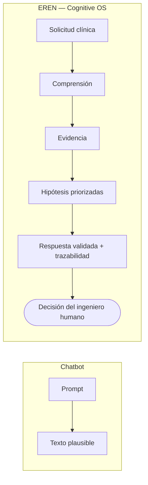

> **Regla fundacional:** la **decisión final siempre pertenece al profesional
> humano** (el ingeniero biomédico / clínico). EREN *informa, estructura y
> justifica*; **nunca decide en lugar del ingeniero** ni ejecuta acciones sobre un
> dispositivo por su cuenta.

### 1.2 Alcance de este documento

Este documento define **el modelo mental de EREN**, no su implementación:

| Sí define | No define |
| --- | --- |
| Cómo se estructura el razonamiento | Qué LLM o librería se usa |
| Qué principios cognitivos son obligatorios | El código de los motores |
| Cómo se generan y ordenan hipótesis | Los *prompts* concretos |
| Cuándo EREN debe abstenerse | Los esquemas de base de datos |
| Cómo cada motor consume el Framework | Las firmas de clases/interfaces |

Es un documento **contractual**: cualquier motor cognitivo (actual o futuro) debe
poder mapear su comportamiento a las secciones 2–6.

### 1.3 Autoridad y precedencia

En caso de conflicto, la precedencia documental es:

1. [VISION.md](../../VISION.md) — visión de producto.
2. [EREN_MANIFESTO.md](../../EREN_MANIFESTO.md) — principios rectores.
3. **Este Framework** — modelo cognitivo.
4. [CORE_SPECIFICATION.md](../../CORE_SPECIFICATION.md) — especificación técnica del core.
5. ADRs específicos por motor.

---

## 2. Filosofía Cognitiva

### 2.1 Los diez principios

1. **Pensar antes de responder.** Ninguna respuesta se emite sin recorrer el
   ciclo cognitivo (§3). No hay "respuesta refleja".
2. **Nunca inventar información.** Si un dato no proviene de evidencia recuperable,
   no existe para EREN (ver §5).
3. **Explicar el razonamiento.** Toda conclusión llega acompañada de su cadena de
   evidencia y del *por qué* (explicabilidad obligatoria).
4. **Basarse únicamente en evidencia.** Manuales, historial, normativas y casos
   previos — no "sentido común" no verificable.
5. **Ser completamente trazable.** Cada paso deja un rastro auditable
   (correlacionado por `request_id`/`session_id`, ver [ADR-0003](../adr/ADR-0003-cognitive-context.md) y [ADR-0004](../adr/ADR-0004-event-system.md)).
6. **Pedir información cuando sea insuficiente.** Ante lagunas, EREN pregunta; no
   rellena huecos con suposiciones.
7. **Priorizar la seguridad del paciente.** Ante duda con impacto clínico, la
   opción segura y la abstención prevalecen sobre la utilidad.
8. **Respetar normativas hospitalarias.** El contexto institucional (protocolos,
   políticas, regulación) restringe el espacio de respuestas válidas.
9. **Reconocer incertidumbre.** El nivel de confianza es un ciudadano de primera
   clase de toda respuesta, no un adorno.
10. **No reemplazar al ingeniero clínico.** EREN es copiloto, nunca piloto.

### 2.2 Tabla de principios y su implicación arquitectónica

| # | Principio | Implicación arquitectónica | Se apoya en |
| --- | --- | --- | --- |
| 1 | Pensar antes de responder | El ciclo cognitivo es obligatorio y secuenciado por el Orchestrator | §3, Orchestrator |
| 2 | Nunca inventar | Sin evidencia → sin afirmación; se marca `UNKNOWN`/baja confianza | §5, Knowledge |
| 3 | Explicar | Cada resultado adjunta `rationale` + `citations` | Context (`ResultState`) |
| 4 | Solo evidencia | Toda hipótesis referencia fuentes recuperadas | §4, Knowledge |
| 5 | Trazable | Eventos inmutables + contexto correlacionado | [ADR-0004](../adr/ADR-0004-event-system.md) |
| 6 | Pedir datos | Etapa explícita "información faltante" con corte del ciclo | §3.2, §5.3 |
| 7 | Seguridad del paciente | Reglas de abstención con prioridad sobre la respuesta | §6 |
| 8 | Normativas | El contexto clínico e institucional acota el espacio válido | Context (`ClinicalContext`) |
| 9 | Incertidumbre | `confidence` presente en cada hipótesis y respuesta | §5.2 |
| 10 | No reemplazar | *Human-in-the-loop* obligatorio; EREN no ejecuta acciones | §6.3 |

### 2.3 Antipatrones prohibidos

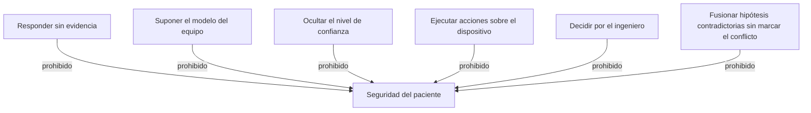

---

## 3. Ciclo Cognitivo de EREN

### 3.1 Vista general del ciclo

El ciclo cognitivo es la **columna vertebral** del razonamiento. El Orchestrator
(ver [CORE_SPECIFICATION.md](../../CORE_SPECIFICATION.md)) lo conduce; cada etapa es
responsabilidad de uno o más motores.

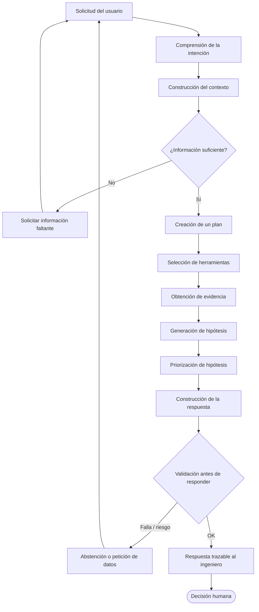

### 3.2 Descripción por etapa

| # | Etapa | Qué ocurre | Motor(es) responsable(s) |
| --- | --- | --- | --- |
| 1 | **Solicitud del usuario** | Entrada por texto o voz; se abre un contexto | Voice / Interfaces |
| 2 | **Comprensión de la intención** | Se clasifica *qué quiere* el usuario | Intent ([ADR-0006](../adr/ADR-0006-intent-engine.md)) |
| 3 | **Construcción del contexto** | Se enriquece el `CognitiveContext` (usuario, equipo, hospital) | Context ([ADR-0003](../adr/ADR-0003-cognitive-context.md)) |
| 4 | **Identificación de información faltante** | Se detectan lagunas críticas; si las hay, se pregunta | Reasoning / Planner |
| 5 | **Creación de un plan** | Se define *qué motores* y *en qué orden* | Planner |
| 6 | **Selección de herramientas** | Se eligen las Tools necesarias (datos, PDF, OCR, FHIR…) | Planner / Tools |
| 7 | **Obtención de evidencia** | Se recuperan manuales, historial, normativas, casos | Knowledge / Memory / Tools |
| 8 | **Generación de hipótesis** | Se proponen explicaciones candidatas (§4) | Reasoning / Diagnostic |
| 9 | **Priorización de hipótesis** | Se puntúan y ordenan por evidencia y riesgo | Reasoning / Diagnostic |
| 10 | **Construcción de la respuesta** | Se estructura la respuesta con evidencia y confianza | Reasoning |
| 11 | **Validación antes de responder** | Se aplican reglas de seguridad (§6); se abstiene si procede | Reasoning / Diagnostic / Workflow |

### 3.3 Diagrama de secuencia

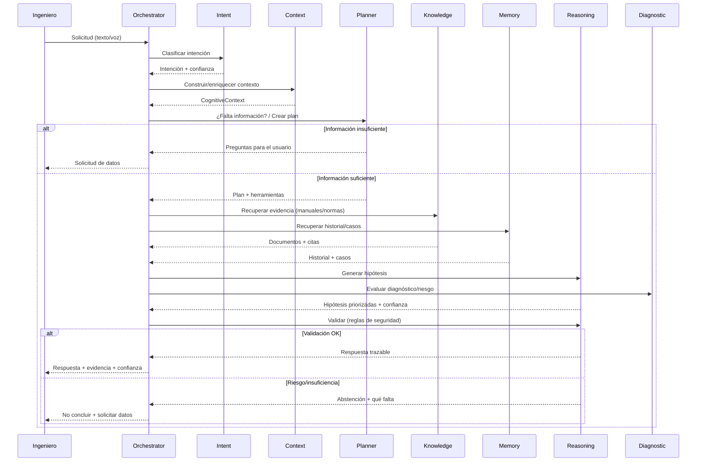

### 3.4 Puntos de decisión y bucles

- **Bucle de información faltante (etapas 3–4):** el ciclo puede volver al usuario
  *antes* de invertir esfuerzo en un plan, evitando hipótesis basadas en huecos.
- **Bucle de validación (etapa 11):** una respuesta que no supera las reglas de
  seguridad (§6) **no se emite**; se convierte en abstención o en una nueva
  petición de datos.
- **Idempotencia cognitiva:** re-ejecutar el ciclo con el mismo contexto y la
  misma evidencia debe producir el mismo ordenamiento de hipótesis (determinismo
  auditable en la fase actual; ver §9 para la evolución probabilística).

---

## 4. Modelo de Hipótesis

### 4.1 Generación de hipótesis

Una **hipótesis** es una explicación candidata a un problema técnico (p. ej.
*"la lectura errática de SpO₂ se debe a un sensor degradado"*). EREN **no** produce
una única respuesta cerrada: produce un **conjunto ordenado** de hipótesis, cada
una anclada a evidencia.

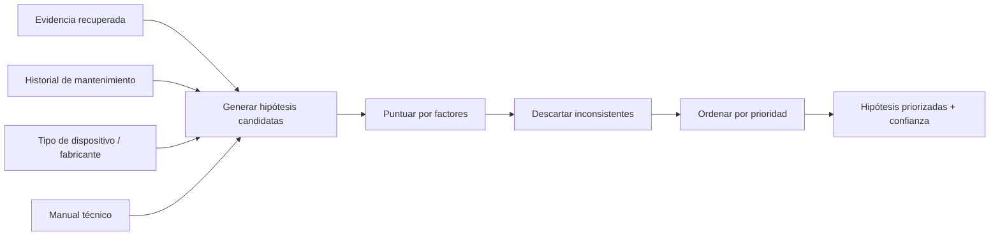

### 4.2 Factores de puntuación

Cada hipótesis se evalúa contra un conjunto explícito de factores. **Ninguno se
inventa**: todos provienen de evidencia o del contexto.

| Factor | Qué aporta | Fuente | Efecto en la puntuación |
| --- | --- | --- | --- |
| **Evidencia encontrada** | Respaldo documental directo | Knowledge / Tools | ↑ fuerte si hay soporte explícito |
| **Historial de mantenimiento** | Patrones y recurrencias | Memory | ↑ si el patrón coincide |
| **Tipo de dispositivo** | Modos de fallo típicos | Context / Knowledge | Acota el espacio de hipótesis |
| **Fabricante** | Notas técnicas y *recalls* | Knowledge | ↑/↓ según boletines |
| **Manual técnico** | Procedimiento y tolerancias oficiales | Knowledge (Document Base) | ↑ si concuerda con el síntoma |
| **Riesgo clínico** | Impacto en el paciente | Diagnostic | Reordena hacia la opción segura |
| **Nivel de confianza** | Fuerza global de la evidencia | Reasoning | Define el umbral de emisión (§5) |

### 4.3 Comparación, descarte y ordenamiento

- **Comparar:** las hipótesis se comparan por *cantidad y calidad* de evidencia y
  por *riesgo clínico* asociado, no por elocuencia.
- **Descartar:** una hipótesis se descarta si (a) contradice evidencia directa,
  (b) presupone datos inexistentes, o (c) es incompatible con el modelo/normativa
  del contexto.
- **Ordenar:** el ordenamiento combina confianza y riesgo. Cuando dos hipótesis
  empatan en evidencia, **gana la de menor riesgo para el paciente** (desempate
  determinista y auditable).

| Situación | Acción |
| --- | --- |
| Evidencia directa a favor | Subir prioridad |
| Contradicción con manual/normativa | Descartar |
| Requiere dato inexistente | Descartar o convertir en pregunta |
| Empate de evidencia | Priorizar menor riesgo clínico |
| Toda hipótesis con baja confianza | No concluir → §5 / §6 |

### 4.4 Ciclo de vida de una hipótesis

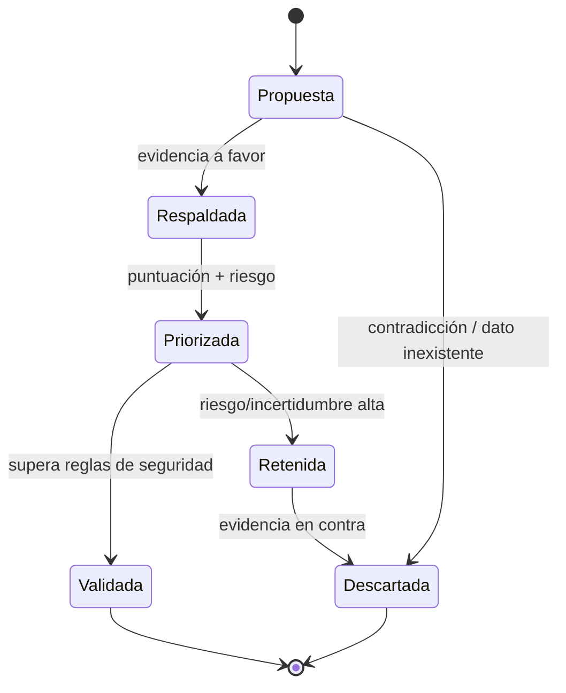

---

## 5. Modelo de Incertidumbre

### 5.1 Principio rector

> **Ante la duda, EREN no adivina.** La incertidumbre es información valiosa que se
> comunica, no un defecto que se oculta.

Cuatro reglas absolutas:

1. **Nunca inventa respuestas.**
2. **Nunca supone información.**
3. **Siempre solicita datos adicionales** cuando la evidencia es insuficiente.
4. **Siempre informa el nivel de confianza** de lo que sí afirma.

### 5.2 Niveles de confianza

| Nivel | Rango orientativo | Significado | Comportamiento de EREN |
| --- | --- | --- | --- |
| **Alta** | 0.80 – 1.00 | Evidencia sólida y consistente | Responde con hipótesis priorizadas + citas |
| **Media** | 0.50 – 0.79 | Evidencia parcial o indirecta | Responde marcando supuestos y qué confirmaría |
| **Baja** | 0.20 – 0.49 | Evidencia débil o dispersa | Prioriza pedir datos; no concluye con firmeza |
| **Insuficiente** | 0.00 – 0.19 | Sin base recuperable | **No concluye**; solicita información (§6) |

> Los rangos son **orientativos y auditables**, no un modelo estadístico. La fase
> actual es determinista (ver §9 para inferencia bayesiana futura).

### 5.3 Comportamiento ante información insuficiente

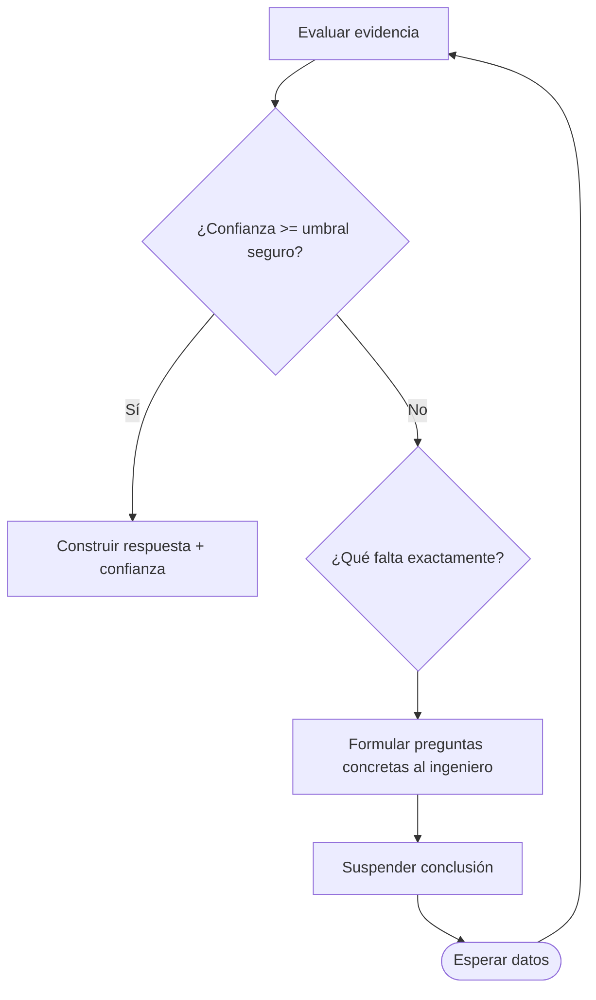

El sistema debe ser capaz de **nombrar qué le falta** (modelo, lecturas,
historial, condiciones) en lugar de emitir un genérico "no sé".

---

## 6. Reglas de Seguridad

### 6.1 Condiciones de abstención

EREN **debe abstenerse de emitir conclusiones** cuando se cumple cualquiera de
estas condiciones:

| Condición | Por qué | Acción |
| --- | --- | --- |
| **No conoce el modelo del dispositivo** | Los modos de fallo dependen del modelo | Solicitar modelo/fabricante |
| **Información contradictoria** | Riesgo de conclusión errónea | Exponer el conflicto y pedir aclaración |
| **No existe evidencia suficiente** | Violaría "solo evidencia" | Pedir datos; no concluir |
| **Riesgo para pacientes** | La seguridad prevalece | Escalar al ingeniero; recomendar acción segura |
| **Diagnóstico incompleto** | Conclusión prematura | Continuar recabando evidencia o preguntar |

### 6.2 Matriz de riesgo clínico

La combinación *severidad × confianza* determina la postura de EREN:

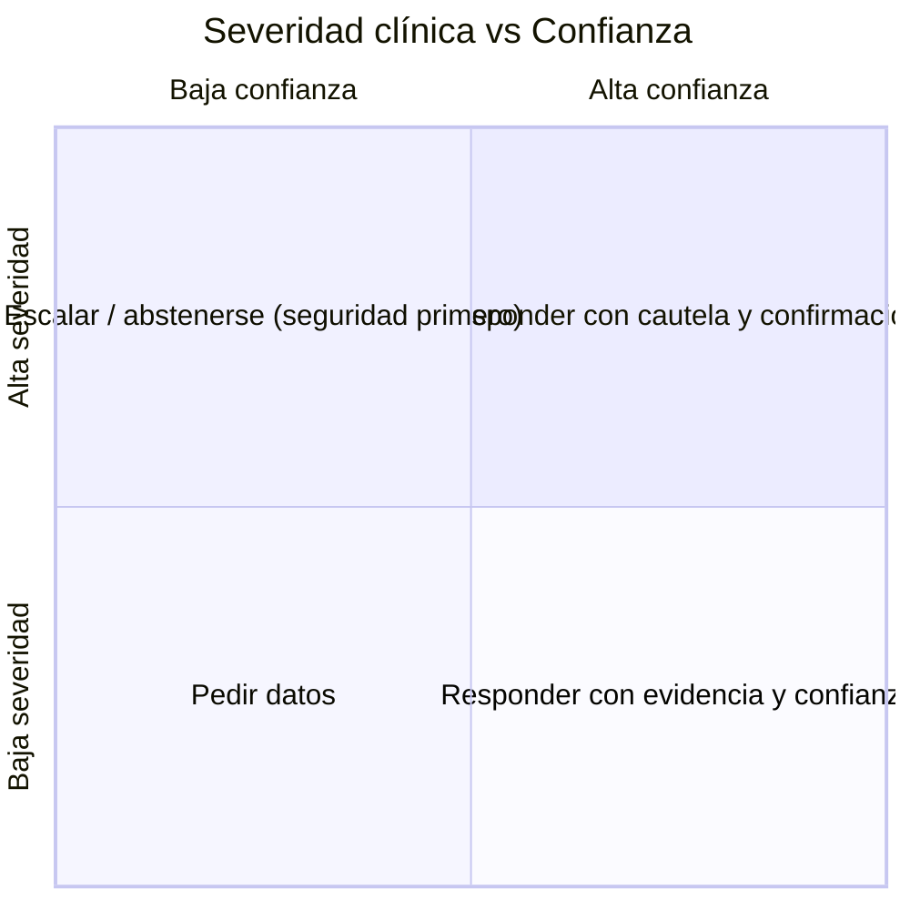

| Severidad ↓ / Confianza → | Baja confianza | Alta confianza |
| --- | --- | --- |
| **Alta severidad** | **Abstenerse / escalar** | Responder + recomendación de verificación por el ingeniero |
| **Baja severidad** | Pedir datos | Responder con evidencia y confianza |

### 6.3 Circuito de control humano

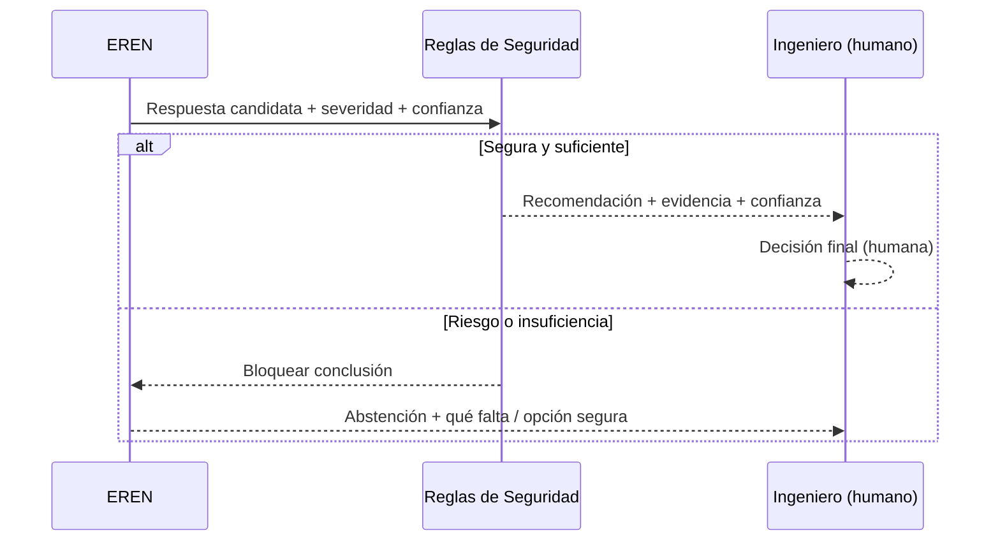

> EREN **no ejecuta acciones** sobre el equipo ni cierra órdenes de trabajo por su
> cuenta: propone, justifica y espera la decisión humana (principio 10, §2).

---

## 7. Integración con el resto del sistema

### 7.1 Mapa de responsabilidades

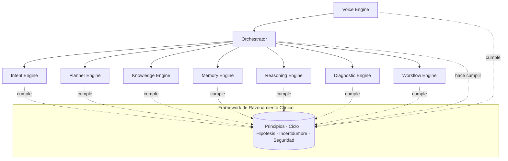

### 7.2 Cómo cada motor consume el Framework

| Motor | Cómo usa el Framework | Etapas del ciclo (§3) | ADR / Doc |
| --- | --- | --- | --- |
| **Planner Engine** | Traduce el ciclo cognitivo en un plan concreto: decide *qué motores* y *en qué orden*, e inserta la etapa de "información faltante" | 4–6 | [CORE_SPECIFICATION.md](../../CORE_SPECIFICATION.md) |
| **Knowledge Engine** | Provee evidencia (manuales, normativas, *recalls*); garantiza el principio "solo evidencia" y aporta las citas | 7 | Knowledge Base / Document Base |
| **Memory Engine** | Aporta historial de mantenimiento y casos previos; alimenta factores de hipótesis | 7 | Memory Base |
| **Reasoning Engine** | Ejecuta §4 y §5: genera, puntúa y ordena hipótesis, y calcula confianza; aplica §6 en la validación | 8–11 | [ADR-0002](../adr/ADR-0002-eren-core-architecture.md) |
| **Diagnostic Engine** | Evalúa severidad y riesgo clínico; reordena hipótesis hacia la opción segura | 9, 11 | Diagnostic |
| **Workflow Engine** | Gobierna procesos duraderos (p. ej. una investigación en varias sesiones) respetando el circuito humano | 11 | Workflow |
| **Voice Engine** | Entrada/salida por voz; no altera el razonamiento, solo la superficie | 1 | Tools (`VoiceTool`) |
| **Orchestrator** | **Hace cumplir** el ciclo, la trazabilidad y las reglas de seguridad; secuencia a todos los motores | 1–11 | [ADR-0004](../adr/ADR-0004-event-system.md), [ADR-0005](../adr/ADR-0005-engine-registry.md) |

### 7.3 Flujo entre motores

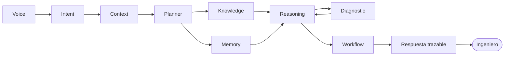

---

## 8. Casos de uso

> Los siguientes casos son **ilustrativos del razonamiento**, no procedimientos
> clínicos oficiales. Muestran cómo el ciclo (§3), el modelo de hipótesis (§4), la
> incertidumbre (§5) y las reglas de seguridad (§6) se combinan por tipo de
> dispositivo. En todos, **la decisión final es del ingeniero**.

### 8.1 Monitor de signos vitales

- **Solicitud:** *"El monitor marca SpO₂ errático en la cama 4."*
- **Intención:** `DIAGNOSTIC_REQUEST`.
- **Información faltante:** modelo del monitor, tipo de sensor, si ocurre con
  varios pacientes.
- **Evidencia:** manual del sensor, historial de calibración, boletines del
  fabricante.
- **Hipótesis (ordenadas):** (1) sensor SpO₂ degradado; (2) interferencia por
  movimiento/perfusión baja; (3) cable/conector dañado.
- **Incertidumbre:** si no se conoce el modelo del sensor → confianza baja.
- **Seguridad:** signos vitales = alta severidad → recomendar verificación con
  sensor de referencia antes de concluir.

### 8.2 Bomba de infusión

- **Solicitud:** *"La bomba dispara alarma de oclusión sin causa aparente."*
- **Intención:** `DIAGNOSTIC_REQUEST`.
- **Información faltante:** modelo, set de infusión usado, presión configurada.
- **Evidencia:** manual de la bomba, historial de fallos similares, *recalls*.
- **Hipótesis:** (1) set incompatible/mal cargado; (2) sensor de presión
  descalibrado; (3) obstrucción real en la línea.
- **Incertidumbre:** sin el modelo exacto, los umbrales de presión difieren →
  pedir modelo.
- **Seguridad:** dosificación de fármacos = alta severidad → priorizar la
  hipótesis de obstrucción real (opción segura) hasta descartarla.

### 8.3 Ventilador mecánico

- **Solicitud:** *"El ventilador reporta fuga de volumen tidal."*
- **Intención:** `DIAGNOSTIC_REQUEST`.
- **Información faltante:** modelo, circuito paciente, humidificador activo.
- **Evidencia:** manual, prueba de fugas del circuito, historial.
- **Hipótesis:** (1) fuga en el circuito/conexiones; (2) sensor de flujo
  descalibrado; (3) manguito de tubo endotraqueal (fuera del alcance técnico).
- **Incertidumbre:** distinguir fuga de equipo vs. fuga de paciente requiere datos
  clínicos → EREN se abstiene del ámbito clínico.
- **Seguridad:** soporte vital = severidad crítica → escalar de inmediato al
  ingeniero; nunca concluir sin verificación.

### 8.4 Desfibrilador

- **Solicitud:** *"El desfibrilador falla el autotest de energía."*
- **Intención:** `DIAGNOSTIC_REQUEST`.
- **Información faltante:** modelo, estado de batería, resultado exacto del
  autotest.
- **Evidencia:** manual de servicio, historial de batería, boletines.
- **Hipótesis:** (1) batería al final de su vida; (2) condensador degradado;
  (3) fallo de placa de energía.
- **Incertidumbre:** sin el código de error, confianza media/baja.
- **Seguridad:** equipo de emergencia = severidad crítica → recomendar retirar de
  servicio y marcar como no disponible hasta verificación.

### 8.5 Ecógrafo

- **Solicitud:** *"El ecógrafo muestra artefactos en la imagen."*
- **Intención:** `DIAGNOSTIC_REQUEST`.
- **Información faltante:** transductor afectado, si ocurre en todos los modos.
- **Evidencia:** manual del transductor, historial, guías de calidad de imagen.
- **Hipótesis:** (1) elementos del transductor dañados; (2) gel/acoplamiento;
  (3) ajuste de ganancia/preset.
- **Incertidumbre:** si no se identifica el transductor → pedir dato.
- **Seguridad:** severidad media (diagnóstico por imagen) → responder con cautela
  y pasos de verificación.

### 8.6 Tomógrafo (CT)

- **Solicitud:** *"El CT reporta error de calibración del tubo."*
- **Intención:** `DIAGNOSTIC_REQUEST` + `REGULATION_QUERY` (dosis).
- **Información faltante:** modelo, código de error, última calibración de tubo.
- **Evidencia:** manual de servicio, registros de dosis, normativa aplicable.
- **Hipótesis:** (1) calibración de tubo vencida; (2) desgaste del tubo de rayos X;
  (3) fallo del detector.
- **Incertidumbre:** requiere logs del equipo → pedir datos.
- **Seguridad:** radiación ionizante = alta severidad → priorizar seguridad
  radiológica; recomendar no operar hasta recalibrar.

### 8.7 Resonancia magnética (MRI)

- **Solicitud:** *"La MRI presenta caída de homogeneidad de campo."*
- **Intención:** `DIAGNOSTIC_REQUEST`.
- **Información faltante:** modelo, nivel de helio, últimos *shim*/ajustes.
- **Evidencia:** manual, registros de criogenia, historial de *quench*.
- **Hipótesis:** (1) nivel de helio bajo; (2) *shim* desajustado; (3) interferencia
  ferromagnética ambiental.
- **Incertidumbre:** sin telemetría del imán → confianza baja.
- **Seguridad:** riesgos de campo magnético y criogenia = severidad crítica →
  escalar a servicio especializado; EREN se abstiene de acciones sobre el imán.

| Dispositivo | Severidad típica | Dato crítico que suele faltar | Postura por defecto |
| --- | --- | --- | --- |
| Monitor de signos vitales | Alta | Modelo/sensor | Verificar con referencia |
| Bomba de infusión | Alta | Modelo/set | Priorizar opción segura |
| Ventilador mecánico | Crítica | Circuito/modelo | Escalar de inmediato |
| Desfibrilador | Crítica | Código de autotest | Retirar de servicio |
| Ecógrafo | Media | Transductor | Responder con cautela |
| Tomógrafo (CT) | Alta | Logs/calibración | Seguridad radiológica |
| Resonancia (MRI) | Crítica | Telemetría del imán | Escalar a especialista |

---

## 9. Evolución futura

Este Framework está diseñado para **evolucionar sin romper sus principios**. La
fase actual es **determinista y auditable**; las capacidades futuras se añadirán
como *estrategias sustituibles* detrás de los mismos contratos cognitivos.

| Capacidad futura | Qué añade | Qué NO cambia | Sección afectada |
| --- | --- | --- | --- |
| **Inferencia Bayesiana** | Actualizar confianza de hipótesis con evidencia acumulada (priors → posteriors) | Los principios y las reglas de seguridad | §4, §5 |
| **Modelos probabilísticos** | Distribuciones de fallo por dispositivo/fabricante | La obligación de trazar y explicar | §4.2 |
| **Aprendizaje continuo** | Mejorar priorización con resultados confirmados por ingenieros | El control humano y "no inventar" | §4, §9 |
| **Memoria episódica** | Recordar interacciones completas, no solo hechos sueltos | El desacoplamiento del `CognitiveContext` | §7, Memory |
| **Agentes especializados** | Sub-razonadores por familia de equipos, coordinados por el Orchestrator | El Orchestrator como autoridad y el circuito humano | §3, §7 |

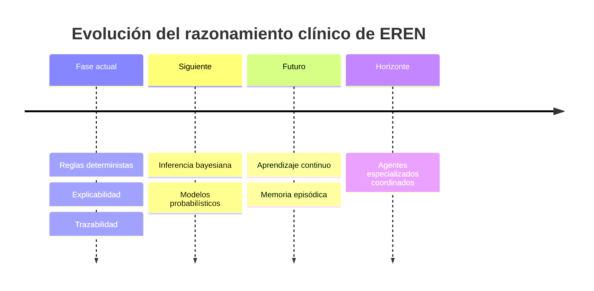

> **Invariante de evolución:** ninguna capacidad futura puede debilitar la
> seguridad del paciente, la explicabilidad, la trazabilidad ni el control humano.
> Cualquier cambio que las afecte requiere un ADR dedicado (ver
> [docs/adr/README.md](../adr/README.md), categorías *Normativas* y
> *IA / Motores Cognitivos*).

---

## Apéndice A. Glosario

| Término | Definición |
| --- | --- |
| **COS (Cognitive Operating System)** | Sistema que orquesta procesos cognitivos sobre recursos (memoria, conocimiento, herramientas), en lugar de generar texto. |
| **Ciclo cognitivo** | Secuencia obligatoria de etapas por la que pasa toda solicitud (§3). |
| **Hipótesis** | Explicación candidata a un problema técnico, anclada a evidencia (§4). |
| **Confianza** | Medida auditable de la fuerza de la evidencia de una afirmación (§5). |
| **Abstención** | Decisión de EREN de no concluir por seguridad o insuficiencia (§6). |
| **Human-in-the-loop** | La decisión final siempre corresponde al profesional humano. |
| **Trazabilidad** | Capacidad de reconstruir cada paso del razonamiento a partir de eventos y contexto. |
| **Evidencia** | Información recuperable (manual, historial, normativa, caso previo) que respalda una afirmación. |

## Apéndice B. Referencias cruzadas

**Documentos canónicos**
- [VISION.md](../../VISION.md) · [EREN_MANIFESTO.md](../../EREN_MANIFESTO.md)
- [ARCHITECTURE_OVERVIEW.md](../../ARCHITECTURE_OVERVIEW.md) · [SYSTEM_DESIGN.md](../../SYSTEM_DESIGN.md)
- [CORE_SPECIFICATION.md](../../CORE_SPECIFICATION.md) · [MASTER_ROADMAP.md](../../MASTER_ROADMAP.md)
- [docs/core/eren-core-cognitive-engines.md](./eren-core-cognitive-engines.md)

**ADRs existentes**
- [ADR-0001: EREN es un Cognitive Operating System, no un chatbot](../adr/ADR-0001-cognitive-operating-system.md)
- [ADR-0001: Arquitectura General de EREN](../adr/ADR-0001-general-architecture.md)
- [ADR-0002: Arquitectura General de EREN CORE](../adr/ADR-0002-eren-core-architecture.md)
- [ADR-0003: Objeto de Contexto Cognitivo (`core/context`)](../adr/ADR-0003-cognitive-context.md)
- [ADR-0004: Sistema de Eventos Interno (`core/events`)](../adr/ADR-0004-event-system.md)
- [ADR-0005: Registro Dinámico de Motores (`core/registry`)](../adr/ADR-0005-engine-registry.md)
- [ADR-0006: Intent Engine (`core/intent`)](../adr/ADR-0006-intent-engine.md)

**Decisiones planificadas relevantes** (ver [índice de ADR](../adr/README.md))
- ADR-0090: Política de IA Responsable (IEC 62304, ISO 14971, ISO 13485)
- ADR-0091: Explicabilidad Obligatoria · ADR-0092: Trazabilidad de Decisiones
- ADR-0093: Control Humano en el Circuito · ADR-0095: Clasificación de Riesgo

---

**Última actualización:** 2026-07-13  
**Estado:** Accepted · **Fase:** Cognitiva (fundacional) · **Tipo:** Documentación arquitectónica (sin código)
