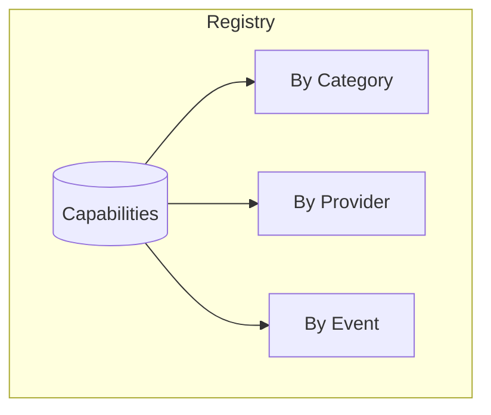
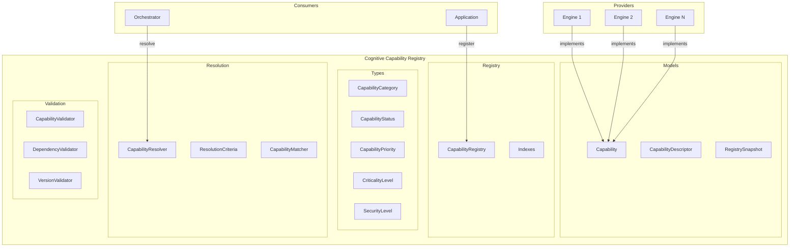
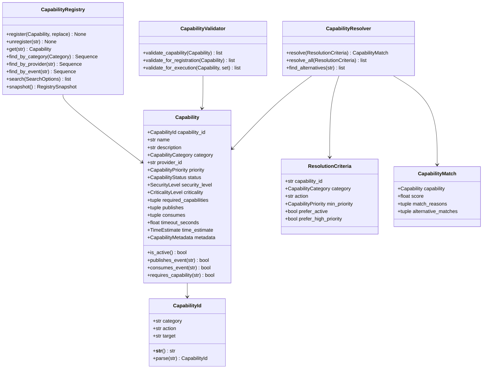
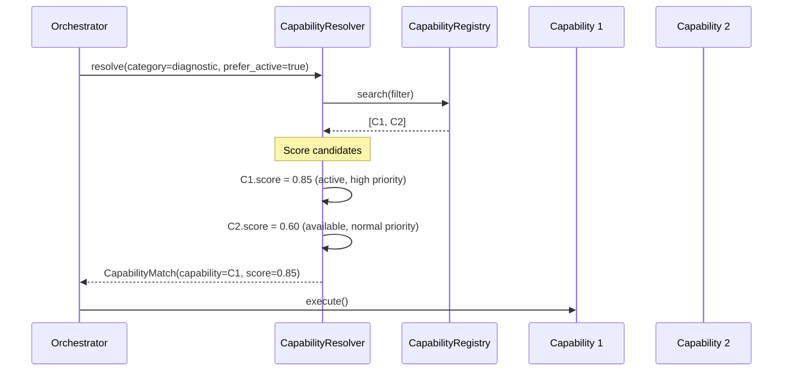
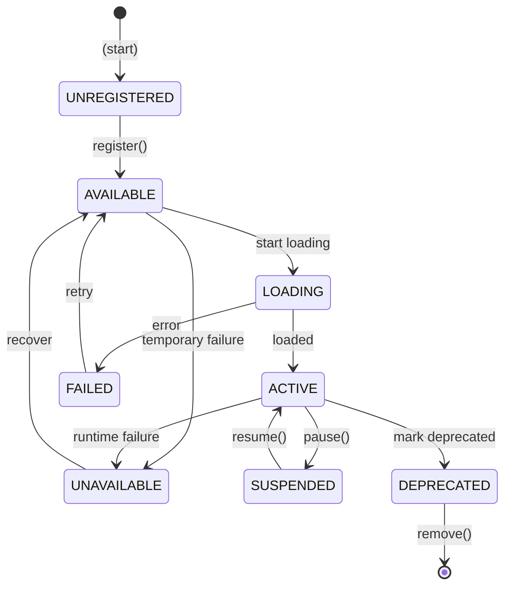

# Cognitive Capability Registry — Arquitectura

> **Documento de arquitectura para el Cognitive Capability Registry (CCR) de EREN.**
> El CCR es el **Kernel de un Sistema Operativo Cognitivo**.
> Complementa el [Clinical Reasoning Framework](./clinical-reasoning-framework.md).

| | |
|---|---|
| **Estado** | Implementación completa |
| **Fase** | Cognitiva — Fase 2 |
| **Tipo** | Infraestructura de registry |
| **Paradigma** | Capabilities > Engines |
| **No contiene** | Implementaciones de motores, IA |

---

## Índice

- [1. Paradigma: Capabilities sobre Engines](#1-paradigma-capabilities-sobre-engines)
  - [1.1 Por qué Capabilities](#11-por-qué-capabilities)
  - [1.2 Comparación de paradigmas](#12-comparación-de-paradigmas)
  - [1.3 Benefits del nuevo paradigma](#13-beneficios-del-nuevo-paradigma)
- [2. Conceptos Fundamentales](#2-conceptos-fundamentales)
  - [2.1 Capability](#21-capability)
  - [2.2 Capability ID](#22-capability-id)
  - [2.3 Provider](#23-provider)
  - [2.4 Registry](#24-registry)
  - [2.5 Resolver](#25-resolver)
- [3. Arquitectura](#3-arquitectura)
  - [3.1 Componentes del sistema](#31-componentes-del-sistema)
  - [3.2 Diagrama de clases](#32-diagrama-de-clases)
  - [3.3 Flujo de resolución](#33-flujo-de-resolución)
- [4. API del Registry](#4-api-del-registry)
  - [4.1 Registro de capabilities](#41-registro-de-capabilities)
  - [4.2 Descubrimiento](#42-descubrimiento)
  - [4.3 Resolución inteligente](#43-resolución-inteligente)
  - [4.4 Validación](#44-validación)
- [5. Categorías de Capabilities](#5-categorías-de-capabilities)
- [6. Estados y Ciclo de Vida](#6-estados-y-ciclo-de-vida)
- [7. Eventos y Contratos](#7-eventos-y-contratos)
- [8. Seguridad y Permisos](#8-seguridad-y-permisos)
- [9. Casos de Uso](#9-casos-de-uso)
- [10. Escalabilidad](#10-escalabilidad)
- [11. Evolución Futura](#11-evolución-futura)
- [Apéndice A. API Completa](#apéndice-a-api-completa)

---

## 1. Paradigma: Capabilities sobre Engines

### 1.1 Por qué Capabilities

En el paradigma tradicional (Engine Registry), el Orchestrator conoce directamente
a los motores:

```
❌ ENGINE REGISTRY (Antiguo paradigma)
═══════════════════════════════════════
Orchestrator ──────► Planner Engine
                      │
                      ▼
                 "Create Plan"
```

En el nuevo paradigma (Cognitive Capability Registry), el Orchestrator solo conoce
las capacidades:

```
✅ COGNITIVE CAPABILITY REGISTRY (Nuevo paradigma)
═══════════════════════════════════════════════════
Orchestrator ──────► Capability: planning.create
                           │
                           ├──► Planner V1 (provider)
                           ├──► Planner V2 (provider)
                           └──► AI Planner (provider)
```

### 1.2 Comparación de paradigmas

| Aspecto | Engine Registry | Cognitive Capability Registry |
|---------|-----------------|-------------------------------|
| **Unidad** | Motor concreto | Capacidad abstracta |
| **Acoplamiento** | Alto (conoce implementaciones) | Bajo (solo conoce capacidades) |
| **Extensibilidad** | Limitada | Ilimitada |
| **Testing** | Difícil (acoplamiento) | Fácil (mocking de capacidades) |
| **Versioning** | Por motor | Por capability |
| **Fallback** | No nativo | Nativo |
| **Multi-provider** | No soportado | Soportado |

### 1.3 Beneficios del nuevo paradigma

1. **Desacoplamiento total**: El Orchestrator no sabe quién implementa una capability
2. **Multi-provider**: Múltiples motores pueden implementar la misma capability
3. **Fallback automático**: Si un provider falla, el resolver encuentra otro
4. **Testing fácil**: Mocking de capabilities sin conocer implementaciones
5. **Extensibilidad**: Agregar nuevos providers no requiere cambiar el Orchestrator
6. **Versioning granular**: Cada capability tiene su propio versionamiento

---

## 2. Conceptos Fundamentales

### 2.1 Capability

Una **Capability** es la unidad atómica de trabajo cognitivo. Define QUÉ puede
hacerse, no QUIÉN lo hace.

```python
Capability(
    capability_id="planning.create.maintenance",
    name="Create Maintenance Plan",
    description="Creates a maintenance plan based on device state",
    category=CapabilityCategory.PLANNING,
    provider_id="planner_engine_v1",
    priority=CapabilityPriority.HIGH,
    criticality=CriticalityLevel.MODERATE,
)
```

### 2.2 Capability ID

Identificador único con formato jerárquico:

```
category.action.target
```

Ejemplos:
- `planning.create.maintenance` - Crear plan de mantenimiento
- `diagnostic.analyze.monitor` - Diagnosticar monitor
- `knowledge.search.document` - Buscar documento
- `voice.input.audio` - Procesar audio

### 2.3 Provider

Un **Provider** es el motor que implementa una o más capabilities. El Orchestrator
nunca conoce al provider directamente.

```python
# El Registry sabe que:
# planning.create.maintenance → provider: "planner_engine_v1"
# planning.create.urgent → provider: "planner_engine_v2"
# Pero el Orchestrator solo sabe "planning.create.*"
```

### 2.4 Registry

El **CapabilityRegistry** es el catálogo central donde se registran todas las
capabilities disponibles.



### 2.5 Resolver

El **CapabilityResolver** encuentra la mejor capability para una query dada.

```
Query: "diagnose_monitor"
        │
        ▼
┌───────────────────┐
│ CapabilityResolver │
└───────────────────┘
        │
        ├──► Exact match: diagnostic.analyze.monitor
        │
        └──► Fallback: diagnostic.analyze (generic)
```

---

## 3. Arquitectura

### 3.1 Componentes del sistema



### 3.2 Diagrama de clases



### 3.3 Flujo de resolución



---

## 4. API del Registry

### 4.1 Registro de capabilities

```python
from core.capabilities import Capability, CapabilityRegistry

registry = CapabilityRegistry()

# Registrar capability básica
capability = Capability.create(
    category="diagnostic",
    action="analyze",
    target="monitor",
    name="Diagnose Patient Monitor",
    description="Performs comprehensive diagnostics on patient monitors",
    provider_id="diagnostic_engine_v1",
    priority=CapabilityPriority.HIGH,
)

registry.register(capability)

# Verificar registro
assert "diagnostic.analyze.monitor" in registry
```

### 4.2 Descubrimiento

```python
from core.capabilities import (
    CapabilityCategory,
    CapabilityFilter,
    CapabilityPriority,
    SearchOptions,
)

# Por categoría
diagnostics = registry.find_by_category(CapabilityCategory.DIAGNOSTIC)

# Por provider
planner_caps = registry.find_by_provider("planner_engine")

# Por estado
active = registry.find_active()

# Búsqueda avanzada
results = registry.search(
    SearchOptions(
        filter=CapabilityFilter(
            category=CapabilityCategory.DIAGNOSTIC,
            min_priority=CapabilityPriority.HIGH,
            active_only=True,
        ),
        sort_by="priority",
        ascending=False,
        limit=10,
    )
)
```

### 4.3 Resolución inteligente

```python
from core.capabilities import (
    CapabilityResolver,
    ResolutionCriteria,
)

resolver = CapabilityResolver(registry)

# Resolver la mejor capability
match = resolver.resolve(
    ResolutionCriteria(
        category=CapabilityCategory.DIAGNOSTIC,
        prefer_active=True,
        prefer_high_priority=True,
    )
)

print(f"Best: {match.capability.name}")
print(f"Score: {match.score}")
print(f"Reasons: {match.match_reasons}")

# Encontrar alternativas
alternatives = resolver.find_alternatives(match.capability.id_string)
```

### 4.4 Validación

```python
from core.capabilities import CapabilityValidator

validator = CapabilityValidator(registry)

# Validar estructura
violations = validator.validate_capability(capability)
if violations:
    print(f"Invalid: {violations}")

# Validar para ejecución
errors = validator.validate_for_execution(
    capability,
    granted_permissions={"devices:read"},
)
if errors:
    print(f"Cannot execute: {errors}")
```

---

## 5. Categorías de Capabilities

| Categoría | Descripción | Capabilities típicas |
|-----------|-------------|---------------------|
| `planning` | Planificación | `planning.create`, `planning.update`, `planning.cancel` |
| `knowledge` | Conocimiento | `knowledge.search`, `knowledge.retrieve`, `knowledge.update` |
| `memory` | Memoria | `memory.store`, `memory.retrieve`, `memory.forget` |
| `reasoning` | Razonamiento | `reasoning.analyze`, `reasoning.hypothesize` |
| `diagnostic` | Diagnóstico | `diagnostic.analyze`, `diagnostic.predict` |
| `workflow` | Workflows | `workflow.execute`, `workflow.pause`, `workflow.resume` |
| `voice` | Voz | `voice.input`, `voice.output`, `voice.transcribe` |
| `tool` | Herramientas | `tool.execute`, `tool.discover` |
| `learning` | Aprendizaje | `learning.train`, `learning.infer` |
| `monitoring` | Monitoreo | `monitor.health`, `monitor.metrics` |
| `security` | Seguridad | `security.authenticate`, `security.authorize` |
| `administration` | Admin | `admin.manage`, `admin.configure` |

---

## 6. Estados y Ciclo de Vida



---

## 7. Eventos y Contratos

Las capabilities se comunican via Event Bus definiendo contratos:

```python
from core.capabilities import Capability, EventContract

capability = Capability.create(
    category="diagnostic",
    action="analyze",
    name="Diagnose",
    description="Diagnoses devices",
    provider_id="diagnostic_engine",
    publishes=(
        EventContract(
            event_type="diagnostic_completed",
            direction="publishes",
            description="Published when diagnosis finishes",
        ),
    ),
    consumes=(
        EventContract(
            event_type="diagnostic_requested",
            direction="consumes",
            is_critical=True,  # Required for operation
        ),
    ),
)
```

El Registry valida que los eventos críticos tengan publishers activos.

---

## 8. Seguridad y Permisos

```python
from core.capabilities import Capability, Permission, SecurityLevel

# Capability que requiere permisos
capability = Capability.create(
    category="administration",
    action="configure",
    name="Configure System",
    description="Configures system settings",
    provider_id="admin_engine",
    security_level=SecurityLevel.ADMIN,
    required_permissions=(
        Permission(resource="system", action="configure", scope="write"),
        Permission(resource="users", action="manage"),
    ),
)

# Verificar permisos antes de ejecutar
granted = {"system:configure:write", "users:manage"}
if capability.has_permissions(granted):
    print("Permission granted")
else:
    print("Permission denied")
```

---

## 9. Casos de Uso

### Caso 1: Registro de una nueva capability

```python
# Un nuevo motor implementa una capability existente
new_capability = Capability.create(
    category="diagnostic",
    action="analyze",
    target="infusion_pump",
    name="Diagnose Infusion Pump",
    description="Advanced diagnostics for infusion pumps",
    provider_id="ai_diagnostic_v2",
    priority=CapabilityPriority.HIGH,
)

# Registrar
registry.register(new_capability)

# Ahora el resolver puede elegir entre múltiples providers
```

### Caso 2: Fallback automático

```python
# Provider principal falla
resolver = CapabilityResolver(registry)

# Intentar resolver
match = resolver.resolve(
    ResolutionCriteria(category=CapabilityCategory.DIAGNOSTIC)
)

# Si el provider principal falla, el resolver usa el alternativo
# basado en score
print(f"Using: {match.capability.provider_id}")
print(f"Alternatives: {match.alternative_matches}")
```

### Caso 3: Validación antes de ejecución

```python
# Antes de ejecutar
validator = CapabilityValidator(registry)

errors = validator.validate_for_execution(
    capability,
    granted_permissions={"devices:read"},
)

if errors:
    # No ejecutar, reportar error
    for error in errors:
        print(f"Error: {error}")
else:
    # Safe to execute
    capability.execute()
```

---

## 10. Escalabilidad

El CCR está diseñado para:

| Escenario | Estrategia |
|-----------|-----------|
| Múltiples hospitales | Cada hospital tiene su CCR |
| Centenares de capabilities | Índices por categoría/provider/evento |
| Alta disponibilidad | Thread-safe con RLock |
| Distribución | Snapshot para sincronización |

---

## 11. Evolución Futura

| Capacidad | Descripción | Fase |
|-----------|-------------|------|
| **Distributed Registry** | CCR distribuido con sync | Infraestructura |
| **A/B Testing** | Múltiples providers activos para testing | Experimentation |
| **Circuit Breaker** | Desactivación automática de providers fallidos | Resilience |
| **Cost-based Routing** | Selección basada en costo de provider | Optimization |
| **ML-based Resolution** | Resolución inteligente con ML | AI Integration |

---

## Apéndice A. API Completa

### Capability

```python
@dataclass(frozen=True)
class Capability:
    # Identity
    capability_id: CapabilityId
    name: str
    description: str
    category: CapabilityCategory
    
    # Provider
    provider_id: str
    provider_version: str
    
    # Classification
    priority: CapabilityPriority
    status: CapabilityStatus
    security_level: SecurityLevel
    criticality: CriticalityLevel
    
    # Dependencies
    required_capabilities: tuple[str, ...]
    required_permissions: tuple[Permission, ...]
    
    # Events
    publishes: tuple[EventContract, ...]
    consumes: tuple[EventContract, ...]
    
    # Execution
    timeout_seconds: float
    time_estimate: TimeEstimate
    
    # Metadata
    metadata: CapabilityMetadata
```

### CapabilityRegistry

```python
class CapabilityRegistry:
    def __init__(self): ...
    
    # Registration
    def register(self, capability, descriptor=None, *, replace=False): ...
    def unregister(self, capability_id: str): ...
    def update(self, capability_id: str, capability: Capability): ...
    def set_status(self, capability_id: str, status: CapabilityStatus): ...
    
    # Retrieval
    def get(self, capability_id: str) -> Capability: ...
    def get_descriptor(self, capability_id: str) -> CapabilityDescriptor: ...
    def list(self) -> Sequence[Capability]: ...
    
    # Discovery
    def find_by_category(self, category: CapabilityCategory) -> Sequence: ...
    def find_by_provider(self, provider_id: str) -> Sequence: ...
    def find_by_status(self, status: CapabilityStatus) -> Sequence: ...
    def find_by_event(self, event_type: str, direction="both") -> Sequence: ...
    def find_active(self) -> Sequence: ...
    def search(self, options: SearchOptions) -> list: ...
    
    # Statistics
    def snapshot(self) -> RegistrySnapshot: ...
```

### Exceptions

```python
CapabilityRegistryError           # Base
├── CapabilityNotFoundError
├── CapabilityAlreadyRegisteredError
├── DependencyNotSatisfiedError
├── PermissionDeniedError
├── CapabilityUnavailableError
├── VersionIncompatibleError
├── EventContractViolationError
├── ResolutionError
├── ValidationError
├── CircularDependencyError
└── ProviderNotFoundError
```

---

## Referencias

| Referencia | Ubicación |
|------------|-----------|
| Clinical Reasoning Framework | [./clinical-reasoning-framework.md](./clinical-reasoning-framework.md) |
| CORE README | [core/README.md](../core/README.md) |
| Capabilities README | [core/capabilities/README.md](../../core/capabilities/README.md) |
| Event Bus | [core/event-bus.md](./event-bus.md) |
| Engine Registry (legacy) | [core/engine-registry.md](./engine-registry.md) |

---

**Última actualización:** 2026-07-13  
**Estado:** Implementación completa  
**Fase:** Cognitiva — Fase 2  
**Tipo:** Documentación arquitectónica  
**Paradigma:** Capabilities > Engines