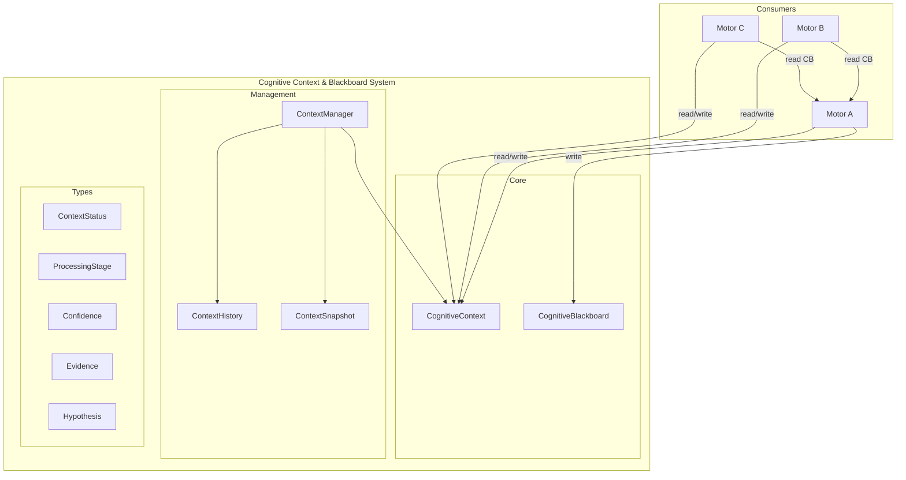
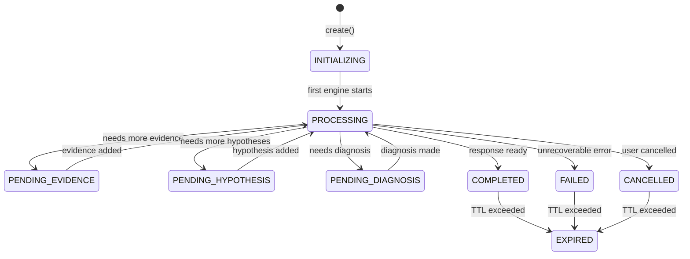
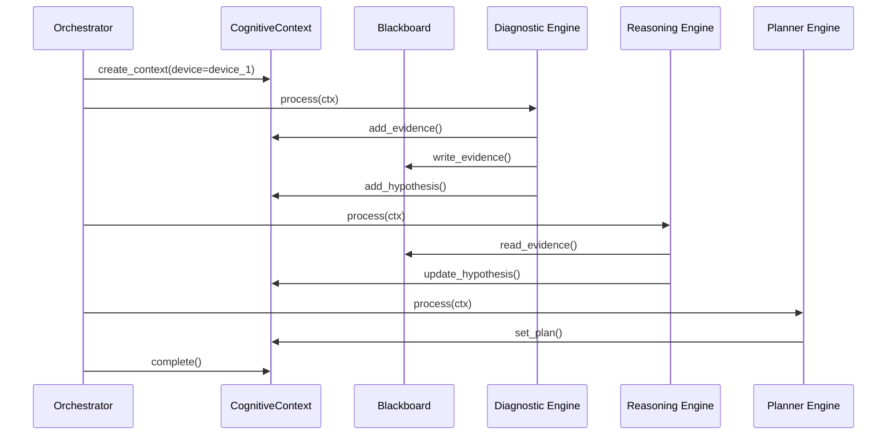

# Cognitive Context & Blackboard System — Arquitectura

> **Documento de arquitectura para el Cognitive Context & Blackboard System (CCBS) de EREN.**
> El CCBS es el **núcleo del procesamiento cognitivo**.
> Complementa el [Clinical Reasoning Framework](./clinical-reasoning-framework.md).

| | |
|---|---|
| **Estado** | Implementación completa |
| **Fase** | Cognitiva — Fase 2 |
| **Tipo** | Sistema de contexto compartido |
| **Paradigma** | Un solo contexto compartido |
| **No contiene** | IA, implementaciones de motores |

---

## Índice

- [1. Paradigma: Contexto Compartido](#1-paradigma-contexto-compartido)
- [2. Cognitive Context](#2-cognitive-context)
- [3. Cognitive Blackboard](#3-cognitive-blackboard)
- [4. Context Manager](#4-context-manager)
- [5. Arquitectura de Componentes](#5-arquitectura-de-componentes)
- [6. Estados y Ciclo de Vida](#6-estados-y-ciclo-de-vida)
- [7. API del Sistema](#7-api-del-sistema)
- [8. Casos de Uso](#8-casos-de-uso)
- [9. Integración con Motores](#9-integración-con-motores)
- [10. Evolución Futura](#10-evolución-futura)

---

## 1. Paradigma: Contexto Compartido

### 1.1 El Problema

En sistemas multi-motor tradicionales:

```
❌ ANTIGUO PARADIGMA
═══════════════════════════════
Motor A ──► Copia de Contexto
                │
Motor B ──► Copia de Contexto  ◄── Motor B no ve el trabajo de Motor A
                │
Motor C ──► Copia de Contexto  ◄── Motor C no ve nada
```

### 1.2 La Solución

En EREN, todos los motores comparten UN contexto:

```
✅ NUEVO PARADIGMA
═══════════════════════════════════════
                    ┌─────────────────┐
                    │ CognitiveContext │
                    │   (UNICO)       │
                    └────────┬────────┘
                             │
        ┌────────────────────┼────────────────────┐
        │                    │                    │
        ▼                    ▼                    ▼
   Motor A              Motor B              Motor C
   (lee/escribe)        (lee/escribe)        (lee/escribe)
        │                    │                    │
        ▼                    ▼                    ▼
   Blackboard ──────► Blackboard ──────► Blackboard
```

---

## 2. Cognitive Context

### 2.1 Estructura

```python
@dataclass
class CognitiveContext:
    # Identity
    context_id: str
    version: int
    created_at: str
    updated_at: str

    # Context
    user: UserContext
    hospital: HospitalContext
    device: DeviceContext
    incident: IncidentContext

    # Processing
    status: ContextStatus
    current_stage: ProcessingStage
    processing: ProcessingMetadata

    # Intent and Plan
    intent: IntentResult
    plan: PlanResult

    # Memory and Knowledge
    retrieved_memories: tuple[str, ...]
    retrieved_knowledge: tuple[str, ...]

    # Evidence and Hypotheses
    evidence: tuple[Evidence, ...]
    hypotheses: tuple[Hypothesis, ...]
    observations: tuple[Observation, ...]

    # Results
    diagnosis: DiagnosisResult
    workflow: WorkflowResult
    tools_used: tuple[ToolUsage, ...]
    response: ResponseResult

    # Confidence
    overall_confidence: Confidence

    # Blackboard
    blackboard: tuple[BlackboardEntry, ...]
```

### 2.2 Campos del Contexto

| Campo | Descripción | Ejemplo |
|-------|-------------|---------|
| `context_id` | UUID único | `ctx_a1b2c3d4e5f6...` |
| `correlation_id` | ID de correlación | `corr-123` |
| `session_id` | ID de sesión | `session-456` |
| `user` | Usuario actual | `biomedical_engineer` |
| `hospital` | Hospital actual | `Hospital Central` |
| `device` | Dispositivo en análisis | `Philips IntelliVue` |
| `incident` | Incidente reportado | `Error E101` |
| `intent` | Intención detectada | `diagnostic_request` |
| `evidence` | Evidencias recopiladas | `[ev-1, ev-2]` |
| `hypotheses` | Hipótesis generadas | `[hyp-1, hyp-2]` |
| `diagnosis` | Diagnóstico final | `Sensor malfunction` |
| `confidence` | Nivel de confianza | `0.85` |

---

## 3. Cognitive Blackboard

### 3.1 Concepto

El Blackboard es un espacio compartido donde todos los motores pueden:

| Operación | Descripción |
|-----------|-------------|
| **READ** | Leer entradas de otros motores |
| **WRITE** | Escribir sus propias entradas |
| **ADD** | Agregar evidencia e hipótesis |
| **NEVER** | Modificar trabajo de otros motores |

### 3.2 Tipos de Entradas

| Tipo | Descripción |
|------|-------------|
| `evidence` | Evidencia recopilada |
| `hypothesis` | Hipótesis generada |
| `observation` | Observación realizada |
| `plan` | Plan de acción |
| `diagnosis` | Diagnóstico propuesto |
| `workflow` | Workflow seleccionado |
| `tool` | Herramienta utilizada |
| `response` | Respuesta generada |

### 3.3 Inmutabilidad

Las entradas del blackboard son **INMUTABLES**:

```
Motor A escribe evidencia E1
        │
        ▼
    E1[entry_id: entry_1, content: {...}]

Motor B intenta modificar E1 ──► ❌ NO PERMITIDO

Motor B puede:
  1. Leer E1
  2. Escribir nueva entrada E2 que "supersede" E1
```

---

## 4. Context Manager

### 4.1 Responsabilidades

- Crear contextos
- Gestionar transiciones de estado
- Proveer lookup de contextos
- Limpiar contextos expirados
- Mantener estadísticas

### 4.2 Índices

```python
class ContextManager:
    _contexts: dict[str, CognitiveContext]  # Por ID
    _by_session: dict[str, list[str]]       # Por sesión
    _by_user: dict[str, list[str]]          # Por usuario
    _by_correlation: dict[str, list[str]]    # Por correlación
```

---

## 5. Arquitectura de Componentes



---

## 6. Estados y Ciclo de Vida



### Processing Stages

```
INTENTION (10)
    │
    ▼
CONTEXT_BUILDING (20)
    │
    ▼
KNOWLEDGE_RETRIEVAL (30)
    │
    ▼
MEMORY_RETRIEVAL (40)
    │
    ▼
HYPOTHESIS_GENERATION (50)
    │
    ▼
EVIDENCE_COLLECTION (60)
    │
    ▼
DIAGNOSIS (70)
    │
    ▼
WORKFLOW_SELECTION (80)
    │
    ▼
EXECUTION (90)
    │
    ▼
RESPONSE (100)
```

---

## 7. API del Sistema

### 7.1 Crear Contexto

```python
from core.context import CognitiveContext, UserContext, DeviceContext

context = CognitiveContext.create(
    correlation_id="corr-123",
    session_id="session-456",
    user=UserContext(
        user_id="eng-001",
        user_name="Dr. Smith",
        role="biomedical_engineer",
    ),
    device=DeviceContext(
        device_id="dev-001",
        device_name="Philips IntelliVue MX450",
        manufacturer="Philips",
        model="IntelliVue MX450",
    ),
)
```

### 7.2 Añadir Evidencia

```python
from core.context import Evidence, EvidenceType, EvidenceSource, Confidence, ConfidenceLevel

context = context.add_evidence(
    Evidence(
        evidence_id="ev-1",
        evidence_type=EvidenceType.OBSERVATION,
        source=EvidenceSource.USER,
        content="Device shows error E101",
        confidence=Confidence(
            level=ConfidenceLevel.HIGH,
            score=0.9,
            reasons=("user_report", "consistent_symptoms"),
        ),
    )
)
```

### 7.3 Añadir Hipótesis

```python
from core.context import Hypothesis

context = context.add_hypothesis(
    Hypothesis(
        hypothesis_id="hyp-1",
        description="Sensor malfunction in SpO2 module",
        probability=0.75,
        supporting_evidence=["ev-1", "ev-2"],
    )
)
```

### 7.4 Blackboard

```python
from core.context import CognitiveBlackboard, Evidence, Observation

blackboard = CognitiveBlackboard()

# Motor A escribe evidencia
blackboard.write_evidence(
    engine_id="diagnostic_engine",
    evidence=Evidence(...),
)

# Motor B lee evidencia
evidence = blackboard.read_evidence()

# Motor B añade hipótesis
blackboard.write_hypothesis(
    engine_id="reasoning_engine",
    hypothesis=Hypothesis(...),
)

# Motor C lee todo
all_entries = blackboard.read_all_entries()
```

### 7.5 Context Manager

```python
from core.context import ContextManager

manager = ContextManager()

# Crear contexto
context = manager.create_context(
    correlation_id="corr-123",
    session_id="session-456",
)

# Actualizar
context = context.add_evidence(evidence)
manager.update_context(context)

# Buscar
contexts = manager.find_by_session("session-456")

# Estadísticas
stats = manager.get_statistics()
```

---

## 8. Casos de Uso

### Caso 1: Diagnóstico de dispositivo

```python
# 1. Crear contexto
context = manager.create_context(
    device=DeviceContext(
        device_id="monitor-001",
        device_name="Philips IntelliVue",
    ),
)

# 2. Motor de intención detecta intención
context = context.set_intent(
    IntentResult(intent="diagnose_device")
)

# 3. Motor de conocimiento recupera manuales
context = context.add_retrieved_knowledge(["kb-123", "kb-456"])

# 4. Motor de memoria recupera experiencias similares
context = context.add_retrieved_memories(["mem-789"])

# 5. Motor de diagnóstico genera hipótesis
context = context.add_hypothesis(
    Hypothesis(hypothesis_id="hyp-1", description="Sensor malfunction")
)
context = context.add_hypothesis(
    Hypothesis(hypothesis_id="hyp-2", description="Calibration needed")
)

# 6. Motor de razonamiento evalúa evidencia
context = context.add_evidence(
    Evidence(evidence_id="ev-1", ...)
)

# 7. Clasificar hipótesis
context = context.rank_hypotheses()

# 8. Seleccionar diagnóstico
context = context.set_diagnosis(
    DiagnosisResult(
        diagnosis="Sensor malfunction confirmed",
        confidence=Confidence(level=ConfidenceLevel.HIGH, score=0.85),
    )
)

# 9. Completar
context = context.complete(
    response=ResponseResult(content="Diagnóstico: Malfunction del sensor SpO2")
)
```

---

## 9. Integración con Motores



---

## 10. Evolución Futura

| Capacidad | Descripción | Fase |
|-----------|-------------|------|
| **Distributed Context** | Contexto distribuido entre nodos | v3 |
| **Real-time Sync** | Sincronización en tiempo real | v3 |
| **Context Versioning** | Versionado completo de contexto | v2 |
| **Conflict Resolution** | Resolución de conflictos | v3 |
| **Predictive Context** | Contexto predictivo con ML | v4 |

---

## Referencias

| Referencia | Ubicación |
|------------|-----------|
| Clinical Reasoning Framework | [./clinical-reasoning-framework.md](./clinical-reasoning-framework.md) |
| CORE README | [core/README.md](../core/README.md) |
| Context README | [core/context/README.md](../../core/context/README.md) |

---

**Última actualización:** 2026-07-13  
**Estado:** Implementación completa  
**Fase:** Cognitiva — Fase 2  
**Tipo:** Documentación arquitectónica  
**Paradigma:** Contexto Compartido > Copias