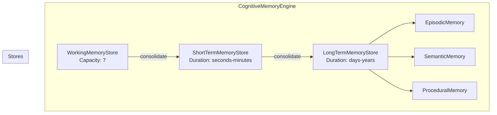
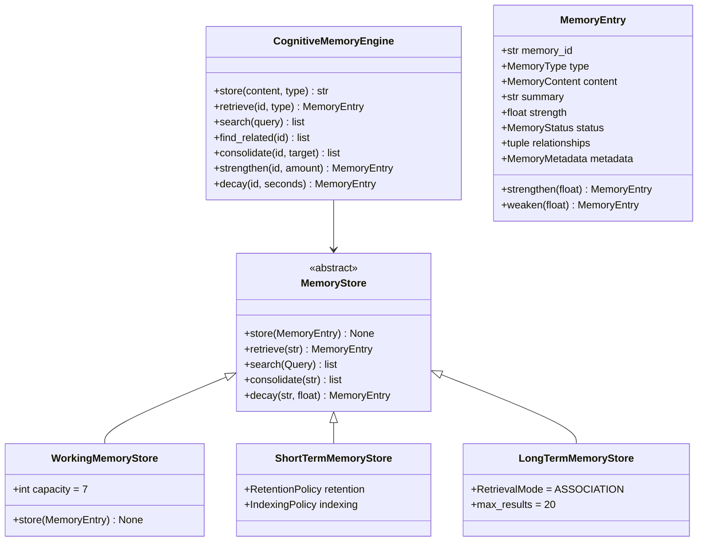
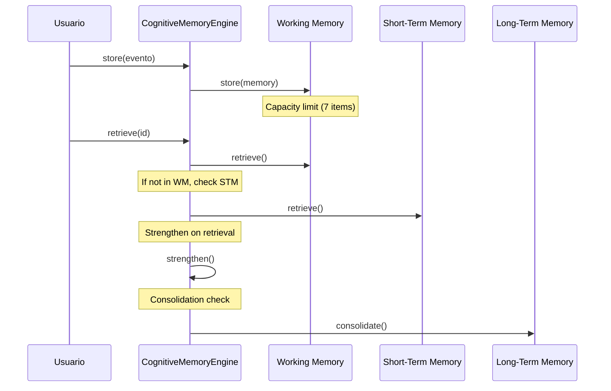
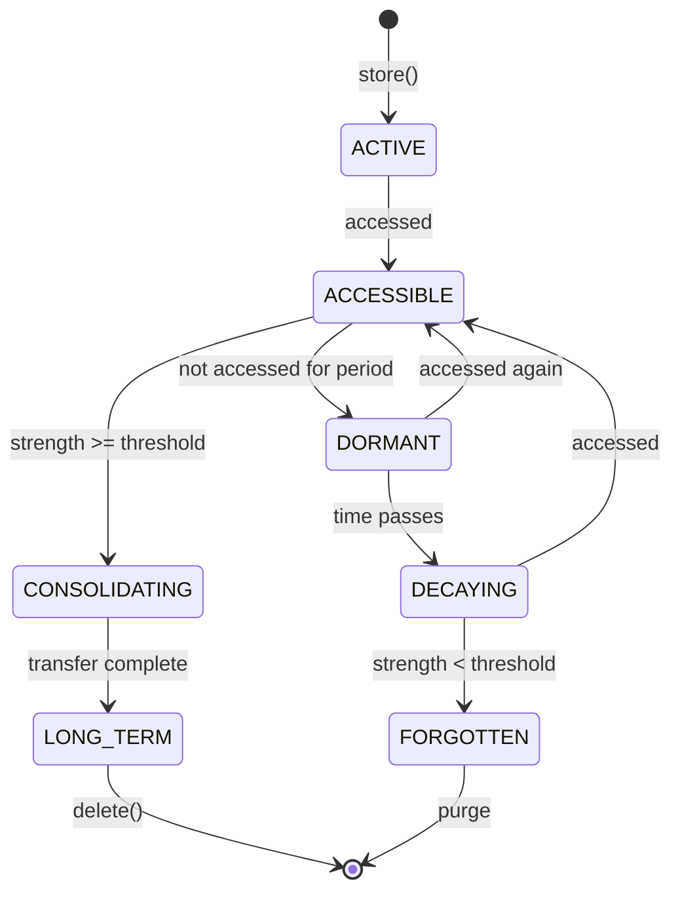
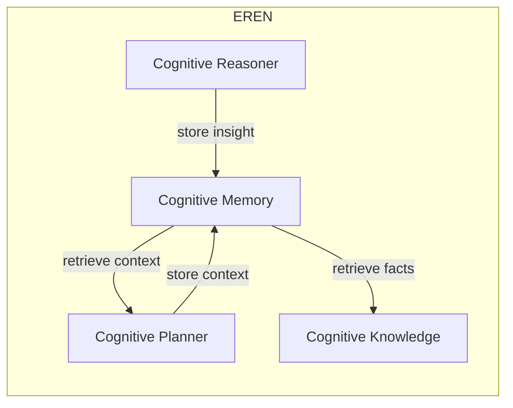

# Cognitive Memory System — Arquitectura

> **Documento de arquitectura para el Cognitive Memory System (CMS) de EREN.**
> Sistema de memoria inspirado en la cognición humana, no una base de datos.
> Complementa el [Clinical Reasoning Framework](./clinical-reasoning-framework.md).

| | |
|---|---|
| **Estado** | Implementación completa |
| **Fase** | Cognitiva — Fase 2 |
| **Tipo** | Sistema de memoria cognitiva |
| **Paradigma** | Memoria humana > Base de datos |
| **No contiene** | IA, almacenamiento backend |

---

## Índice

- [1. Paradigma: Memoria Cognitiva](#1-paradigma-memoria-cognitiva)
- [2. Tipos de Memoria](#2-tipos-de-memoria)
- [3. Arquitectura del Sistema](#3-arquitectura-del-sistema)
- [4. Políticas de Memoria](#4-políticas-de-memoria)
- [5. Ciclo de Vida](#5-ciclo-de-vida)
- [6. API del Motor](#6-api-del-motor)
- [7. Casos de Uso Clínico](#7-casos-de-uso-clínico)
- [8. Integración](#8-integración)
- [9. Evolución Futura](#9-evolución-futura)

---

## 1. Paradigma: Memoria Cognitiva

### 1.1 Memoria vs Base de Datos

```
┌─────────────────────────────────────────────────────────────────────┐
│                    BASE DE DATOS TRADICIONAL                          │
├─────────────────────────────────────────────────────────────────────┤
│  • Almacena DATOS                                                    │
│  • Operaciones CRUD                                                   │
│  • Sin contexto emocional                                             │
│  • Sin olvido automático                                              │
│  • Sin relaciones complejas                                            │
│  • Sin temporalidad rica                                              │
└─────────────────────────────────────────────────────────────────────┘

┌─────────────────────────────────────────────────────────────────────┐
│                 SISTEMA DE MEMORIA COGNITIVA                          │
├─────────────────────────────────────────────────────────────────────┤
│  • Almacena EXPERIENCIAS                                             │
│  • Operaciones: Store/Retrieve/Consolidate/Forget                    │
│  • Contexto emocional (valence/arousal)                              │
│  • Olvido natural (decay)                                            │
│  • Relaciones complejas (causal, temporal, espacial)                   │
│  • Temporalidad rica                                                 │
│  • Fortaleza variable (strength)                                     │
└─────────────────────────────────────────────────────────────────────┘
```

### 1.2 Inspiración en Cognición Humana

```
┌─────────────────────────────────────────────────────────────────────┐
│                 ARQUITECTURA DE MEMORIA HUMANA                        │
├─────────────────────────────────────────────────────────────────────┤
│                                                                      │
│  ┌──────────────┐                                                    │
│  │   SENSORY    │ ◄─── Input perceptual                            │
│  │   MEMORY     │                                                    │
│  └──────┬───────┘                                                    │
│         │                                                            │
│         ▼                                                            │
│  ┌──────────────┐                                                    │
│  │   WORKING    │ ◄─── limited capacity (~7 items)                  │
│  │   MEMORY     │ ◄─── active processing                            │
│  └──────┬───────┘                                                    │
│         │                                                            │
│         ▼                                                            │
│  ┌──────────────┐                                                    │
│  │    SHORT-    │ ◄─── seconds to minutes                          │
│  │    TERM      │                                                    │
│  └──────┬───────┘                                                    │
│         │                                                            │
│         ▼                                                            │
│  ┌──────────────┐     ┌──────────────┐                               │
│  │   LONG-TERM  │────►│   EPISODIC   │ ◄── events                    │
│  │   MEMORY     │     │   MEMORY     │ ◄── experiences              │
│  │              │────►│   SEMANTIC   │ ◄── facts                    │
│  │              │────►│ PROCEDURAL    │ ◄── skills                  │
│  └──────────────┘     └──────────────┘                               │
│                                                                      │
└─────────────────────────────────────────────────────────────────────┘
```

---

## 2. Tipos de Memoria

| Tipo | Descripción | Duración | Capacidad | Ejemplo |
|------|-------------|----------|-----------|---------|
| **Working** | Procesamiento activo | ~segundos | ~7 items | "Estoy pensando en..." |
| **Short-Term** | Almacenamiento temporal | ~minutos | ~20 items | "Recordar número de teléfono" |
| **Long-Term** | Almacenamiento persistente | días-años | ilimitada | Conocimiento general |
| **Episodic** | Eventos y experiencias | permanente | ilimitada | "那次维修经历" |
| **Semantic** | Hechos y conceptos | permanente | ilimitada | "北京是中国的首都" |
| **Procedural** | Habilidades y procedimientos | permanente | ilimitada | "如何骑自行车" |

---

## 3. Arquitectura del Sistema

### 3.1 Componentes



### 3.2 Diagrama de Clases



### 3.3 Flujo de Memoria



---

## 4. Políticas de Memoria

### 4.1 Retención

```python
@dataclass
class RetentionPolicy:
    memory_type: MemoryType
    
    min_duration_seconds: float = 60      # Minimum retention
    max_duration_seconds: float = 300     # Maximum before review
    decay_rate: float = 0.01              # Strength loss per minute
    consolidation_threshold: float = 0.5  # Strength to trigger consolidation
    forget_threshold: float = 0.1         # Strength below which to forget
```

### 4.2 Decay (Olvido)

```
╭──────────────────────────────────────────────────────────╮
│                    MEMORY DECAY CURVE                    │
│                                                         │
│  Strength                                               │
│    1.0 ┤    ★ Important Memory (slow decay)             │
│        │   ╱                                             │
│    0.8 ┤  ╱                                              │
│        │ ╱                                               │
│    0.5 ┼╱───────────── Normal Memory                     │
│        │              ╲                                 │
│    0.2 ┤               ╲___ Fast decay                  │
│        │                   ╲___                         │
│    0.0 ┼──────────────────────────────→ Time            │
│         0    1m    5m    30m   1h                      │
│                                                         │
│  Strength < forget_threshold → Memory forgotten          │
╰──────────────────────────────────────────────────────────╯
```

### 4.3 Consolidación

```python
@dataclass
class ConsolidationPolicy:
    # Triggers
    trigger_on_access_count: int = 3      # After N accesses
    trigger_on_importance: int = 5         # If importance >= N
    trigger_on_emotional_valence: bool = True  # If emotionally significant
    
    # Process
    min_consolidation_strength: float = 0.5
    parallel_consolidation: bool = True   # Consolidate related too
    forget_duplicates: bool = True        # Remove duplicates
```

---

## 5. Ciclo de Vida



---

## 6. API del Motor

### 6.1 Almacenamiento

```python
memory_id = engine.store(
    content="Patient presented with arrhythmia",
    memory_type=MemoryType.EPISODIC,
    summary="Arrhythmia case",
    tags=("cardiology", "patient"),
    importance=8,
    source="intake_form",
)
```

### 6.2 Recuperación

```python
# Por ID
memory = engine.retrieve(memory_id, MemoryType.EPISODIC)

# Por query
results = engine.search(
    MemoryQuery(
        query_text="arrhythmia treatment",
        memory_type=MemoryType.EPISODIC,
    )
)

# Por contexto
results = engine.retrieve_with_context(
    query="patient history",
    context=RetrievalContext(
        patient_id="patient-123",
        device_id="monitor-001",
    ),
)
```

### 6.3 Relaciones

```python
# Añadir relación causal
engine.add_relationship(
    source_id=device_memory_id,
    target_id=diagnosis_memory_id,
    relationship_type=RelationshipType.CAUSAL,
    bidirectional=True,
)

# Encontrar relacionadas
related = engine.find_related(memory_id)
```

### 6.4 Consolidación

```python
# Consolidar a largo plazo
engine.consolidate(memory_id, target_type=MemoryType.LONG_TERM)

# Fortalecer (refresco)
engine.strengthen(memory_id, amount=0.1)
```

---

## 7. Casos de Uso Clínico

### Caso 1: Registrar evento de dispositivo

```python
# Registrar diagnóstico de dispositivo
memory_id = engine.store(
    content={
        "device_id": "Philips IntelliVue MX450",
        "model": "IntelliVue MX450",
        "error_code": "E101",
        "diagnosis": "Sensor de saturación defectuoso",
        "actions": ["Reemplazar sensor", "Calibrar"],
    },
    memory_type=MemoryType.EPISODIC,
    summary="Error E101 en monitor Philips",
    tags=("monitor", "philips", "intellivue", "E101"),
    importance=7,
    source="biomedical_team",
)

# Consolidar si es importante
if importance >= 7:
    engine.consolidate(memory_id)
```

### Caso 2: Buscar conocimiento técnico

```python
# Buscar procedimiento de mantenimiento
results = engine.search(
    MemoryQuery(
        query_text="Philips IntelliVue mantenimiento",
        memory_type=MemoryType.SEMANTIC,
    )
)

# Buscar experiencias similares
similar = engine.find_similar(device_memory_id)
```

### Caso 3: Recordar procedimiento

```python
# Buscar procedimiento
procedures = engine.search(
    MemoryQuery(
        query_text="calibración bomba de infusión",
        memory_type=MemoryType.PROCEDURAL,
    )
)

# Recuperar pasos
if procedures:
    steps = procedures[0].memory.content.data["steps"]
```

---

## 8. Integración

### 8.1 Con otros motores



### 8.2 Con Event Bus

```
Memory Events:
• memory.stored
• memory.retrieved
• memory.consolidated
• memory.forgotten
• memory.strengthened
• memory.decayed
```

---

## 9. Evolución Futura

| Capacidad | Descripción | Fase |
|-----------|-------------|------|
| **Episodic Indexing** | Indexar por tiempo, lugar, emoción | v2 |
| **Semantic Graph** | Grafo de conocimiento semántico | v2 |
| **Procedural Chaining** | Encadenar procedimientos | v2 |
| **Distributed Memory** | Memoria distribuida entre nodos | v3 |
| **ML-based Retrieval** | Recuperación inteligente con ML | v3 |
| **Predictive Memory** | Predecir qué se necesitará | v4 |

---

## Referencias

| Referencia | Ubicación |
|------------|-----------|
| Clinical Reasoning Framework | [./clinical-reasoning-framework.md](./clinical-reasoning-framework.md) |
| CORE README | [core/README.md](../core/README.md) |
| Memory README | [core/memory/README.md](../../core/memory/README.md) |

---

**Última actualización:** 2026-07-13  
**Estado:** Implementación completa  
**Fase:** Cognitiva — Fase 2  
**Tipo:** Documentación arquitectónica  
**Paradigma:** Memoria Cognitiva > Base de Datos