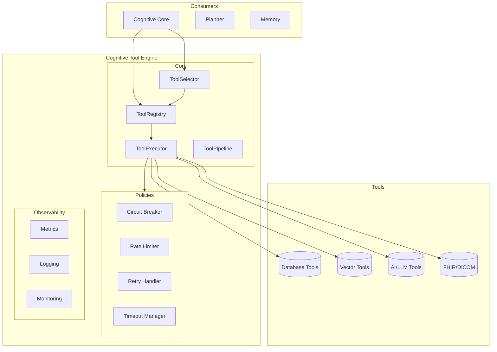
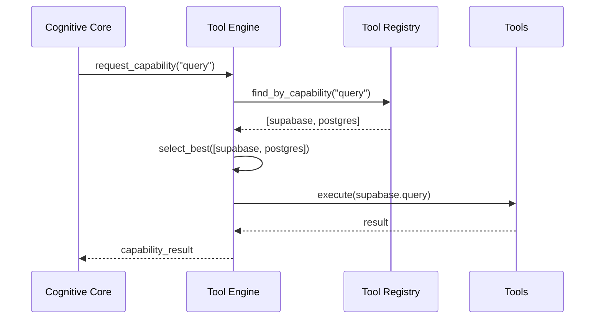

# Cognitive Tool Engine — Arquitectura

> **Documento de arquitectura para el Cognitive Tool Engine (CTE) de EREN.**
> El CTE es el puente entre el nucleo cognitivo de EREN y el mundo exterior.
> Complementa el [Clinical Reasoning Framework](./clinical-reasoning-framework.md).

| | |
|---|---|
| **Estado** | Implementacion completa |
| **Fase** | Cognitiva - Fase 2 |
| **Tipo** | Sistema de gestion de herramientas |
| **Paradigma** | EREN nunca conoce tecnologias |
| **No contiene** | Implementaciones de herramientas reales |

---

## Indice

- [1. Paradigma](#1-paradigma)
- [2. Arquitectura del CTE](#2-arquitectura-del-cte)
- [3. Tool Registry](#3-tool-registry)
- [4. Tool Executor](#4-tool-executor)
- [5. Tool Pipeline](#5-tool-pipeline)
- [6. Politicas de Ejecucion](#6-politicas-de-ejecucion)
- [7. Casos de Uso](#7-casos-de-uso)
- [8. Integracion](#8-integracion)
- [9. Evolucion Futura](#9-evolucion-futura)

---

## 1. Paradigma

### 1.1 El Problema

En sistemas tradicionales:

```
EREN -> Supabase (conoce implementacion)
EREN -> Qdrant (conoce implementacion)
EREN -> OpenAI (conoce implementacion)
```

### 1.2 La Solucion

En EREN, el nucleo cognitivo solo conoce capacidades:

```
                    +------------------+
                    |   CTE           |
                    | (Tool Engine)   |
                    +--------+---------+
                             |
                             v
        +--------------------+--------------------+
        |                    |                    |
   Capability           Capability           Capability
    (query)              (search)            (chat)
        |                    |                    |
   +----v----+         +---v---+          +---v---+
   | Supabase|         | Qdrant|          | OpenAI |
   +---------+         +--------+          +--------+
```

EREN nunca conoce a Supabase, Qdrant u OpenAI.
EREN solo sabe que necesita "query", "search", "chat".

---

## 2. Arquitectura del CTE



---

## 3. Tool Registry

### 3.1 ToolDescriptor

```python
@dataclass
class ToolDescriptor:
    tool_id: str           # "supabase.query"
    name: str             # "Supabase Query"
    provider: str         # "supabase_client"
    category: ToolCategory  # DATABASE
    
    capabilities: tuple[ToolCapability, ...]
    parameters: tuple[ToolParameter, ...]
    
    retry_policy: RetryPolicy
    circuit_breaker: CircuitBreakerConfig
    rate_limit: RateLimitConfig
    
    cost: ToolCost
    performance: ToolPerformance
```

### 3.2 Categorias de Herramientas

| Categoria | Descripcion | Ejemplos |
|-----------|-------------|----------|
| `database` | Bases de datos | Supabase, PostgreSQL |
| `vector_store` | Almacenamiento vectorial | Qdrant, Pinecone |
| `llm` | Modelos de lenguaje | OpenAI, Anthropic |
| `fhir` | Sistemas FHIR | Epic, Cerner |
| `dicom` | Imagenes medicas | PACS |
| `api` | APIs genericas | REST, GraphQL |
| `storage` | Almacenamiento | S3, GCS |
| `notification` | Notificaciones | Email, SMS |

### 3.3 Descubrimiento

```python
registry = ToolRegistry()

# Buscar por capacidad
tools = registry.find_by_capability("query")

# Buscar por categoria
databases = registry.find_by_category(ToolCategory.DATABASE)

# Buscar por proveedor
supabase_tools = registry.find_by_provider("supabase")
```

---

## 4. Tool Executor

### 4.1 Ejecucion con Politicas

```python
executor = registry.get_executor()

result = executor.execute(
    tool_id="supabase.query",
    parameters={
        "query": "SELECT * FROM devices",
    },
    context=ExecutionContext(
        timeout_seconds=30.0,
        priority=ToolPriority.HIGH,
    ),
)
```

### 4.2 Politicas Implementadas

| Politica | Descripcion |
|----------|-------------|
| **Retry** | Reintentos con estrategias: fixed, linear, exponential |
| **Timeout** | Tiempo maximo de ejecucion |
| **Circuit Breaker** | Previene fallos en cascada |
| **Rate Limiter** | Limita solicitudes por tiempo |

---

## 5. Tool Pipeline

### 5.1 Ejecucion Secuencial

```python
pipeline = PipelineDefinition(
    pipeline_id="diagnostic_pipeline",
    name="Device Diagnostic",
    steps=(
        PipelineStep(
            step_id="query_history",
            tool_id="memory.search",
            parameters={"query": "device errors"},
        ),
        PipelineStep(
            step_id="retrieve_knowledge",
            tool_id="knowledge.search",
            depends_on=("query_history",),
        ),
        PipelineStep(
            step_id="generate_diagnosis",
            tool_id="llm.chat",
            depends_on=("retrieve_knowledge",),
        ),
    ),
)

result = pipeline_executor.execute("diagnostic_pipeline", {})
```

### 5.2 Ejecucion Paralela

```python
pipeline_executor.execute_parallel(
    "multi_tool_pipeline",
    parameters_by_step={
        "step1": {"query": "..."},
        "step2": {"query": "..."},
    },
)
```

---

## 6. Politicas de Ejecucion

### 6.1 Circuit Breaker

```
                    +--------+
    Request ------->| CLOSED |----> Execute
                     +--------+
                         |
              +----------+----------+
              |                     |
       Failures > 5          Successes > 2
              |                     |
              v                     v
           +--------+         +--------+
           | OPEN   |         | HALF   |
           +--------+         | OPEN   |
              |              +--------+
              | Timeout(60s)      |
              +------------------+
```

### 6.2 Retry Policy

```python
RetryPolicy(
    strategy=RetryStrategy.EXPONENTIAL,
    max_attempts=3,
    base_delay_seconds=1.0,
    max_delay_seconds=60.0,
    jitter=True,
)
```

### 6.3 Rate Limiting

```python
RateLimitConfig(
    requests_per_second=10.0,
    requests_per_minute=100.0,
    requests_per_hour=1000.0,
    burst_size=20,
)
```

---

## 7. Casos de Uso

### Caso 1: Query a Base de Datos

```python
# Registrar herramienta
registry.register(
    tool=ToolTemplates.database_query(
        provider="supabase",
        database="clinical_db",
    ),
    handler=lambda params: supabase_client.query(params["query"]),
)

# Seleccionar y ejecutar
selector = ToolSelector(registry)
tool = selector.select("query")

executor = registry.get_executor()
result = executor.execute(
    tool_id=tool.tool_id,
    parameters={"query": "SELECT * FROM devices WHERE status = 'error'"},
)
```

### Caso 2: Busqueda Vectorial

```python
# Registrar
registry.register(
    tool=ToolTemplates.vector_search(
        provider="qdrant",
        collection="medical_manuals",
    ),
    handler=qdrant_client.search,
)

# Ejecutar
result = executor.execute(
    tool_id="qdrant.search",
    parameters={
        "query_vector": embedding,
        "top_k": 5,
    },
)
```

### Caso 3: Pipeline Completo

```python
# 1. Recuperar contexto
# 2. Buscar conocimiento
# 3. Generar diagnostico
# 4. Crear plan de accion

pipeline_result = tool_pipeline.execute(
    "clinical_diagnostic_pipeline",
    initial_parameters={"device_id": "monitor-001"},
)
```

---

## 8. Integracion

### 8.1 Con Cognitive Core



### 8.2 Herramientas Pre-registradas

| Herramienta | Categoria | Capacidades |
|-------------|----------|-------------|
| Supabase | DATABASE | query, transaction |
| Qdrant | VECTOR_STORE | search, index |
| OpenAI | LLM | completion, chat |
| FHIR Client | FHIR | read, write, search |
| PACS Client | DICOM | retrieve, store |

---

## 9. Evolucion Futura

| Capacidad | Descripcion | Fase |
|-----------|-------------|------|
| **Tool Versioning** | Versionado de herramientas | v2 |
| **A/B Testing** | Testing de herramientas | v2 |
| **Cost Optimization** | Optimizacion de costos | v3 |
| **ML-based Selection** | Seleccion inteligente | v3 |
| **Distributed Tools** | Herramientas distribuidas | v3 |

---

## Referencias

| Referencia | Ubicacion |
|------------|-----------|
| Clinical Reasoning Framework | [./clinical-reasoning-framework.md](./clinical-reasoning-framework.md) |
| CORE README | [core/README.md](../core/README.md) |
| Tools README | [core/tools/README.md](../../core/tools/README.md) |

---

**Ultima actualizacion:** 2026-07-13  
**Estado:** Implementacion completa  
**Fase:** Cognitiva - Fase 2  
**Tipo:** Documentacion arquitectonica  
**Paradigma:** EREN nunca conoce tecnologias