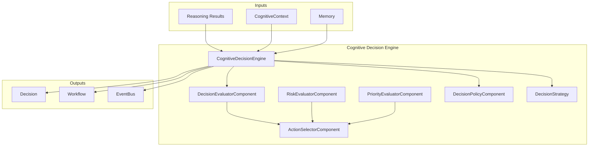
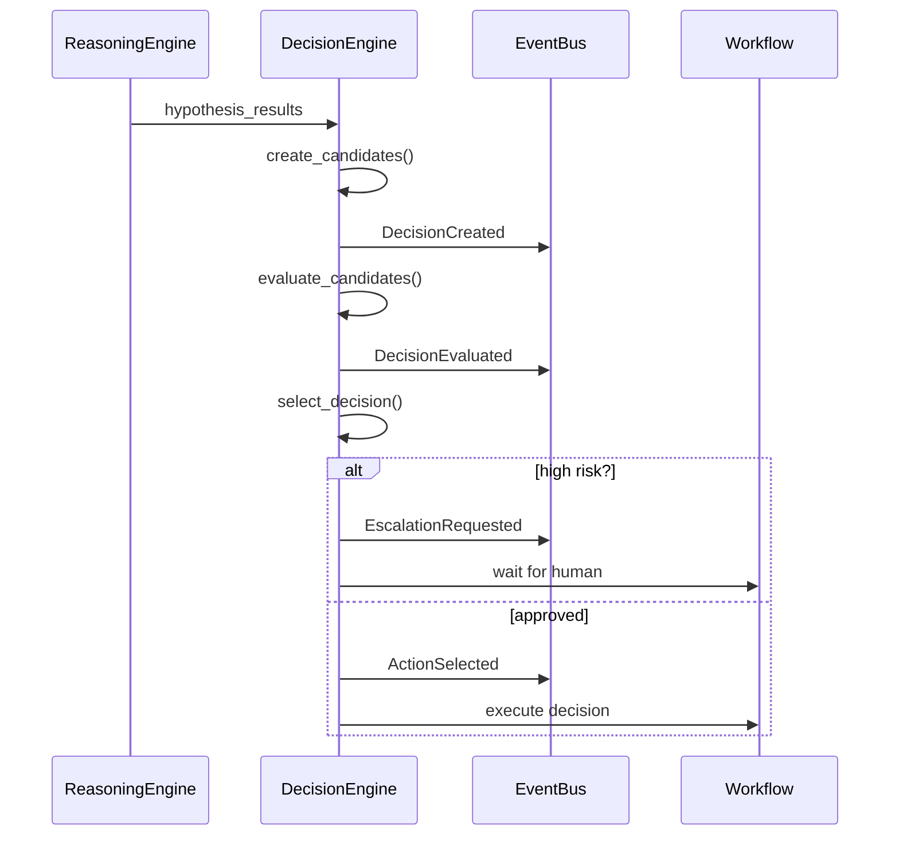

# Cognitive Decision Engine — Arquitectura

> **Documento de arquitectura para el Cognitive Decision Engine (CDE) de EREN.**
> El CDE transforma hipotesis y evidencia en decisiones cognitivas estructuradas.

| | |
|---|---|
| **Estado** | Fundacion implementada |
| **Fase** | Cognitiva - Fase 2 |
| **Tipo** | Motor de decision |
| **Paradigma** | EREN NO usa IA |
| **No contiene** | LLMs, ejecucion de herramientas |

---

## Indice

- [1. Mision](#1-mision)
- [2. Filosofia](#2-filosofia)
- [3. Arquitectura](#3-arquitectura)
- [4. Tipos de Decision](#4-tipos-de-decision)
- [5. Evaluadores](#5-evaluadores)
- [6. Estrategias](#6-estrategias)
- [7. Politicas](#7-politicas)
- [8. Integracion](#8-integracion)
- [9. Eventos](#9-eventos)
- [10. Roadmap](#10-roadmap)

---

## 1. Mision

```
El Decision Engine transforma hipotesis y evidencia
en decisiones cognitivas estructuradas.

Su mision NO es razonar (eso pertenece al Reasoning Engine),
sino decidir cual es la siguiente accion que debe ejecutar EREN.
```

---

## 2. Filosofia

```
Separacion clara:
================

Reasoning = Pensar
-------------
- Genera hipotesis
- Evalua evidencia
- Calcula confianza
- NO toma decisiones

Decision = Decidir
---------------
- Transforma hipotesis en candidatos
- Evalua y prioriza
- Selecciona la mejor accion
- NO razona


Flujo:
======

Evidence
    |
    v
Reasoning Engine
    |
    v
Hypotheses
    |
    v
Decision Engine
    |
    v
Decision
    |
    v
Workflow / Tool / Human
```

---

## 3. Arquitectura



---

## 4. Tipos de Decision

### 4.1 Tipos Disponibles

| Tipo | Categoria | Descripcion |
|------|------------|-------------|
| CONTINUE_ANALYSIS | Analysis | Continuar razonamiento |
| REQUEST_MORE_EVIDENCE | Analysis | Solicitar mas evidencia |
| EXECUTE_TOOL | Action | Ejecutar una herramienta |
| CONSULT_KNOWLEDGE | Action | Consultar base de conocimiento |
| CONSULT_MEMORY | Action | Consultar memoria |
| ESCALATE_TO_HUMAN | Control | Intervencion humana |
| STOP_ANALYSIS | Control | Detener razonamiento |
| CREATE_WORKFLOW | State | Crear workflow |
| WAIT_FOR_EVENT | State | Esperar evento |
| REJECT_HYPOTHESIS | Analysis | Rechazar hipotesis |

### 4.2 Decision Candidate

```python
@dataclass
class DecisionCandidate:
    candidate_id: str
    decision_type: DecisionType
    description: str
    category: DecisionCategory
    priority: DecisionPriority
    confidence: float  # 0.0 - 1.0
    risk_level: RiskLevel
    risk_score: float
    based_on_hypothesis: str
    based_on_evidence: tuple[str, ...]
```

---

## 5. Evaluadores

### 5.1 RiskEvaluator

```python
def evaluate(candidate, context) -> float:
    # Calcula riesgo de ejecutar la decision
    # 0.0 = sin riesgo
    # 1.0 = riesgo critico
```

### 5.2 PriorityEvaluator

```python
def evaluate(candidate, context) -> int:
    # Calcula prioridad de la decision
    # 0-100
    # CRITICAL = 100
    # HIGH = 75
    # MEDIUM = 50
    # LOW = 25
```

### 5.3 DecisionEvaluator

```python
def evaluate(candidates, context, strategy) -> list[Candidate]:
    # Evalua y ordena candidatos
    # Retorna candidatos evaluados y rankeados
```

---

## 6. Estrategias

### 6.1 Tipos de Estrategia

| Estrategia | Descripcion | Uso |
|-----------|-------------|-----|
| CONSERVATIVE | Minimiza riesgo | Alta seguridad |
| SAFETY_FIRST | Prioriza seguridad | Critico |
| BALANCED | Balance riesgo/beneficio | Normal |
| SPEED | Prioriza velocidad | Tiempo real |
| CONFIDENCE_BASED | Sigue los datos | Basado en evidencia |
| HUMAN_IN_LOOP | Siempre requiere humano | Compliance |
| FULLY_AUTOMATED | Sin aprobacion humana | Eficiencia |

### 6.2 Calculo de Score

```python
# Conservative: Riesgo es factor dominante
score = (1 - risk) * 2 + confidence + priority

# Balanced: Balance 40/30/30
score = (1 - risk) * 0.4 + confidence * 0.3 + priority * 0.3

# Speed: Rapidez es factor dominante
score = priority + evidence_bonus + speed_bonus - risk_penalty
```

---

## 7. Politicas

### 7.1 Politicas Disponibles

| Politica | Aprobacion | Escalation |
|----------|------------|-------------|
| Conservative | confidence >= 0.8 | HIGH, CRITICAL |
| Balanced | confidence >= 0.6 | HIGH, CRITICAL, safety |
| Permissive | confidence >= 0.4 | CRITICAL |

### 7.2 Reglas de Escalation

```
ESCALATE_TO_HUMAN cuando:
- Riesgo = CRITICAL
- Afecta seguridad del paciente
- Baja confianza + alta prioridad
```

---

## 8. Integracion

### 8.1 Con Reasoning Engine

```
Reasoning Engine
    |
    v (hypothesis_id, confidence)
Decision Engine
    |
    v
create_candidates_from_reasoning()
```

### 8.2 Con Context

```python
@dataclass
class DecisionContext:
    session_id: str
    best_hypothesis_id: str
    best_hypothesis_confidence: float
    available_evidence: tuple[str, ...]
    device_info: dict
    clinical_context: dict
    safety_requirements: tuple[str, ...]
```

### 8.3 Con EventBus

```python
# Eventos publicados
DecisionCreated    # Candidato creado
DecisionEvaluated   # Candidatos evaluados
ActionSelected      # Decision seleccionada
DecisionApproved   # Decision aprobada
DecisionRejected   # Decision rechazada
EscalationRequested # Escalation a humano
```

### 8.4 Con CapabilityRegistry

```python
# Capacidades registradas
decision.evaluate     # Evaluar candidatos
decision.select       # Seleccionar decision
decision.prioritize    # Priorizar decisiones
decision.escalate      # Escalar a humano
decision.stop          # Detener proceso
decision.workflow       # Crear workflow
```

---

## 9. Eventos



---

## 10. Roadmap

### Fase 1: Fundacion (Actual)
```
- Estructura de modulos
- Tipos y contratos
- Evaluadores basicos
- Estrategias
- Politicas
```

### Fase 2: Conectores
```
- Integration con ReasoningEngine
- Integration con Context
- Integration con Memory
- Integration con Workflow
```

### Fase 3: Politicas Avanzadas
```
- Policy learning
- Policy optimization
- Context-aware policies
```

### Fase 4: Optimizacion
```
- Parallel evaluation
- Caching
- Performance tuning
```

---

## Referencias

| Referencia | Ubicacion |
|------------|-----------|
| Core README | [../core/README.md](../core/README.md) |
| Clinical Reasoning Framework | [./clinical-reasoning-framework.md](./clinical-reasoning-framework.md) |
| Reasoning Engine | [./reasoning-engine.md](./reasoning-engine.md) |
| Knowledge Engine | [./knowledge-engine.md](./knowledge-engine.md) |

---

**Ultima actualizacion:** 2026-07-13  
**Estado:** Fundacion implementada  
**Fase:** Cognitiva - Fase 2  
**Tipo:** Documentacion arquitectonica  
**Paradigma:** EREN NO usa IA