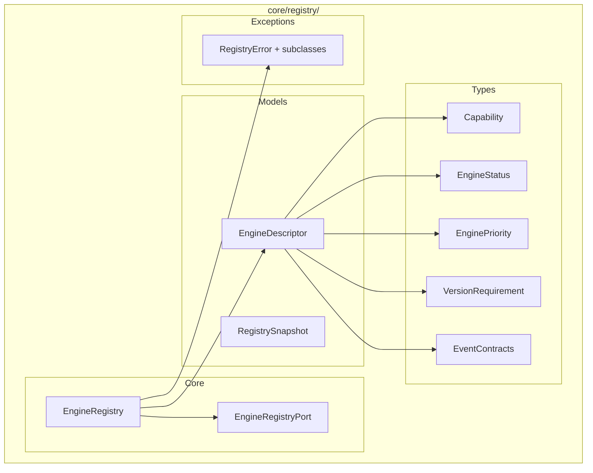
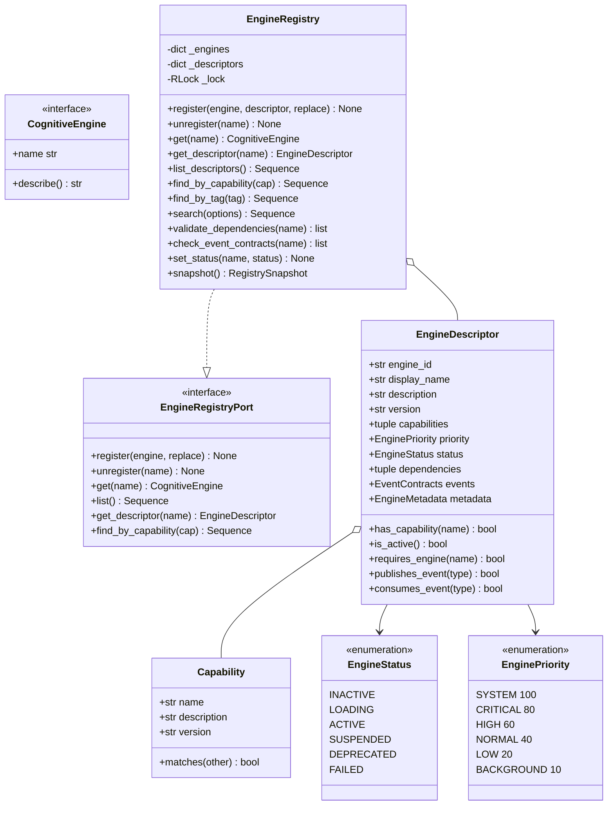
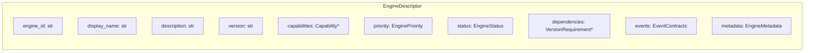
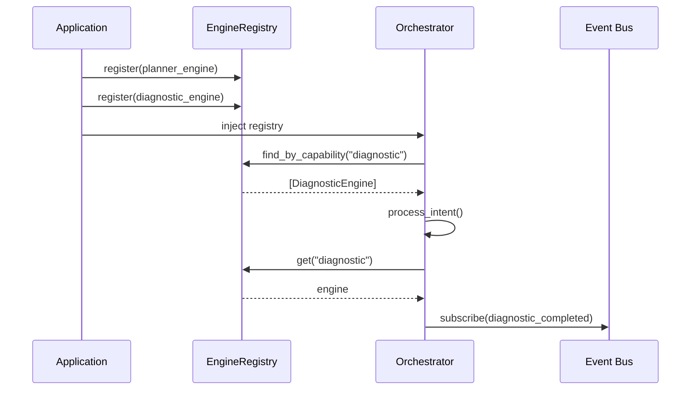
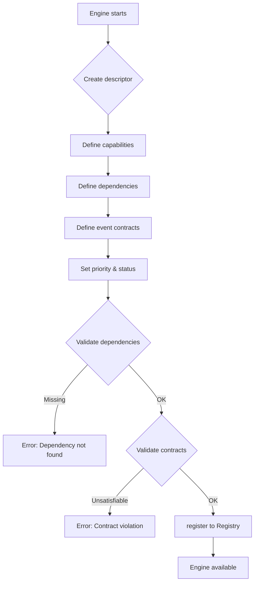
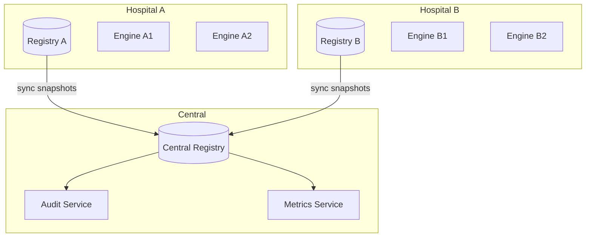

# Engine Registry — Arquitectura Cognitiva

> **Documento de arquitectura para el Engine Registry de EREN.**
> Define el catálogo central de todos los motores cognitivos.
> Complementa el [Clinical Reasoning Framework](./clinical-reasoning-framework.md).

| | |
|---|---|
| **Estado** | Implementación completa |
| **Fase** | Cognitiva — Fase 2 |
| **Tipo** | Infraestructura de registro |
| **Alineado con** | ADR-0005, Clinical Reasoning Framework |
| **No contiene** | Implementaciones de motores, IA |

---

## Índice

- [1. Propósito](#1-propósito)
  - [1.1 Qué es el Engine Registry](#11-qué-es-el-engine-registry)
  - [1.2 Por qué existe](#12-por-qué-existe)
  - [1.3 Principios fundamentales](#13-principios-fundamentales)
- [2. Arquitectura](#2-arquitectura)
  - [2.1 Componentes principales](#21-componentes-principales)
  - [2.2 Diagrama de clases](#22-diagrama-de-clases)
  - [2.3 Patrones de diseño](#23-patrones-de-diseño)
- [3. Engine Descriptor](#3-engine-descriptor)
  - [3.1 Estructura del descriptor](#31-estructura-del-descriptor)
  - [3.2 Capacidades](#32-capacidades)
  - [3.3 Dependencias](#33-dependencias)
  - [3.4 Contratos de eventos](#34-contratos-de-eventos)
- [4. API del Registry](#4-api-del-registry)
  - [4.1 Operaciones básicas](#41-operaciones-básicas)
  - [4.2 Búsqueda y descubrimiento](#42-búsqueda-y-descubrimiento)
  - [4.3 Validación de dependencias](#43-validación-de-dependencias)
- [5. Integración](#5-integración)
  - [5.1 Con el Orchestrator](#51-con-el-orchestrator)
  - [5.2 Con el Event Bus](#52-con-el-event-bus)
  - [5.3 Flujo de registro](#53-flujo-de-registro)
- [6. Casos de Uso](#6-casos-de-uso)
- [7. Escalabilidad](#7-escalabilidad)
- [8. Evolución Futura](#8-evolución-futura)
- [Apéndice A. API Completa](#apéndice-a-api-completa)

---

## 1. Propósito

### 1.1 Qué es el Engine Registry

El **Engine Registry** es el **catálogo central** de todos los motores cognitivos de EREN. Cada motor debe registrarse aquí para ser descubrible por el Orchestrator.

```mermaid
flowchart TB
    subgraph "Motor Registration"
        E1[Planner Engine]
        E2[Knowledge Engine]
        E3[Memory Engine]
        E4[Reasoning Engine]
    end
    
    subgraph "Engine Registry"
        R[(Catalog)]
    end
    
    subgraph "Consumer"
        O[Orchestrator]
    end
    
    E1 -->|register| R
    E2 -->|register| R
    E3 -->|register| R
    E4 -->|register| R
    
    O -->|discover| R
    O -->|get engine| R
    
    Note over R: El Orchestrator nunca conoce<br/>implementaciones concretas
```

### 1.2 Por qué existe

| Problema | Solución del Registry |
|----------|----------------------|
| Motores tightly coupled | Dependency Injection via Registry |
| if/elif para selección de motores | Búsqueda por nombre O(1) |
| Sin visibilidad de capacidades | Descubrimiento por capacidad |
| Dependencias no validadas | Validación automática |
| Version mismatch | Control de compatibilidad |
| Sin auditoría | Registry Snapshot |

### 1.3 Principios fundamentales

| Principio | Descripción |
|-----------|-------------|
| **Dependency Injection** | Los motores se injectan, no se crean dentro del Registry |
| **No conditional dispatch** | Resolución O(1) por nombre, sin if/elif |
| **Descriptor-based** | Cada motor tiene metadata rica para descubrimiento |
| **Capability-driven** | Motores descubribles por capacidades, no por nombre |
| **Validación automática** | Dependencias y contratos verificados |

---

## 2. Arquitectura

### 2.1 Componentes principales



### 2.2 Diagrama de clases



### 2.3 Patrones de diseño

| Patrón | Implementación | Beneficio |
|--------|----------------|-----------|
| **Dependency Injection** | Motores injectados desde outside | Bajo acoplamiento |
| **Registry** | Catálogo centralizado | Descubrimiento uniforme |
| **Strategy** | SearchOptions para filtros | Flexibilidad de búsqueda |
| **Observer** | Event Bus para notificaciones | Reactividad |
| **Snapshot** | RegistrySnapshot | Auditoría y rollback |
| **Value Object** | Capability, VersionRequirement | Inmutabilidad |

---

## 3. Engine Descriptor

### 3.1 Estructura del descriptor



### 3.2 Capacidades

Las capacidades definen **qué puede hacer** un motor:

```python
Capability(name="diagnostic")
Capability(
    name="voice_input",
    description="Procesa entrada de voz",
    version="1.0.0",
    parameters=("language", "format"),
)
```

**Ejemplos de capacidades:**

| Motor | Capacidades |
|-------|-------------|
| Voice Engine | `voice_input`, `voice_output`, `transcription` |
| Planner Engine | `planning`, `scheduling`, `prioritization` |
| Knowledge Engine | `search`, `retrieval`, `reasoning` |
| Memory Engine | `storage`, `retrieval`, `context_management` |
| Reasoning Engine | `deduction`, `hypothesis_generation` |
| Diagnostic Engine | `diagnosis`, `analysis`, `troubleshooting` |

### 3.3 Dependencias

Las dependencias definen **qué necesita** un motor:

```python
VersionRequirement(
    engine_name="planner",
    min_version="1.0.0",
    max_version="2.0.0",
    required=True,
)
```

**Validación automática:**
- El Registry verifica que todas las dependencias requeridas estén registradas
- Verifica compatibilidad de versiones
- Reporta errores antes de que los motores intenten ejecutarse

### 3.4 Contratos de eventos

Los contratos definen **cómo se comunica** un motor:

```python
EventContracts(
    publishes=(
        EventContract(
            event_type="plan_created",
            direction="publishes",
            description="Publicado cuando se crea un plan",
        ),
    ),
    consumes=(
        EventContract(
            event_type="intent_detected",
            direction="consumes",
            is_critical=True,  # Requerido para funcionar
        ),
    ),
)
```

**Validación:**
- El Registry verifica que los eventos críticos tengan publishers activos
- Previene configuración incorrecta en tiempo de registro

---

## 4. API del Registry

### 4.1 Operaciones básicas

```python
from core.registry import EngineRegistry, EngineDescriptor

registry = EngineRegistry()

# Registrar con descriptor completo
registry.register(
    engine=my_engine,
    descriptor=EngineDescriptor.create(
        engine_id="planner",
        display_name="Planner Engine",
        description="Plans cognitive tasks",
        capabilities=[Capability(name="planning")],
        priority=EnginePriority.HIGH,
    ),
)

# Obtener por nombre (O(1))
engine = registry.get("planner")

# Listar todos
all_engines = registry.list()

# Desregistrar
registry.unregister("planner")
```

### 4.2 Búsqueda y descubrimiento

```python
# Buscar por capacidad
diagnostic_engines = registry.find_by_capability("diagnostic")

# Buscar por tag
tagged_engines = registry.find_by_tag("production")

# Búsqueda avanzada con filtros
from core.registry import EngineFilter, SearchOptions

results = registry.search(
    SearchOptions(
        filter=EngineFilter(
            capability="reasoning",
            status=EngineStatus.ACTIVE,
            min_priority=EnginePriority.HIGH,
        ),
        sort_by="priority",
        ascending=False,
        limit=10,
    )
)
```

### 4.3 Validación de dependencias

```python
# Validar antes de ejecutar
errors = registry.validate_dependencies("diagnostic")

if errors:
    for error in errors:
        print(f"Error: {error.message}")
else:
    # Safe to run
    engine = registry.get("diagnostic")
```

---

## 5. Integración

### 5.1 Con el Orchestrator



### 5.2 Con el Event Bus

```mermaid
flowchart TB
    subgraph Registry
        R1[Planner descriptor<br/>publishes: plan_created<br/>consumes: intent_detected]
        R2[Diagnostic descriptor<br/>publishes: diagnostic_completed<br/>consumes: hypothesis_generated]
    end
    
    subgraph EventBus
        E1[plan_created]
        E2[intent_detected]
        E3[diagnostic_completed]
    end
    
    R1 -->|publishes| E1
    R1 -->|publishes| E2
    R2 -->|publishes| E3
    
    Note over R1,R2: El Registry actúa como<br/>fuente de verdad para<br/>los contratos de eventos
```

### 5.3 Flujo de registro



---

## 6. Casos de Uso

### Caso 1: Registro de nuevo motor

```python
# 1. Crear descriptor
descriptor = EngineDescriptor.create(
    engine_id="reasoning",
    display_name="Reasoning Engine",
    description="Performs clinical reasoning",
    version="1.0.0",
    capabilities=[
        Capability(name="reasoning", description="Clinical reasoning"),
        Capability(name="hypothesis", description="Generate hypotheses"),
    ],
    priority=EnginePriority.HIGH,
    author="Team EREN",
)

# 2. Registrar
registry.register(reasoning_engine, descriptor=descriptor)

# 3. Activar cuando esté listo
registry.set_status("reasoning", EngineStatus.ACTIVE)
```

### Caso 2: Descubrimiento por capacidad

```python
# Encontrar todos los motores que pueden diagnosticar
diagnostics = registry.find_by_capability("diagnostic")

# Encontrar motores de alta prioridad activos
high_priority = registry.search(
    SearchOptions(
        filter=EngineFilter(
            min_priority=EnginePriority.HIGH,
            status=EngineStatus.ACTIVE,
        ),
        sort_by="priority",
    )
)
```

### Caso 3: Validación antes de ejecutar

```python
# Antes de ejecutar un workflow
errors = registry.validate_dependencies("diagnostic_workflow")
contract_errors = registry.check_event_contracts("diagnostic_workflow")

if errors or contract_errors:
    print("Cannot execute: missing dependencies or event contracts")
else:
    # Safe to execute
    engine = registry.get("diagnostic_workflow")
```

---

## 7. Escalabilidad

El Registry está diseñado para:

| Escenario | Estrategia |
|-----------|-----------|
| Múltiples hospitales | Cada hospital tiene su propio Registry |
| Centenares de motores | Búsqueda O(1) por nombre |
| Versiones distribuidas | Validación semver |
| Alta disponibilidad | Thread-safe con RLock |



---

## 8. Evolución Futura

| Capacidad | Descripción | Fase |
|----------|-------------|------|
| **Distributed Registry** | Registro distribuido con sync | Infraestructura |
| **Hot Reload** | Registro dinámico sin restart | Operations |
| **A/B Testing** | Versiones múltiples del mismo motor | Experimentation |
| **Circuit Breaker** | Desactivación automática de motores fallidos | Resilience |

---

## Apéndice A. API Completa

### EngineDescriptor

```python
EngineDescriptor(
    engine_id: str,           # Identificador único
    display_name: str,         # Nombre legible
    description: str,          # Descripción
    version: str,              # Semver
    min_er_en_version: str,    # Versión mínima de EREN
    capabilities: tuple[Capability, ...],
    priority: EnginePriority,
    status: EngineStatus,
    dependencies: tuple[VersionRequirement, ...],
    events: EventContracts,
    metadata: EngineMetadata,
)

# Métodos
has_capability(name: str) -> bool
get_capability(name: str) -> Capability | None
is_active() -> bool
is_compatible_with(eren_version: str) -> bool
requires_engine(engine_name: str) -> bool
publishes_event(event_type: str) -> bool
consumes_event(event_type: str) -> bool
```

### EngineRegistry

```python
EngineRegistry(engines: Iterable[CognitiveEngine] | None = None)

# Operations
register(engine, descriptor=None, replace=False) -> None
unregister(name) -> None
get(name) -> CognitiveEngine
get_descriptor(name) -> EngineDescriptor
list() -> Sequence[CognitiveEngine]
list_descriptors() -> Sequence[EngineDescriptor]

# Search
find_by_capability(capability: str) -> Sequence[EngineDescriptor]
find_by_tag(tag: str) -> Sequence[EngineDescriptor]
search(options: SearchOptions) -> Sequence[EngineDescriptor]

# Status
set_status(name: str, status: EngineStatus) -> None
get_active_engines() -> Sequence[EngineDescriptor]

# Validation
validate_dependencies(name: str) -> list[DependencyNotFoundError]
check_event_contracts(name: str) -> list[ValidationError]

# Snapshot
snapshot() -> RegistrySnapshot
```

### Exceptions

```python
RegistryError                    # Base
├── EngineNotFoundError
├── EngineAlreadyRegisteredError
├── DependencyNotFoundError
├── CompatibilityError
├── ValidationError
├── EventContractError
└── CircularDependencyError
```

---

## Referencias

| Referencia | Ubicación |
|------------|-----------|
| Clinical Reasoning Framework | [./clinical-reasoning-framework.md](./clinical-reasoning-framework.md) |
| CORE README | [core/README.md](../core/README.md) |
| Registry README | [core/registry/README.md](../../core/registry/README.md) |
| Event Bus | [core/event-bus.md](./event-bus.md) |
| Planner Engine | [core/planner-engine.md](./planner-engine.md) |

---

**Última actualización:** 2026-07-13  
**Estado:** Implementación completa  
**Fase:** Cognitiva — Fase 2  
**Tipo:** Documentación arquitectónica