# EREN CORE - Cognitive Engines Design

> **Diseño técnico de motores cognitivos especializados para EREN Cognitive Operating System**

---

## Declaración de Propósito

Este documento define el diseño técnico de los motores cognitivos especializados que componen EREN CORE. Cada motor es un componente especializado que orquesta un aspecto específico de la cognición del sistema.

**Alineado con**: VISION.md v1.0.0, ADR-0001, ADR-0002, TECH_BIBLE.md v2.0.0

---

## Arquitectura de Motores Cognitivos

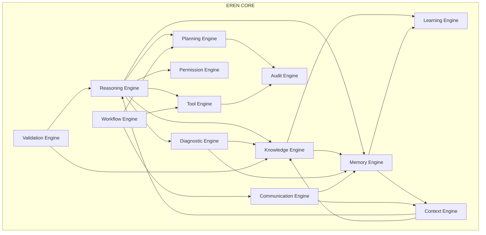
```mermaid
graph TB
    subgraph "EREN CORE"
        RE[Reasoning Engine]
        KE[Knowledge Engine]
        ME[Memory Engine]
        LE[Learning Engine]
        PE[Planning Engine]
        TE[Tool Engine]
        PME[Permission Engine]
        AE[Audit Engine]
        DE[Diagnostic Engine]
        WE[Workflow Engine]
        VE[Validation Engine]
        CE[Communication Engine]
        CTE[Context Engine]
    end
    
    RE --> KE
    RE --> ME
    RE --> PE
    RE --> TE
    RE --> PME
    RE --> DE
    
    KE --> ME
    KE --> LE
    
    ME --> LE
    ME --> CTE
    
    PE --> AE
    TE --> AE
    
    DE --> KE
    DE --> ME
    
    WE --> PE
    WE --> TE
    WE --> CE
    
    VE --> KE
    VE --> RE
    
    CE --> ME
    CE --> CTE
    
    CTE --> RE
    CTE --> KE
```

---

## 1. Reasoning Engine

### Propósito

Orquestar razonamiento lógico y deductivo, coordinando otros motores para generar respuestas cognitivas.

### Responsabilidades

- Clasificación de intentos de usuario
- Planificación de razonamiento
- Coordinación de otros motores
- Síntesis de resultados
- Generación de explicaciones
- Evaluación de confianza

### Arquitectura Interna

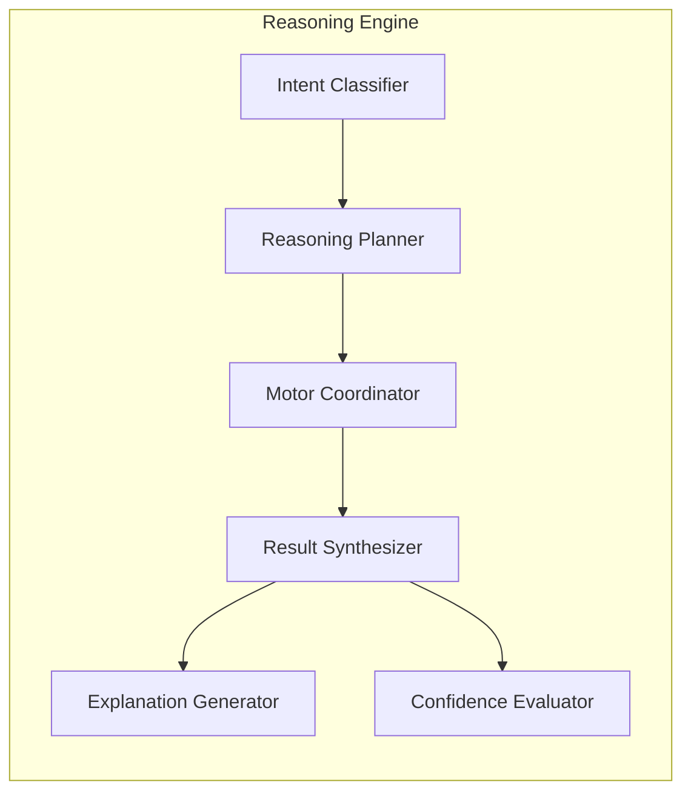
```mermaid
graph LR
    subgraph "Reasoning Engine"
        IC[Intent Classifier]
        RP[Reasoning Planner]
        MC[Motor Coordinator]
        RS[Result Synthesizer]
        EG[Explanation Generator]
        CE[Confidence Evaluator]
    end
    
    IC --> RP
    RP --> MC
    MC --> RS
    RS --> EG
    RS --> CE
```

### Flujo de Procesamiento

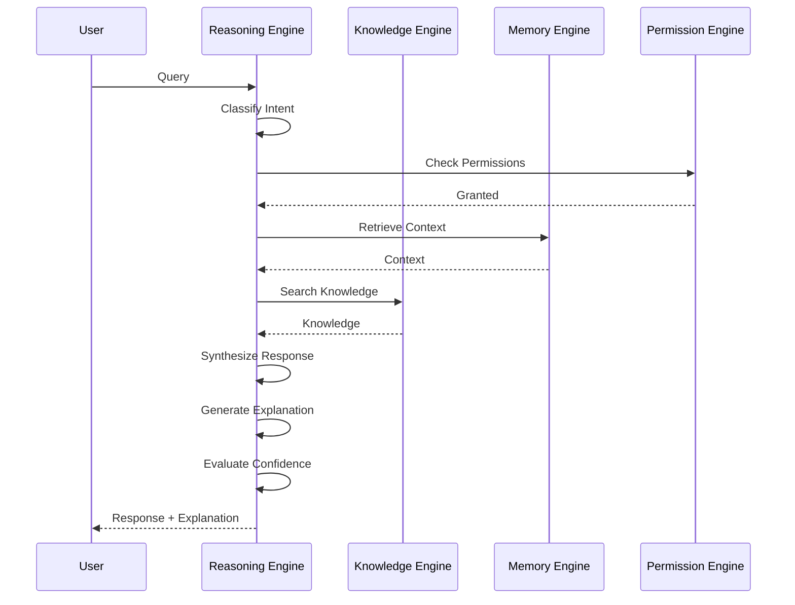
```mermaid
sequenceDiagram
    participant User
    participant RE as Reasoning Engine
    participant KE as Knowledge Engine
    participant ME as Memory Engine
    participant PE as Permission Engine
    
    User->>RE: Query
    RE->>RE: Classify Intent
    RE->>PE: Check Permissions
    PE-->>RE: Granted
    RE->>ME: Retrieve Context
    ME-->>RE: Context
    RE->>KE: Search Knowledge
    KE-->>RE: Knowledge
    RE->>RE: Synthesize Response
    RE->>RE: Generate Explanation
    RE->>RE: Evaluate Confidence
    RE-->>User: Response + Explanation
```

### Ventajas

- **Coordinación Centralizada**: Un punto de coordinación para razonamiento
- **Explicabilidad Obligatoria**: Generación de explicaciones es parte del flujo
- **Evaluación de Confianza**: Cada respuesta tiene confidence score
- **Flexibilidad**: Puede coordinar diferentes combinaciones de motores

### Riesgos

- **Single Point of Failure**: Si Reasoning Engine falla, todo el sistema falla
- **Complejidad**: Coordinación de múltiples motores es compleja
- **Latencia**: Coordinación añade overhead

### Alternativas

- **Distributed Reasoning**: Cada motor razona independientemente
- **Rule-Based System**: Sistema de reglas en lugar de orquestación
- **Neural Reasoning**: Red neuronal para razonamiento

### Evolución Futura

- **v1.0**: Razonamiento basado en reglas y LLM
- **v2.0**: Razonamiento con Tree of Thoughts
- **v3.0**: Razonamiento con neural-symbolic hybrid
- **v4.0**: Razonamiento meta-cognitivo

---

## 2. Knowledge Engine

### Propósito

Gestionar y recuperar conocimiento estructurado de forma eficiente y explicable.

### Responsabilidades

- Ingesta de conocimiento
- Indexación y embeddings
- Búsqueda vectorial híbrida
- Validación de conocimiento
- Reranking de resultados
- Citación de fuentes

### Arquitectura Interna

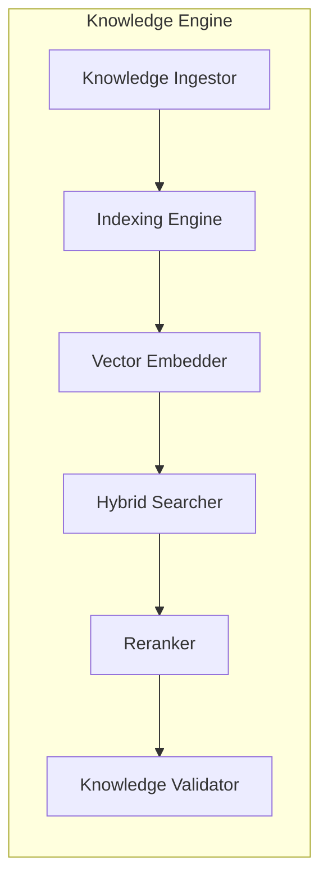
```mermaid
graph LR
    subgraph "Knowledge Engine"
        KI[Knowledge Ingestor]
        IE[Indexing Engine]
        VE[Vector Embedder]
        HS[Hybrid Searcher]
        RR[Reranker]
        KC[Knowledge Validator]
    end
    
    KI --> IE
    IE --> VE
    VE --> HS
    HS --> RR
    RR --> KC
```

### Bases de Conocimiento

**Knowledge Base (KB)**
- Manuales técnicos
- Documentación de equipos
- Procedimientos estándar
- Guías de mantenimiento

**Case Base (CB)**
- Casos de mantenimiento resueltos
- Historial de diagnósticos
- Lecciones aprendidas
- Patrones de fallas

**Memory Base (MB)**
- Memoria de conversaciones
- Memoria de contexto de usuario
- Memoria episódica
- Memoria semántica

**Document Base (DB)**
- Protocolos y normativas
- Regulaciones (HIPAA, GDPR)
- Políticas hospitalarias
- Documentos legales

### Ventajas

- **Búsqueda Híbrida**: Combina búsqueda vectorial y keyword
- **Validación**: Cada conocimiento es validado antes de ingestión
- **Citas**: Cada respuesta cita fuentes específicas
- **Reranking**: Mejora relevancia de resultados

### Riesgos

- **Calidad de Conocimiento**: Depende de calidad de fuentes
- **Embedding Drift**: Embeddings pueden degradarse con tiempo
- **Escalabilidad**: Búsqueda vectorial a escala es costosa

### Alternativas

- **Keyword-only Search**: Solo búsqueda por palabras clave
- **Graph-based Knowledge**: Grafo de conocimiento en lugar de vectorial
- **Hybrid Graph+Vector**: Combinación de grafo y vectorial

### Evolución Futura

- **v1.0**: Búsqueda vectorial básica
- **v2.0**: Búsqueda híbrida con reranking
- **v3.0**: Knowledge graph integrado
- **v4.0**: Generación de conocimiento nuevo

---

## 3. Memory Engine

### Propósito

Gestionar memoria a corto y largo plazo del sistema, permitiendo aprendizaje continuo.

### Responsabilidades

- Memoria de conversaciones
- Memoria de contexto de usuario
- Memoria episódica
- Memoria semántica
- Consolidación de memoria
- Olvido selectivo

### Arquitectura Interna

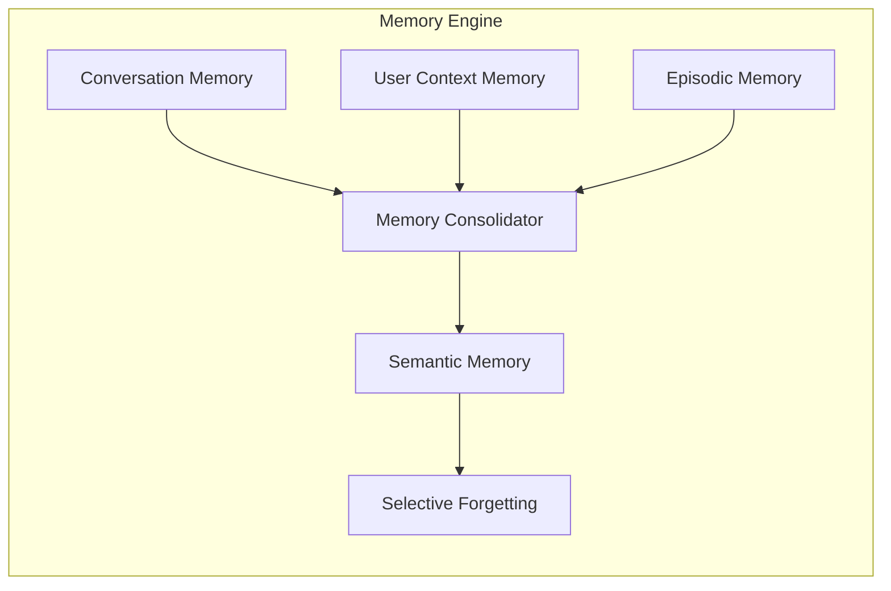
```mermaid
graph LR
    subgraph "Memory Engine"
        CM[Conversation Memory]
        UM[User Context Memory]
        EM[Episodic Memory]
        SM[Semantic Memory]
        MC[Memory Consolidator]
        SMF[Selective Forgetting]
    end
    
    CM --> MC
    UM --> MC
    EM --> MC
    MC --> SM
    SM --> SMF
```

### Tipos de Memoria

**Short-term Memory**
- Conversación actual
- Contexto inmediato
- Variables temporales

**Long-term Memory**
- Historial de conversaciones
- Patrones de usuario
- Conocimiento aprendido

**Episodic Memory**
- Eventos específicos
- Casos resueltos
- Experiencias pasadas

**Semantic Memory**
- Conceptos y relaciones
- Conocimiento general
- Abstracciones

### Ventajas

- **Aprendizaje Continuo**: Sistema aprende de cada interacción
- **Personalización**: Memoria permite personalización
- **Contexto**: Memoria provee contexto profundo
- **Olvido Selectivo**: Evita saturación de memoria

### Riesgos

- **Privacy**: Memoria puede contener datos sensibles
- **Bias**: Memoria puede acumular bias
- **Consolidación**: Consolidación de memoria es compleja
- **Escalabilidad**: Memoria a escala es costosa

### Alternativas

- **Stateless System**: Sin memoria persistente
- **External Memory**: Memoria en sistemas externos
- **Neural Memory**: Memoria basada en redes neuronales

### Evolución Futura

- **v1.0**: Memoria básica de conversaciones
- **v2.0**: Memoria episódica y semántica
- **v3.0**: Consolidación automática de memoria
- **v4.0**: Meta-cognición sobre memoria

---

## 4. Learning Engine

### Propósito

Aprender automáticamente de patrones, casos y feedback para mejorar continuamente.

### Responsabilidades

- Entrenamiento de modelos
- Detección de patrones
- Predicción de fallas
- Optimización de procesos
- Feedback loops
- Evaluación de aprendizaje

### Arquitectura Interna

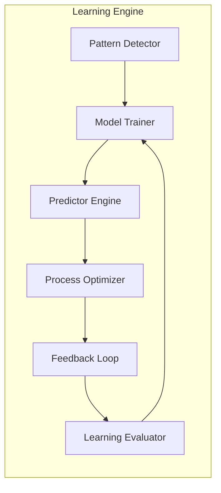
```mermaid
graph LR
    subgraph "Learning Engine"
        PD[Pattern Detector]
        ML[Model Trainer]
        PE[Predictor Engine]
        PO[Process Optimizer]
        FL[Feedback Loop]
        LE[Learning Evaluator]
    end
    
    PD --> ML
    ML --> PE
    PE --> PO
    PO --> FL
    FL --> LE
    LE --> ML
```

### Tipos de Aprendizaje

**Supervised Learning**
- Clasificación de fallas
- Predicción de mantenimiento
- Priorización de casos

**Unsupervised Learning**
- Detección de anomalías
- Clustering de casos
- Descubrimiento de patrones

**Reinforcement Learning**
- Optimización de workflows
- Toma de decisiones
- Planificación de mantenimiento

### Ventajas

- **Mejora Continua**: Sistema mejora con el tiempo
- **Predicción**: Puede predecir fallas antes de que ocurran
- **Optimización**: Optimiza procesos automáticamente
- **Adaptación**: Se adapta a nuevos patrones

### Riesgos

- **Overfitting**: Modelos pueden overfit a datos específicos
- **Drift**: Patrones pueden cambiar con tiempo
- **Explainability**: Modelos de ML pueden ser cajas negras
- **Data Quality**: Depende de calidad de datos

### Alternativas

- **Rule-based Learning**: Aprendizaje basado en reglas
- **Human-in-the-loop**: Aprendizaje con supervisión humana
- **No Learning**: Sistema sin aprendizaje automático

### Evolución Futura

- **v1.0**: Sin aprendizaje automático
- **v2.0**: Aprendizaje supervisado básico
- **v3.0**: Aprendizaje no supervisado y RL
- **v4.0**: Meta-learning y few-shot learning

---

## 5. Planning Engine

### Propósito

Planificar y descomponer tareas complejas en pasos ejecutables.

### Responsabilidades

- Descomposición de tareas
- Planificación de workflows
- Optimización de recursos
- Programación de mantenimiento
- Manejo de dependencias
- Re-planificación dinámica

### Arquitectura Interna

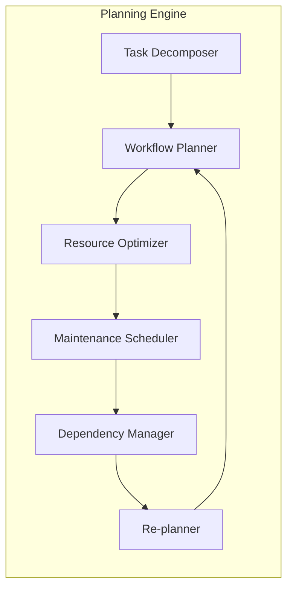
```mermaid
graph LR
    subgraph "Planning Engine"
        TD[Task Decomposer]
        WP[Workflow Planner]
        RO[Resource Optimizer]
        MS[Maintenance Scheduler]
        DM[Dependency Manager]
        RP[Re-planner]
    end
    
    TD --> WP
    WP --> RO
    RO --> MS
    MS --> DM
    DM --> RP
    RP --> WP
```

### Tipos de Planificación

**Task Planning**
- Descomposición de tareas complejas
- Secuenciación de pasos
- Manejo de dependencias

**Workflow Planning**
- Planificación de workflows multi-paso
- Coordinación de recursos
- Manejo de excepciones

**Maintenance Planning**
- Programación de mantenimiento preventivo
- Optimización de recursos
- Balanceo de carga

### Ventajas

- **Automatización**: Automatiza planificación compleja
- **Optimización**: Optimiza uso de recursos
- **Flexibilidad**: Re-planifica dinámicamente
- **Escalabilidad**: Escala a tareas complejas

### Riesgos

- **Complejidad**: Planificación es NP-hard
- **Incertidumbre**: Planificación con incertidumbre es difícil
- **Over-planning**: Puede planificar excesivamente
- **Rigidez**: Planes pueden ser demasiado rígidos

### Alternativas

- **Human Planning**: Planificación manual
- **Rule-based Planning**: Planificación basada en reglas
- **Heuristic Planning**: Planificación heurística

### Evolución Futura

- **v1.0**: Sin planificación automática
- **v2.0**: Planificación básica de tareas
- **v3.0**: Planificación de workflows complejos
- **v4.0**: Planificación predictiva

---

## 6. Tool Engine

### Propósito

Ejecutar herramientas externas de forma segura y controlada.

### Responsabilidades

- Registro de herramientas
- Ejecución segura
- Manejo de errores
- Timeout handling
- Validación de outputs
- Logging de ejecuciones

### Arquitectura Interna

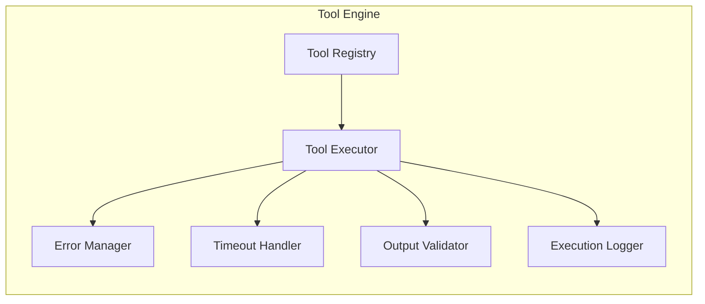
```mermaid
graph LR
    subgraph "Tool Engine"
        TR[Tool Registry]
        TE[Tool Executor]
        EM[Error Manager]
        TO[Timeout Handler]
        OV[Output Validator]
        EL[Execution Logger]
    end
    
    TR --> TE
    TE --> EM
    TE --> TO
    TE --> OV
    TE --> EL
```

### Tipos de Herramientas

**Knowledge Tools**
- Búsqueda en KB
- Búsqueda en CB
- Búsqueda en DB

**Data Tools**
- Consultas a DB
- Análisis de datos
- Generación de reportes

**Integration Tools**
- Llamadas a APIs externas
- Integración con sistemas hospitalarios
- Comunicación con dispositivos

### Ventajas

- **Seguridad**: Ejecución controlada y segura
- **Extensibilidad**: Fácil agregar nuevas herramientas
- **Validación**: Outputs validados antes de uso
- **Logging**: Toda ejecución es registrada

### Riesgos

- **Security**: Herramientas pueden tener vulnerabilidades
- **Reliability**: Herramientas externas pueden fallar
- **Performance**: Ejecución puede ser lenta
- **Complexity**: Gestión de herramientas es compleja

### Alternativas

- **Direct Execution**: Ejecución directa sin motor
- **Sandboxed Execution**: Ejecución en sandbox
- **No Tools**: Sin herramientas externas

### Evolución Futura

- **v1.0**: Herramientas básicas
- **v2.0**: Herramientas avanzadas con validación
- **v3.0**: Herramientas dinámicas
- **v4.0**: Auto-generación de herramientas

---

## 7. Permission Engine

### Propósito

Controlar permisos y autorización de forma granular y segura.

### Responsabilidades

- Verificación de permisos
- Role-based access control (RBAC)
- Attribute-based access control (ABAC)
- Auditoría de accesos
- Gestión de roles
- Revocación de permisos

### Arquitectura Interna

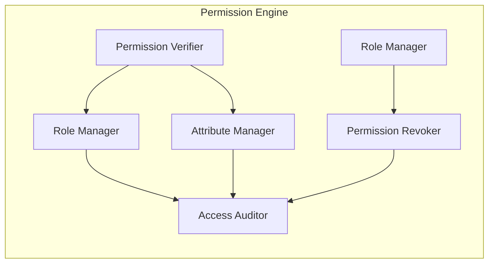
```mermaid
graph LR
    subgraph "Permission Engine"
        PV[Permission Verifier]
        RM[Role Manager]
        AM[Attribute Manager]
        AA[Access Auditor]
        RMG[Role Manager]
        PR[Permission Revoker]
    end
    
    PV --> RM
    PV --> AM
    RM --> AA
    AM --> AA
    RMG --> PR
    PR --> AA
```

### Tipos de Permisos

**Read Permissions**
- READ_EQUIPMENT
- READ_KNOWLEDGE_BASE
- READ_CASE_BASE
- READ_USER_DATA

**Write Permissions**
- WRITE_EQUIPMENT
- WRITE_CASE
- WRITE_KNOWLEDGE

**Admin Permissions**
- ADMIN_USERS
- ADMIN_ROLES
- ADMIN_SYSTEM

### Ventajas

- **Seguridad**: Control granular de accesos
- **Flexibilidad**: RBAC + ABAC para flexibilidad
- **Auditoría**: Todos los accesos son auditados
- **Compliance**: Cumple con regulaciones

### Riesgos

- **Complexity**: Gestión de permisos es compleja
- **Over-permissioning**: Puede dar permisos excesivos
- **Performance**: Verificación de permisos añade overhead

### Alternativas

- **Simple RBAC**: Solo role-based access control
- **No Permissions**: Sin control de permisos
- **External Auth**: Autenticación externa

### Evolución Futura

- **v1.0**: RBAC básico
- **v2.0**: RBAC + ABAC
- **v3.0**: Dynamic permissions
- **v4.0**: AI-powered permission management

---

## 8. Audit Engine

### Propósito

Auditoría completa de todas las acciones cognitivas y del sistema.

### Responsabilidades

- Logging estructurado
- Tracing distribuido
- Metrics collection
- Alert generation
- Audit trail
- Compliance reporting

### Arquitectura Interna

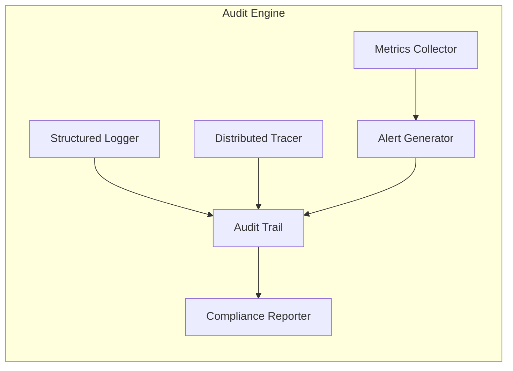
```mermaid
graph LR
    subgraph "Audit Engine"
        SL[Structured Logger]
        DT[Distributed Tracer]
        MC[Metrics Collector]
        AG[Alert Generator]
        AT[Audit Trail]
        CR[Compliance Reporter]
    end
    
    SL --> AT
    DT --> AT
    MC --> AG
    AG --> AT
    AT --> CR
```

### Tipos de Auditoría

**Action Audit**
- Logging de acciones
- Tracing de requests
- Logging de errores

**Security Audit**
- Logging de accesos
- Logging de cambios de permisos
- Logging de eventos de seguridad

**Compliance Audit**
- Logging para HIPAA/GDPR
- Reportes de compliance
- Evidencias de auditoría

### Ventajas

- **Observabilidad**: Visibilidad completa del sistema
- **Compliance**: Cumple con regulaciones
- **Debugging**: Facilita debugging
- **Security**: Detecta anomalías de seguridad

### Riesgos

- **Performance**: Logging añade overhead
- **Storage**: Logs requieren mucho storage
- **Privacy**: Logs pueden contener datos sensibles
- **Complexity**: Sistema de auditoría es complejo

### Alternativas

- **Minimal Logging**: Logging mínimo
- **No Auditing**: Sin auditoría
- **External Auditing**: Auditoría externa

### Evolución Futura

- **v1.0**: Logging básico
- **v2.0**: Distributed tracing
- **v3.0**: Metrics y alerting
- **v4.0**: AI-powered anomaly detection

---

## 9. Diagnostic Engine

### Propósito

Diagnosticar problemas técnicos de equipos médicos de forma precisa y explicable.

### Responsabilidades

- Análisis de síntomas
- Búsqueda de casos similares
- Generación de diagnósticos
- Explicación de razonamiento
- Recomendación de soluciones
- Validación de diagnósticos

### Arquitectura Interna

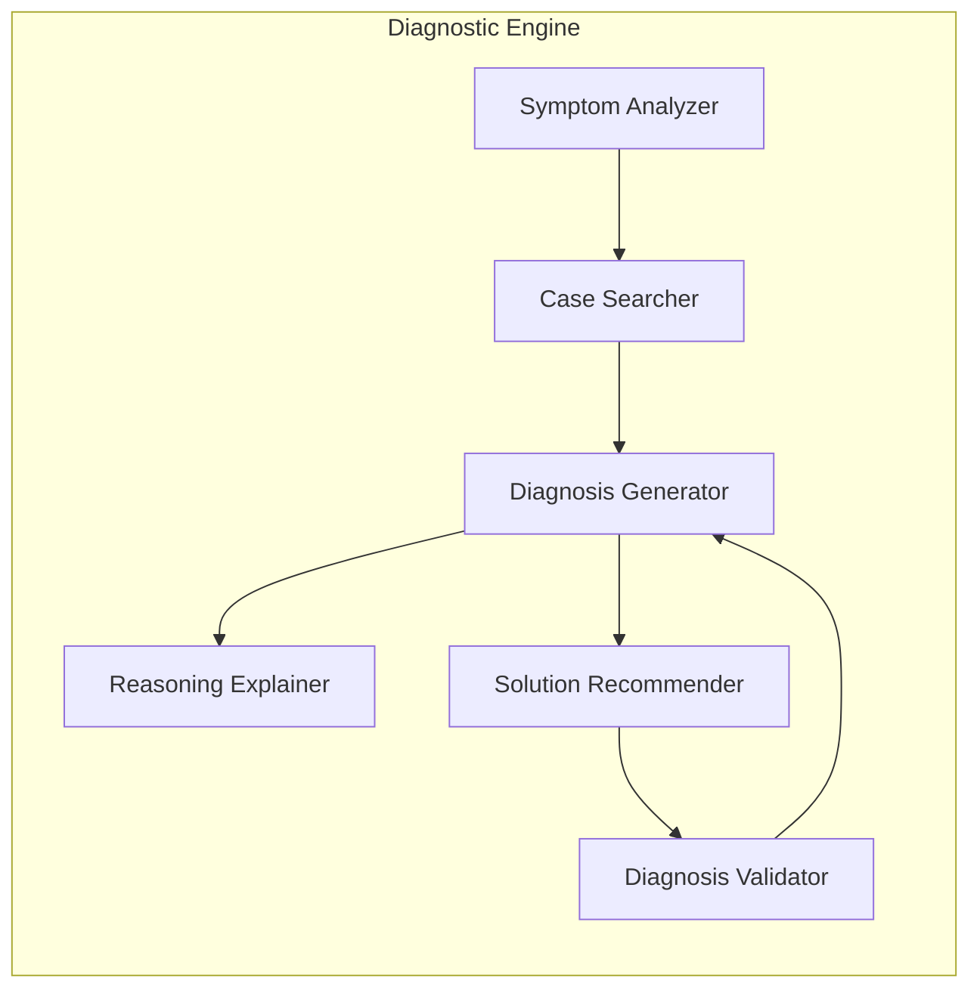
```mermaid
graph LR
    subgraph "Diagnostic Engine"
        SA[Symptom Analyzer]
        CS[Case Searcher]
        DG[Diagnosis Generator]
        RE[Reasoning Explainer]
        SR[Solution Recommender]
        DV[Diagnosis Validator]
    end
    
    SA --> CS
    CS --> DG
    DG --> RE
    DG --> SR
    SR --> DV
    DV --> DG
```

### Flujo de Diagnóstico

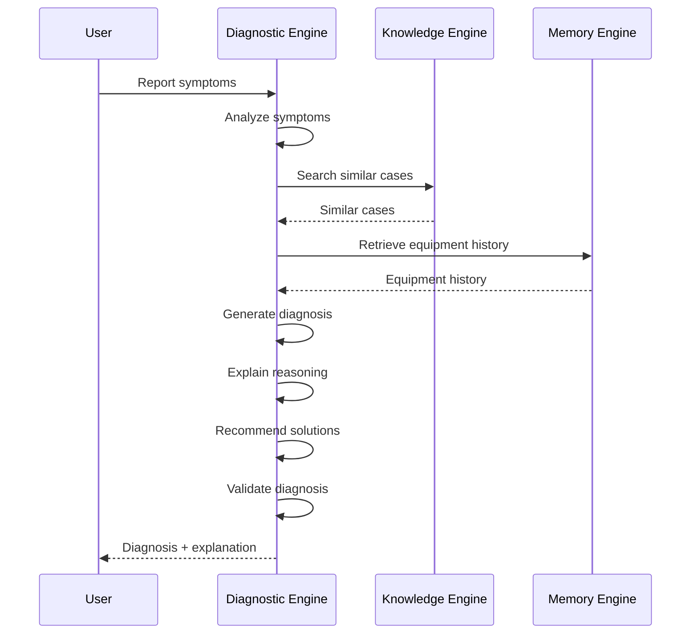
```mermaid
sequenceDiagram
    participant User
    participant DE as Diagnostic Engine
    participant KE as Knowledge Engine
    participant ME as Memory Engine
    
    User->>DE: Report symptoms
    DE->>DE: Analyze symptoms
    DE->>KE: Search similar cases
    KE-->>DE: Similar cases
    DE->>ME: Retrieve equipment history
    ME-->>DE: Equipment history
    DE->>DE: Generate diagnosis
    DE->>DE: Explain reasoning
    DE->>DE: Recommend solutions
    DE->>DE: Validate diagnosis
    DE-->>User: Diagnosis + explanation
```

### Ventajas

- **Precisión**: Diagnósticos precisos basados en casos
- **Explicabilidad**: Razonamiento explicado
- **Validación**: Diagnósticos validados
- **Aprendizaje**: Aprende de cada caso

### Riesgos

- **Accuracy**: Diagnósticos pueden ser incorrectos
- **Complexity**: Diagnóstico es complejo
- **Data Quality**: Depende de calidad de casos
- **Liability**: Diagnósticos incorrectos tienen consecuencias

### Alternativas

- **Rule-based Diagnosis**: Diagnóstico basado en reglas
- **Human Diagnosis**: Diagnóstico manual
- **No Diagnosis**: Sin diagnóstico automático

### Evolución Futura

- **v1.0**: Diagnóstico básico
- **v2.0**: Diagnóstico con validación
- **v3.0**: Diagnóstico predictivo
- **v4.0**: Diagnóstico con IoT integration

---

## 10. Workflow Engine

### Propósito

Ejecutar workflows automatizados de forma segura y controlada.

### Responsabilidades

- Definición de workflows
- Ejecución de workflows
- Manejo de errores
- Coordinación de pasos
- Validación de outputs
- Logging de workflows

### Arquitectura Interna

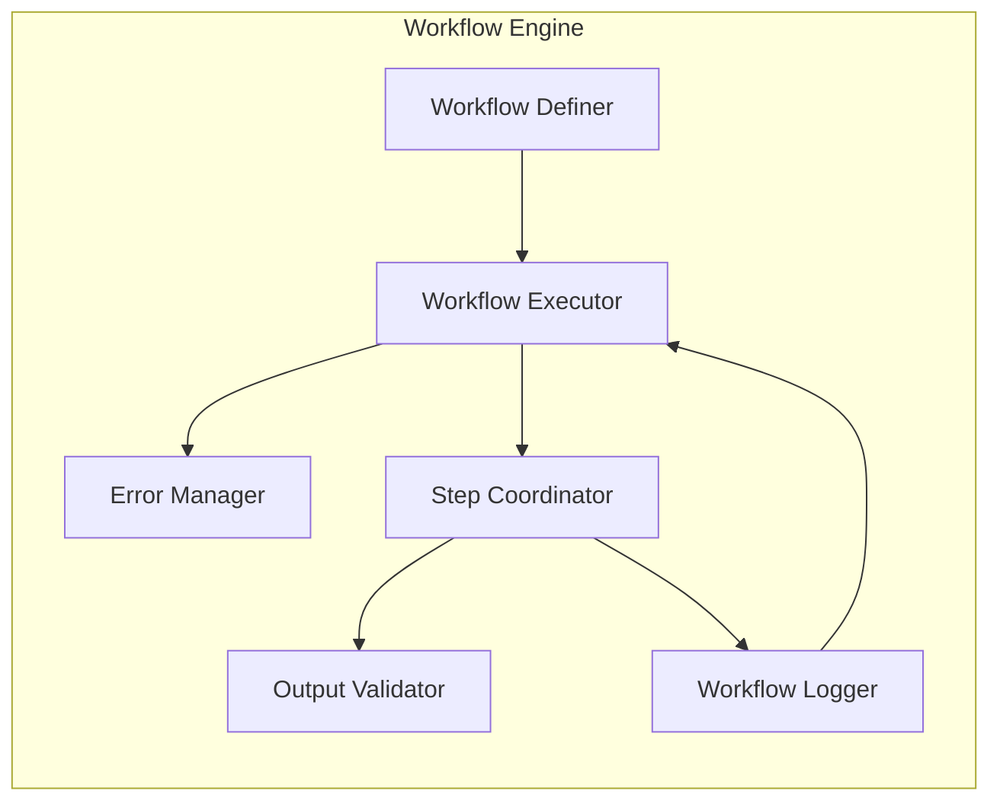
```mermaid
graph LR
    subgraph "Workflow Engine"
        WD[Workflow Definer]
        WE[Workflow Executor]
        EM[Error Manager]
        SC[Step Coordinator]
        OV[Output Validator]
        WL[Workflow Logger]
    end
    
    WD --> WE
    WE --> EM
    WE --> SC
    SC --> OV
    SC --> WL
    WL --> WE
```

### Tipos de Workflows

**Maintenance Workflows**
- Workflow de mantenimiento preventivo
- Workflow de mantenimiento correctivo
- Workflow de inspección

**Onboarding Workflows**
- Workflow de onboarding de hospital
- Workflow de onboarding de usuario
- Workflow de onboarding de equipo

**Data Workflows**
- Workflow de ingestión de documentos
- Workflow de validación de datos
- Workflow de archivado

### Ventajas

- **Automatización**: Automatiza procesos repetitivos
- **Consistencia**: Workflows ejecutan consistentemente
- **Observabilidad**: Workflows son observables
- **Scalability**: Escala a workflows complejos

### Riesgos

- **Complexity**: Workflows complejos son difíciles de diseñar
- **Error Handling**: Manejo de errores en workflows es complejo
- **Performance**: Workflows pueden ser lentos
- **Debugging**: Debugging de workflows es difícil

### Alternativas

- **Manual Workflows**: Workflows manuales
- **Rule-based Workflows**: Workflows basados en reglas
- **No Workflows**: Sin workflows automatizados

### Evolución Futura

- **v1.0**: Workflows básicos
- **v2.0**: Workflows con error handling
- **v3.0**: Workflows dinámicos
- **v4.0**: AI-generated workflows

---

## 11. Validation Engine

### Propósito

Validar resultados, decisiones y acciones antes de ser ejecutadas o presentadas.

### Responsabilidades

- Validación de datos
- Validación de decisiones
- Validación de outputs
- Validación de seguridad
- Validación de compliance
- Validación de calidad

### Arquitectura Interna

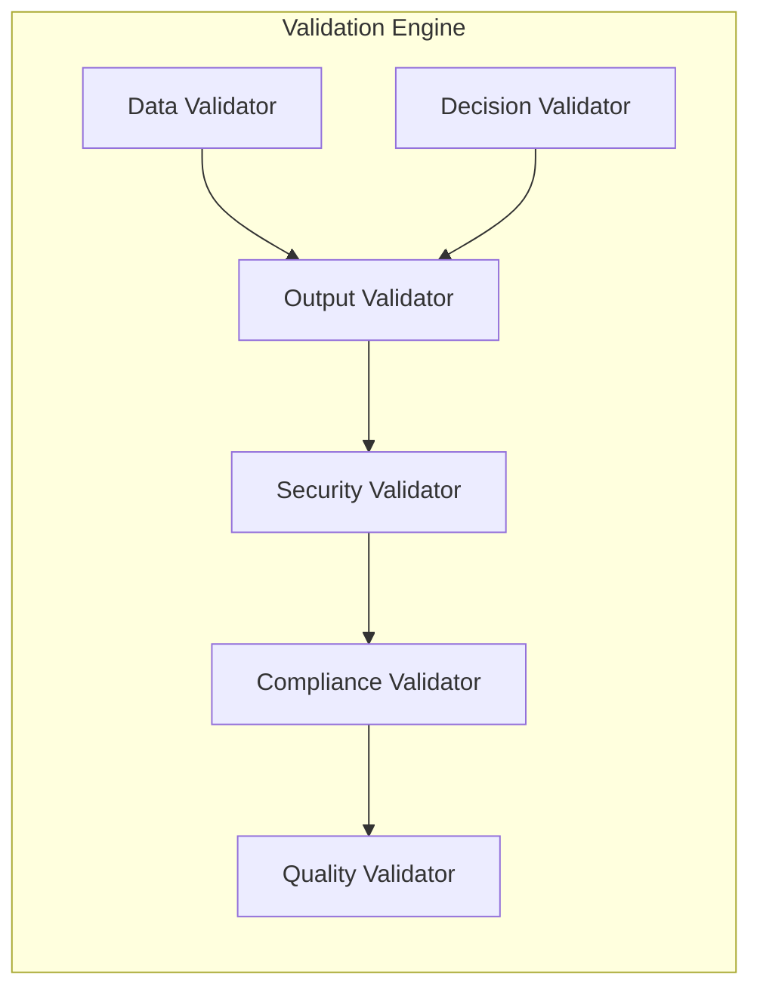
```mermaid
graph LR
    subgraph "Validation Engine"
        DV[Data Validator]
        DV2[Decision Validator]
        OV[Output Validator]
        SV[Security Validator]
        CV[Compliance Validator]
        QV[Quality Validator]
    end
    
    DV --> OV
    DV2 --> OV
    OV --> SV
    SV --> CV
    CV --> QV
```

### Tipos de Validación

**Data Validation**
- Validación de schema
- Validación de tipos
- Validación de rangos

**Decision Validation**
- Validación de lógica
- Validación de permisos
- Validación de seguridad

**Output Validation**
- Validación de formato
- Validación de contenido
- Validación de calidad

### Ventajas

- **Quality**: Mejora calidad de outputs
- **Security**: Previene acciones no seguras
- **Compliance**: Cumple con regulaciones
- **Reliability**: Mejora confiabilidad

### Riesgos

- **Over-validation**: Puede validar excesivamente
- **Performance**: Validación añade overhead
- **False Positives**: Puede rechazar outputs válidos
- **Complexity**: Validación es compleja

### Alternativas

- **Minimal Validation**: Validación mínima
- **No Validation**: Sin validación
- **External Validation**: Validación externa

### Evolución Futura

- **v1.0**: Validación básica
- **v2.0**: Validación avanzada
- **v3.0**: Validación predictiva
- **v4.0**: AI-powered validation

---

## 12. Communication Engine

### Propósito

Gestionar comunicación entre motores, interfaces y sistemas externos.

### Responsabilidades

- Message passing
- Event publishing
- Subscription management
- Protocol handling
- Error handling
- Retry logic

### Arquitectura Interna

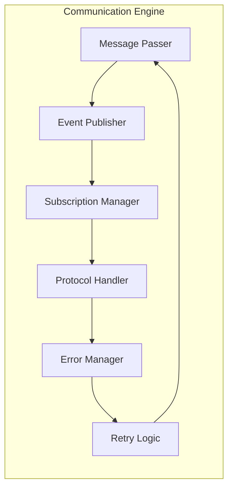
```mermaid
graph LR
    subgraph "Communication Engine"
        MP[Message Passer]
        EP[Event Publisher]
        SM[Subscription Manager]
        PH[Protocol Handler]
        EM[Error Manager]
        RL[Retry Logic]
    end
    
    MP --> EP
    EP --> SM
    SM --> PH
    PH --> EM
    EM --> RL
    RL --> MP
```

### Protocolos

**Internal Communication**
- Message queue (RabbitMQ/Kafka)
- Event bus
- Direct calls

**External Communication**
- HTTP/REST
- WebSockets
- gRPC
- HL7/FHIR (futuro)

### Ventajas

- **Decoupling**: Desacopla componentes
- **Scalability**: Escala horizontalmente
- **Reliability**: Retry logic y error handling
- **Flexibility**: Soporta múltiples protocolos

### Riesgos

- **Complexity**: Sistema de mensajes es complejo
- **Latency**: Añade latencia
- **Reliability**: Message queues pueden fallar
- **Ordering**: Orden de mensajes puede ser problemático

### Alternativas

- **Direct Calls**: Llamadas directas sin messaging
- **REST Only**: Solo HTTP/REST
- **No Communication**: Sin comunicación externa

### Evolución Futura

- **v1.0**: Message queue básico
- **v2.0**: Event-driven architecture
- **v3.0**: Multi-protocol support
- **v4.0**: AI-powered communication

---

## 13. Context Engine

### Propósito

Gestionar y enriquecer contexto para todas las operaciones cognitivas.

### Responsabilidades

- Extracción de contexto
- Enriquecimiento de contexto
- Gestión de contexto multi-nivel
- Validación de contexto
- Propagación de contexto
- Historial de contexto

### Arquitectura Interna

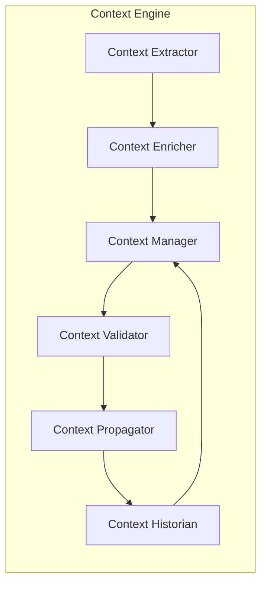
```mermaid
graph LR
    subgraph "Context Engine"
        CE[Context Extractor]
        CEE[Context Enricher]
        CM[Context Manager]
        CV[Context Validator]
        CP[Context Propagator]
        CH[Context Historian]
    end
    
    CE --> CEE
    CEE --> CM
    CM --> CV
    CV --> CP
    CP --> CH
    CH --> CM
```

### Niveles de Contexto

**User Context**
- Identidad de usuario
- Permisos de usuario
- Historial de usuario

**Session Context**
- Conversación actual
- Estado de sesión
- Variables temporales

**Hospital Context**
- Configuración de hospital
- Políticas de hospital
- Recursos de hospital

**Equipment Context**
- Historial de equipo
- Estado de equipo
- Especificaciones de equipo

### Ventajas

- **Personalización**: Contexto permite personalización
- **Relevance**: Mejora relevancia de respuestas
- **Efficiency**: Evita redundancia
- **Consistency**: Mantiene consistencia

### Riesgos

- **Complexity**: Gestión de contexto es compleja
- **Privacy**: Contexto puede contener datos sensibles
- **Drift**: Contexto puede driftear
- **Overhead**: Gestión de contexto añade overhead

### Alternativas

- **Minimal Context**: Contexto mínimo
- **No Context**: Sin contexto
- **External Context**: Contexto externo

### Evolución Futura

- **v1.0**: Contexto básico
- **v2.0**: Contexto multi-nivel
- **v3.0**: Contexto predictivo
- **v4.0**: Meta-context

---

## Integración de Motores

### Orquestación de Motores

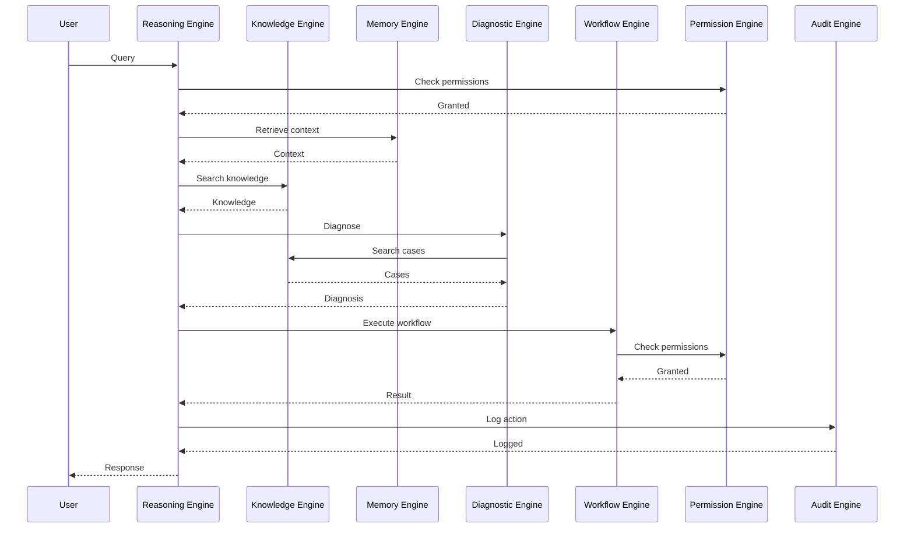
```mermaid
sequenceDiagram
    participant User
    participant RE as Reasoning Engine
    participant KE as Knowledge Engine
    participant ME as Memory Engine
    participant DE as Diagnostic Engine
    participant WE as Workflow Engine
    participant PME as Permission Engine
    participant AE as Audit Engine
    
    User->>RE: Query
    RE->>PME: Check permissions
    PME-->>RE: Granted
    RE->>ME: Retrieve context
    ME-->>RE: Context
    RE->>KE: Search knowledge
    KE-->>RE: Knowledge
    RE->>DE: Diagnose
    DE->>KE: Search cases
    KE-->>DE: Cases
    DE-->>RE: Diagnosis
    RE->>WE: Execute workflow
    WE->>PME: Check permissions
    PME-->>WE: Granted
    WE-->>RE: Result
    RE->>AE: Log action
    AE-->>RE: Logged
    RE-->>User: Response
```

### Comunicación Entre Motores

**Message Format**:
```json
{
  "id": "uuid",
  "type": "REQUEST|RESPONSE|ERROR|EVENT",
  "source": "engine_name",
  "target": "engine_name",
  "content": {},
  "timestamp": "ISO8601",
  "metadata": {
    "context_id": "uuid",
    "user_id": "uuid",
    "hospital_id": "uuid"
  }
}
```

---

## Performance Considerations

### Latency Targets

- **Reasoning Engine**: < 500ms
- **Knowledge Engine**: < 200ms
- **Memory Engine**: < 100ms
- **Diagnostic Engine**: < 1s
- **Workflow Engine**: Variable según workflow

### Caching Strategy

- **Knowledge Cache**: Redis para resultados frecuentes
- **Memory Cache**: Redis para contexto activo
- **Context Cache**: Redis para contexto de sesión

### Scalability

- **Horizontal Scaling**: Motores pueden escalar horizontalmente
- **Load Balancing**: Load balancing entre instancias
- **Circuit Breakers**: Circuit breakers para resiliencia

---

## Security Considerations

### Per-Engine Security

- **Permission Engine**: Verifica permisos antes de cada acción
- **Audit Engine**: Registra todas las acciones
- **Validation Engine**: Valida outputs antes de presentación
- **Tool Engine**: Ejecución sandboxed de herramientas

### Data Protection

- **Encryption**: Datos en reposo y en tránsito
- **Anonymization**: Datos sensibles anonimizados antes de procesamiento
- **Access Control**: RBAC + ABAC para control granular

---

## Monitoring and Observability

### Metrics

- **Engine Performance**: Latencia, throughput, error rate
- **Engine Health**: CPU, memory, disk usage
- **Business Metrics**: Diagnósticos correctos, workflows completados

### Logging

- **Structured Logging**: Logs estructurados en JSON
- **Distributed Tracing**: Tracing distribuido con OpenTelemetry
- **Error Tracking**: Error tracking con Sentry

---

## Future Roadmap

### v0.1.0 (MVP)

**Motores Implementados**:
- Reasoning Engine (básico)
- Knowledge Engine (básico)
- Memory Engine (básico)
- Tool Engine (básico)
- Permission Engine (básico)
- Audit Engine (básico)

### v0.2.0 (Core)

**Motores Añadidos**:
- Learning Engine (básico)
- Planning Engine (básico)
- Workflow Engine (básico)

### v0.3.0 (Advanced)

**Motores Añadidos**:
- Diagnostic Engine (avanzado)
- Validation Engine (básico)
- Communication Engine (avanzado)

### v1.0.0 (Production)

**Motores Completos**:
- Todos los motores implementados
- Optimización de performance
- Mejoras de seguridad

### v2.0.0 (Scale)

**Motores Evolucionados**:
- Context Engine (nuevo)
- Mejoras en todos los motores
- Escalabilidad horizontal

### v3.0.0 (Intelligence)

**Motores Avanzados**:
- Meta-cognitive capabilities
- Auto-optimización
- Predictive capabilities

---

**Versión**: 1.0.0  
**Fecha**: 2026-07-10  
**Autor**: Chief Software Architect / Principal AI Engineer / CTO  
**Alineado con**: VISION.md v1.0.0, ADR-0001, ADR-0002, TECH_BIBLE.md v2.0.0
