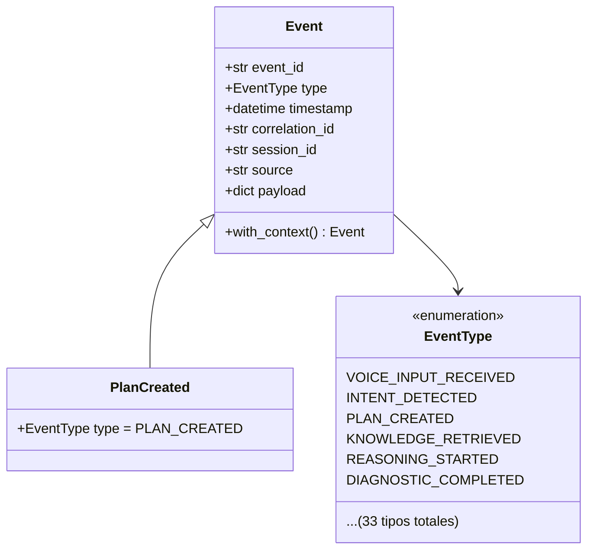
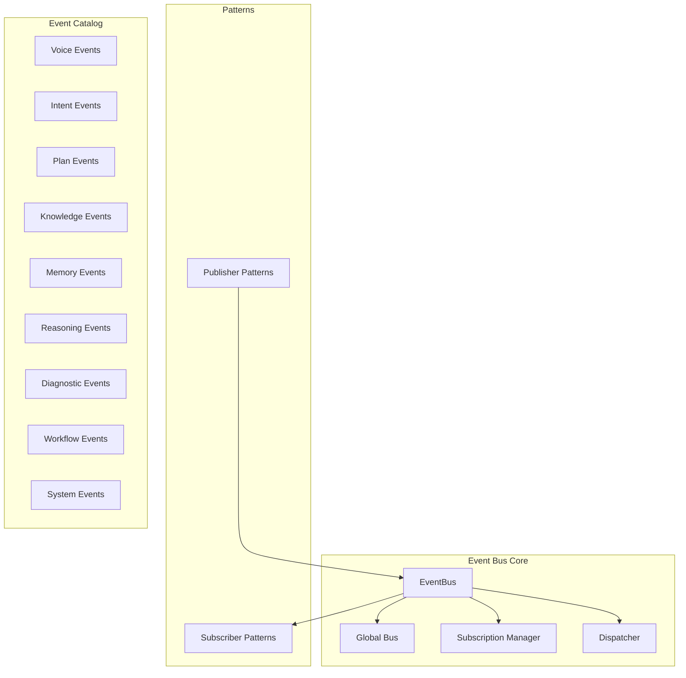
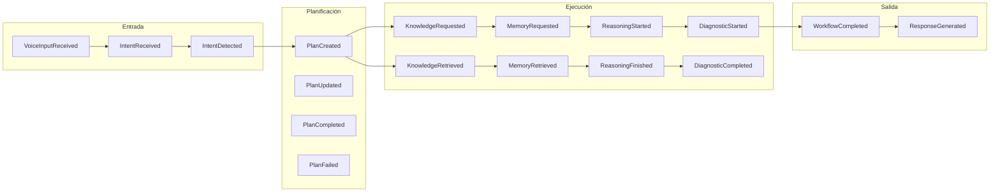
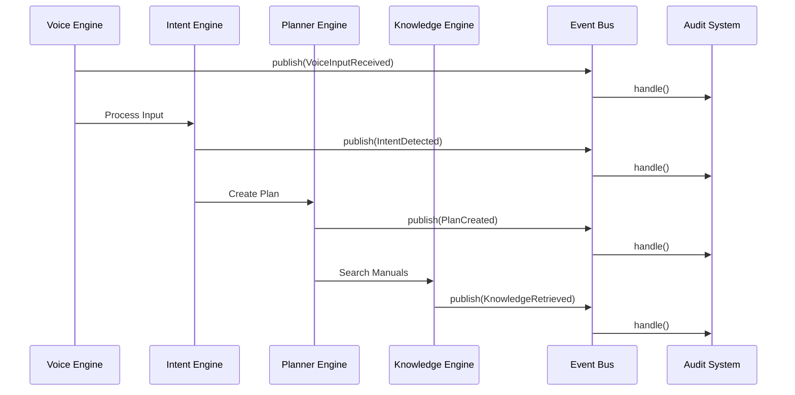
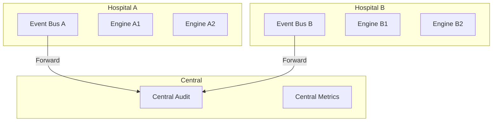
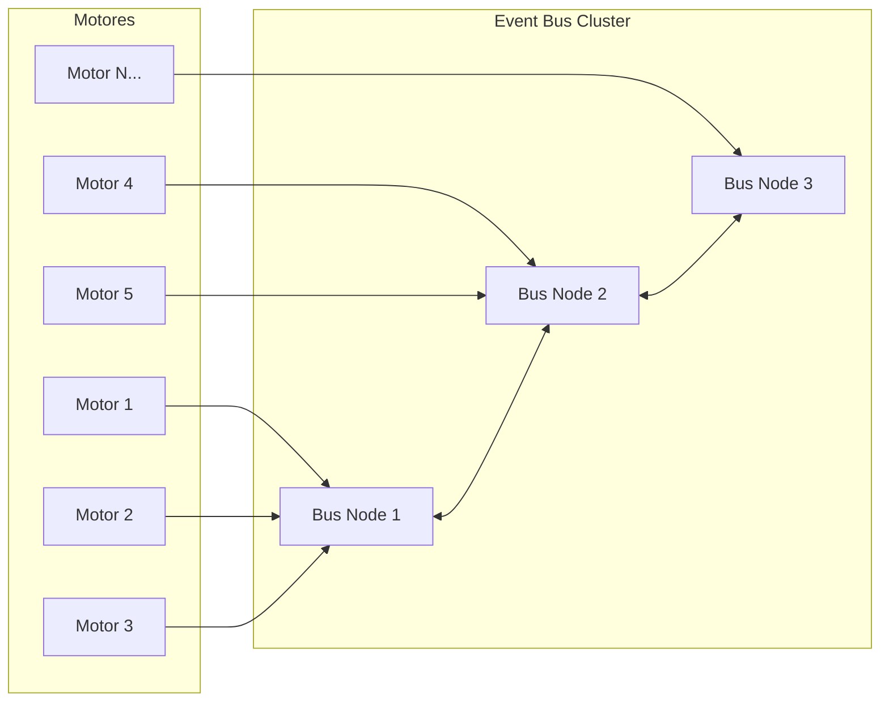
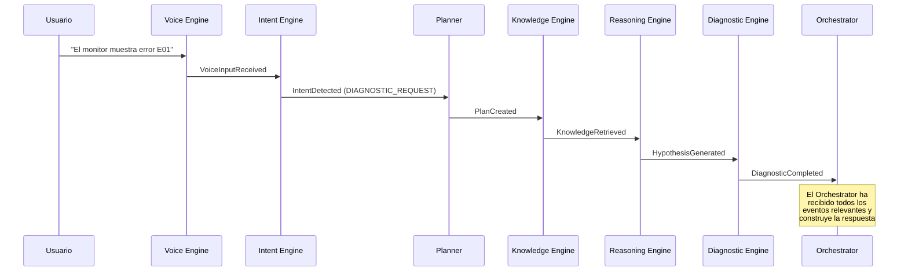
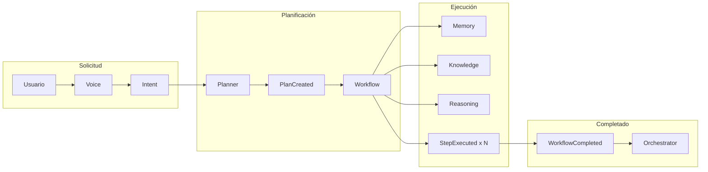

# Event Bus — Arquitectura Cognitiva

> **Documento de arquitectura para el Event Bus de EREN.**
> Define cómo los motores cognitivos se comunican mediante eventos.
> Complementa el [Clinical Reasoning Framework](./clinical-reasoning-framework.md).

| | |
|---|---|
| **Estado** | Implementación funcional (scaffolding) |
| **Fase** | Cognitiva — Fase 2 |
| **Tipo** | Infraestructura de comunicación |
| **Alineado con** | ADR-0004, Clinical Reasoning Framework |
| **No contiene** | Lógica de negocio, IA, conexión a BD |

---

## Índice

- [1. Propósito](#1-propósito)
  - [1.1 Qué es el Event Bus](#11-qué-es-el-event-bus)
  - [1.2 Principios fundamentales](#12-principios-fundamentales)
  - [1.3 Prohibición de llamadas directas](#13-prohibición-de-llamadas-directas)
- [2. Arquitectura](#2-arquitectura)
  - [2.1 Modelo de datos](#21-modelo-de-datos)
  - [2.2 Componentes del sistema](#22-componentes-del-sistema)
  - [2.3 Patrones de diseño](#23-patrones-de-diseño)
- [3. Catálogo de Eventos](#3-catálogo-de-eventos)
  - [3.1 Eventos del ciclo cognitivo](#31-eventos-del-ciclo-cognitivo)
  - [3.2 Mapa de eventos por motor](#32-mapa-de-eventos-por-motor)
- [4. Integración con Motores](#4-integración-con-motores)
  - [4.1 Cómo un motor publica eventos](#41-cómo-un-motor-publica-eventos)
  - [4.2 Cómo un motor se suscribe a eventos](#42-cómo-un-motor-se-suscribe-a-eventos)
  - [4.3 Ejemplo de integración](#43-ejemplo-de-integración)
- [5. Patrones Avanzados](#5-patrones-avanzados)
  - [5.1 Correlación de eventos](#51-correlación-de-eventos)
  - [5.2 Auditoría](#52-auditoría)
  - [5.3 Métricas](#53-métricas)
  - [5.4 Circuit breaker](#54-circuit-breaker)
- [6. Escalabilidad](#6-escalabilidad)
  - [6.1 Preparado para múltiples hospitales](#61-preparado-para-múltiples-hospitales)
  - [6.2 Preparado para cientos de motores](#62-preparado-para-cientos-de-motores)
- [7. Casos de Uso](#7-casos-de-uso)
  - [7.1 Diagnóstico típico](#71-diagnóstico-típico)
  - [7.2 Mantenimiento preventivo](#72-mantenimiento-preventivo)
- [8. Evolución Futura](#8-evolución-futura)
- [Apéndice A. API Completa](#apéndice-a-api-completa)
- [Apéndice B. Referencias](#apéndice-b-referencias)

---

## 1. Propósito

### 1.1 Qué es el Event Bus

El **Event Bus** es el sistema nervioso central de EREN. Es un **mediador desacoplado** que permite a los motores cognitivos comunicarse sin conocerse entre sí.

```mermaid
flowchart LR
    subgraph Motores
        V[Voice]
        I[Intent]
        P[Planner]
        K[Knowledge]
        M[Memory]
        R[Reasoning]
        D[Diagnostic]
    end
    
    V -->|Publica| EB[Event Bus]
    I -->|Publica| EB
    P -->|Publica| EB
    K -->|Publica| EB
    M -->|Publica| EB
    R -->|Publica| EB
    D -->|Publica| EB
    
    EB -->|Entrega| Audit[Auditoría]
    EB -->|Entrega| Metrics[Métricas]
    EB -->|Entrega| Logs[Logging]
    
    Note over EB: Los motores NO se llaman<br/>directamente entre sí
```

### 1.2 Principios fundamentales

| Principio | Descripción | Beneficio |
|-----------|-------------|-----------|
| **Desacoplamiento** | Los motores solo conocen el Event Bus | Un motor puede cambiar sin afectar otros |
| **Trazabilidad** | Cada evento tiene correlation_id, session_id | Rastreo completo de interacciones |
| **Observabilidad** | Auditoría, logging y métricas integrados | Monitoreo del sistema completo |
| **Extensibilidad** | Nuevos suscriptores sin modificar productores | Fácil evolución del sistema |
| **Escalabilidad** | Diseñado para múltiples hospitales | Arquitectura distribuida-ready |

### 1.3 Prohibición de llamadas directas

**REGLA FUNDACIONAL:** Queda **prohibido** que un motor invoque directamente a otro motor.

```
❌ INCORRECTO (Prohibido)
═══════════════════════════
Motor A ──────► Motor B

✅ CORRECTO (Requerido)
═══════════════════════════
Motor A ──────► EventBus ◄────── Motor B
                     │
                     ▼
               Suscribers
```

**¿Por qué?**
- Un motor no debe asumir que otro motor existe
- Los motores pueden estar en diferentes procesos o servidores
- Permite monitoreo y auditoría centralizados
- Facilita el testing y debugging

---

## 2. Arquitectura

### 2.1 Modelo de datos



### 2.2 Componentes del sistema



### 2.3 Patrones de diseño

El Event Bus implementa varios patrones de diseño:

| Patrón | Implementación | Uso |
|--------|----------------|-----|
| **Publisher-Subscriber** | `EventBus.subscribe/publish` | Comunicación asíncrona |
| **Observer** | `EventSubscriber.handle` | Reacción a eventos |
| **Mediator** | `EventBus` central | Coordinación de motores |
| **Factory** | `create_event()` | Creación de eventos tipados |
| **Circuit Breaker** | `CircuitBreakerPublisher` | Tolerancia a fallos |
| **Circuit Breaker** | `EventAggregator` | Batch de eventos |

---

## 3. Catálogo de Eventos

### 3.1 Eventos del ciclo cognitivo



### 3.2 Mapa de eventos por motor

| Motor | Eventos que publica | Eventos a los que se suscribe |
|-------|-------------------|------------------------------|
| **Voice Engine** | `VoiceInputReceived`, `VoiceOutputGenerated` | `ResponseGenerated` |
| **Intent Engine** | `IntentReceived`, `IntentDetected` | `VoiceInputReceived` |
| **Planner Engine** | `PlanCreated`, `PlanUpdated`, `PlanCompleted`, `PlanFailed` | `IntentDetected` |
| **Knowledge Engine** | `KnowledgeRequested`, `KnowledgeRetrieved`, `KnowledgeSearchFailed` | `PlanCreated` |
| **Memory Engine** | `MemoryRequested`, `MemoryRetrieved`, `MemoryStored` | `PlanCreated` |
| **Reasoning Engine** | `ReasoningStarted`, `ReasoningFinished`, `HypothesisGenerated` | `PlanCreated`, `KnowledgeRetrieved`, `MemoryRetrieved` |
| **Diagnostic Engine** | `DiagnosticStarted`, `DiagnosticFinished`, `DiagnosticCompleted` | `ReasoningFinished` |
| **Workflow Engine** | `WorkflowStarted`, `WorkflowFinished`, `WorkflowCompleted`, `StepExecuted` | `PlanCreated` |

---

## 4. Integración con Motores

### 4.1 Cómo un motor publica eventos

```python
from core.events import EventPublisherMixin, EventType

class PlannerEngine(EventPublisherMixin):
    def __init__(self, event_bus):
        super().__init__(event_bus=event_bus, source="planner")
    
    def create_plan(self, intention):
        # ... lógica de planificación ...
        
        # Publicar evento
        self.publish(
            EventType.PLAN_CREATED,
            step_count=len(steps),
            priority=urgency,
        )
        
        return plan
```

### 4.2 Cómo un motor se suscribe a eventos

```python
from core.events import EventBus, BaseSubscriber, EventType

class AuditSubscriber(BaseSubscriber):
    def __init__(self):
        super().__init__(
            event_types=(EventType.PLAN_CREATED, EventType.PLAN_FAILED),
            log_events=True,
        )
    
    def on_event(self, event):
        # Lógica de auditoría
        print(f"Audit: {event.type.value} from {event.source}")
```

### 4.3 Ejemplo de integración



---

## 5. Patrones Avanzados

### 5.1 Correlación de eventos

```python
from core.events import EventContext, EventType

# Todos los eventos en este contexto comparten correlation_id
with EventContext("request-123", source="planner", event_bus=bus) as ctx:
    ctx.publish(EventType.PLAN_CREATED, step_count=5)
    ctx.publish(EventType.PLAN_COMPLETED, steps_done=5)
```

### 5.2 Auditoría

```python
from core.events import AuditSubscriber

audit = AuditSubscriber()
bus.subscribe_wildcard(audit)

# Recuperar eventos auditados
records = audit.get_records(correlation_id="request-123")
```

### 5.3 Métricas

```python
from core.events import MetricSubscriber

metrics = MetricSubscriber()
bus.subscribe_wildcard(metrics)

# Consultar métricas
print(metrics.get_counts())
# {'plan_created': 5, 'diagnostic_completed': 3}
```

### 5.4 Circuit breaker

```python
from core.events import CircuitBreakerPublisher

# Proteger contra fallos en cascada
safe_bus = CircuitBreakerPublisher(
    wrapped=bus,
    failure_threshold=5,
    reset_timeout=60,
)
```

---

## 6. Escalabilidad

### 6.1 Preparado para múltiples hospitales

El Event Bus está diseñado para soportar múltiples hospitales:



- Cada hospital puede tener su propio Event Bus
- Eventos pueden replicarse a sistemas centrales
- Aislamiento de fallos entre hospitales

### 6.2 Preparado para cientos de motores



- Arquitectura de clusters para escalabilidad horizontal
- Balanceo de carga entre nodos
- Particionamiento por tipo de evento o motor

---

## 7. Casos de Uso

### 7.1 Diagnóstico típico



### 7.2 Mantenimiento preventivo



---

## 8. Evolución Futura

| Capacidad | Descripción | Fase |
|----------|-------------|------|
| **Distributed Bus** | Event Bus distribuido con brokers externos | Infraestructura |
| **Event Sourcing** | Persistencia de eventos para replay | Almacenamiento |
| **Complex Event Processing** | Detección de patrones en streams | Procesamiento |
| **Eventual Consistency** | Consistencia eventual entre nodos | Distribución |

---

## Apéndice A. API Completa

### Clases Principales

```python
# Event Bus
EventBus(
    max_workers=None,
    async_mode=False,
)
├── subscribe(event_type, subscriber, priority=0)
├── subscribe_wildcard(subscriber, priority=0)
├── unsubscribe(event_type, subscriber)
├── publish(event)
├── get_subscriber_count(event_type=None)
└── close()

# Event
Event(
    event_id=None,
    type=None,
    timestamp=None,
    correlation_id="",
    session_id="",
    source="",
    payload={},
)
└── with_context(correlation_id=None, session_id=None, source=None)

# Factory
create_event(
    event_type,
    source="",
    correlation_id="",
    session_id="",
    **payload,
) -> Event
```

### Excepciones

```python
EventError                    # Base
├── PublishError
├── SubscriptionError
├── EventValidationError
├── EventBusClosedError
├── CircuitBreakerOpenError
└── SubscriberError
```

---

## Apéndice B. Referencias

| Referencia | Ubicación |
|------------|-----------|
| Clinical Reasoning Framework | [./clinical-reasoning-framework.md](./clinical-reasoning-framework.md) |
| CORE README | [core/README.md](../core/README.md) |
| Events README | [core/events/README.md](../../core/events/README.md) |
| ADR-0004 (Events) | [adr/ADR-0004-event-system.md](../adr/ADR-0004-event-system.md) |
| Planner Engine | [core/planner/README.md](../core/planner/README.md) |

---

**Última actualización:** 2026-07-13  
**Estado:** Implementación funcional  
**Fase:** Cognitiva — Fase 2  
**Tipo:** Documentación arquitectónica