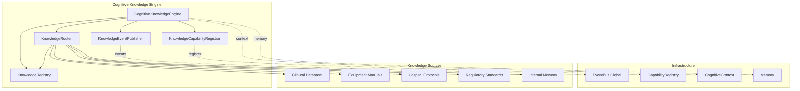
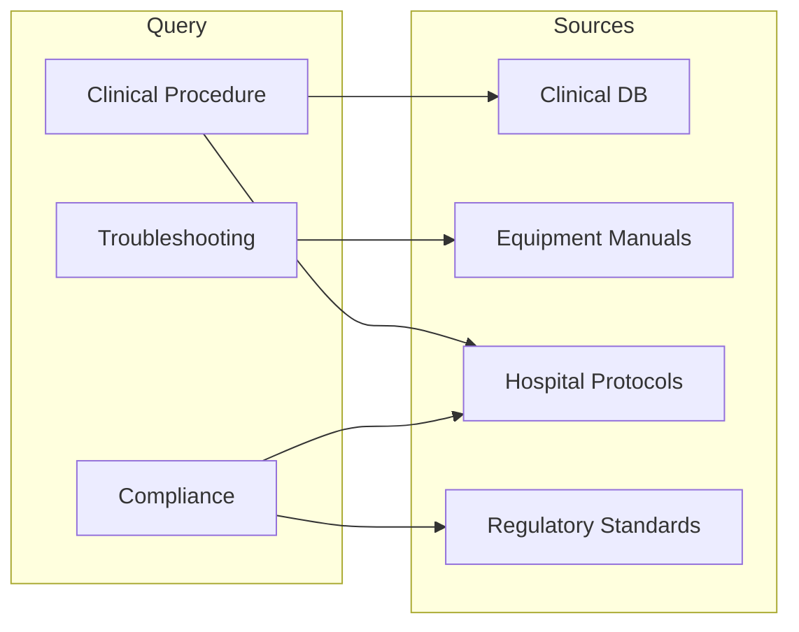
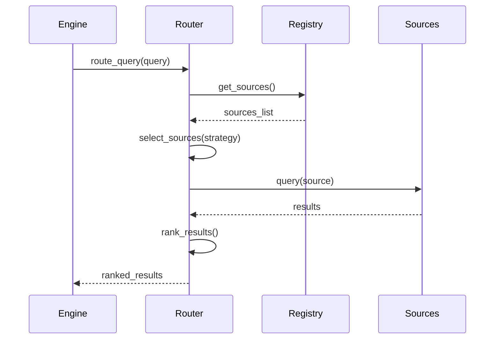

# Cognitive Knowledge Engine — Arquitectura

> **Documento de arquitectura para el Cognitive Knowledge Engine (CKE) de EREN.**
> El CKE gestiona la recuperacion y almacenamiento de conocimiento
> a traves de una interfaz unificada.

| | |
|---|---|
| **Estado** | Fundacion implementada |
| **Fase** | Cognitiva - Fase 2 |
| **Tipo** | Motor de conocimiento |
| **Paradigma** | EREN NO usa IA |
| **No contiene** | RAG, embeddings, LLM, busqueda real |

---

## Indice

- [1. Mision](#1-mision)
- [2. Filosofia](#2-filosofia)
- [3. Arquitectura](#3-arquitectura)
- [4. Fuentes de Conocimiento](#4-fuentes-de-conocimiento)
- [5. Router](#5-router)
- [6. Registro](#6-registro)
- [7. Integracion](#7-integracion)
- [8. Tipos](#8-tipos)
- [9. Roadmap](#9-roadmap)

---

## 1. Mision

```
El Knowledge Engine es el motor de recuperacion de conocimiento de EREN.

NO realiza busqueda real.
NO usa embeddings.
NO llama LLMs.

Solo proporciona la infraestructura para que futuras
implementaciones puedan conectarse sin romper la arquitectura.
```

---

## 2. Filosofia

```
ANTIGUO: Chatbot con RAG
========================
Usuario -> Embeddings -> Vector DB -> LLM -> Respuesta
                        (Acoplamiento fuerte)

NUEVO: Motor de Conocimiento
============================
Usuario -> Query
               |
               v
          +--------+
          | Router |
          +--------+
               |
     +---------+---------+
     |         |         |
     v         v         v
+--------+ +--------+ +--------+
|Source A| |Source B| |Source C|
+--------+ +--------+ +--------+
     |         |         |
     +---------+---------+
               |
               v
         +--------+
         |Results |
         +--------+
```

---

## 3. Arquitectura



---

## 4. Fuentes de Conocimiento

### 4.1 Tipos de Fuente

| Tipo | Descripcion | Categoria |
|------|-------------|-----------|
| CLINICAL_DATABASE | Base de datos clinica | Clinical |
| EQUIPMENT_MANUALS | Manuales de equipos | Technical |
| HOSPITAL_PROTOCOLS | Protocolos hospitalarios | Clinical |
| TECHNICAL_DOCUMENTATION | Documentacion tecnica | Technical |
| SCIENTIFIC_LITERATURE | Literatura cientifica | Scientific |
| REGULATORY_STANDARDS | Normativas (FDA, IEC, ISO) | Regulatory |
| INTERNAL_MEMORY | Memoria interna de EREN | Historical |
| EXTERNAL_SERVICES | Servicios externos (APIs) | Operational |
| KNOWLEDGE_BASE | Base de conocimiento estructurada | Operational |
| PROCEDURES | Procedimientos estandar | Technical |

### 4.2 Mapeo Query -> Fuente



---

## 5. Router

### 5.1 Responsabilidades

```
El KnowledgeRouter decide:
1. Que fuentes consultar para una query
2. En que orden priorizarlas
3. Como combinar los resultados

El router NO conoce implementaciones concretas.
Solo conoce contratos.
```

### 5.2 Estrategias de Routing

| Estrategia | Descripcion | Uso |
|-----------|-------------|-----|
| ExhaustiveRouting | Todas las fuentes relevantes | Completo |
| PriorityRouting | Fuentes por prioridad | Normal |
| MinimumRouting | Minimas fuentes necesarias | Rapido |

### 5.3 Flujo de Routing



---

## 6. Registro

### 6.1 KnowledgeRegistry

```
El registro gestiona fuentes de conocimiento:
- Registro dinamico de fuentes
- Desregistro de fuentes
- Consulta de fuentes por tipo
- Verificacion de salud

Similar al CapabilityRegistry pero para fuentes.
```

### 6.2 Metodos

| Metodo | Descripcion |
|--------|-------------|
| register(source) | Registrar fuente |
| unregister(source_id) | Desregistrar fuente |
| get(source_id) | Obtener fuente |
| get_by_type(type) | Fuentes por tipo |
| get_by_query_type(query_type) | Fuentes para query type |
| list_sources() | Lista de IDs |

---

## 7. Integracion

### 7.1 Contexto Cognitivo

```python
# El engine consume contexto
class KnowledgeContextAdapter:
    def read_evidence() -> list: ...
    def read_hypotheses() -> list: ...
    def get_device_info() -> dict: ...
```

### 7.2 Con Memoria

```python
# El engine usa memoria via contrato
class KnowledgeMemoryAdapter:
    def retrieve(query: str) -> list: ...
    def store(content: str) -> str: ...
    def search(query: str, limit: int) -> list: ...
```

### 7.3 Con EventBus

```python
# Eventos publicados
knowledge_source_registered
knowledge_source_unregistered
knowledge_query_started
knowledge_query_completed
knowledge_query_failed
knowledge_stored
```

### 7.4 Con CapabilityRegistry

```python
# Capacidades registradas
knowledge.retrieve  # Recuperar conocimiento
knowledge.store     # Almacenar conocimiento
knowledge.route     # Enrutar queries
knowledge.verify    # Verificar conocimiento
knowledge.search    # Buscar conocimiento
```

---

## 8. Tipos

### 8.1 Query Types

| Tipo | Descripcion | Prioridad |
|------|-------------|-----------|
| CLINICAL_PROCEDURE | Procedimientos clinicos | Alta |
| DIAGNOSTIC | Informacion diagnostica | Alta |
| TROUBLESHOOTING | Resolucion de problemas | Alta |
| SAFETY | Procedimientos de seguridad | Critica |
| MAINTENANCE | Mantenimiento de equipos | Media |
| COMPLIANCE | Cumplimiento normativo | Alta |
| TECHNICAL_SPECIFICATION | Especificaciones tecnicas | Media |
| TREATMENT | Protocolos de tratamiento | Alta |
| GENERAL | Conocimiento general | Baja |
| HISTORICAL | Eventos pasados | Baja |
| POLICY | Politicas hospitalarias | Media |
| CERTIFICATION | Informacion de certificacion | Media |

### 8.2 Result Types

```python
@dataclass
class KnowledgeResult:
    result_id: str
    source_id: str
    source_type: KnowledgeSourceType
    content: str | dict
    relevance: ResultRelevance  # HIGHLY, RELEVANT, PARTIAL, NOT
    confidence: ResultConfidence  # HIGH, MEDIUM, LOW, UNKNOWN
```

---

## 9. Roadmap

### Fase 1: Fundacion (Actual)
```
- Estructura de modulos
- Tipos y contratos
- Registro de fuentes
- Router basico
- Integracion basica
```

### Fase 2: Conectores
```
- ClinicalDatabaseConnector
- EquipmentManualsConnector
- HospitalProtocolsConnector
- RegulatoryStandardsConnector
```

### Fase 3: Estrategias
```
- RetrievalStrategy avanzada
- Ranking algorithms
- Caching strategies
- Personalization
```

### Fase 4: Optimizacion
```
- Parallel querying
- Result fusion
- Query optimization
- Performance tuning
```

---

## Referencias

| Referencia | Ubicacion |
|------------|-----------|
| Core README | [../core/README.md](../core/README.md) |
| Clinical Reasoning Framework | [./clinical-reasoning-framework.md](./clinical-reasoning-framework.md) |
| Cognitive Architecture | [./cognitive-architecture.md](./cognitive-architecture.md) |

---

**Ultima actualizacion:** 2026-07-13  
**Estado:** Fundacion implementada  
**Fase:** Cognitiva - Fase 2  
**Tipo:** Documentacion arquitectonica  
**Paradigma:** EREN NO usa IA