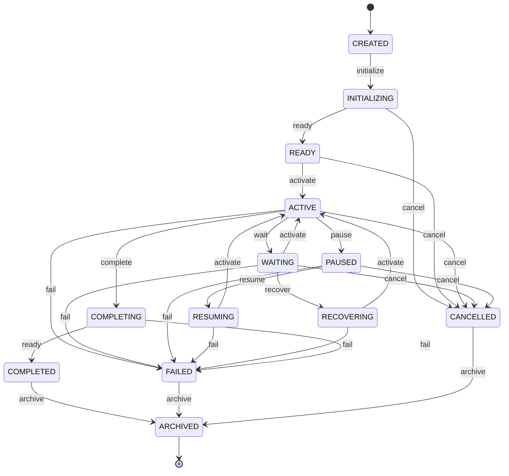
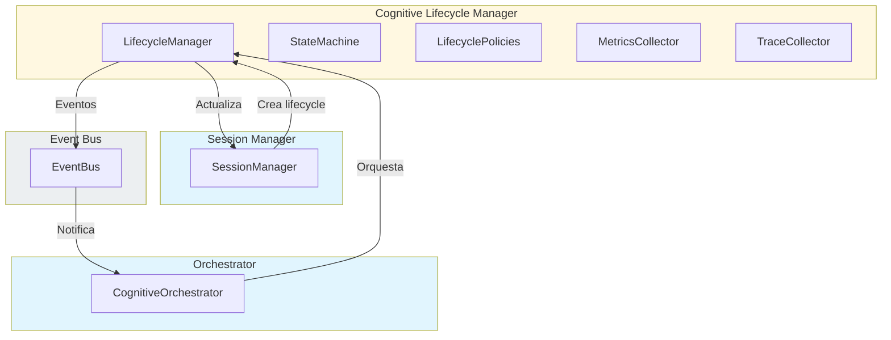

# Cognitive Lifecycle Manager — Arquitectura

> **Documento de arquitectura para el Cognitive Lifecycle Manager (CLM) de EREN.**
> Controla todas las transiciones validas de una sesion cognitiva.

| | |
|---|---|
| **Estado** | Fundacion implementada |
| **Fase** | Cognitiva - Fase 2 |
| **Tipo** | Lifecycle Manager |
| **Paradigma** | EREN NO usa IA |

---

## Indice

- [1. Mision](#1-mision)
- [2. Filosofia](#2-filosofia)
- [3. Estados del Ciclo de Vida](#3-estados-del-ciclo-de-vida)
- [4. Maquina de Estados](#4-maquina-de-estados)
- [5. Responsabilidades](#5-responsabilidades)
- [6. Integracion](#6-integracion)
- [7. Politicas](#7-politicas)
- [8. Trazabilidad](#8-trazabilidad)
- [9. Roadmap](#9-roadmap)

---

## 1. Mision

```
El Cognitive Lifecycle Manager controla todas las transiciones validas
de una sesion cognitiva.

NO ejecuta motores.
NO realiza razonamiento.
NO consulta memoria.
NO consulta conocimiento.
NO ejecuta herramientas.

Su unica responsabilidad es CONTROLAR EL CICLO DE VIDA.
```

---

## 2. Filosofia

```
Separacion clara:
================

Lifecycle Manager (ESTE componente)
------------------------------------
- Controlar transiciones de estado
- Validar transiciones
- Registrar historial
- Publicar eventos

Session Manager (gestiona sesiones)
------------------------------------
- Crear y eliminar sesiones
- Gestionar estados de sesion

Orchestrator (orquesta)
------------------------------------
- Coordinar motores
- Gestionar flujo

Infraestructura (dependencias)
------------------------------------
- EventBus: Comunicacion
- Scheduler: Planificacion
```

---

## 3. Estados del Ciclo de Vida

### 3.1 Estados Completos (13)

| Estado | Descripcion |
|--------|-------------|
| CREATED | Lifecycle creado |
| INITIALIZING | Inicializando |
| READY | Listo |
| ACTIVE | Activo |
| WAITING | Esperando |
| PAUSED | Pausado |
| RESUMING | Reanudando |
| RECOVERING | Recuperando |
| COMPLETING | Completando |
| COMPLETED | Completado |
| FAILED | Fallido |
| CANCELLED | Cancelado |
| ARCHIVED | Archivado |

### 3.2 Estados Terminales

```
COMPLETED
ARCHIVED
```

---

## 4. Maquina de Estados

### 4.1 Diagrama de Estados



### 4.2 Transiciones Validas

| Estado Actual | Evento | Nuevo Estado |
|---------------|--------|--------------|
| CREATED | initialize | INITIALIZING |
| INITIALIZING | ready | READY |
| INITIALIZING | cancel | CANCELLED |
| READY | activate | ACTIVE |
| READY | cancel | CANCELLED |
| ACTIVE | wait | WAITING |
| ACTIVE | pause | PAUSED |
| ACTIVE | complete | COMPLETING |
| ACTIVE | fail | FAILED |
| ACTIVE | cancel | CANCELLED |
| WAITING | activate | ACTIVE |
| WAITING | recover | RECOVERING |
| WAITING | fail | FAILED |
| WAITING | cancel | CANCELLED |
| PAUSED | resume | RESUMING |
| PAUSED | fail | FAILED |
| PAUSED | cancel | CANCELLED |
| RESUMING | activate | ACTIVE |
| RESUMING | fail | FAILED |
| RECOVERING | activate | ACTIVE |
| RECOVERING | fail | FAILED |
| COMPLETING | ready | COMPLETED |
| COMPLETING | fail | FAILED |
| COMPLETED | archive | ARCHIVED |
| FAILED | archive | ARCHIVED |
| CANCELLED | archive | ARCHIVED |

---

## 5. Responsabilidades

### 5.1 Lo Que Hace el Lifecycle Manager

```
╔═══════════════════════════════════════════════════════════════════════════════╗
║              RESPONSABILIDADES DEL LIFECYCLE MANAGER                          ║
╠═══════════════════════════════════════════════════════════════════════════════╣
║                                                                             ║
║  1. MAQUINA DE ESTADOS                                                  ║
║     • Definir estados validos                                            ║
║     • Validar transiciones                                               ║
║     • Rechazar transiciones invalidas                                     ║
║     • Mantener historial de transiciones                                 ║
║                                                                             ║
║  2. CONTROL DE CICLO DE VIDA                                           ║
║     • Crear lifecycle                                                    ║
║     • Inicializar                                                        ║
║     • Activar                                                            ║
║     • Pausar                                                             ║
║     • Reanudar                                                           ║
║     • Completar                                                          ║
║     • Fallar                                                             ║
║     • Cancelar                                                           ║
║     • Archivar                                                           ║
║                                                                             ║
║  3. POLITICAS                                                          ║
║     • Aplicar timeouts                                                  ║
║     • Aplicar recuperacion                                              ║
║     • Aplicar archivado                                                 ║
║                                                                             ║
║  4. OBSERVABILIDAD                                                     ║
║     • Publicar eventos                                                  ║
║     • Recolectar metricas                                              ║
║     • Registrar traces                                                 ║
║                                                                             ║
╚═══════════════════════════════════════════════════════════════════════════════╝
```

### 5.2 Lo Que NO Hace el Lifecycle Manager

```
╔═══════════════════════════════════════════════════════════════════════════════╗
║             RESTRICCIONES DEL LIFECYCLE MANAGER                            ║
╠═══════════════════════════════════════════════════════════════════════════════╣
║                                                                             ║
║  ✗ NO ejecuta motores                                                  ║
║  ✗ NO realiza razonamiento                                             ║
║  ✗ NO consulta memoria                                                 ║
║  ✗ NO consulta conocimiento                                            ║
║  ✗ NO ejecuta herramientas                                             ║
║  ✗ NO implementa persistencia real                                     ║
║                                                                             ║
║  El Lifecycle Manager SOLO controla transiciones. No hace.               ║
║                                                                             ║
╚═══════════════════════════════════════════════════════════════════════════════╝
```

---

## 6. Integracion

### 6.1 Diagrama de Integracion



### 6.2 Flujo de Transicion

```
╔═══════════════════════════════════════════════════════════════════════════════╗
║                      FLUJO DE TRANSICION                                  ║
╠═══════════════════════════════════════════════════════════════════════════════╣
║                                                                             ║
║  1. Orchestrator o SessionManager solicita transicion                    ║
║     ↓                                                                   ║
║  2. LifecycleManager recibe evento                                      ║
║     ↓                                                                   ║
║  3. StateMachine valida transicion                                     ║
║     ↓                                                                   ║
║  4. Si valida: Ejecuta transicion                                     ║
║     ↓                                                                   ║
║  5. Si invalida: Rechaza y publica evento de error                    ║
║     ↓                                                                   ║
║  6. Registra en trace                                                  ║
║     ↓                                                                   ║
║  7. Actualiza metricas                                                 ║
║     ↓                                                                   ║
║  8. Publica evento de transicion                                      ║
║                                                                             ║
╚═══════════════════════════════════════════════════════════════════════════════╝
```

---

## 7. Politicas

### 7.1 Politicas Disponibles

| Politica | Descripcion | Valor Predeterminado |
|----------|------------|---------------------|
| auto_recovery | Recuperacion automatica | True |
| max_recovery_attempts | Maximo recuperaciones | 3 |
| timeout_ms | Timeout | 300000 (5 min) |
| auto_archive | Archivado automatico | True |
| archive_delay_ms | Delay de archivado | 3600000 (1 hr) |
| retention_days | Retention | 90 dias |

### 7.2 Presets

```python
# Estandar
LifecyclePolicyPresets.default()

# Estricto
LifecyclePolicyPresets.strict()

# Permisivo
LifecyclePolicyPresets.permissive()
```

---

## 8. Trazabilidad

### 8.1 LifecycleTraceEntry

```python
@dataclass
class LifecycleTraceEntry:
    entry_id: str           # ID unico
    session_id: str        # ID de sesion
    correlation_id: str     # ID de correlacion
    timestamp: str        # Timestamp ISO
    from_state: str       # Estado origen
    to_state: str         # Estado destino
    event: str            # Evento
    reason: str           # Motivo
    actor: str            # Actor
    metadata: dict        # Metadatos adicionales
```

### 8.2 Eventos Rastreables

| Evento | Descripcion |
|--------|------------|
| LifecycleStarted | Lifecycle iniciado |
| LifecycleInitialized | Lifecycle inicializado |
| LifecycleReady | Lifecycle listo |
| LifecycleActivated | Lifecycle activado |
| LifecyclePaused | Lifecycle pausado |
| LifecycleResumed | Lifecycle reanudado |
| LifecycleRecovered | Lifecycle recuperado |
| LifecycleCompleted | Lifecycle completado |
| LifecycleFailed | Lifecycle fallido |
| LifecycleCancelled | Lifecycle cancelado |
| LifecycleArchived | Lifecycle archivado |
| InvalidTransitionDetected | Transicion invalida |

---

## 9. Roadmap

### Fase 1: Fundacion (Actual)
```
- Core Lifecycle Manager
- Maquina de estados
- Transiciones validas
- Politicas basicas
- Trazabilidad
```

### Fase 2: Validacion Avanzada
```
- Validacion de condiciones
- Guard conditions
- Effects
```

### Fase 3: Persistencia
```
- Persistencia de lifecycle
- Recovery de lifecycle
```

### Fase 4: Compliance
```
- Auditoria completa
- Cumplimiento regulatorio
```

---

## Referencias

| Referencia | Ubicacion |
|------------|-----------|
| Cognitive Orchestrator | [../core/orchestrator.md](./orchestrator.md) |
| Cognitive Session Manager | [../core/session-manager.md](./session-manager.md) |
| Cognitive Processing Pipeline | [../architecture/cognitive-processing-pipeline.md](../architecture/cognitive-processing-pipeline.md) |

---

**Ultima actualizacion:** 2026-07-13  
**Estado:** Fundacion implementada  
**Fase:** Cognitiva - Fase 2  
**Tipo:** Documentacion arquitectonica  
**Paradigma:** EREN NO usa IA