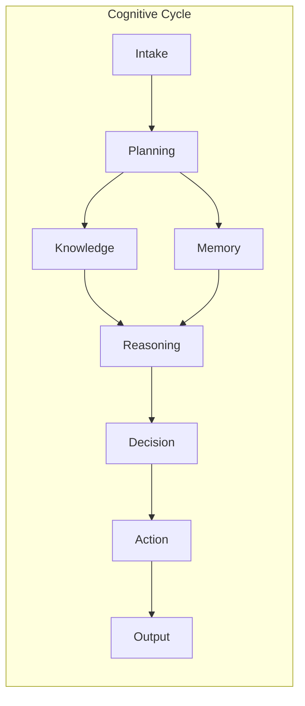
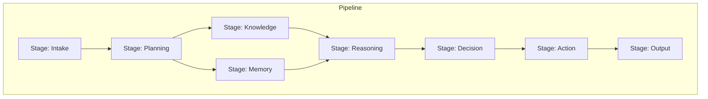
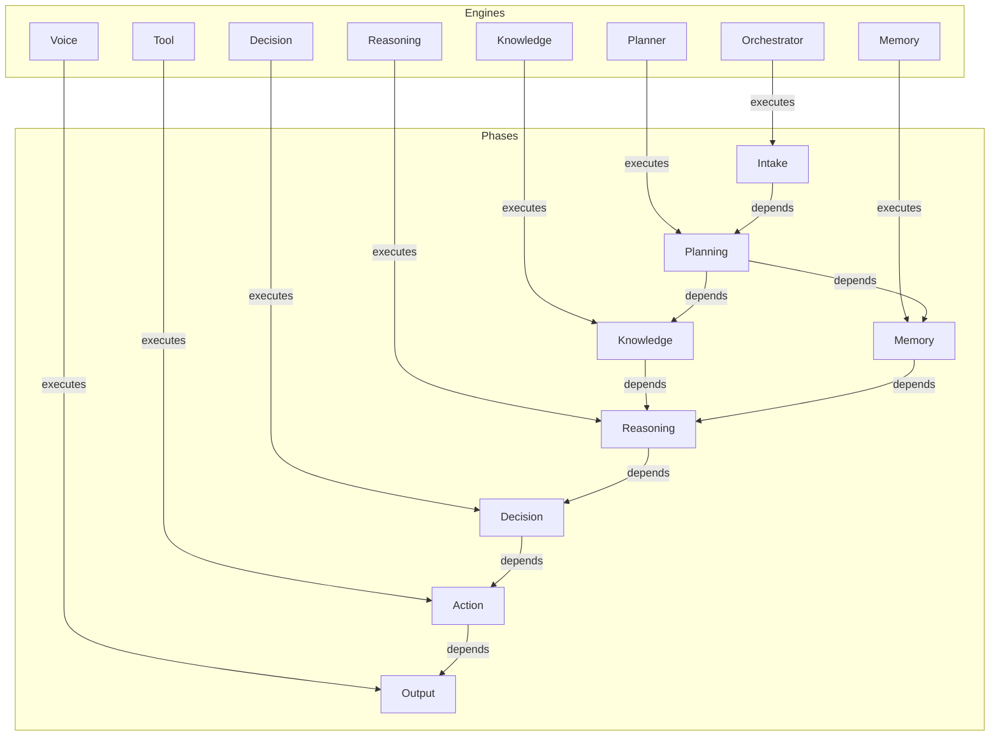

# Cognitive Orchestration Contracts — Arquitectura

> **Documento de arquitectura para los contratos de orquestacion de EREN.**
> Define como los motores cognitivos colaboran durante un ciclo cognitivo.

| | |
|---|---|
| **Estado** | Fundacion implementada |
| **Fase** | Cognitiva - Fase 2 |
| **Tipo** | Contratos de orquestacion |
| **Paradigma** | EREN NO usa IA |

---

## Indice

- [1. Proposito](#1-proposito)
- [2. Filosofia](#2-filosofia)
- [3. Ciclo Cognitivo](#3-ciclo-cognitivo)
- [4. Estados del Ciclo](#4-estados-del-ciclo)
- [5. Contratos](#5-contratos)
- [6. Pipeline](#6-pipeline)
- [7. Contexto](#7-contexto)
- [8. Grafo de Ejecucion](#8-grafo-de-ejecucion)
- [9. Integracion](#9-integracion)
- [10. Roadmap](#10-roadmap)

---

## 1. Proposito

```
Los contratos de orquestacion definen:
- Interfaz comun para todos los motores cognitivos
- Estados y fases del ciclo cognitivo
- Gestion de estado de motores
- Orden de ejecucion del pipeline
- Contexto compartido de orquestacion
```

---

## 2. Filosofia

```
Separacion de responsabilidades:
=============================

Orchestrator (NO implementado en este PR)
---------------------------------------
- Coordina la ejecucion de motores
- Decide el orden de ejecucion
- Maneja errores y reintentos
- Publica eventos de ciclo

Motores Cognitivos (contratos definidos)
---------------------------------------
- planner: Planifica acciones
- knowledge: Consulta conocimiento
- memory: Consulta memoria
- reasoning: Razona sobre evidencia
- decision: Toma decisiones
- tool: Ejecuta herramientas
- voice: Genera respuestas

Contratos (implementados en este PR)
-----------------------------------
- Definen la interfaz comun
- Gestionan estados
- Desacoplan motores
- No contienen logica de negocio
```

---

## 3. Ciclo Cognitivo

### 3.1 Fases del Ciclo



### 3.2 Flujo Completo

```
Recepcion del contexto
    |
    v
Planificacion
    |
    +---> Consulta de conocimiento
    |
    +---> Consulta de memoria
    |
    v
Razonamiento
    |
    v
Decision
    |
    v
Creacion de acciones
    |
    v
Publicacion de eventos
    |
    v
Finalizacion del ciclo
```

---

## 4. Estados del Ciclo

### 4.1 CycleState

| Estado | Descripcion |
|--------|-------------|
| CREATED | Ciclo creado |
| READY | Listo para iniciar |
| PLANNING | Planner activo |
| KNOWLEDGE | Knowledge activo |
| MEMORY | Memory activo |
| REASONING | Reasoning activo |
| DECISION | Decision activo |
| ACTION | Accion activa |
| COMPLETED | Completado exitosamente |
| FAILED | Fallo |
| CANCELLED | Cancelado |

### 4.2 CyclePhase

| Fase | Motor | Descripcion |
|------|-------|-------------|
| INTAKE | Orchestrator | Procesar entrada del usuario |
| PLANNING | Planner | Planificar siguientes pasos |
| KNOWLEDGE | Knowledge | Consultar base de conocimiento |
| MEMORY | Memory | Consultar memoria |
| REASONING | Reasoning | Razonar sobre evidencia |
| DECISION | Decision | Tomar decisiones |
| ACTION | Tool | Ejecutar decisiones |
| OUTPUT | Voice | Generar respuesta |

---

## 5. Contratos

### 5.1 CognitiveEngine Protocol

```python
class CognitiveEngine(Protocol):
    """Protocol para todos los motores cognitivos."""
    
    async def prepare(self, context: OrchestrationContext) -> None:
        """Preparar el motor para ejecucion."""
        ...
    
    async def execute(self, context: OrchestrationContext) -> EngineResult:
        """Ejecutar la operacion cognitiva."""
        ...
    
    def publish_events(self) -> list[Any]:
        """Publicar eventos pendientes."""
        ...
    
    async def cleanup(self) -> None:
        """Limpiar recursos despues de ejecucion."""
        ...
```

### 5.2 Contratos Adicionales

| Contrato | Descripcion |
|----------|-------------|
| Plannable | Motores que pueden ser planificados |
| Stateful | Motores con estado |
| EngineRegistry | Registro de motores |

---

## 6. Pipeline

### 6.1 Estructura del Pipeline



### 6.2 PipelineStage

```python
@dataclass
class PipelineStage:
    stage_id: str
    phase: str
    engine_type: str
    engine_id: str
    position: int
    dependencies: tuple[str, ...]
    optional: bool
    timeout_ms: int
```

### 6.3 Dependencias de Fase

| Fase | Dependencias |
|------|--------------|
| PLANNING | INTAKE |
| KNOWLEDGE | PLANNING |
| MEMORY | PLANNING |
| REASONING | KNOWLEDGE, MEMORY |
| DECISION | REASONING |
| ACTION | DECISION |
| OUTPUT | ACTION |

---

## 7. Contexto

### 7.1 OrchestrationContext

```python
@dataclass
class OrchestrationContext:
    # Session info
    user_id: str
    session_id: str
    request_id: str
    
    # User input
    user_input: str
    intent: str
    
    # Device information
    device_type: str
    device_model: str
    
    # Cognitive data
    hypotheses: list
    evidence: list
    decisions: list
    knowledge_results: list
    memory_results: list
    
    # Actions
    planned_actions: list
    selected_action: dict
    action_results: list
    
    # Response
    response: str
    response_type: str
```

### 7.2 Context Keys

| Key | Descripcion |
|-----|-------------|
| user_id | ID del usuario |
| session_id | ID de la sesion |
| hypotheses | Hipotesis actuales |
| evidence | Evidencia disponible |
| decisions | Decisiones tomadas |
| knowledge_results | Resultados de knowledge |
| memory_results | Resultados de memory |

---

## 8. Grafo de Ejecucion

### 8.1 Estructura



### 8.2 Tipos de Nodos

| Tipo | Descripcion |
|------|-------------|
| ENGINE | Motor cognitivo |
| PHASE | Fase del ciclo |
| DATA | Nodo de datos |

### 8.3 Tipos de Aristas

| Tipo | Descripcion |
|------|-------------|
| EXECUTES | Motor ejecuta fase |
| DEPENDS_ON | Fase depende de otra |
| PRODUCES | Nodo produce datos |
| CONSUMES | Nodo consume datos |

---

## 9. Integracion

### 9.1 Integracion con EventBus

```
EventBus
    |
    +---> Ciclo completado
    +---> Fase completada
    +---> Motor completado
    +---> Error de motor
```

### 9.2 Integracion con Capability Registry

```
Capability Registry
    |
    +---> planner.execute
    +---> knowledge.retrieve
    +---> memory.retrieve
    +---> reasoning.analyze
    +---> decision.select
    +---> tool.execute
    +---> voice.respond
```

### 9.3 Integracion con Cognitive Context

```
Cognitive Context
    |
    +---> Leer estado compartido
    +---> Escribir resultados
    +---> Acceder a hipotesis
    +---> Acceder a evidencia
```

---

## 10. Roadmap

### Fase 1: Contratos (Actual)
```
- Contratos de motor
- Ciclo cognitivo
- Estados y transiciones
- Pipeline
- Contexto
- Grafo de ejecucion
```

### Fase 2: Implementacion Base
```
- Orchestrator basico
- Registro de motores
- Ejecucion secuencial
- Manejo de errores basico
```

### Fase 3: Paralelismo
```
- Ejecucion paralela
- Pipelines condicionales
- Reintentos inteligentes
```

### Fase 4: Optimizacion
```
- Caching de resultados
- Pipeline adaptativo
- Monitoreo avanzado
```

---

## Referencias

| Referencia | Ubicacion |
|------------|-----------|
| Core README | [../core/README.md](../core/README.md) |
| Reasoning Engine | [./reasoning-engine.md](./reasoning-engine.md) |
| Decision Engine | [./decision-engine.md](./decision-engine.md) |
| Knowledge Engine | [./knowledge-engine.md](./knowledge-engine.md) |

---

**Ultima actualizacion:** 2026-07-13  
**Estado:** Fundacion implementada  
**Fase:** Cognitiva - Fase 2  
**Tipo:** Documentacion arquitectonica  
**Paradigma:** EREN NO usa IA