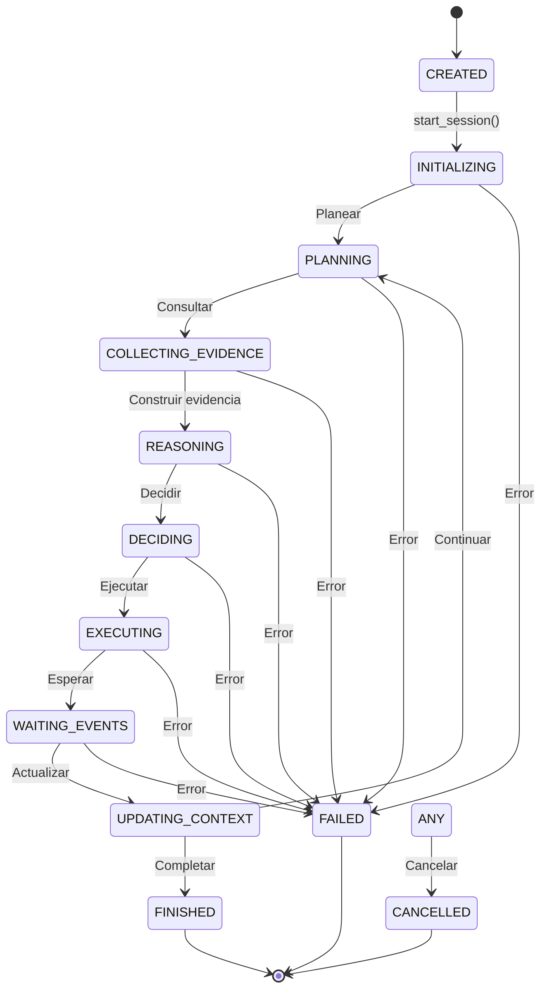

# Cognitive Orchestrator — Arquitectura

> **Documento de arquitectura para el Cognitive Orchestrator (CKO) de EREN.**
> El CKO es el director de orquesta que coordina todos los motores cognitivos.

| | |
|---|---|
| **Estado** | Fundacion implementada |
| **Fase** | Cognitiva - Fase 2 |
| **Tipo** | Orchestrator |
| **Paradigma** | EREN NO usa IA |

---

## Indice

- [1. Mision](#1-mision)
- [2. Filosofia](#2-filosofia)
- [3. Estados del Orchestrator](#3-estados-del-orchestrator)
- [4. Responsabilidades](#4-responsabilidades)
- [5. Integracion con el CPP](#5-integracion-con-el-cpp)
- [6. Eventos](#6-eventos)
- [7. Politicas](#7-politicas)
- [8. Trazabilidad](#8-trazabilidad)
- [9. Metricas](#9-metricas)
- [10. Roadmap](#10-roadmap)

---

## 1. Mision

```
El Cognitive Orchestrator es el director de orquesta de EREN.

Su unica responsabilidad es COORDINAR el ciclo cognitivo completo.

NO implementa IA.
NO implementa reglas clinicas.
NO ejecuta herramientas.
NO realiza razonamiento.
```

---

## 2. Filosofia

```
Separacion clara de responsabilidades:
================================

Orchestrator (ESTE componente)
---------------------------
- Coordina el ciclo cognitivo
- Gestiona sesiones
- Controla transiciones de estado
- Publica eventos
- Recolecta metricas

Motores (componentes coordinados)
---------------------------
- Planner Engine: Planifica
- Knowledge Engine: Consulta conocimiento
- Memory Engine: Consulta memoria
- Reasoning Engine: Razo
- Decision Engine: Decide
- Tool Engine: Ejecuta

Infraestructura (dependencias)
---------------------------
- EventBus: Comunicacion
- Context: Estado compartido
- Capability Registry: Capacidades
```

---

## 3. Estados del Orchestrator

### 3.1 Diagrama de Estados



### 3.2 Estados Completos

| Estado | Descripcion | Estados Validos Siguientes |
|--------|-------------|---------------------------|
| CREATED | Sesion creada, no iniciada | INITIALIZING |
| INITIALIZING | Inicializacion | PLANNING, FAILED, CANCELLED |
| PLANNING | Fase de planificacion | COLLECTING_EVIDENCE, FAILED, CANCELLED |
| COLLECTING_EVIDENCE | Recoleccion de evidencia | REASONING, PLANNING, FAILED, CANCELLED |
| REASONING | Fase de razonamiento | DECIDING, COLLECTING_EVIDENCE, FAILED, CANCELLED |
| DECIDING | Fase de decision | EXECUTING, REASONING, WAITING_EVENTS, FINISHED, FAILED, CANCELLED |
| EXECUTING | Ejecucion | WAITING_EVENTS, UPDATING_CONTEXT, DECIDING, FINISHED, FAILED, CANCELLED |
| WAITING_EVENTS | Esperando eventos | UPDATING_CONTEXT, DECIDING, FINISHED, FAILED, CANCELLED |
| UPDATING_CONTEXT | Actualizando contexto | PLANNING, COLLECTING_EVIDENCE, REASONING, DECIDING, EXECUTING, FINISHED, FAILED, CANCELLED |
| FINISHED | Completado exitosamente | (terminal) |
| FAILED | Fallo | (terminal) |
| CANCELLED | Cancelado | (terminal) |

---

## 4. Responsabilidades

### 4.1 Lo Que Hace el Orchestrator

```
╔═══════════════════════════════════════════════════════════════════════════════╗
║                       RESPONSABILIDADES DEL CKO                              ║
╠═══════════════════════════════════════════════════════════════════════════════╣
║                                                                             ║
║  1. GESTION DE SESIONES                                                  ║
║     • Crear sesiones cognitivas                                           ║
║     • Iniciar/detener sesiones                                           ║
║     • Finalizar sesiones exitosamente                                      ║
║     • Fallar sesiones                                                    ║
║     • Cancelar sesiones                                                  ║
║                                                                             ║
║  2. CONTROL DE ESTADOS                                                   ║
║     • Transicionar entre estados                                          ║
║     • Validar transiciones                                              ║
║     • Registrar historial de estados                                       ║
║                                                                             ║
║  3. COORDINACION DE MOTORES                                             ║
║     • Indicar motor activo                                               ║
║     • Indicar fase activa                                                ║
║     • Registrar motor utilizado                                           ║
║                                                                             ║
║  4. PUBLICACION DE EVENTOS                                               ║
║     • SessionStarted                                                    ║
║     • StateChanged                                                       ║
║     • SessionCompleted                                                  ║
║     • SessionFailed                                                     ║
║     • SessionCancelled                                                  ║
║                                                                             ║
║  5. COLECCION DE METRICAS                                               ║
║     • Duracion de sesion                                                ║
║     • Eventos procesados                                                ║
║     • Motores utilizados                                                ║
║     • Decisiones tomadas                                               ║
║     • Iteraciones cognitivas                                            ║
║                                                                             ║
║  6. TRAZABILIDAD                                                        ║
║     • Registrar cada transicion                                          ║
║     • Mantener trace completo                                           ║
║     • Auditoria de decisiones                                           ║
║                                                                             ║
║  7. APLICACION DE POLITICAS                                             ║
║     • Verificar timeouts                                                ║
║     • Limitar iteraciones                                               ║
║     • Controlar reintentos                                            ║
║                                                                             ║
╚═══════════════════════════════════════════════════════════════════════════════╝
```

### 4.2 Lo Que NO Hace el Orchestrator

```
╔═══════════════════════════════════════════════════════════════════════════════╗
║                       RESTRICCIONES DEL CKO                                 ║
╠═══════════════════════════════════════════════════════════════════════════════╣
║                                                                             ║
║  ✗ NO llama motores directamente                                         ║
║  ✗ NO ejecuta herramientas                                              ║
║  ✗ NO accede a memoria                                                 ║
║  ✗ NO accede a conocimiento                                            ║
║  ✗ NO realiza razonamiento                                             ║
║  ✗ NO toma decisiones                                                  ║
║  ✗ NO implementa reglas clinicas                                       ║
║  ✗ NO implementa IA                                                    ║
║                                                                             ║
║  El Orchestrator SOLO coordina. No hace.                                ║
║                                                                             ║
╚═══════════════════════════════════════════════════════════════════════════════╝
```

---

## 5. Integracion con el CPP

### 5.1 Diagrama de Integracion

```mermaid
flowchart TB
    subgraph ORCH["Cognitive Orchestrator"]
        CKO[CognitiveOrchestrator]
        EV[EventPublisher]
        MET[MetricsCollector]
        TRC[TraceCollector]
        POL[Policies]
    end

    subgraph CPP["Cognitive Processing Pipeline"]
        VE[Voice Engine]
        IE[Intent Engine]
        PE[Planner Engine]
        KE[Knowledge Engine]
        ME[Memory Engine]
        RE[Reasoning Engine]
        DE[Decision Engine]
        TE[Tool Engine]
    end

    subgraph INF["Infraestructura"]
        EB[EventBus]
        CCR[CapabilityRegistry]
        CCTX[CognitiveContext]
    end

    CKO -->|"Coordina"| VE
    CKO -->|"Coordina"| IE
    CKO -->|"Coordina"| PE
    CKO -->|"Coordina"| KE
    CKO -->|"Coordina"| ME
    CKO -->|"Coordina"| RE
    CKO -->|"Coordina"| DE
    CKO -->|"Coordina"| TE

    CKO --> EV
    CKO --> MET
    CKO --> TRC
    CKO --> POL

    EV -.->|"Publica eventos"| EB
    MET -.->|"Recolecta metricas"| EB
    TRC -.->|"Trace"| EB

    PE -.->|"Registra capacidad"| CCR
    KE -.->|"Registra capacidad"| CCR
    ME -.->|"Registra capacidad"| CCR
    RE -.->|"Registra capacidad"| CCR
    DE -.->|"Registra capacidad"| CCR
    TE -.->|"Registra capacidad"| CCR

    VE -.->|"Enriquece"| CCTX
    IE -.->|"Enriquece"| CCTX
    PE -.->|"Enriquece"| CCTX
    KE -.->|"Enriquece"| CCTX
    ME -.->|"Enriquece"| CCTX
    RE -.->|"Enriquece"| CCTX
    DE -.->|"Enriquece"| CCTX
    TE -.->|"Enriquece"| CCTX
```



### 5.2 Flujo de Interaccion

```
╔═══════════════════════════════════════════════════════════════════════════════╗
║                     FLUJO DE INTERACCION                                     ║
╠═══════════════════════════════════════════════════════════════════════════════╣
║                                                                             ║
║  1. USUARIO envia peticion                                              ║
║     ↓                                                                   ║
║  2. Orchestrator crea CognitiveSession                                  ║
║     ↓                                                                   ║
║  3. Orchestrator publica SessionStarted                                 ║
║     ↓                                                                   ║
║  4. Motores se registran en CapabilityRegistry                        ║
║     ↓                                                                   ║
║  5. Orchestrator transiciona a PLANNING                               ║
║     ↓                                                                   ║
║  6. Planner Engine recibe evento y planifica                            ║
║     ↓                                                                   ║
║  7. Orchestrator transiciona a COLLECTING_EVIDENCE                    ║
║     ↓                                                                   ║
║  8. Knowledge + Memory consultan fuentes                                ║
║     ↓                                                                   ║
║  9. Orchestrator transiciona a REASONING                             ║
║     ↓                                                                   ║
║  10. Reasoning Engine razona sobre evidencia                          ║
║     ↓                                                                   ║
║  11. Orchestrator transiciona a DECIDING                              ║
║     ↓                                                                   ║
║  12. Decision Engine decide proxima accion                             ║
║     ↓                                                                   ║
║  13. Orchestrator transiciona a EXECUTING                             ║
║     ↓                                                                   ║
║  14. Tool Engine ejecuta accion                                       ║
║     ↓                                                                   ║
║  15. Orchestrator transiciona a FINISHED                              ║
║     ↓                                                                   ║
║  16. Orchestrator publica SessionCompleted                            ║
║     ↓                                                                   ║
║  17. TRACE completo disponible                                        ║
║                                                                             ║
╚═══════════════════════════════════════════════════════════════════════════════╝
```

---

## 6. Eventos

### 6.1 Catalogo de Eventos

| Evento | Cuando | Datos |
|--------|--------|-------|
| SessionStarted | Sesion iniciada | session_id, correlation_id, state |
| SessionCompleted | Sesion completada | session_id, correlation_id, metrics |
| SessionFailed | Sesion fallida | session_id, reason, error |
| SessionCancelled | Sesion cancelada | session_id, reason |
| StateChanged | Cambio de estado | session_id, from_state, to_state, reason |
| OrchestrationPaused | Orchestrator pausado | session_id |
| OrchestrationResumed | Orchestrator resumido | session_id |
| OrchestrationTimeout | Timeout detectado | session_id, duration |
| MotorStarted | Motor iniciado | session_id, motor_id |
| MotorCompleted | Motor completado | session_id, motor_id, result |
| MotorFailed | Motor fallo | session_id, motor_id, error |
| ContextUpdated | Contexto actualizado | session_id, context_id |

---

## 7. Politicas

### 7.1 Politicas Disponibles

| Politica | Descripcion | Valor Predeterminado |
|----------|------------|---------------------|
| session_timeout_ms | Timeout de sesion | 300000 (5 min) |
| phase_timeout_ms | Timeout de fase | 60000 (1 min) |
| max_retries | Maximo reintentos | 3 |
| max_iterations | Maximo iteraciones | 10 |
| enable_auto_recovery | Recuperacion automatica | True |
| enable_metrics | Habilitar metricas | True |
| enable_tracing | Habilitar trace | True |

### 7.2 Presets

```python
# Politicas estrictas para produccion
strict_policies = PolicyPresets.strict()

# Politicas permisivas para desarrollo
permissive_policies = PolicyPresets.permissive()

# Politicas para entornos criticos
critical_policies = PolicyPresets.critical()
```

---

## 8. Trazabilidad

### 8.1 TraceEntry

```python
@dataclass
class TraceEntry:
    entry_id: str           # ID unico de entrada
    timestamp: str          # Timestamp ISO
    from_state: str | None # Estado anterior
    to_state: str          # Estado nuevo
    reason: str             # Razon de transicion
    correlation_id: str     # ID de correlacion
    motor_active: str      # Motor activo
    events_count: int       # Numero de eventos
```

### 8.2 Ejemplo de Trace

```
Trace completo para sesion session_abc123:
─────────────────────────────────────

[0] 10:00:00 | CREATED -> INITIALIZING | "Session starting"
[1] 10:00:01 | INITIALIZING -> PLANNING | "Plan phase"
[2] 10:00:02 | PLANNING -> COLLECTING_EVIDENCE | "Collect evidence"
[3] 10:00:05 | COLLECTING_EVIDENCE -> REASONING | "Reasoning"
[4] 10:00:10 | REASONING -> DECIDING | "Decision"
[5] 10:00:11 | DECIDING -> EXECUTING | "Execute action"
[6] 10:00:15 | EXECUTING -> FINISHED | "Session completed"
```

---

## 9. Metricas

### 9.1 Metricas Recolectadas

| Metrica | Descripcion |
|---------|------------|
| sessions_created | Sesiones creadas |
| sessions_completed | Sesiones completadas |
| sessions_failed | Sesiones fallidas |
| state_transitions | Transiciones de estado |
| events_published | Eventos publicados |
| motors_coordinated | Motores coordinados |
| average_duration_ms | Duracion promedio |
| errors_count | Errores |

---

## 10. Roadmap

### Fase 1: Fundacion (Actual)
```
- Core Orchestrator
- Gestion de sesiones
- Control de estados
- Eventos basicos
- Politicas basicas
- Trazabilidad basica
```

### Fase 2: Paralelismo
```
- Ejecucion paralela de motores
- Pipelines condicionales
- Workflows simples
```

### Fase 3: Resiliencia
```
- Recuperacion automatica
- Reintentos inteligentes
- Fallback entre motores
```

### Fase 4: Optimizacion
```
- Caching de contexto
- Balanceo de carga
- Autoscaling
```

---

## Referencias

| Referencia | Ubicacion |
|------------|-----------|
| Cognitive Processing Pipeline | [../architecture/cognitive-processing-pipeline.md](../architecture/cognitive-processing-pipeline.md) |
| Event Bus | [../events/architecture.md](../events/architecture.md) |
| Context System | [../context/architecture.md](../context/architecture.md) |

---

**Ultima actualizacion:** 2026-07-13  
**Estado:** Fundacion implementada  
**Fase:** Cognitiva - Fase 2  
**Tipo:** Documentacion arquitectonica  
**Paradigma:** EREN NO usa IA